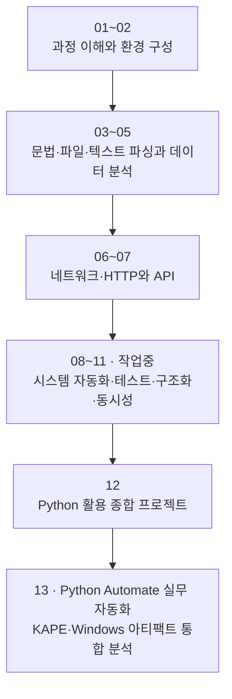

# 01. Python 소개


### 실습 자료 준비

[01장 교육자료 ZIP 받기](https://github.com/zxz3650/Python/raw/refs/heads/master/downloads/chapter-01.zip)로 이 장의 노트북과 필요한 코드·입력 데이터를 준비한다. 구성과 개별 파일은 [이 장의 노트북 목록](PRACTICE.md#chapter-01)에서 확인한다. 자료가 수정되면 이 장의 ZIP만 새로 받는다.

[첫 노트북 보기](notebooks/01-python-first-step.ipynb) · [첫 노트북 원본 받기](https://github.com/zxz3650/Python/raw/refs/heads/master/notebooks/01-python-first-step.ipynb)

[02장](02-python-setup.md)의 환경 구성을 마친 뒤 01장 ZIP을 푼 폴더에서 `python -m jupyterlab`을 실행하고 `notebooks/01-python-first-step.ipynb`를 연다. 자세한 저장·커널 확인 방법은 [자료 준비·실행 안내](PRACTICE.md#download)를 따른다.


Python이 보안·데이터 처리·업무 자동화에서 널리 쓰이는 이유와 이 과정의 학습 경로를 살펴본다. 이 과정은 문법을 암기하는 데 그치지 않고, 반복 작업을 작은 프로그램으로 바꾸고 그 결과를 검증하는 능력을 기르는 데 초점을 둔다. 먼저 Python의 공통 기반을 익힌 뒤 파일, 데이터, 네트워크, HTTP, 시스템 자동화 문제로 적용 범위를 넓힌다.


### 🧭 학습 목표

- Python이 자동화와 문제 해결에 적합한 이유를 설명한다.
- 핵심 과정 01~12장과 보충 과정 13장의 관계를 파악한다.
- 자신의 경험에 맞는 시작 지점을 정한다.
- 허용된 실습 범위와 안전 원칙을 설명한다.


## 1.1 왜 Python을 배우는가

프로그래밍 문법을 아는 것과 반복 업무를 자동화하는 것은 다르다. 예를 들어 분석가는 많은 로그에서 필요한 항목을 골라야 하고, 운영자는 여러 파일의 형식을 같은 규칙으로 바꿔야 한다. 네트워크나 웹 데이터를 점검할 때도 요청, 응답 확인, 결과 정리와 같은 절차를 반복한다.

Python을 사용하면 이런 절차를 **입력 → 처리 → 검증 → 출력**의 흐름으로 표현할 수 있다. Python이 이 과정에 적합한 이유는 다음과 같다.

### 읽기 쉬운 문법과 빠른 피드백

Python은 비교적 간결한 문법을 사용한다. 대화형 실행 환경(REPL)이나 Jupyter Notebook에서는 코드를 짧게 실행하고 결과를 즉시 확인할 수 있어, 개념을 탐색하고 오류 원인을 찾기 쉽다.

```python
plain = 0x41
key = 0x13

cipher = plain ^ key
restored = cipher ^ key

print(hex(restored))  # 0x41
```

위 예제는 같은 키로 XOR 연산을 두 번 수행하면 원래 값으로 돌아오는지를 확인한다. 결과를 먼저 예측한 뒤 코드를 실행하면 연산의 의미와 실행 결과를 함께 검증할 수 있다.

### 표준 라이브러리와 확장 생태계

Python은 파일 경로를 다루는 `pathlib`, 구조화 데이터를 처리하는 `csv`와 `json`, 문자열 패턴을 찾는 `re`, 네트워크 통신을 위한 `socket` 같은 표준 모듈을 제공한다. 이후 과정에서는 HTTP 요청을 처리하는 `requests`, 수치·표 데이터를 다루는 NumPy와 pandas 같은 외부 패키지도 사용한다.

모든 기능을 처음부터 구현할 필요는 없다. 문제에 맞는 모듈과 패키지를 선택하고, 입력과 출력이 요구사항에 맞는지 검증하는 능력이 더 중요하다.

### 자동화와 코드 공유

Python 프로그램은 반복 절차를 다시 실행할 수 있는 형태로 남긴다. 수작업 과정을 함수와 모듈로 정리하면 입력만 바꾸어 재사용할 수 있고, 동료와 실행 방법 및 결과를 공유하기도 쉽다.


### 💡 응용 인사이트

Python을 잘 사용한다는 것은 문법을 많이 외운다는 뜻이 아니다. 문제의 입력, 처리 규칙, 예상 출력, 실패 조건을 구분하고 프로그램의 결과가 맞는지 확인할 수 있어야 한다. 이 관점은 로그 분석, 파일 정리, API 연동처럼 서로 다른 문제에도 그대로 적용된다.


## 1.2 이 과정에서 다루는 범위

이 과정은 보안 실무 심화 과정에 들어가기 전에 필요한 Python 프로그래밍 기반을 다룬다.

| 영역 | 주요 내용 | 학습 결과 |
| --- | --- | --- |
| 문법과 프로그램 흐름 | 변수, 자료형, 조건문, 반복문, 함수, 예외, 모듈·패키지, 클래스 | 문제를 실행 가능한 코드로 표현한다. |
| 파일과 데이터 | 경로, 텍스트·바이너리, CSV, JSON, 정규표현식, 데이터 분석 | 외부 데이터를 안전하게 읽고 검증해 변환한다. |
| 통신과 자동화 | 소켓, HTTP·API, 시스템 자동화 | 외부 시스템과 데이터를 주고받고 반복 절차를 자동화한다. |
| 품질과 구조 | 테스트, 디버깅, 프로그램 구조화, 동시성과 비동기 처리 | 실패 원인을 찾고 재사용·검증 가능한 프로그램을 만든다. |
| 종합 적용 | 여러 장의 개념을 연결하는 프로젝트 | 요구사항부터 실행·검증 기록까지 하나의 결과물로 완성한다. |

다음 내용은 핵심 과정에서 직접 다루지 않는다.

- 상용 서비스 규모의 웹 프레임워크, GUI 애플리케이션, 배포 시스템 구축
- 실제 대상을 공격하는 취약점 악용이나 무단 접근 자동화
- 고급 익스플로잇 개발, 악성코드 제작, 암호 해독과 같은 전문 분야

전문 보안 주제는 공통 기반을 마친 뒤, 명시적으로 허가된 환경에서 진행하는 별도의 심화 과정으로 다룬다. 이 과정의 예제에 보안 맥락이 등장하더라도 핵심 목표는 다른 문제에도 옮겨 쓸 수 있는 프로그래밍 능력을 기르는 것이다.

## 1.3 커리큘럼 로드맵

현재 목차는 01~13장으로 구성된다. 08~11장은 **작업중**이며, 아래 로드맵은 해당 장을 포함한 전체 학습 흐름을 보여 준다. 13장은 KAPE 결과와 Windows 아티팩트를 통합 분석하는 실무 자동화 과정이다.



| 장 | 현재 구성과 학습 내용 |
| --- | --- |
| [01. Python 소개](01-python-intro.md) | Python의 특징, 학습 범위와 방법 |
| [02. 개발 및 실습 환경](02-python-setup.md) | Python 설치, 가상환경, 패키지와 Notebook 커널 확인 |
| [03. Python 기초 문법](03-python-basics.md) | 자료형, 제어 흐름, 함수, 예외, 모듈과 클래스 |
| [04. 파일 입출력과 데이터 형식](04-file-io.md) | 경로, 텍스트·바이너리, CSV·JSON, 안전한 저장 |
| [05. 텍스트 파싱과 데이터 분석](05-text-processing.md) | 문자열·정규표현식, 검증·시간 처리, NumPy·pandas, 웹 접근 로그 분석 |
| [06. 네트워크 프로그래밍](06-network-programming.md) | TCP·UDP·DNS, 메시지 경계, 로컬 Echo 통신 |
| [07. HTTP와 API](07-http-api.md) | requests, JSON API, 세션·인증, 로컬 웹 보안 점검 |
| 08. 시스템 자동화 — **작업중** | CLI, 설정, 로그, 외부 프로세스, HTTP 점검기 도구화 |
| 09. 테스트와 디버깅 — **작업중** | 테스트 설계, pytest, mock, 디버깅 |
| 10. 프로그램 구조화 — **작업중** | 프로그램의 책임 분리와 재사용 가능한 구조 |
| 11. 동시성과 비동기 처리 — **작업중** | 여러 작업의 실행과 비동기 처리 |
| [12. Python 활용 종합 프로젝트](12-capstone.md) | 여러 장의 개념을 연결하는 종합 프로젝트 안내 |
| [13. Python Automate 실무 자동화](13-python-automate.md) | KAPE 파서 CSV 정규화, 출처 보존, 다중 호스트 타임라인과 검토 보고서 |

각 장의 학습 목표와 완료 기준을 점검하며 진행한다. 08~11장의 개설 상태는 표지에서 확인한다. 13장의 기본 실습은 합성 CSV와 Python 표준 라이브러리로 진행하며, 외부 분석 엔진 실행과 워커 연계는 확장 과정에서 다룬다.

## 1.4 어디서 시작할까

| 현재 경험 | 권장 시작 지점 |
| --- | --- |
| Python을 처음 배운다. | 01장에서 학습 방향을 확인하고 02장에서 환경을 구성한 뒤 순서대로 진행한다. |
| 변수·조건문·반복문을 사용해 본 적이 있다. | 03장의 완료 기준으로 기초를 점검한 뒤 익숙하지 않은 절부터 시작한다. |
| 간단한 프로그램을 작성할 수 있지만 파일·네트워크 처리가 익숙하지 않다. | 03장의 완료 기준을 확인하고 04장부터 진행한다. |
| 업무 자동화 경험이 있다. | 04~11장의 완료 기준으로 빈 부분을 확인한 뒤 12장 종합 프로젝트를 수행한다. |

익숙한 문법이 있더라도 예외 처리, 입력 검증, 테스트와 같은 항목을 건너뛰지 않는다. 프로그램이 정상 입력에서 한 번 실행되는 것과, 실패를 설명하고 같은 결과를 다시 검증할 수 있는 것은 서로 다른 수준의 능력이다.

## 1.5 학습 방법

각 예제는 다음 순서로 학습한다.

1. 코드를 실행하기 전에 입력과 결과를 예상한다.
2. 예제를 실행하고 예상과 실제 결과를 비교한다.
3. 입력값과 조건을 바꾸어 결과가 달라지는 이유를 설명한다.
4. 빈 값·경계값 같은 경계 사례와 잘못된 형식 같은 오류 사례를 추가한다.
5. 출력, `assert`, 테스트 코드로 결과를 다시 확인한다.
6. 예제의 구조를 다른 문제에 적용해 본다.

코드를 그대로 입력해 실행하는 데서 끝내지 않는다. **예측하고, 실행하고, 변경하고, 검증하는 과정**을 반복해야 개념을 새로운 문제에 적용할 수 있다.

## 1.6 실습 윤리와 허용 범위


### ⚠️ 실습 전 확인

교육과정의 모든 실습은 다음 범위에서만 수행한다.

- 본인이 소유하고 관리하는 자산
- 대상과 방법에 대해 명시적인 허가를 받은 시스템
- 외부와 분리된 로컬 랩 또는 합법적인 교육·CTF 환경

허가받지 않은 시스템에는 접근하지 않으며, 허용된 실습 범위도 넘어서지 않는다. 교육 목적이라는 이유만으로 무단 접근이 허용되는 것은 아니다.


실습을 시작하기 전에 대상, 허용 시간, 요청 빈도, 수집할 데이터와 저장 위치를 확인한다. 예제 데이터에는 실제 비밀번호, 인증 토큰, 개인정보를 넣지 않는다. 실습 범위가 불분명하면 실행을 중단하고 담당자에게 확인한다.

무단 접근이나 권한을 넘어선 행위는 관련 법률과 조직 정책을 위반할 수 있다. 관련 조항은 [국가법령정보센터의 정보통신망 이용촉진 및 정보보호 등에 관한 법률 제48조](https://law.go.kr/LSW/lsLinkCommonInfo.do?chrClsCd=010202&lsJoLnkSeq=1029563083)에서 확인할 수 있다. 이 교안은 법률 자문을 대신하지 않으므로 실습 시점의 법령과 소속 조직의 정책을 함께 확인한다.
