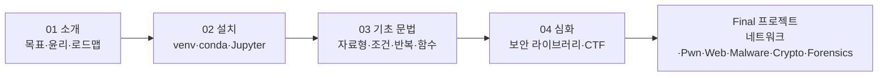

# 개요
보안 실무에서 Python이 사실상 표준이 된 배경과, 이 커리큘럼 전체의 학습 경로를 조망한다. 개발자 양성이 아니라 침투 테스트·포렌식·악성코드 분석·CTF에서 반복 작업을 자동화하고 즉석에서 도구를 만드는 능력에 초점을 둔다.

## 🧭 학습 목표
- 보안 실무에서 Python이 선택되는 3가지 이유(생태계·REPL·PoC 공유)를 이해한다
- 이 커리큘럼의 전체 구조(소개 → 설치 → 기초 → 심화 → 프로젝트)를 파악한다
- 각자의 현재 수준에 맞는 진입 지점을 정한다

---
# 1.1 왜 보안 실무자에게 Python인가
보안 업계에서 "프로그래밍을 할 줄 안다"와 "실무를 자동화할 수 있다"는 전혀 다른 이야기다. CSIRT/SOC 분석가는 하루에도 수백 건의 로그를 파싱하고, 레드팀은 동일한 공격 패턴을 수십 번 반복해야 하며, 포렌식 분석가는 수백 개 샘플에서 동일한 IOC를 추출해야 한다. 이런 반복 작업을 자동화할 수 있는지 여부가 실무자의 생산성을 결정한다.
Python이 이 역할을 독점하게 된 데는 세 가지 이유가 있다.
**첫째, 성숙한 보안 생태계다.** requests(HTTP 자동화), scapy(패킷 조작), pwntools(CTF/익스플로잇 프레임워크), pycryptodome(암호 연산) 같은 라이브러리가 이미 업계 표준으로 자리잡았다. 직접 구현할 필요 없이 바로 조립해 쓸 수 있다.
**둘째, REPL 기반 즉석 실험이다.** 바이트열을 해석하거나 암호 연산을 검증할 때, 컴파일 없이 즉시 결과를 확인할 수 있다.
```python
# python3 REPL에서 바로 실험
>>> plain, key = 0x41, 0x13
>>> cipher = plain ^ key
>>> cipher ^ key   # 같은 키로 다시 XOR하면?
65                  # 원래 값(0x41)으로 복원됨
```
한 줄 실험하고 바로 다음 줄에서 결과를 확인하는 이 사이클이 실무자의 사고 속도를 직접 결정한다.
**셋째, PoC/write-up 공유 문화다.** CTF write-up, 익스플로잇 PoC, 리서치 보고서 대부분이 Python으로 공유된다. 읽고 수정할 수 있어야 남의 공격 코드를 자기 환경에 맞게 고쳐 재현할 수 있다.
> 💡 이 세 가지는 단순히 "Python이 인기가 많다"가 아니라, 보안 업무의 본질적 요구사항(빠른 프로토타입, 바이트 단위 조작, 공유 가능한 코드)과 Python의 특성이 정확히 맞아떨어진 결과다.
# 1.2 다루는 것 / 다루지 않는 것
| 구분 | 내용 |
| --- | --- |
| 다루는 것 | 진법·바이트 조작, 인코딩·해독, 정규식 기반 IOC 추출, struct 바이너리 파싱, requests 웹 자동화, socket/pwntools 서비스 상호작용, 암호 연산(XOR/hash/AES/RSA) |
| 다루지 않는 것 | 웹 프레임워크(Django/Flask) 개발, GUI 앱 제작, 객체지향 설계 원칙, 배포/CI 등 순수 개발 주제 |

이 커리큘럼은 "좋은 코드를 짜는 법"이 아니라 "문제를 빠르게 자동화하는 법"을 가르친다. 한 번 돌아가는 스크립트가 우아하게 추상화된 프레임워크보다 가치 있다.
# 1.3 커리큘럼 로드맵
이 커리큘럼은 5단계로 구성된다.




**🗺️ 학습 흐름**: 01 → 02 → 03 → 04 → Final 프로젝트 순서로 진행한다.


| 단계 | 구분 | 내용 |
| --- | --- | --- |
| 1 | 소개 | 이 문서 — 왜 Python인가, 로드맵, 윤리 |
| 2 | 설치 | 기본 설치(venv) / 아나콘다(conda) / Jupyter 실습 환경 |
| 3 | 기초교안 | 문법 기초(변수\~파일/예외) |
| 4 | 심화교안 | Offensive Security & CTF 관련 라이브러리 사용법 학습 |
| Fin. | 프로젝트 | 네트워크 통신, pwntools CTF, 웹 CTF, 악성코드 분석, 암호 CTF, 포렌식 카빙 |

각 단계는 이전 단계를 선행으로 하며, `01 소개 → 02 설치 → 03 기초 → 04 심화 → Final 프로젝트` 순서로 진행한다.

# 1.4 ⚠️ 실습 윤리와 법적 고지
> 💡 **필독**
> 교육과정에서 실습하는 모든 공격 기법은** (1) 본인 소유 자산 (2) 서면 동의 대상 (3) 폐쇄된 CTF/랩 환경에서만 실행해야 하며, **무단 대상 스캔·요청·익스플로잇은 정보통신망법 위반이다.
구체적으로는 다음을 준수한다.
- **대상 범위**: 본인이 구축한 랩(VM, 로컬 서버), 서면 동의를 받은 시스템, picoCTF/HackTheBox/TryHackMe/OverTheWire 같은 합법 CTF 플랫폼
- **금지 대상**: 본인이 소유하지 않고 서면 동의도 없는 시스템에 대한 스캔·요청·익스플로잇 (정보통신망 이용촉진 및 정보보호 등에 관한 법률 제48조·제71조 등 위반)
- **코드 공유**: 이 커리큘럼에서 작성한 익스플로잇은 교육/연구 목적으로만 배포하며, 대상 시스템의 버전·구성이 다르면 동작을 보장하지 않는다


---
[2. 파이썬 설치](https://app.notion.com/p/3a7436c34cbd81a1bfa4da9c871f4b3c)로 이동하여 실습 환경을 구성한다.
---