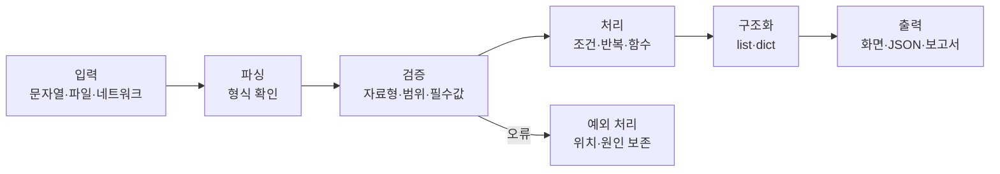

# 공식 기초교안
> 📘 이 과정의 기준 교재는 [화이트 해커를 위한 Python 기초과정](https://app.notion.com/p/3a6436c34cbd80549d0dcd801446847c)이다. 아래 실습과 개념 보강은 공식 교재를 대체하지 않고, 보안 실무에서 실행·검증·분석하는 능력을 확장한다.
# 대상과 목표
- **대상**: Python을 처음 배우거나 기초를 다시 정리하는 보안 실무자
- **Python 선수지식**: 없음
- **환경 선수 과정**: 02. 파이썬 설치 완료
- **최종 목표**: Python 코드를 읽고 수정하며, 합성 또는 허가된 로그로 재현 가능한 분석 도구를 작성한다.
- **다음 과정**: Python 문법 심화교안
# 학습 경로
1. 값과 자료형: str, int, float, bool, None, bytes
2. 제어 흐름: 조건문, 반복문, 컴프리헨션
3. 자료구조: list, tuple, set, dict
4. 함수와 모듈: 책임 분리, import, main 구조
5. 파일과 데이터: pathlib, 파일 I/O, JSON, CSV, 인코딩
6. 오류와 검증: 예외 처리, 디버깅, assert, pytest
7. 보안 데이터 실습: 로그 파싱, IP·시간·필드 검증, 집계
8. 미니 프로젝트: 오류를 보존하는 로그 분석기와 JSON 보고서
# 공식 교안 실습 연결
- 1장 input()과 형변환 → 로그 필드 자료형 검증
- 2\~3장 조건·반복 → 탐지 조건과 이벤트 순회
- 4\~5장 list·dict → IP 목록과 실패 횟수 집계
- 6장 문자열 → 로그 split()과 필드 추출
- 7\~8장 함수·파일·예외 → 재사용 가능한 분석기
- 9장 로그 분석기 → 아래 Jupyter Book 연계 실습과 확장 프로젝트
# 수료 산출물
- 코드가 포함된 로그 분석기
- 정상·오류·경계값 입력에 대한 테스트
- 분석 결과 JSON
- 파싱 오류의 행 번호와 원인
- 실행 방법과 입력 형식을 설명하는 README
---
# Jupyter Book 연계 실습 — 로그 요약기
## 학습 목표
- list·dict·함수·예외 처리를 조합한다.
- 텍스트 로그를 구조화하고 DENY 이벤트를 집계한다.
- 오류 행을 조용히 버리지 않고 위치와 원인을 보존한다.
- assert와 pytest를 구분하여 결과를 검증한다.
## 기본 데이터와 파서
```python
from collections import Counter

sample = """2026-07-27T09:00:00Z ALLOW 10.0.0.5 /index
2026-07-27T09:00:01Z DENY 198.51.100.9 /admin
2026-07-27T09:00:02Z DENY 198.51.100.9 /login
2026-07-27T09:00:03Z ALLOW 10.0.0.8 /health"""

def parse_line(line):
    parts = line.split()
    if len(parts) != 4:
        raise ValueError(f"잘못된 로그 형식: {line!r}")
    timestamp, action, ip, path = parts
    return {"time": timestamp, "action": action, "ip": ip, "path": path}

records = [parse_line(line) for line in sample.splitlines()]
denied = Counter(r["ip"] for r in records if r["action"] == "DENY")
assert denied["198.51.100.9"] == 2
denied
```
## 직접 해보기
1. 경로별 요청 수를 집계한다.
2. 잘못된 한 줄을 추가해 오류 메시지를 확인한다.
3. DENY가 3회 이상인 IP만 출력한다.
4. 빈 줄은 건너뛰되 오류가 있는 줄의 번호는 기록한다.
## 오류를 보존하는 파서
```python
def parse_lines(text):
    records, errors = [], []
    for number, line in enumerate(text.splitlines(), start=1):
        if not line.strip():
            continue
        try:
            records.append(parse_line(line))
        except ValueError as exc:
            errors.append({"line": number, "error": str(exc)})
    return records, errors
```
정상 이벤트만 반환하면 분석 결과가 실제보다 깨끗하게 보일 수 있다. 실무 분석기는 정상 결과와 파싱 오류를 함께 반환해야 한다.
---
# 개념 보강 — 데이터가 코드 안에서 흐르는 방식

## 핵심 개념 1 — 변수와 자료형
변수는 값을 담는 상자라기보다 **값을 가리키는 이름**이다. 보안 데이터는 숫자, 문자열, 바이트, 목록, 키-값 구조가 섞이므로 자료형을 정확히 구분해야 한다.
| 자료형 | 예 | 보안 활용 |
| --- | --- | --- |
| str | "198.51.100.9" | 로그·URL·도메인 |
| bytes | b"MZ" | 패킷·파일 헤더 |
| list | \[80, 443\] | 포트·이벤트 목록 |
| tuple | ("tcp", 443) | 변경하지 않을 구조화 값 |
| set | \{"admin", "root"\} | 중복 제거·허용 목록 |
| dict | \{"ip": "..."\} | 구조화 이벤트·보고서 |

## 핵심 개념 2 — 함수와 검증
```python
from ipaddress import ip_address

def validate_ip(value):
    ip_address(value)
    return value

def is_suspicious(record):
    return record["action"] == "DENY" and record["path"] in {"/admin", "/login"}
```
정규식은 후보를 찾는 데 유용하지만, IP 주소의 의미 검증은 ipaddress 같은 표준 라이브러리로 수행한다.
## 핵심 개념 3 — 파일·JSON·CSV
```python
import json
from pathlib import Path

def load_json(path):
    path = Path(path)
    if not path.is_file():
        raise FileNotFoundError(path)
    try:
        return json.loads(path.read_text(encoding="utf-8"))
    except json.JSONDecodeError as exc:
        raise ValueError(f"JSON 형식 오류: {path}") from exc
```
pathlib로 경로를 처리하고, 파일 없음·인코딩 오류·손상된 형식을 구분한다. CSV는 쉼표가 포함된 인용 필드를 고려해 csv 모듈을 사용한다.
## 핵심 개념 4 — assert와 pytest
assert는 학습 중 불변식을 확인하는 도구다. 사용자 입력 검증이나 권한 판정의 대체 수단으로 사용하지 않는다. 실제 테스트는 pytest로 작성한다. 정상·오류·경계값을 모두 테스트한다.
---
# 예제문제
## 문제 1 — 자료형 선택
```python

```
IP별 로그인 실패 횟수를 저장하기 가장 적절한 자료형은 무엇인가?
1. str
2. dict
3. bool
4. bytes

**정답과 해설**

	**정답: 2번 dict**. IP를 키로, 실패 횟수를 값으로 저장한다.

## 문제 2 — 코드 수정
형식이 잘못된 줄에서 오류가 나지 않고 행 번호와 원인이 기록되도록 parse_lines를 수정한다.
## 문제 3 — 입력 검증
198.51.100.999가 포함된 로그를 정상 이벤트로 처리하지 않도록 ipaddress.ip_address()를 사용해 수정한다.
---
# 미니 프로젝트 — 로그 분석기
입력 형식은 다음과 같다.
```javascript
2026-07-27T09:00:00Z ALLOW 10.0.0.5 /index
2026-07-27T09:00:01Z DENY 198.51.100.9 /admin
```
필수 검증:
- 필드 수가 4개인지
- timestamp가 ISO 형식인지
- IP 주소가 유효한지
- action이 ALLOW 또는 DENY인지
- path가 /로 시작하는지
결과에는 전체 이벤트 수, IP별 실패 횟수, 임계치 이상 IP, 시간 범위, 파싱 오류 목록을 포함한다.
## 확장 과제
- --threshold, --input, --output 명령줄 인자를 추가한다.
- JSON과 CSV 입력을 모두 지원한다.
- UTC 기준 시간 범위를 계산한다.
- 사용자명·토큰·민감 경로를 마스킹한다.
- generator로 대용량 로그를 한 줄씩 처리한다.
- [parser.py](http://parser.py), [report.py](http://report.py), [main.py](http://main.py)로 모듈을 분리한다.
- 정상·오류·경계값 테스트를 작성한다.
## 완료 기준
- [ ] 공식 교안의 직접 해보기 문제를 실행한다.
- [ ] 정상 입력과 비정상 입력을 구분한다.
- [ ] 파싱 오류의 위치와 원인을 보존한다.
- [ ] 결과가 정해진 JSON 구조로 재현된다.
- [ ] 함수별 책임이 분리되어 있다.
- [ ] 합성 데이터 또는 명시적으로 허가된 데이터만 사용한다.
- [ ] 실행 방법과 입력 형식을 README에 기록한다.
# 보안·윤리 주의
실제 개인정보와 운영 로그를 학습 데이터로 사용하지 않는다. 합성 데이터 또는 명시적으로 허가된 데이터만 사용하며, 외부 시스템에 대한 요청·스캔·분석은 소유권 또는 명시적 허가가 있는 환경에서만 수행한다.
# 참조 주피터북 기준 학습 구성
이 과정은 [03_python_basics.ipynb](https://drive.google.com/file/d/11xD0M-CDVjIZ5Vqr8LJyIFRCJOzvjJdo/view?usp=drive_link)의 실행 순서를 기준으로 학습한다. 각 절은 설명을 읽은 뒤 코드 셀을 실행하고, 입력값을 바꿔 결과를 예측하는 방식으로 진행한다.
## 1. 자료형과 기본 표현
- 변수와 값의 관계
- `str`, `int`, `float`, `bool`, `None`
- `list`, `tuple`, `set`, `dict`
- `type()`과 자료형 확인
- 보안 데이터에서 문자열, 숫자, 부울값, 누락값의 차이
## 2. 연산자와 형변환
- 산술 연산자: `+`, `-`, `*`, `/`, `//`, `%`, `**`
- 비교 연산자와 논리 연산자
- 문자열과 숫자의 형변환
- 포트, 실패 횟수, 임계치 계산
## 3. 입력과 안전한 변환
- `input()`은 항상 문자열을 반환한다.
- 숫자 입력은 `int()` 또는 `float()`으로 변환한다.
- 변환할 수 없는 입력은 `ValueError`가 발생하므로 예외 처리가 필요하다.
- 외부 입력을 신뢰하지 않고 자료형·범위·형식을 확인한다.
## 4. 문자열 처리
- 인덱싱과 슬라이싱
- `strip()`, `lower()`, `upper()`, `replace()`
- `split()`과 `join()`
- `in`과 `not in`을 이용한 부분 문자열 검사
- f-string을 이용한 분석 결과 출력
로그에서 문자열 처리는 단순 출력이 아니라 파싱과 정규화의 첫 단계다. 원본을 보존해야 하는 경우에는 정규화한 값과 원본 값을 구분하여 저장한다.
## 5. 조건과 truthy/falsey
Python에서는 빈 문자열, 0, 빈 컬렉션, `None`이 거짓으로 평가된다. 이 특성을 이해해야 누락된 로그와 정상적인 0 값을 혼동하지 않는다.
- `if`, `elif`, `else`
- `None`과 값이 없는 상태
- `True`와 `False`
- 중첩 조건과 조기 반환
- 임계치별 NORMAL·WARNING·CRITICAL 분류
## 6. 반복과 자료구조 순회
- `for`와 `while`
- `break`와 `continue`
- `enumerate()`로 행 번호 보존
- `zip()`으로 관련 목록 결합
- list·tuple·set·dict 순회
- 언패킹과 컴프리헨션
보안 로그에서는 반복문을 이용해 이벤트를 순회하고, `enumerate()`를 이용해 오류가 발생한 원본 행을 추적한다.
## 7. 함수와 스코프
- 함수 정의와 반환값
- 인자와 기본값
- 지역 변수와 전역 변수
- 함수별 단일 책임
- `parse`, `validate`, `summarize` 분리
권장 구조:
```python
def parse_line(line):
    ...

def validate_record(record):
    ...

def summarize(records):
    ...
```
## 8. 파일 처리
with open(...)을 사용해 파일을 안전하게 열고 닫는다. 파일 경로는 가능하면 `pathlib.Path`로 다룬다.
- 텍스트 파일 읽기와 쓰기
- UTF-8 인코딩
- 파일 확장자와 경로 처리
- `read()`, `readline()`, `readlines()`
- 대용량 파일을 고려한 한 줄씩 처리
- 파일 없음과 권한 오류
## 9. 예외 처리
- `try/except`
- `else`와 `finally`
- `raise`로 의미 있는 오류 발생
- `ValueError`, `FileNotFoundError`, `JSONDecodeError`
- 오류 메시지에 행 번호·파일명·원인을 포함
- 오류 행을 버리지 않고 오류 목록에 기록
예외를 무조건 숨기거나 `except Exception`으로 모두 삼키지 않는다. 예상 가능한 오류와 프로그래밍 오류를 구분한다.
## 10. str과 bytes
- `str`은 문자 데이터, `bytes`는 0\~255 범위의 바이트열
- `encode()`와 `decode()`
- bytes 인덱싱 결과가 정수라는 점
- 파일 헤더, 패킷, 해시 입력에서 bytes의 역할
- 문자열과 bytes를 암묵적으로 혼용하지 않기
이 내용은 다음 심화 과정의 바이너리 파싱·네트워크·암호 실습을 위한 선수 개념이다.
## 11. assert와 모듈
- `assert`로 학습 중 불변식 확인
- 실제 사용자 입력 검증에는 assert를 사용하지 않기
- `import`와 표준 라이브러리
- `__name__ == "__main__"` 구조
- 기능별 모듈 분리
실제 반복 테스트는 `pytest`로 작성한다. 정상 입력뿐 아니라 빈 입력, 손상된 입력, 경계값을 포함한다.
## 12. 미니 프로젝트 — 인증 로그 분석
주피터북의 미니 프로젝트는 다음 형식의 합성 인증 로그를 사용한다.
```plain text
2026-08-10T10:00:00Z ALLOW alice 10.0.0.5 /index
2026-08-10T10:00:01Z DENY bob 198.51.100.9 /admin
2026-08-10T10:00:02Z DENY bob 198.51.100.9 /login

BROKEN LINE
```
구현 단계:
1. 한 줄을 공백 기준으로 분리한다.
2. 정상 행은 timestamp, action, user, ip, path로 구조화한다.
3. 필드 수가 잘못된 행은 행 번호·원문·오류 원인을 기록한다.
4. 사용자별 DENY 횟수와 IP별 DENY 횟수를 각각 집계한다.
5. 반복 실패 사용자를 추출한다.
6. 정상 이벤트 수, 파싱 오류 수, 의심 사용자, 오류 행 목록을 JSON으로 저장한다.
결과에는 다음 항목을 포함한다.
```json
{
  "valid_events": 5,
  "parse_errors": 1,
  "deny_by_user": {
    "bob": 3
  },
  "deny_by_ip": {
    "198.51.100.9": 3
  },
  "suspicious_users": {
    "bob": 3
  },
  "error_lines": [5]
}
```
## 13. JSON 산출물 챌린지
분석 결과를 `analysis_result.json`으로 저장하고 다시 읽어 원본 결과와 같은지 확인한다.
- `json.dumps()`와 `json.loads()`
- `Path.write_text()`와 `Path.read_text()`
- UTF-8 저장
- 들여쓰기와 사람이 읽을 수 있는 출력
- 저장 후 재로드 검증
# 학습 완료 기준
- 주피터북의 각 코드 셀을 직접 실행한다.
- 코드의 입력값을 바꾸고 결과 변화를 설명한다.
- 정상·오류·경계값 입력을 구분한다.
- 인증 로그를 구조화하고 사용자·IP별로 집계한다.
- 파싱 오류의 원본 행과 행 번호를 보존한다.
- JSON 결과를 저장하고 다시 읽어 검증한다.
- 다음 심화 과정에서 사용할 str·bytes·파일·예외·모듈 개념을 설명할 수 있다.
# 참고 자료
- 원본 주피터북: [03_python_basics.ipynb](https://drive.google.com/file/d/11xD0M-CDVjIZ5Vqr8LJyIFRCJOzvjJdo/view?usp=drive_link)
- 공식 기초교안: [화이트 해커를 위한 Python 기초과정](https://app.notion.com/p/3a6436c34cbd80549d0dcd801446847c)

---

# 공식 Python 기초과정 통합 본문

| 프로그램 | 용도 | 준비 기준 |
| --- | --- | --- |
| Python 3 | 코드 실행 | 버전 명령이 정상 출력됨 |
| JupyterLab | 교안 예제와 실습 노트북 실행 | 브라우저에서 새 노트북을 열 수 있음 |
| Visual Studio Code | Python·로그·설정 파일 편집 | 새 파일을 만들고 저장할 수 있음 |
| Chrome 또는 Firefox | 노션 교안, Jupyter, 교육용 CTF 접속 | 최신 버전으로 업데이트됨 |
| 압축 해제 프로그램 | 실습 자료 압축 해제 | ZIP 파일을 폴더로 풀 수 있음 |

설치 방법은 아래 **0.2 파이썬 설치와 실행 환경** 절차를 따릅니다. Anaconda는 필수 사항이 아닙니다.
## 3. 실습 폴더 준비
영문과 숫자만 사용하여 다음과 같은 폴더를 만듭니다.
```plain text
python-security-lab/
├── notebooks/
├── datasets/
├── solutions/
└── reports/
```
<callout icon="⚠️" color="yellow_bg">
	폴더 이름에 공백, 한글, 특수문자가 있어도 Python 자체는 동작하지만 초보 실습에서는 경로 입력 오류가 자주 발생합니다. 처음에는 `python-security-lab`처럼 단순한 영문 경로를 사용하세요.
</callout>
## 4. 설치 상태 사전 점검
**Windows PowerShell**
```powershell
py --version
py -m pip --version
```
**macOS·Ubuntu·Kali Linux 터미널**
```bash
python3 --version
python3 -m pip --version
```
가상환경과 JupyterLab도 확인합니다.
```bash
python -c "import sys; print(sys.executable)"
python -m jupyter --version
```
JupyterLab을 실행한 뒤 새 Python 노트북에서 다음 셀을 실행합니다.
```python
print("ready")
1 + 1
```
`ready`와 `2`가 출력되면 기본 환경 준비가 완료된 것입니다.
## 5. 수업 자료 준비
- [ ] 이 노션 교안에 접속할 수 있습니다.
- [ ] 내려받은 파일을 `python-security-lab` 폴더에 정리했습니다.
- [ ] `(윈도우의 경우) `파일 확장자가 숨겨져 있지 않은지 확인했습니다.
- [ ] 수업 결과를 저장할 `solutions`와 `reports` 폴더를 만들었습니다.
## 6. 기초과정 사전지식
프로그래밍 경험은 필요하지 않습니다. 다만 다음 컴퓨터 조작은 미리 연습하세요.
- 폴더를 만들고 파일을 이동하거나 복사하기
- 파일 이름과 확장자 변경하기
- 브라우저에서 파일 내려받기
- 터미널 또는 PowerShell 열기
- 명령어를 한 줄씩 입력하고 Enter 누르기
- 오류 화면을 캡처하거나 오류 문장을 복사하기
## 7. 심화과정 추가 준비
심화과정에 참여하려면 기초 문법을 모두 암기할 필요는 없지만 다음 작업은 할 수 있어야 합니다.
- [ ] 변수, 조건문, 반복문, 리스트, 딕셔너리를 읽을 수 있습니다.
- [ ] 함수를 호출하고 간단한 함수를 작성할 수 있습니다.
- [ ] 텍스트 파일을 열어 한 줄씩 읽을 수 있습니다.
- [ ] `try/except`가 필요한 이유를 설명할 수 있습니다.
- [ ] `str`과 `bytes`가 다르다는 것을 알고 있습니다.
- [ ] 기초과정의 인증 로그 분석 실습을 실행하고 결과를 확인했습니다.
강사가 별도로 안내한 경우에만 Kali Linux 가상머신, 교육용 VPN, CTF 계정을 준비합니다. 비밀번호와 VPN 설정 파일은 공개 저장소나 단체 채팅방에 올리지 않습니다.
## 8. 보안·윤리 준수사항
<callout icon="🛡️" color="red_bg">
	실습 코드는 **본인 소유 장비, 강사가 지정한 폐쇄 실습망, 서면 허가를 받은 시스템, 공식 CTF 환경**에서만 실행합니다. 공인 IP, 학교·회사 서비스, 타인의 계정이나 장비를 임의로 스캔하거나 공격하지 않습니다.
</callout>
- 실제 서비스의 계정·비밀번호·개인정보를 예제 데이터에 사용하지 않습니다.
- 악성코드나 출처를 알 수 없는 실행 파일을 개인 PC에서 직접 실행하지 않습니다.
- 운영체제 보안 기능, 백신, 방화벽을 강사 안내 없이 끄지 않습니다.
- API 키, 토큰, 쿠키, VPN 파일을 노트북 코드에 그대로 저장하거나 제출하지 않습니다.
- 실습 데이터와 결과물은 교육 목적 범위에서만 사용합니다.
- 취약점을 발견하면 직접 악용하거나 공개하지 말고 강사에게 보고합니다.
## 9. 준비 실패 시 전달할 정보
설치나 실행이 되지 않으면 수업 시작 직전에 해결하려 하지 말고 미리 강사에게 다음 정보를 전달합니다.
1. 사용 운영체제와 버전
2. 실행한 명령어
3. 오류 메시지 전체
4. 오류 화면 캡처
5. 이미 시도한 해결 방법
<callout icon="✅" color="green_bg">
	**최종 준비 완료 기준:** Python과 JupyterLab 실행 성공, 실습 폴더 생성, 교안 접속, 예제 셀 실행, 보안·윤리 수칙 확인까지 완료하면 됩니다.
</callout>
---
## 이 교재와 심화과정의 관계
| 구분 | 기초과정 (이 교재) | 심화과정 (CTF 강의교안) |
| --- | --- | --- |
| 대상 | 프로그래밍 완전 입문 | 기본 문법을 아는 사람 |
| 내용 | 변수·조건·반복·함수·리스트 등 순수 문법 | XOR 암호, 웹 자동화, pwntools 등 실전 |
| 예제 | 쉬운 일상 예제 + 가벼운 보안 맛보기 | 실제 CTF/침투테스트 시나리오 |
| 목표 | 코드를 읽고 쓸 수 있게 되기 | 코드로 공격/분석을 자동화하기 |

---
# 0장. 파이썬 시작하기
## 0.1 파이썬이란 무엇인가
파이썬(Python)은 사람이 읽기 쉽게 만들어진 프로그래밍 언어입니다. 프로그래밍 언어란 '컴퓨터에게 시킬 일을 적는 언어'입니다. 보안 분야에서 파이썬을 특히 많이 쓰는 이유는 짧고 빠르게 도구를 만들 수 있고, 전 세계 보안 전문가들이 공유하는 코드가 대부분 파이썬으로 되어 있기 때문입니다. 남이 만든 공격/분석 도구를 읽고 고쳐 쓰려면 파이썬을 알아야 합니다.
## 0.2 파이썬 설치와 실행 환경
<callout icon="🎯" color="blue_bg">
	**이 과정의 권장 구성:** Python 3 기본 설치판(CPython) + 프로젝트별 가상환경(`venv`) + JupyterLab
	Anaconda는 데이터과학 패키지가 한꺼번에 필요한 경우에만 선택합니다. 보안 자동화·CTF 입문에서는 기본 설치판이 가볍고 문제 원인을 추적하기 쉽습니다.
</callout>
### 0.2.1 설치 전 확인
터미널(Windows는 PowerShell)을 열고 다음 명령을 실행합니다.
```bash
python3 --version
python3 -m pip --version
```
Windows에서는 다음 명령을 사용합니다.
```powershell
py --version
py -m pip --version
```
두 명령 모두 버전이 표시되면 **0.2.5 가상환경 만들기**로 이동합니다. 명령을 찾을 수 없다는 메시지가 나오면 운영체제에 맞게 설치합니다.
### 0.2.2 Windows 설치
1. [Python 공식 다운로드 페이지](https://www.python.org/downloads/)에서 **Python Install Manager**를 설치합니다.
2. PowerShell을 새로 열고 Python 런타임을 설치합니다.
```powershell
py install
py --version
py -m pip --version
```
1. `py` 명령을 찾지 못하면 PowerShell을 닫았다 다시 엽니다. 그래도 실패하면 Windows의 **앱 실행 별칭**과 사용자 `PATH`에서 Python 항목을 확인합니다.
<callout icon="✅" color="green_bg">
	Windows에서는 교안의 `python3` 명령 대신 `py`를 사용해도 됩니다. 패키지 설치는 `pip`만 단독으로 실행하지 말고 `py -m pip` 형식을 사용합니다.
</callout>
### 0.2.3 macOS 설치
1. [Python 공식 다운로드 페이지](https://www.python.org/downloads/macos/)에서 최신 지원 버전의 `.pkg` 설치 파일을 받습니다.
2. 설치 프로그램을 기본 옵션으로 완료합니다.
3. 응용 프로그램의 Python 폴더에서 **Install Certificates.command**를 한 번 실행합니다.
4. 터미널을 새로 열어 확인합니다.
```bash
python3 --version
python3 -m pip --version
which python3
```
macOS가 자체적으로 사용하는 `/usr/bin/python3`는 삭제하거나 변경하지 않습니다. 수업용 Python은 공식 설치판과 가상환경을 사용합니다.
### 0.2.4 Kali Linux·Ubuntu 설치
시스템 패키지 목록을 갱신한 뒤 Python, pip, 가상환경 모듈을 설치합니다.
```bash
sudo apt update
sudo apt install -y python3 python3-pip python3-venv
python3 --version
python3 -m pip --version
```
<callout icon="🛡️" color="yellow_bg">
	**보안 실습 환경 주의:** `sudo pip install ...`로 시스템 Python을 변경하지 않습니다. Kali의 보안 도구와 운영체제 패키지가 사용하는 Python 환경을 망가뜨릴 수 있습니다. 아래의 프로젝트 가상환경 안에서 패키지를 설치하세요.
</callout>
### 0.2.5 프로젝트 가상환경 만들기
가상환경은 프로젝트마다 Python 패키지를 격리합니다. 실습 폴더를 만들고 `.venv` 환경을 생성합니다.
**Kali Linux·Ubuntu·macOS**
```bash
mkdir python-security-lab
cd python-security-lab
python3 -m venv .venv
source .venv/bin/activate
python -m pip install --upgrade pip
```
**Windows PowerShell**
```powershell
mkdir python-security-lab
cd python-security-lab
py -m venv .venv
.\.venv\Scripts\Activate.ps1
python -m pip install --upgrade pip
```
명령줄 앞에 `(.venv)`가 표시되면 활성화된 것입니다.
```bash
python -c "import sys; print(sys.executable)"
python -m pip --version
```
실습을 마친 뒤에는 다음 명령으로 빠져나옵니다.
```bash
deactivate
```
PowerShell에서 스크립트 실행 정책 오류가 발생하면 **현재 터미널에서만** 정책을 완화한 뒤 다시 활성화합니다.
```powershell
Set-ExecutionPolicy -Scope Process -ExecutionPolicy Bypass
.\.venv\Scripts\Activate.ps1
```
### 0.2.6 JupyterLab 설치와 실행
반드시 `(.venv)`가 표시된 상태에서 설치합니다.
```bash
python -m pip install jupyterlab
python -m jupyter lab
```
브라우저가 자동으로 열리지 않으면 터미널에 표시된 `http://localhost:...` 주소를 복사해 브라우저에서 엽니다. 종료할 때는 Jupyter를 실행한 터미널에서 `Ctrl+C`를 누릅니다.
### 0.2.7 설치 검증 실습
`check_environment.py` 파일을 만들고 다음 내용을 저장합니다.
```python
import platform
import sys

print("Python:", sys.version)
print("실행 파일:", sys.executable)
print("운영체제:", platform.platform())

if sys.version_info < (3, 10):
    print("확인 필요: 교육 환경의 권장 Python 버전보다 낮습니다.")
else:
    print("설치 검증 완료")
```
실행합니다.
```bash
python check_environment.py
```
Windows에서 가상환경을 활성화하지 않았다면 `py check_environment.py`로 실행할 수 있습니다. 출력의 **실행 파일** 경로에 `.venv`가 포함되면 올바른 실습 환경입니다.
### 0.2.8 대화형 실행과 스크립트 실행
**대화형 모드(REPL)** 는 한 줄씩 시험할 때 사용합니다.
```python
python
>>> 1 + 1
2
>>> print("안녕")
안녕
>>> exit()
```
**스크립트 방식**은 코드를 `.py` 파일로 저장해 반복 실행할 때 사용합니다.
```python
# hello.py
print("Hello, Hacker")
```
```bash
python hello.py
```
### 0.2.9 자주 발생하는 문제
| 증상 | 확인 및 해결 |
| --- | --- |
| `python` 또는 `py`를 찾지 못함 | 터미널을 다시 열고 설치 여부와 PATH를 확인 |
| `No module named ...` | 가상환경을 활성화한 뒤 `python -m pip install 패키지명` 실행 |
| Kali에서 externally-managed-environment 오류 | 시스템에 직접 설치하지 말고 `python3 -m venv .venv` 사용 |
| Jupyter에서 설치한 패키지를 찾지 못함 | `python -m jupyter lab`로 현재 가상환경의 Jupyter 실행 |

### 0.2.10 설치 완료 체크리스트
- [ ] Python 3 버전이 출력된다.
- [ ] `python -m pip --version`이 정상 동작한다.
- [ ] `.venv`를 만들고 활성화했다.
- [ ] `sys.executable` 경로에 `.venv`가 표시된다.
- [ ] JupyterLab을 실행하고 새 노트북 셀에서 `print("ready")`를 실행했다.
**공식 참고 문서:** [Windows에서 Python 사용](https://docs.python.org/3/using/windows.html) · [macOS에서 Python 사용](https://docs.python.org/3/using/mac.html) · [venv 가상환경](https://docs.python.org/3/library/venv.html) · [Kali에서 pipx와 가상환경 사용](https://www.kali.org/docs/general-use/python3-external-packages/)
## 0.3 첫 프로그램과 주석
`print()`는 화면에 무언가를 출력하는 명령입니다. `#` 뒤의 글자는 '주석'으로, 컴퓨터는 무시하고 사람이 읽기 위한 메모입니다.
```python
print('Hello, World')      # 화면에 출력
print(123)                 # 숫자도 출력 가능
print('나는', '해커')       # 쉼표로 여러 개를 이어서 출력
```
## 0.4 에러를 두려워하지 않기
코드를 실행하면 종종 빨간 글씨의 에러가 뜹니다. 이것은 실패가 아니라 컴퓨터가 '여기가 이상해요'라고 알려주는 안내문입니다.
> 💡 에러 메시지의 **마지막 줄**(예: SyntaxError, NameError)이 문제의 핵심입니다. 영어가 어렵다면 그대로 검색창에 붙여넣으세요. 전 세계 사람들이 같은 에러를 겪었고 해답이 이미 올라와 있습니다.
---
# 1장. 변수와 자료형
## 1.1 변수 — 값에 이름 붙이기
변수(variable)는 '값을 담아두는 상자에 이름을 붙이는 것'입니다. `=`는 수학의 '같다'가 아니라 '오른쪽 값을 왼쪽 상자에 넣어라'라는 뜻입니다.
```python
age = 25             # age 라는 상자에 25를 넣음
name = '홍길동'       # name 상자에 글자를 넣음
print(age)           # 25
age = 26             # 값을 바꿀 수도 있음
```
## 1.2 자료형 — 값의 종류
| 자료형 | 이름 | 예시 | 설명 |
| --- | --- | --- | --- |
| int | 정수 | 25, -3, 0 | 소수점 없는 숫자 |
| float | 실수 | 3.14, -0.5 | 소수점 있는 숫자 |
| str | 문자열 | 'hello', "해커" | 따옴표로 감싼 글자 |
| bool | 불리언 | True, False | 참 또는 거짓 |

```python
a = 25          # int
c = 'hello'     # str
d = True        # bool
print(type(a))  # <class 'int'>
```
> 💡 문자열은 반드시 따옴표로 감싸야 합니다. `25`는 숫자지만 `'25'`는 글자입니다. `25 + 25`는 50이지만, `'25' + '25'`는 `'2525'`가 됩니다.
> ✅ **\[심화과정에서는\]** 이 '숫자냐 글자냐'의 구분이 정말 중요합니다. 심화과정에서 str(글자)과 bytes(원시 데이터)의 차이를 깊이 배웁니다.
## 1.3 형변환 — 자료형 바꾸기
사용자가 입력한 `'25'`(글자)를 숫자로 계산하려면 `int()`로 변환해야 합니다.
```python
str_num = '25'
num = int(str_num)      # 숫자 25 로 변환
print(num + 5)          # 30

n = 100
s = str(n)              # 숫자 -> 글자 '100'
print(s + '점')          # '100점'
```
## 1.4 연산자 — 계산하기
```python
print(10 + 3)    # 13   덧셈
print(10 // 3)   # 3    몫 (정수 나눗셈)
print(10 % 3)    # 1    나머지
print(2 ** 10)   # 1024 거듭제곱 (2의 10승)
```
비교 연산자와 논리 연산자는 조건문의 핵심입니다.
```python
print(5 == 5)          # True  같다 ('=' 가 두 개!)
print(5 != 3)          # True  다르다
print(True and False)  # False (둘 다 참이어야 참)
print(True or False)   # True  (하나만 참이면 참)
```
> 💡 '같다'를 확인할 때는 `==`(등호 두 개)를 씁니다. 등호 하나(`=`)는 '값을 넣어라'는 뜻이라 완전히 다릅니다. 초보자가 가장 많이 하는 실수입니다.
## 1.5 입력받기 — input()
`input()`은 항상 '글자(str)'로 값을 줍니다. 숫자로 계산하려면 `int()`로 변환해야 합니다.
```python
name = input('이름을 입력하세요: ')
print('안녕하세요,', name)

age = int(input('나이를 입력하세요: '))
print('내년에는', age + 1, '살이 됩니다')
```
> 📝 **직접 해보기**: 태어난 연도를 입력받아 올해(2025)에서 빼서 나이를 계산하고 '당신의 나이는 OO세입니다'를 출력하세요. 힌트: `int()`로 변환 필요.

**풀이 보기**

	```python
birth = int(input('태어난 연도: '))
age = 2025 - birth
print('당신의 나이는', age, '세입니다')
	```
	핵심: `int()`를 빼먹으면 숫자에서 글자를 빼려다 TypeError가 납니다. input 값은 항상 형변환을 생각하세요.

---
# 2장. 조건문 — 상황에 따라 다르게
## 2.1 if 문 — 만약에
조건문은 '만약 \~라면 이것을 해라'라는 갈림길을 만듭니다. 조건 뒤에 콜론(`:`)을 붙이고, 실행할 코드는 **들여쓰기**(공백 4칸)로 안쪽에 씁니다.
```python
age = 20
if age >= 19:
    print('성인입니다')
```
> 💡 들여쓰기는 파이썬의 **문법**입니다. 다른 언어는 중괄호 `{}`로 코드 묶음을 표시하지만, 파이썬은 들여쓰기로 표시합니다. 공백 4칸을 일관되게 쓰세요.
## 2.2 if / else — 아니면
```python
password = input('비밀번호: ')
if password == 'secret123':
    print('로그인 성공')
else:
    print('비밀번호가 틀렸습니다')
```
> ✅ **\[심화과정에서는\]** 비밀번호를 코드에 그대로 적어두면(하드코딩) 절대 안 됩니다. 심화과정에서 안전하게 저장하는 '해시(hash)'를 배웁니다.
## 2.3 if / elif / else — 여러 갈림길
```python
score = int(input('점수: '))
if score >= 90:
    print('A 등급')
elif score >= 80:
    print('B 등급')
else:
    print('재시험')
```
## 2.4 조건 묶기 — and / or
```python
if user == 'admin' and pw == '1234':   # 둘 다 맞아야
    print('관리자 로그인 성공')

if age < 7 or age >= 65:               # 하나만 맞아도
    print('무료 입장')
```
> 📝 **직접 해보기**: 아이디와 비밀번호를 입력받아, 아이디가 'hacker'이고 비밀번호가 'ctf2025'이면 '접속 허가', 그 외에는 '접근 거부'를 출력하세요.

**풀이 보기**

	```python
user = input('아이디: ')
pw = input('비밀번호: ')
if user == 'hacker' and pw == 'ctf2025':
    print('접속 허가')
else:
    print('접근 거부')
	```
	핵심: 두 조건을 `and`로 묶었습니다. `or`로 묶으면 아이디만 맞아도 통과되어 보안상 위험합니다.

---
# 3장. 반복문 — 같은 일을 여러 번
## 3.1 왜 반복문이 필요한가
컴퓨터가 사람보다 압도적으로 잘하는 일이 바로 '반복'입니다. 비밀번호 후보 천 개를 하나씩 시도하는 일은 사람에게는 고문이지만 컴퓨터에게는 순식간입니다.
## 3.2 for 문 — 정해진 횟수만큼
`range(5)`는 0, 1, 2, 3, 4 다섯 개의 숫자를 만들어 줍니다.
```python
for i in range(5):
    print(i)          # 0 1 2 3 4

for i in range(1, 6):    # range(시작, 끝) -> 끝은 미포함
    print(i)          # 1 2 3 4 5

for i in range(0, 10, 2):  # range(시작, 끝, 간격)
    print(i)          # 0 2 4 6 8
```
구구단 예제:
```python
dan = 3
for i in range(1, 10):
    print(dan, 'x', i, '=', dan * i)
```
## 3.3 while 문 — 조건이 참인 동안
```python
count = 5
while count > 0:
    print(count)
    count = count - 1   # 매번 1씩 줄임
print('발사!')
```
> 💡 `while` 문에서 조건을 변화시키는 줄을 빼먹으면 무한 루프에 빠집니다. 멈추지 않으면 `Ctrl + C`로 강제 종료하세요.
## 3.4 break와 continue — 흐름 조절
```python
# break: 원하는 값을 찾으면 멈추기
for i in range(1, 100):
    if i == 7:
        print('7을 찾았다!')
        break

# continue: 짝수는 건너뛰고 홀수만
for i in range(1, 11):
    if i % 2 == 0:
        continue
    print(i)          # 1 3 5 7 9
```
> ✅ **\[심화과정에서는\]** 반복문 + 조건문 + break 조합은 '무차별 대입(brute force)'의 핵심 뼈대입니다. '후보를 하나씩 시도하다가(for), 정답이면(if) 멈춘다(break)'는 구조가 나중에 암호 해독 코드가 됩니다.
> 📝 **직접 해보기**: 정답을 42로 정하고, while 문으로 숫자를 반복 입력받아 정답보다 크면 '더 작게', 작으면 '더 크게'를 출력하고, 맞히면 '정답!'과 함께 break로 종료하세요.

**풀이 보기**

	```python
answer = 42
while True:
    guess = int(input('숫자: '))
    if guess > answer:
        print('더 작게')
    elif guess < answer:
        print('더 크게')
    else:
        print('정답!')
        break
	```
	핵심: `while True`는 '무조건 반복', 탈출은 `break`로 합니다. 서버와 계속 주고받는 프로그램에서 아주 흔한 패턴입니다.

---
# 4장. 리스트 — 여러 값을 한 번에
## 4.1 리스트란
리스트(list)는 여러 값을 순서대로 담는 상자입니다. 대괄호 `[]`로 만들고 쉼표로 값을 구분합니다.
```python
scores = [90, 85, 77, 100]
names = ['철수', '영희', '민수']
print(len(scores))   # 4 (개수)
```
## 4.2 인덱싱 — 값 하나 꺼내기
번호(인덱스)는 **0부터** 시작합니다.
```python
fruits = ['사과', '바나나', '체리']
#           0        1        2
print(fruits[0])    # 사과 (첫 번째)
print(fruits[-1])   # 체리 (음수는 뒤에서부터)
fruits[0] = '딸기'   # 값 바꾸기
```
> 💡 인덱스가 0부터 시작한다는 것은 초보자가 가장 많이 헷갈리는 부분입니다. 값이 3개면 인덱스는 0, 1, 2입니다. `fruits[3]`을 부르면 IndexError가 납니다.
## 4.3 슬라이싱 — 여러 값 잘라내기
`[시작:끝]` 형태로 쓰며, 끝 번호는 포함하지 않습니다.
```python
nums = [10, 20, 30, 40, 50]
print(nums[1:3])    # [20, 30]
print(nums[:2])     # [10, 20]
print(nums[3:])     # [40, 50]
```
## 4.4 추가와 삭제
```python
todo = ['정찰', '스캔']
todo.append('공격')       # 맨 뒤에 추가
todo.remove('스캔')       # 특정 값 삭제
print('정찰' in todo)     # True (들어있는지 확인)
```
## 4.5 리스트와 반복문 — 최고의 짝
```python
ip_list = ['192.168.0.1', '10.0.0.5', '172.16.0.9']
for ip in ip_list:
    print('점검 중:', ip)

# 합계와 평균
scores = [90, 85, 77, 100]
total = 0
for s in scores:
    total = total + s
print('평균:', total / len(scores))   # 88.0
```
> ✅ **\[심화과정에서는\]** 실제 보안 도구는 '대상 목록(IP, URL, 포트, 비밀번호 후보)을 리스트에 담고, for 문으로 하나씩 처리'하는 구조가 대부분입니다. 포트 스캐너는 포트 리스트를, 무차별 대입기는 비밀번호 리스트를 for로 훑습니다.
> 📝 **직접 해보기**: `passwords = ['1234', 'admin', 'ctf2025', 'qwerty']`에서 정답 'ctf2025'를 for 문으로 찾아 'FOUND: ...'를 출력하고 break로 멈추세요. 몇 번째 시도였는지도 세어보세요.

**풀이 보기**

	```python
passwords = ['1234', 'admin', 'ctf2025', 'qwerty']
answer = 'ctf2025'
count = 0
for pw in passwords:
    count = count + 1
    if pw == answer:
        print('FOUND:', pw, '(', count, '번째 )')
        break
	```
	핵심: '리스트를 for로 훑으며, 조건을 만족하면 break'. 이 짧은 코드가 무차별 대입 공격의 가장 단순한 형태입니다.

---
# 5장. 딕셔너리 — 이름표로 값 찾기
## 5.1 딕셔너리란
딕셔너리(dictionary)는 '이름표(key)와 값(value)의 짝'을 저장합니다. 중괄호 `{}`로 만듭니다.
```python
student = {'name': '철수', 'age': 20, 'score': 90}
print(student['name'])   # 철수
print(student['score'])  # 90
```
## 5.2 값 추가와 수정
```python
user = {'id': 'admin'}
user['password'] = '1234'   # 새 짝 추가
user['id'] = 'root'         # 기존 값 수정
print('password' in user)   # True (키가 있는지)
```
> 💡 존재하지 않는 키를 부르면 KeyError가 납니다. 안전하게 꺼내려면 `.get()`을 씁니다. `user.get('email')`은 키가 없어도 에러 대신 None을 돌려줍니다.
## 5.3 딕셔너리와 반복문
```python
scores = {'철수': 90, '영희': 85, '민수': 100}
for name, score in scores.items():
    print(name, '님의 점수:', score)
```
> ✅ **\[심화과정에서는\]** 딕셔너리는 위협 정보를 `{'유형': 'IP', '값': '1.2.3.4', '위험도': '높음'}`처럼 구조화하는 데 널리 쓰입니다. 심화과정의 JSON 데이터도 사실상 딕셔너리와 같은 모양입니다.
> 📝 **직접 해보기**: `users = {'admin': '1234', 'guest': '0000'}`에서 입력한 아이디가 존재하고(`in`) 비밀번호가 일치하면 '로그인 성공', 아니면 '로그인 실패'를 출력하세요.

**풀이 보기**

	```python
users = {'admin': '1234', 'guest': '0000'}
uid = input('아이디: ')
pw = input('비밀번호: ')
if uid in users and users[uid] == pw:
    print('로그인 성공')
else:
    print('로그인 실패')
	```
	핵심: 먼저 `uid in users`로 존재를 확인한 뒤 비밀번호를 비교했습니다. 존재 확인 없이 `users[uid]`를 부르면 없는 아이디에서 KeyError가 납니다.

---
# 6장. 문자열 다루기
## 6.1 문자열도 순서가 있다
문자열도 리스트처럼 인덱싱과 슬라이싱이 통합니다.
```python
s = 'HACKER'
#     012345
print(s[0])      # H
print(s[-1])     # R
print(s[0:3])    # HAC
print(s[::-1])   # REKCAH (뒤집기)
```
## 6.2 자주 쓰는 문자열 메서드
| 메서드 | 기능 | 예시 -\> 결과 |
| --- | --- | --- |
| .upper() | 대문자로 | 'abc'.upper() -\> 'ABC' |
| .lower() | 소문자로 | 'ABC'.lower() -\> 'abc' |
| .strip() | 양쪽 공백 제거 | ' hi '.strip() -\> 'hi' |
| .replace(a,b) | a를 b로 교체 | 'a-b'.replace('-','_') -\> 'a_b' |
| .split(x) | x 기준으로 자르기 | 'a,b,c'.split(',') -\> \['a','b','c'\] |
| .find(x) | x의 위치 찾기 | 'hello'.find('l') -\> 2 |

```python
log = '  User admin logged in from 192.168.0.5  '
log = log.strip()                 # 양쪽 공백 제거
parts = log.split(' ')            # 공백으로 나누기
print('사용자:', parts[1])         # admin
print('접속 IP:', parts[-1])       # 192.168.0.5
```
> ✅ **\[심화과정에서는\]** 문자열 자르기(split)와 찾기(find)는 로그 분석의 기본 도구입니다. 이 작업을 심화과정에서는 '정규표현식'이라는 더 강력한 도구로 자동화합니다.
## 6.3 f-string — 문자열 조립
따옴표 앞에 `f`를 붙이고 중괄호 `{}` 안에 변수를 넣습니다.
```python
name = '철수'
age = 20
print(f'{name} 님은 {age} 세입니다')
print(f'내년에는 {age + 1} 세')

n = 255
print(f'{n} 은 16진수로 {n:x}')   # 255 은 16진수로 ff
```
> 📝 **직접 해보기**: `log = '2025-01-15 LOGIN user=hacker ip=10.0.0.99 status=success'`에서 날짜, 사용자, IP, 상태를 추출해 '\[날짜\] 사용자 OO(이)가 IP에서 접속 (상태)' 형태로 출력하세요. 힌트: `split('=')`를 겹쳐 쓰기.

**풀이 보기**

	```python
log = '2025-01-15 LOGIN user=hacker ip=10.0.0.99 status=success'
parts = log.split(' ')
date = parts[0]
user = parts[2].split('=')[1]     # 'user=hacker' -> 'hacker'
ip = parts[3].split('=')[1]
status = parts[4].split('=')[1]
print(f'[{date}] 사용자 {user}(이)가 {ip}에서 접속 ({status})')
	```
	핵심: split을 두 번 겹쳐 쓰는 기법(공백으로 나눈 뒤 `=`로 다시)은 로그 파싱의 기본 패턴입니다. 이를 자동화한 것이 심화과정의 정규표현식입니다.

---
# 7장. 함수 — 코드를 재사용하기
## 7.1 함수란
함수(function)는 '자주 쓰는 코드 묶음에 이름을 붙여둔 것'입니다. 우리는 이미 `print()`, `input()`, `len()` 같은 만들어진 함수를 써 왔습니다. 이제 직접 만듭니다.
```python
def greet():
    print('안녕하세요')
    print('환영합니다')

greet()      # 위 두 줄이 실행됨
greet()      # 재사용
```
## 7.2 인자 — 함수에 값 전달하기
```python
def greet(name):
    print(f'{name} 님, 안녕하세요')

greet('철수')    # 철수 님, 안녕하세요

def add(a, b):
    print(a + b)
add(3, 5)       # 8
```
## 7.3 return — 결과 돌려주기
`print`는 '화면에 보여줄 뿐'이고, `return`은 '값을 돌려준다'는 점이 다릅니다.
```python
def add(a, b):
    return a + b

result = add(3, 5)     # 돌려받은 8을 변수에 저장
print(result)          # 8

# 비밀번호 강도 검사 함수
def is_strong(pw):
    if len(pw) >= 8:
        return True
    else:
        return False
```
:::✅**\[심화과정에서는\]** 함수는 도구를 '부품화'하는 것입니다. 심화과정의 보안 도구들은 'IP를 스캔하는 함수', '해시를 계산하는 함수'처럼 기능별 함수를 조립합니다.
:::

**직접 해보기** (심화 맛보기): 두 숫자를 받아 XOR(`^`) 결과를 return하는 함수 `xor(a, b)`를 만들고, 65와 55를 XOR한 뒤 그 결과를 다시 55와 XOR하면 원래 65로 돌아오는지 확인하세요.

**풀이 보기**

	```python
def xor(a, b):
    return a ^ b

cipher = xor(65, 55)      # 암호화 -> 118
print(xor(cipher, 55))    # 65 (같은 키로 다시 XOR -> 원래 값 복원!)
	```
	핵심: 같은 값으로 두 번 XOR하면 원래대로 돌아옵니다. 이 단순한 성질이 암호의 기초이며, 이 3줄 함수가 심화과정 XOR 암호 해독의 출발점입니다.

---
# 8장. 파일과 에러 다루기 (입문)
## 8.1 파일 읽기
`with` 구문을 쓰면 다 쓴 뒤 자동으로 닫아줍니다(권장). `'r'`은 읽기 모드입니다.
```python
# 전체를 한 번에
with open('log.txt', 'r') as f:
    content = f.read()

# 한 줄씩 (큰 파일에 적합)
with open('log.txt', 'r') as f:
    for line in f:
        print(line.strip())   # strip: 줄 끝 개행문자 제거
```
## 8.2 파일 쓰기
```python
# 'w' = 쓰기 (기존 내용을 지우고 새로 씀)
with open('result.txt', 'w') as f:
    f.write('첫 번째 줄\n')

# 'a' = 이어쓰기 (기존 뒤에 추가)
with open('result.txt', 'a') as f:
    f.write('추가된 줄\n')
```
:::💡`'w'`(쓰기)는 파일의 기존 내용을 모두 지웁니다. 실수로 중요한 파일을 `'w'`로 열면 내용이 날아갑니다. 기존 내용을 유지하며 추가하려면 반드시 `'a'`를 쓰세요.
:::

## 8.3 에러 다루기 — try / except
`try/except`를 쓰면 에러가 나도 프로그램이 죽지 않고 대신 다른 행동을 하게 만들 수 있습니다.
```python
try:
    with open('없는파일.txt', 'r') as f:
        print(f.read())
except FileNotFoundError:
    print('파일을 찾을 수 없습니다')

try:
    num = int(input('숫자: '))
    print(num * 2)
except ValueError:
    print('숫자가 아닙니다')
```
:::✅**\[심화과정에서는\]** try/except는 '수천 개의 대상을 스캔하다가 하나가 응답하지 않아도 전체가 멈추지 않게' 하는 데 필수입니다. 안정적인 보안 도구의 조건이 바로 이 에러 처리입니다.
:::

**직접 해보기**: 페이지 하단의 `auth_events.txt` 데이터셋을 읽어(없으면 `try/except`로 안내), `DENY` 행의 개수와 형식 오류 행의 개수를 각각 출력하세요. 오류 행 때문에 전체 분석이 중단되지 않아야 합니다.

**풀이 보기**

	```python
from ipaddress import ip_address

deny_count = 0
error_count = 0

try:
    with open('auth_events.txt', encoding='utf-8') as file:
        for line in file:
            parts = line.split()

            if len(parts) != 5:
                error_count += 1
                continue

            action = parts[1]
            ip_text = parts[2]

            if action not in {'ALLOW', 'DENY'}:
                error_count += 1
                continue

            try:
                ip_address(ip_text)
            except ValueError:
                error_count += 1
                continue

            if action == 'DENY':
                deny_count += 1

    print(f'DENY: {deny_count}회')
    print(f'형식 오류: {error_count}회')
except FileNotFoundError:
    print('auth_events.txt 파일이 없습니다')
	```
	핵심: '파일을 한 줄씩 읽으며(for), 조건에 맞으면(if) 개수를 센다'. 실무에서는 'Failed password' 급증을 무차별 대입 공격의 신호로 봅니다.

---
# 9장. 종합 미니 프로젝트
지금까지 배운 것만으로 작은 프로그램 두 개를 완성합니다. 새로운 문법은 없습니다.
## 프로젝트 1. 숫자 맞히기 게임
`import`는 '만들어진 도구 상자를 가져오기'입니다.
```python
import random

answer = random.randint(1, 100)   # 1~100 무작위 정수
tries = 0
print('1부터 100 사이 숫자를 맞혀보세요')

while True:
    guess = int(input('입력: '))
    tries = tries + 1
    if guess > answer:
        print('더 작은 수')
    elif guess < answer:
        print('더 큰 수')
    else:
        print(f'정답! {tries}번 만에 맞혔습니다')
        break
```
## 프로젝트 2. 간단한 로그 분석기
IP별 접속 실패 횟수를 세어, 3회 이상이면 무차별 대입을 의심합니다. 무차별 대입 공격 탐지의 아주 단순한 형태입니다.
```python
logs = [
    'FAIL 192.168.0.5',
    'FAIL 192.168.0.5',
    'OK 10.0.0.1',
    'FAIL 192.168.0.5',
    'FAIL 10.0.0.9',
]

fail_count = {}   # IP별 실패 횟수

for line in logs:
    parts = line.split(' ')        # ['FAIL', '192.168.0.5']
    status = parts[0]
    ip = parts[1]
    if status == 'FAIL':
        if ip in fail_count:
            fail_count[ip] = fail_count[ip] + 1
        else:
            fail_count[ip] = 1

for ip, count in fail_count.items():
    print(f'{ip}: 실패 {count}회')
    if count >= 3:
        print(f'  [경고] {ip} 무차별 대입 의심!')
```
이 프로그램은 8개 장에서 배운 개념(리스트 순회, split, 조건 분기, 딕셔너리 누적, f-string)을 모두 씁니다. 이것을 이해하고 직접 변형할 수 있다면 기초과정의 목표를 달성한 것입니다.
:::✅**\[심화과정에서는\]** 방금 만든 로그 분석기는 실제 보안 관제(SOC)에서 하는 일의 축소판입니다. 심화과정에서는 이 논리에 정규표현식, 실제 로그 파일, 자동 알림을 더해 진짜 탐지 도구로 발전시킵니다.
:::

---
# 부록
## 부록 A. 자주 쓰는 내장 함수
| 함수 | 기능 | 예시 |
| --- | --- | --- |
| print(x) | 화면에 출력 | print('hi') |
| input(msg) | 입력받기 (항상 str) | name = input('이름: ') |
| len(x) | 길이/개수 | len(\[1,2,3\]) -\> 3 |
| int(x) / str(x) | 자료형 변환 | int('25') -\> 25 |
| range(n) | 0\~n-1 숫자 생성 | for i in range(5) |
| type(x) | 자료형 확인 | type(25) -\> int |
| sum(list) | 리스트 합계 | sum(\[1,2,3\]) -\> 6 |

## 부록 B. 자주 만나는 에러와 뜻
| 에러 이름 | 뜻 | 흔한 원인 |
| --- | --- | --- |
| SyntaxError | 문법이 틀림 | 따옴표/괄호/콜론 빠뜨림 |
| NameError | 이름을 모름 | 변수 이름 오타, 정의 안 함 |
| TypeError | 자료형이 안 맞음 | 숫자와 글자를 더하려 함 |
| IndexError | 범위를 벗어남 | 없는 인덱스 접근 |
| KeyError | 키가 없음 | 딕셔너리에 없는 키 접근 |
| ValueError | 값이 부적절 | int('abc') 변환 시도 |
| IndentationError | 들여쓰기 오류 | 공백 칸 수 불일치 |

## 부록 C. 다음 단계 — 심화과정으로
| 심화과정 주제 | 이 기초과정에서 배운 씨앗 |
| --- | --- |
| XOR 암호 해독 | 7장 함수, 1장 연산자(\^) |
| 무차별 대입 공격 | 3장 반복문+break, 4장 리스트 |
| 로그/IOC 추출 (정규표현식) | 6장 문자열 split, 8장 파일 읽기 |
| 웹 자동화 (requests) | 5장 딕셔너리, 7장 함수 |
| 바이너리 분석 (struct) | 1장 자료형, 진법 개념 |
| pwntools 서비스 공략 | 3장 while 반복, 8장 에러 처리 |

## 부록 D. 기초과정 8차시 운영안 — 회당 2시간
<callout icon="⏱️" color="blue_bg">
	**운영 시간:** 주 1회 × 120분 × 8차시 = 총 16시간
	**기본 시간 배분:** 도입·복습 10분 + 핵심 이론 35분 + 따라하기 실습 35분 + 보안 적용 실습 30분 + 정리·평가 10분
</callout>
<callout icon="🔧" color="yellow_bg">
	**사전 준비:** Python과 JupyterLab 설치는 교육 전에 완료합니다. 설치 검증에 실패한 교육생은 0.2장의 체크리스트를 따라 확인하고, 문의사항은 [메일 주소](mailto:seongmin.jeong@igloo.co.kr) 로 연락주세요.
</callout>
| 차시 | 이론 35분 | 따라하기 35분 | 보안 적용 실습 30분 | 도입·정리 20분 |
| --- | --- | --- | --- | --- |
| 1차시 | 실행 환경, 변수, 기본 자료형, 입력·출력 | REPL과 스크립트 실행, 형변환 | IP·포트 입력값을 받아 검사하는 프로그램 | 환경 확인 및 결과 점검 |
| 2차시 | 비교·논리 연산자와 조건문 | if/elif/else 단계별 작성 | 로그인 결과·HTTP 상태 분류기 | 이전 차시 복습 및 오답 수정 |
| 3차시 | for, while, range, break, continue | 반복 횟수와 종료 조건 실험 | 비밀번호 후보·포트 목록 순회 | 무한 반복 점검 및 퀴즈 |
| 4차시 | 리스트, 인덱싱, 슬라이싱 | 목록 추가·수정·순회 | IOC·포트·계정 목록 필터링 | IndexError 원인 분석 |
| 5차시 | 딕셔너리와 집계 구조 | 키·값 추가, 수정, 반복 | IP별 인증 실패 횟수 집계 | 자료구조 선택 점검 |
| 6차시 | 문자열 인덱싱, split, strip, f-string | 로그 한 행 분해와 출력 형식화 | 인증 로그에서 사용자·IP·행위 추출 | 파싱 오류 사례 리뷰 |
| 7차시 | 함수, 파일 입출력, 예외 처리 | 함수 분리와 파일 읽기 | 정상 행·오류 행을 분리하는 로그 파서 | FileNotFoundError·ValueError 점검 |
| 8차시 | 프로그램 설계와 결과 해석 | 요구사항을 함수와 처리 단계로 분해 | 인증·웹 로그 종합 분석 미니 프로젝트 | 자동 검증, 발표 및 피드백 |

### 기초과정 차시별 완료 기준
- 이론 설명을 듣고 핵심 문법을 자신의 말로 설명할 수 있다.
- 따라하기 코드를 그대로 실행하는 데서 끝나지 않고 입력값을 바꿔 결과를 예측한다.
- 보안 적용 실습의 필수 출력과 자동 검증 조건을 통과한다.
- 오류가 발생하면 오류 종류, 발생 위치, 수정 내용을 기록한다.
> **시간 운영 원칙:** 실습이 끝나지 않으면 해설을 서둘러 복사하지 않습니다. 수업에서는 필수 기능까지만 완성하고, 확장 기능은 선택 과제 또는 복습 과제로 분리합니다.
:::💡프로그래밍은 지식이 아니라 기술입니다. 수영에 관한 책을 백 권 읽어도 물에 들어가지 않으면 헤엄칠 수 없습니다. 모든 예제를 눈으로만 읽지 말고 반드시 직접 입력해서 실행하세요. 에러를 두려워하지 말고, 값을 바꿔보며 실험하세요. 그 실험이 여러분을 화이트 해커로 만듭니다.
:::

---
# 문제를 풀기 전에 — 무엇을 분석하는가
<callout icon="🎯" color="yellow_bg">
	이 실습에서 분석할 대상은 페이지 아래에 첨부된 **`auth_events.txt`****와 ****`web_access.csv`**** 두 파일**입니다. 먼저 파일을 내려받아 Python 코드와 같은 폴더에 둡니다. 화면에 보이는 예시 네 줄만 분석하는 문제가 아닙니다.
</callout>
| 문제 | 분석 대상 | 입력 한 행의 모양 | 만들 결과 |
| --- | --- | --- | --- |
| 인증 로그 분석 | `auth_events.txt` 전체 14행 | 시각 행위 IP 사용자 경로 | 정상 11행, 오류 3행, 행위·IP별 집계 |
| 웹 로그 분석 | `web_access.csv` 데이터 10행 | timestamp,status,ip,path,bytes | 정상 9행, 오류 1행, 상태별 집계 |

## 축소 예제로 풀이 흐름 이해하기
먼저 아래 세 줄만 있다고 가정합니다.
```plain text
2026-07-27T09:00:00Z ALLOW 10.0.0.5 alice /index
2026-07-27T09:00:01Z DENY 198.51.100.9 admin /admin
잘못된 행
```
만들어야 하는 결과는 다음과 같습니다.
```python
valid_records = [
    {'time': '2026-07-27T09:00:00Z', 'action': 'ALLOW', 'ip': '10.0.0.5', 'user': 'alice', 'path': '/index'},
    {'time': '2026-07-27T09:00:01Z', 'action': 'DENY', 'ip': '198.51.100.9', 'user': 'admin', 'path': '/admin'},
]
errors = [
    {'line_number': 3, 'raw': '잘못된 행', 'reason': '필드 수가 5개가 아님'},
]
```
### 단계별 풀이
```python
sample = '''2026-07-27T09:00:00Z ALLOW 10.0.0.5 alice /index
2026-07-27T09:00:01Z DENY 198.51.100.9 admin /admin
잘못된 행'''

valid_records = []
errors = []

# 1. splitlines()로 여러 줄을 한 줄씩 나눕니다.
# 2. enumerate(..., start=1)로 사람이 보는 행 번호를 함께 얻습니다.
for line_number, line in enumerate(sample.splitlines(), start=1):
    # 3. 한 행을 공백으로 나눕니다.
    parts = line.split()

    # 4. 정상 형식은 필드가 정확히 5개입니다.
    if len(parts) != 5:
        errors.append({
            'line_number': line_number,
            'raw': line,
            'reason': '필드 수가 5개가 아님',
        })
        # 5. 오류 행은 여기서 멈추고 다음 행으로 넘어갑니다.
        continue

    # 6. 다섯 필드에 각각 이름을 붙입니다.
    time, action, ip, user, path = parts

    # 7. 정상 행은 딕셔너리로 구조화합니다.
    valid_records.append({
        'time': time,
        'action': action,
        'ip': ip,
        'user': user,
        'path': path,
    })

print('정상:', valid_records)
print('오류:', errors)
```
### 이 코드에서 꼭 이해할 부분
- `parts = line.split()`은 한 줄을 다섯 필드로 나눕니다.
- `len(parts) != 5`는 문제에서 정한 형식과 다른지 검사합니다.
- `errors.append(...)`는 잘못된 행을 삭제하지 않고 근거로 보존합니다.
- `continue`는 현재 오류 행의 처리를 끝내고 다음 행으로 이동합니다.
- `valid_records.append(...)`는 정상 행만 구조화된 목록에 추가합니다.
## 본 실습 1 — 인증 이벤트 분석
### 문제 대상
페이지 아래에서 **`auth_events.txt`****를 내려받아 전체 14행**을 처리합니다.
### 목표 출력
```plain text
전체 행: 14
정상 행: 11
오류 행: 3
행위별: {'ALLOW': 4, 'DENY': 7}
DENY IP별: {'198.51.100.9': 5, '192.0.2.25': 2}
```
### 시작 코드
```python
from collections import Counter
from ipaddress import ip_address

INPUT_FILE = 'auth_events.txt'
valid_records = []
errors = []

with open(INPUT_FILE, encoding='utf-8') as file:
    for line_number, raw_line in enumerate(file, start=1):
        line = raw_line.strip()
        # TODO 1: 필드를 분리합니다.
        # TODO 2: 필드 수, action, IP를 검사합니다.
        # TODO 3: 정상 행과 오류 행을 각각 저장합니다.

# TODO 4: action과 DENY IP를 집계합니다.
# TODO 5: 목표 출력과 같은 형태로 출력합니다.
```

**인증 이벤트 전체 풀이와 해설**

	```python
from collections import Counter
from ipaddress import ip_address

INPUT_FILE = 'auth_events.txt'
VALID_ACTIONS = {'ALLOW', 'DENY'}
valid_records = []
errors = []

with open(INPUT_FILE, encoding='utf-8') as file:
    for line_number, raw_line in enumerate(file, start=1):
        line = raw_line.strip()
        parts = line.split()

        try:
            if len(parts) != 5:
                raise ValueError('필드 수가 5개가 아님')

            time, action, ip_text, user, path = parts

            if action not in VALID_ACTIONS:
                raise ValueError(f'허용되지 않은 action: {action}')

            normalized_ip = str(ip_address(ip_text))

            if not path.startswith('/'):
                raise ValueError('경로가 /로 시작하지 않음')

            valid_records.append({
                'time': time,
                'action': action,
                'ip': normalized_ip,
                'user': user,
                'path': path,
            })

        except ValueError as error:
            errors.append({
                'line_number': line_number,
                'raw': line,
                'reason': str(error),
            })

action_counts = Counter(record['action'] for record in valid_records)
deny_by_ip = Counter(
    record['ip']
    for record in valid_records
    if record['action'] == 'DENY'
)

print('전체 행:', len(valid_records) + len(errors))
print('정상 행:', len(valid_records))
print('오류 행:', len(errors))
print('행위별:', dict(action_counts))
print('DENY IP별:', dict(deny_by_ip))
print('오류 상세:', errors)
	```
	**풀이 순서:** 파일 열기 → 한 줄씩 순회 → 다섯 필드 확인 → 허용 action 확인 → IP 검증 → 정상·오류 분리 → 정상 데이터만 집계합니다.

## 본 실습 2 — 웹 CSV 분석
### 문제 대상
페이지 아래에서 **`web_access.csv`****를 내려받아 헤더 다음의 데이터 10행**을 처리합니다.
### 목표 출력
```plain text
데이터 행: 10
정상 행: 9
오류 행: 1
상태별: {200: 4, 404: 1, 401: 3, 500: 1}
정상 행의 전체 bytes: 4414
```
### 시작 코드
```python
import csv
from collections import Counter

INPUT_FILE = 'web_access.csv'
valid_rows = []
errors = []

with open(INPUT_FILE, encoding='utf-8', newline='') as file:
    reader = csv.DictReader(file)
    for row_number, row in enumerate(reader, start=2):
        # TODO 1: status와 bytes를 int로 변환합니다.
        # TODO 2: 정상 행과 오류 행을 분리합니다.
        pass

# TODO 3: status 횟수와 bytes 합계를 구합니다.
```

**웹 CSV 전체 풀이와 해설**

	```python
import csv
from collections import Counter

INPUT_FILE = 'web_access.csv'
valid_rows = []
errors = []

with open(INPUT_FILE, encoding='utf-8', newline='') as file:
    reader = csv.DictReader(file)
    for row_number, row in enumerate(reader, start=2):
        try:
            normalized = {
                'timestamp': row['timestamp'],
                'status': int(row['status']),
                'ip': row['ip'],
                'path': row['path'],
                'bytes': int(row['bytes']),
            }
            valid_rows.append(normalized)
        except (ValueError, KeyError) as error:
            errors.append({
                'line_number': row_number,
                'raw': row,
                'reason': str(error),
            })

status_counts = Counter(row['status'] for row in valid_rows)
total_bytes = sum(row['bytes'] for row in valid_rows)

print('데이터 행:', len(valid_rows) + len(errors))
print('정상 행:', len(valid_rows))
print('오류 행:', len(errors))
print('상태별:', dict(status_counts))
print('정상 행의 전체 bytes:', total_bytes)
print('오류 상세:', errors)
	```
	`DictReader`는 CSV의 첫 줄을 열 이름으로 사용합니다. 따라서 `row['status']`처럼 이름으로 값을 꺼낼 수 있습니다. 파일의 실제 1행은 헤더이므로 데이터의 첫 행 번호는 2에서 시작합니다.

---
# 실습 데이터셋과 검증 과제
<callout icon="📦" color="blue_bg">
	아래 데이터는 모두 교육용 합성 데이터입니다. 문서용 IP 대역과 사설 주소만 사용하며 실제 사용자·시스템·사건을 나타내지 않습니다. 파일을 내려받아 같은 폴더에 저장한 뒤 문제를 수행하세요.
</callout>
## 데이터셋 1 — 인증 이벤트
<file src="file://%7B%22source%22%3A%22attachment%3Acb6eb2db-d39d-4c2f-b025-e2be8874a1e8%3Aauth_events.txt%22%2C%22permissionRecord%22%3A%7B%22table%22%3A%22block%22%2C%22id%22%3A%229a38d56d-b799-4ade-ae2c-0eb4083c5739%22%2C%22spaceId%22%3A%2232fcaea4-90f4-4a98-a01f-a855ddfc9fed%22%7D%7D">auth_events.txt — 정상 행과 오류 행이 섞인 인증 이벤트 14개</file>
### 데이터 형식
```plain text
시각 행위 IP 사용자 경로
```
허용된 행위는 `ALLOW`, `DENY` 두 가지이며, 시각은 ISO 8601 형식, 경로는 `/`로 시작해야 합니다.
### 데이터 미리보기
```plain text
2026-07-27T09:00:00Z ALLOW 10.0.0.5 alice /index
2026-07-27T09:00:01Z DENY 198.51.100.9 admin /admin
2026-07-27T09:00:02Z DENY 198.51.100.9 guest /login
2026-07-27T09:00:03Z ALLOW 10.0.0.8 monitor /health
```
### 과제 A — 파일과 문자열
1. 파일을 UTF-8로 읽습니다.
2. 전체 행 수와 비어 있지 않은 행 수를 출력합니다.
3. 첫 행과 마지막 행을 인덱싱으로 출력합니다.
4. 원본 파일의 SHA-256을 계산합니다.
### 과제 B — 파싱과 오류 처리
각 행을 `time`, `action`, `ip`, `user`, `path` 키를 가진 딕셔너리로 변환합니다.
- 필드가 5개가 아니면 오류 목록에 기록합니다.
- 행위가 허용목록에 없으면 오류 목록에 기록합니다.
- IP 주소가 올바르지 않으면 오류 목록에 기록합니다.
- 오류가 발생해도 다음 행을 계속 처리합니다.
### 과제 C — 집계
- `ALLOW`와 `DENY` 횟수
- `DENY`가 관측된 IP별 횟수
- 사용자별 이벤트 수
- 경로별 요청 수
- 정상 행과 오류 행 수
### 과제 D — 해석
가장 많은 `DENY`가 관측된 IP를 찾고 다음을 구분해 작성합니다.
- **관찰 사실**: 데이터로 직접 확인한 내용
- **추가 확인 사항**: 시간 범위, 로그인 성공 여부, NAT·프록시, 자산 중요도
- **판정 한계**: 반복 관측만으로 공격자나 침해라고 확정할 수 없는 이유
## 데이터셋 2 — 웹 접근 CSV
<file src="file://%7B%22source%22%3A%22attachment%3A40ba4bee-fbfd-4f4d-9c48-f5e09f58bd10%3Aweb_access.csv%22%2C%22permissionRecord%22%3A%7B%22table%22%3A%22block%22%2C%22id%22%3A%22e17888da-06b6-434c-8a17-7cabb45ade70%22%2C%22spaceId%22%3A%2232fcaea4-90f4-4a98-a01f-a855ddfc9fed%22%7D%7D">web_access.csv — HTTP 상태·경로·응답 크기 데이터 10행</file>
### 데이터 형식
```plain text
timestamp,status,ip,path,bytes
```
### 과제 E — CSV 처리
Python 표준 라이브러리 `csv`를 사용합니다.
1. 헤더를 제외한 데이터 행 수를 계산합니다.
2. `status`와 `bytes`를 정수로 변환합니다.
3. 상태 코드별 횟수를 집계합니다.
4. 정상 행의 전체 응답 바이트를 합산합니다.
5. 숫자로 변환할 수 없는 행은 행 번호·원본·오류 이유와 함께 격리합니다.
6. `401` 응답이 관측된 IP와 경로를 표로 만듭니다.
```python
import csv

with open('web_access.csv', encoding='utf-8', newline='') as file:
    reader = csv.DictReader(file)
    for row_number, row in enumerate(reader, start=2):
        print(row_number, row)
```
## 정답 검증 파일
<file src="file://%7B%22source%22%3A%22attachment%3Aee9d1b8c-574c-4ac9-89c5-cecc345aed89%3Aexpected_results.json%22%2C%22permissionRecord%22%3A%7B%22table%22%3A%22block%22%2C%22id%22%3A%22f92d99fa-469e-4218-9faf-6e9a07ee3f38%22%2C%22spaceId%22%3A%2232fcaea4-90f4-4a98-a01f-a855ddfc9fed%22%7D%7D">expected_results.json — 정답 확인용 집계 결과</file>
<callout icon="✅" color="green_bg">
	먼저 직접 구현하고 테스트한 뒤 정답 검증 파일과 비교하세요. 정답의 개수만 맞추는 것이 아니라 오류 행을 누락하지 않고 원본 근거로 돌아갈 수 있어야 합니다.
</callout>
## 자동 검증 조건
```python
assert report['total_lines'] == 14
assert report['valid_lines'] == 11
assert report['error_lines'] == 3
assert report['action_counts'] == {'ALLOW': 4, 'DENY': 7}
assert report['deny_by_ip']['198.51.100.9'] == 5
assert report['deny_by_ip']['192.0.2.25'] == 2
```
CSV 과제 검증 조건:
```python
assert report['data_rows'] == 10
assert report['valid_rows'] == 9
assert report['error_rows'] == 1
assert report['status_counts'] == {200: 4, 401: 3, 404: 1, 500: 1}
assert report['total_bytes_valid_rows'] == 4414
```
## 완료 기준
- [ ] 정상·오류 행을 분리하고 모든 오류 이유를 기록했습니다.
- [ ] 검증 조건이 모두 통과합니다.
- [ ] 같은 입력에서 같은 결과가 생성됩니다.
