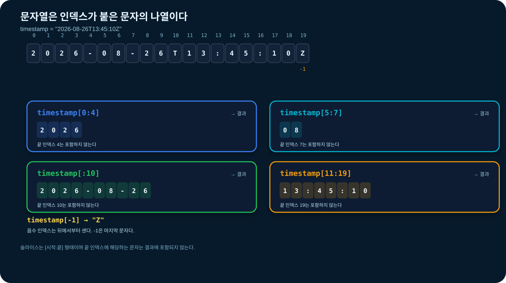
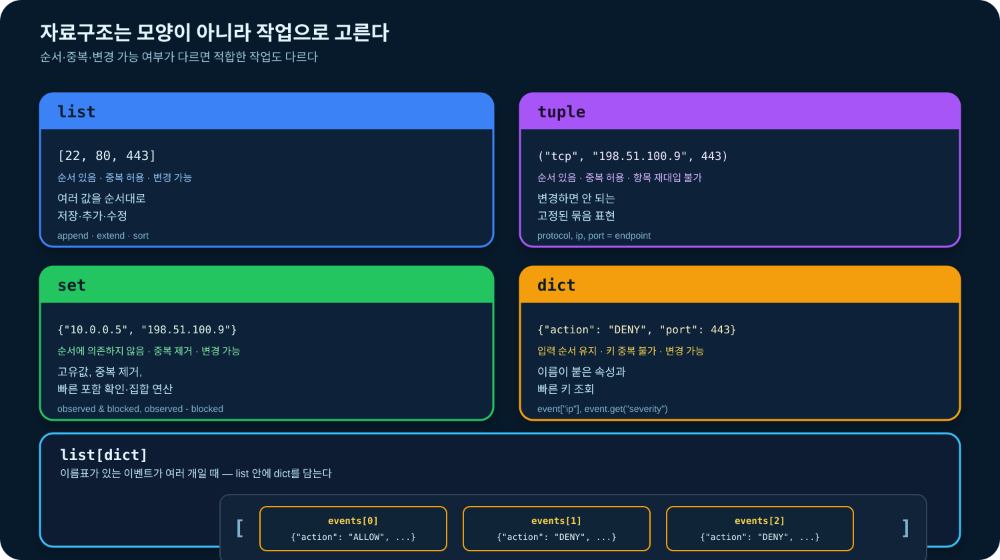
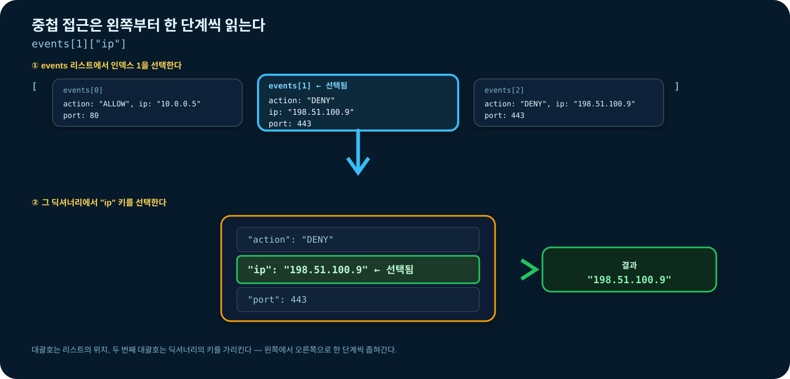
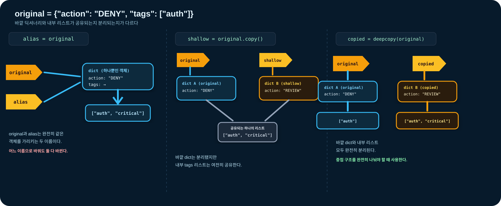

# 03-2. 문자열과 자료구조

문자열과 자료구조는 수집한 데이터를 **읽고, 정리하고, 구조화하고, 다시 찾기 위한 도구**다. 로그 한 줄은 문자열로 들어오지만 분석할 때는 필드를 나누어 딕셔너리로 만들고, 여러 이벤트를 리스트에 모은다.

03-1에서는 문자열이 숫자와 다른 기본 자료형이라는 점과 명시적 형변환을 배웠다. 이 절에서는 그 내용을 반복하지 않고, 문자열을 실제로 처리하는 방법과 여러 값을 목적에 맞게 조직하는 방법에 집중한다.


### 🧭 학습 목표

- 문자열을 순서가 있는 불변 시퀀스로 설명하고 인덱싱·슬라이싱한다.
- 문자열을 정리·검색·분리·결합·포매팅한다.
- `list`, `tuple`, `set`, `dict`의 선택 기준을 설명한다.
- 이벤트 하나를 `dict`, 이벤트 여러 개를 `list[dict]`로 표현한다.
- 별칭, 얕은 복사, 깊은 복사의 차이를 실행 결과로 설명한다.
- 자료구조에서 자주 발생하는 `IndexError`, `KeyError`, 복사 오류를 진단한다.


## 학습 우선순위

| 구분 | 내용 |
| --- | --- |
| 필수 | 문자열 정규화·검색·분리·결합, 리스트와 딕셔너리 |
| 권장 | 튜플·집합 선택, 중첩 자료구조, 정렬과 안전한 조회 |
| 심화 | 별칭, 얕은 복사·깊은 복사, 자료구조 선택 의사결정 |

## 학습 범위와 순서

이 절은 다음 경계를 지킨다.

- `443`과 `"443"`, `int()` 형변환의 원리는 [03-1](03-1-data-types.md)에서 학습한 내용으로 간단히 복습만 한다.
- `if` 조건문은 [03-3](03-3-conditions.md), `for` 반복문과 컴프리헨션은 [03-4](03-4-loops.md)에서 배운다.
- 이 절의 핵심 실습은 조건문과 반복문 없이도 실행할 수 있게 구성한다.
- 여러 로그를 자동으로 분류·집계하는 코드는 03-3과 03-4 학습 후 확장 과제로 진행한다.

전용 실습은 [`notebooks/03-2-strings-collections.ipynb`](../notebooks/03-2-strings-collections.ipynb)에서 진행할 수 있다.

## 0. 03-1 연결 확인

다음 코드는 새 개념이 아니라 03-1에서 배운 내용을 문자열 처리에 적용한 것이다.

```python
port_text = "443"
port = int(port_text)

print(port_text, type(port_text))  # 443 <class 'str'>
print(port, type(port))            # 443 <class 'int'>
```

다음 질문에 답할 수 있으면 바로 1절로 진행한다.

1. `port_text + "1"`과 `port + 1`의 결과가 다른 이유는 무엇인가?
2. 외부 입력의 원본 문자열을 바로 덮어쓰지 않고 별도 변수에 보관하면 어떤 이점이 있는가?
3. `None`과 빈 문자열 `""`은 어떤 업무 상태를 표현하는가?

답하기 어렵다면 03-1의 “숫자 443과 문자열 443”, “명시적 형변환”, “None” 부분을 복습한다.

## 1. 문자열은 순서가 있는 불변 시퀀스

문자열(`str`)은 문자를 순서대로 모은 값이다. 각 문자는 0부터 시작하는 위치 번호인 인덱스를 가진다.

```python
action = "DENY"

print(len(action))  # 4
print(action[0])    # D
print(action[1])    # E
print(action[-1])   # Y
```

음수 인덱스는 뒤에서부터 센다. `-1`은 마지막 문자다.

문자열의 일부 범위를 잘라 내는 것을 슬라이싱이라고 한다.

```python
timestamp = "2026-08-26T13:45:10Z"

print(timestamp[0:4])   # 2026
print(timestamp[5:7])   # 08
print(timestamp[:10])   # 2026-08-26
print(timestamp[11:19]) # 13:45:10
print(timestamp[-1])    # Z
```



슬라이스의 끝 인덱스는 포함하지 않는다. `timestamp[0:4]`는 0, 1, 2, 3 위치의 문자를 가져온다.

문자열은 생성 후 내부 문자를 바꿀 수 없는 불변 객체다.

```python
action = "DENY"

# action[0] = "d"
# TypeError: 문자열의 일부를 직접 변경할 수 없음

lower_action = action.lower()
print(action)        # DENY
print(lower_action)  # deny
```

문자열 메서드는 원본을 바꾸지 않고 새로운 문자열을 반환한다.

## 2. 원본 보존과 문자열 정규화

외부 문자열에는 불필요한 공백, 줄바꿈, 대소문자 차이가 포함될 수 있다.

```python
raw_line = "  Deny 198.51.100.9 /Admin\n"
clean_line = raw_line.strip()
normalized_line = clean_line.lower()

print(repr(raw_line))         # '  Deny 198.51.100.9 /Admin\n'
print(repr(clean_line))       # 'Deny 198.51.100.9 /Admin'
print(normalized_line)        # deny 198.51.100.9 /admin
```

`repr()`은 공백과 `\n` 같은 특수 문자를 확인할 때 유용하다.

분석 증거가 되는 원문은 덮어쓰지 않는다.

```python
raw_action = "  DeNy\n"
normalized_action = raw_action.strip().upper()

print(repr(raw_action))       # 원본 보존
print(normalized_action)      # DENY
```

| 메서드 | 반환 결과 | 대표 활용 |
|---|---|---|
| `strip()` | 양끝 공백·탭·줄바꿈을 제거한 새 문자열 | 로그 한 줄 정리 |
| `lstrip()`, `rstrip()` | 왼쪽 또는 오른쪽만 정리한 새 문자열 | 접두 공백·줄바꿈 제거 |
| `lower()`, `upper()` | 대소문자를 통일한 새 문자열 | action, 확장자 비교 |
| `replace(old, new)` | 지정 부분을 치환한 새 문자열 | 표시용 마스킹, 형식 통일 |


`strip("ab")`는 문자열 양끝의 정확한 `"ab"`를 제거하는 기능이 아니다. 양끝에서 `a` 또는 `b` 문자를 반복해서 제거한다. 고정 접두사·접미사를 제거하려면 `removeprefix()`와 `removesuffix()`를 검토한다.


### 응용 인사이트: 정규화는 비교 목적에 맞게 제한한다

이벤트 종류처럼 대소문자를 구분하지 않는 필드는 `strip().upper()`로 정규화하면 비교 기준을 하나로 만들 수 있다. 그러나 모든 문자열을 일괄적으로 소문자로 바꾸면 대소문자를 구분하는 파일 경로, 토큰, 사용자 식별자의 의미가 달라질 수 있다.

```python
raw_action = "  deny\n"
raw_path = "/CaseSensitive/Report.txt"

normalized_action = raw_action.strip().upper()
preserved_path = raw_path.strip()

print(normalized_action)  # DENY
print(preserved_path)     # /CaseSensitive/Report.txt
```

정규화를 넓게 적용하면 검색 누락은 줄어들지만 서로 다른 값을 같은 값으로 합칠 위험이 커진다. 원본을 그대로 비교하면 의미는 보존되지만 입력 시스템마다 표기가 다른 경우 같은 이벤트를 놓칠 수 있다. 어떤 필드에 어떤 변환을 허용할지 필드별로 정한다.

> 사고 질문: action은 대문자로 통일하면서 경로는 보존한 이유는 무엇인가? 사용자 이름과 파일 해시는 어느 쪽에 가까운가?

## 3. 문자열 검색과 포함 여부

문자열 안에 특정 값이 있는지 확인할 때 `in`을 사용한다.

```python
line = "DENY 198.51.100.9 /admin"

print("DENY" in line)          # True
print("ALLOW" in line)         # False
print(line.startswith("DENY")) # True
print(line.endswith("/admin")) # True
```

대소문자를 무시하려면 비교 대상과 데이터를 같은 기준으로 정규화한다.

```python
raw_path = "/Admin/Login"
normalized_path = raw_path.lower()

print("/admin" in normalized_path)  # True
print(normalized_path.endswith("/login"))  # True
```

`find()`는 위치를 반환하며 찾지 못하면 `-1`을 반환한다.

```python
line = "DENY 198.51.100.9 /admin"

print(line.find("198.51"))  # 5
print(line.find("ALLOW"))   # -1
```

단순히 존재 여부만 필요하다면 `find(...) >= 0`보다 `in`이 읽기 쉽다.

## 4. 인덱싱과 슬라이싱의 경계

존재하지 않는 한 위치를 인덱싱하면 `IndexError`가 발생한다.

```python
action = "DENY"

# print(action[4])
# IndexError: string index out of range
```

반면 슬라이싱은 범위를 넘어가도 가능한 부분까지만 반환한다.

```python
action = "DENY"

print(action[0:100])  # DENY
print(action[100:])   # 빈 문자열
```

빈 문자열을 인덱싱할 수는 없다.

```python
empty = ""

print(len(empty))  # 0
# print(empty[0])  # IndexError
```

## 5. 문자열 분리: split과 partition

`split()`은 문자열을 나누고 **리스트를 반환**한다.

```python
line = "DENY 198.51.100.9 443 /admin"
parts = line.split()

print(parts)
# ['DENY', '198.51.100.9', '443', '/admin']

action, ip, port_text, path = parts
port = int(port_text)

print(action, ip, port, path)
```

인자를 생략한 `split()`은 연속된 공백·탭을 하나의 구분처럼 처리한다.

```python
line = "DENY   198.51.100.9\t443"

print(line.split())
# ['DENY', '198.51.100.9', '443']
```

구분자를 지정하면 그 문자를 기준으로 나눈다.

```python
indicator = "sha256=abc123"
name, value = indicator.split("=", 1)

print(name)   # sha256
print(value)  # abc123
```

구분자를 기준으로 앞·구분자·뒤의 세 부분을 항상 얻고 싶다면 `partition()`을 사용한다.

```python
header = "Content-Type: application/json"
name, separator, value = header.partition(":")

print(name)             # Content-Type
print(separator)        # :
print(value.strip())    # application/json
```


CSV처럼 값 안에 쉼표·따옴표·줄바꿈이 들어갈 수 있는 표준 형식은 `split(",")`으로 직접 파싱하지 않는다. [04-5. CSV](../04-file-io/04-5-csv.md)에서 표준 `csv` 모듈을 사용한다.


### 응용 인사이트: 구분자는 곧 데이터 형식의 규칙이다

`split()`은 “이 구분자가 값 내부에는 나타나지 않는다”는 전제가 있을 때 적합하다. 단순한 `이름=값` 형식에서도 값에 `=`가 들어올 수 있다면 분할 횟수를 제한해야 원래 의미를 보존할 수 있다.

```python
metadata = "note=a=b=c"
name, value = metadata.split("=", 1)

print(name)   # note
print(value)  # a=b=c
```

직접 분리하는 코드는 형식이 단순할 때 의존성이 적고 읽기 쉽다. 반면 따옴표, 이스케이프, 선택 필드가 포함되기 시작하면 누락된 예외 규칙이 데이터 손상으로 이어진다. CSV·URL·JSON처럼 이미 문법이 정의된 형식은 이후 장에서 전용 파서를 사용한다.

> 사고 질문: `"DENY user name 443"`을 공백으로 나눌 때 사용자 이름이 두 단어일 수 있다면 필드 위치를 신뢰할 수 있는가? 형식 자체를 어떻게 바꾸는 편이 나은가?

## 6. 문자열 결합과 포매팅

여러 문자열을 하나로 연결할 때 `join()`을 사용한다.

```python
fields = ["DENY", "198.51.100.9", "443", "/admin"]
line = " ".join(fields)

print(line)
# DENY 198.51.100.9 443 /admin
```

`join()`을 호출하는 대상이 구분자라는 점에 주의한다.

```python
tags = ["auth", "deny", "critical"]

print(", ".join(tags))
# auth, deny, critical
```

문장 안에 변수 값을 넣을 때는 f-string이 읽기 쉽다.

```python
action = "DENY"
ip = "198.51.100.9"
port = 443

message = f"action={action} ip={ip} port={port}"
print(message)
```

`join()`은 문자열만 결합할 수 있다. 정수가 섞여 있으면 먼저 문자열로 변환한다.

```python
ip = "198.51.100.9"
port = 443

# print(":".join([ip, port]))  # TypeError
print(":".join([ip, str(port)]))  # 198.51.100.9:443
```

## 7. 자료구조는 작업을 기준으로 선택한다

자료구조는 여러 값을 어떤 규칙으로 저장하고, 찾고, 추가하고, 변경할지 정한 형태다.

| 자료구조 | 순서 | 중복 | 변경 | 적합한 작업 |
|---|---:|---:|---:|---|
| `list` | 있음 | 허용 | 가능 | 여러 값을 순서대로 저장·추가·수정 |
| `tuple` | 있음 | 허용 | 항목 재대입 불가 | 변경하면 안 되는 고정 묶음 표현 |
| `set` | 순서에 의존하지 않음 | 제거 | 가능 | 고유값, 중복 제거, 빠른 포함 확인 |
| `dict` | 입력 순서 유지 | 키 중복 불가 | 가능 | 이름이 붙은 속성과 빠른 키 조회 |

자료의 겉모양보다 앞으로 수행할 작업이 더 중요하다.

- 같은 종류의 로그가 여러 개이고 순서가 중요하다 → `list`
- 프로토콜·IP·포트처럼 고정된 한 묶음이다 → `tuple`
- 관측된 고유 IP와 차단 IP의 교집합을 구한다 → `set`
- 이벤트 하나의 action·IP·port에 이름표를 붙인다 → `dict`
- 이름표가 있는 이벤트가 여러 개다 → `list[dict]`



### 응용 인사이트: 편리한 자료구조가 정보를 없앨 수도 있다

세트는 중복 제거와 포함 검사에 적합하지만, 관측 순서와 반복 횟수를 보존하지 않는다. 분석에서 “어떤 IP가 등장했는가”만 필요하면 세트가 맞지만, “어떤 순서로 몇 번 등장했는가”가 필요하면 원본 리스트도 유지해야 한다.

```python
observed_ip_sequence = [
    "10.0.0.5",
    "198.51.100.9",
    "10.0.0.5",
]
unique_ips = set(observed_ip_sequence)

print(len(observed_ip_sequence))  # 3: 전체 관측 횟수
print(len(unique_ips))            # 2: 고유 IP 수
```

리스트와 세트를 함께 유지하면 시간 순서와 빠른 포함 검사를 모두 얻지만 메모리를 더 사용하고 두 구조를 일관되게 갱신해야 한다. 자료구조 변환 전에는 제거될 정보가 이후 분석에 필요한지 먼저 확인한다.

이 절에서는 변환할 때 잃는 정보에 집중한다. 같은 자료를 반복 검색할 때 리스트와 세트의 실행 비용을 비교하는 방법은 [03-4의 반복문 응용 인사이트](03-4-loops.md#응용-인사이트-반복-횟수보다-자료구조-선택이-더-큰-차이를-만들-수-있다)에서 이어서 다룬다.

> 사고 질문: 중복 로그를 세트로 제거한 뒤에는 공격 시도의 빈도를 계산할 수 있는가?

## 8. list: 순서가 있는 값의 모음

리스트는 대괄호(`[]`)로 만들며 항목을 추가·수정·삭제할 수 있다.

```python
ports = [22, 80, 443]

print(ports[0])    # 22
print(ports[-1])   # 443
print(ports[1:])   # [80, 443]
print(len(ports))  # 3
print(443 in ports) # True
```

리스트를 변경하는 대표 메서드는 다음과 같다.

```python
ports = [22, 80, 443]

ports.append(8080)       # 값 하나 추가
ports.extend([8443, 9000]) # 여러 값 추가
ports[0] = 2222          # 위치의 값 변경
ports.remove(80)         # 첫 번째 일치 값 제거
last_port = ports.pop()  # 마지막 값을 제거하며 반환

print(ports)
print(last_port)
```

`append()`와 `extend()`의 차이를 확인한다.

```python
items_a = [22, 80]
items_a.append([443, 8080])
print(items_a)  # [22, 80, [443, 8080]]

items_b = [22, 80]
items_b.extend([443, 8080])
print(items_b)  # [22, 80, 443, 8080]
```

변경 메서드 대부분은 변경된 리스트가 아니라 `None`을 반환한다.

```python
ports = [443, 22, 80]
result = ports.sort()

print(ports)   # [22, 80, 443]
print(result)  # None
```

새 리스트가 필요하면 `sorted()`를 사용한다.

```python
ports = [443, 22, 80]
sorted_ports = sorted(ports)

print(ports)         # [443, 22, 80]
print(sorted_ports)  # [22, 80, 443]
```

## 9. tuple: 변경하지 않을 값의 묶음

튜플은 소괄호(`()`)로 만들며 생성 후 항목을 다른 값으로 바꿀 수 없다.

```python
endpoint = ("tcp", "198.51.100.9", 443)
protocol, ip, port = endpoint

print(protocol, ip, port)
```

```python
# endpoint[2] = 8443
# TypeError: 튜플 항목은 변경할 수 없음
```

항목이 하나인 튜플에는 쉼표가 필요하다.

```python
not_a_tuple = (443)
one_item_tuple = (443,)

print(type(not_a_tuple))     # <class 'int'>
print(type(one_item_tuple))  # <class 'tuple'>
```

튜플은 “절대로 모든 내부 상태가 바뀌지 않는다”는 보안 장치가 아니라, 튜플의 각 위치를 다른 객체로 재대입할 수 없다는 뜻이다. 완전한 불변성이 필요한 설계는 이후 객체 설계에서 다시 다룬다.

## 10. set: 중복 없는 값의 모음

세트는 중복을 제거하고 포함 여부와 집합 연산을 수행하기 좋다. 항목의 출력 순서에 의존하지 않는다.

```python
observed_ips = {
    "198.51.100.9",
    "10.0.0.5",
    "198.51.100.9",
}

print(len(observed_ips))  # 2
print("198.51.100.9" in observed_ips)  # True
```

리스트의 중복을 제거할 수 있다.

```python
ip_list = ["10.0.0.5", "198.51.100.9", "10.0.0.5"]
unique_ips = set(ip_list)

print(unique_ips)
```

집합 연산은 관측값과 기준 목록을 비교할 때 유용하다.

```python
observed_ips = {"10.0.0.5", "198.51.100.9"}
blocked_ips = {"198.51.100.9", "203.0.113.7"}

print(observed_ips & blocked_ips)  # 교집합
print(observed_ips - blocked_ips)  # 차집합
print(observed_ips | blocked_ips)  # 합집합
```

빈 세트는 `set()`으로 만든다. `{}`는 빈 딕셔너리다.

```python
empty_set = set()
empty_dict = {}

print(type(empty_set))   # <class 'set'>
print(type(empty_dict))  # <class 'dict'>
```

## 11. dict: 키와 값의 연결

딕셔너리는 `키: 값` 형식으로 값에 이름표를 붙인다. 이벤트 하나처럼 여러 속성을 가진 대상을 표현하기 좋다.

```python
event = {
    "action": "DENY",
    "ip": "198.51.100.9",
    "port": 443,
    "path": "/admin",
}

print(event["ip"])
print(event["port"])
```

항목을 추가하거나 수정할 수 있다.

```python
event["user"] = "bob"
event["action"] = "REVIEW"

print(event)
```

없는 키를 대괄호로 조회하면 `KeyError`가 발생한다.

```python
# print(event["country"])
# KeyError: 'country'
```

값이 없을 수 있다면 `get()`을 사용한다.

```python
country = event.get("country")
severity = event.get("severity", "UNKNOWN")

print(country)   # None
print(severity)  # UNKNOWN
```

`in`은 기본적으로 값이 아니라 키의 존재 여부를 확인한다.

```python
print("ip" in event)                # True
print("198.51.100.9" in event)      # False
print("198.51.100.9" in event.values()) # True
```

키, 값, 키-값 쌍은 다음 메서드로 얻는다.

```python
print(event.keys())
print(event.values())
print(event.items())
```

`items()`를 반복하는 방법은 03-4에서 다룬다.

### 응용 인사이트: 없는 키와 값이 None인 키는 다르다

`dict.get()`은 키가 없을 때 기본적으로 `None`을 반환한다. 따라서 값이 실제로 `None`인 경우와 키 자체가 수집되지 않은 경우를 `get()` 결과만으로는 구분할 수 없다.

```python
event = {"action": "DENY", "country": None}

print(event.get("country"))       # None: 키는 있지만 값이 미확인
print(event.get("sensor_id"))     # None: 키 자체가 없음
print("country" in event)         # True
print("sensor_id" in event)       # False
```

선택 필드를 편하게 읽을 때는 `get()`이 적합하다. 반면 필수 필드 누락을 데이터 품질 오류로 구분해야 한다면 먼저 `"key" in event`를 확인하거나 대괄호 조회로 오류를 드러낸다. 무조건 기본값을 넣으면 보고서 생성은 계속되지만, 수집 파이프라인의 결함이 숨을 수 있다.

> 사고 질문: 국가 정보가 아직 확인되지 않은 이벤트와 센서가 `country` 필드를 아예 보내지 않은 이벤트를 같은 상태로 집계해도 되는가?

## 12. list[dict]: 여러 이벤트 표현

실무에서는 이벤트 하나를 딕셔너리로, 이벤트 여러 개를 리스트로 표현하는 조합을 자주 사용한다.

```python
events = [
    {"action": "ALLOW", "ip": "10.0.0.5", "port": 80},
    {"action": "DENY", "ip": "198.51.100.9", "port": 443},
    {"action": "DENY", "ip": "198.51.100.9", "port": 443},
]

print(events[0])
print(events[1]["action"])
print(events[1]["ip"])
```

자료구조의 접근 순서를 왼쪽부터 읽는다.

```text
events[1]["ip"]
│      │   └─ 두 번째 이벤트 딕셔너리의 "ip" 값
│      └──── 리스트의 두 번째 이벤트
└─────────── 여러 이벤트가 저장된 리스트
```



딕셔너리 안에 리스트나 다른 딕셔너리를 넣어 보고서를 구성할 수도 있다.

```python
report = {
    "summary": {
        "total": 3,
        "deny": 2,
    },
    "unique_ips": {"10.0.0.5", "198.51.100.9"},
    "events": events,
}

print(report["summary"]["deny"])  # 2
print(report["events"][0]["port"]) # 80
```

중첩이 너무 깊으면 읽고 수정하기 어려워진다. 반복해서 접근하는 값은 의미 있는 변수로 분리한다.

```python
summary = report["summary"]
deny_count = summary["deny"]

print(deny_count)
```

## 13. 별칭과 복사

리스트와 딕셔너리는 변경 가능한 객체다. 단순 대입은 복사가 아니라 같은 객체에 새 이름을 붙인다.

### 별칭: 같은 객체를 공유

```python
original = {"action": "DENY", "tags": ["auth"]}
alias = original

alias["action"] = "REVIEW"
alias["tags"].append("critical")

print(original)
# {'action': 'REVIEW', 'tags': ['auth', 'critical']}
```

`original`과 `alias`는 같은 딕셔너리를 가리키므로 어느 이름으로 변경해도 같은 객체에서 보인다.

### 얕은 복사: 바깥 컨테이너만 분리

```python
original = {"action": "DENY", "tags": ["auth"]}
shallow = original.copy()

shallow["action"] = "REVIEW"
shallow["tags"].append("critical")

print(original)
# {'action': 'DENY', 'tags': ['auth', 'critical']}
print(shallow)
# {'action': 'REVIEW', 'tags': ['auth', 'critical']}
```

바깥 딕셔너리는 분리됐지만 내부 리스트 `tags`는 여전히 공유한다.

### 깊은 복사: 중첩 객체까지 분리

```python
from copy import deepcopy

original = {"action": "DENY", "tags": ["auth"]}
copied = deepcopy(original)

copied["action"] = "REVIEW"
copied["tags"].append("critical")

print(original)
# {'action': 'DENY', 'tags': ['auth']}
print(copied)
# {'action': 'REVIEW', 'tags': ['auth', 'critical']}
```

`from copy import deepcopy`의 모듈 문법은 03-7에서 자세히 배운다. 지금은 중첩 구조를 완전히 분리해야 할 때 사용하는 도구라는 점에 집중한다.



## 14. 자료구조 선택 의사결정

다음 질문을 순서대로 확인한다.

1. 값 하나인가? → 기본 자료형 또는 `str`
2. 여러 값을 순서대로 저장·추가하는가? → `list`
3. 위치와 개수가 고정된 묶음인가? → `tuple`
4. 중복 제거·포함 확인·집합 비교가 중요한가? → `set`
5. 각 값에 이름표가 필요한가? → `dict`
6. 이름표가 있는 대상이 여러 개인가? → `list[dict]`
7. 중첩 구조를 복사하는가? → 공유 여부를 확인하고 필요하면 `deepcopy()`

자료구조를 선택한 이유를 “모양이 비슷해서”가 아니라 수행할 작업으로 설명한다.

```text
관측 IP를 set으로 저장한다.
→ 중복을 제거하고 차단 목록과 교집합을 구할 것이기 때문이다.
```

## 15. 자주 발생하는 오류

### 존재하지 않는 위치 접근

```python
ports = [22, 80, 443]

# print(ports[3])
# IndexError: list index out of range
```

### 존재하지 않는 딕셔너리 키 접근

```python
event = {"action": "DENY"}

# print(event["ip"])
# KeyError: 'ip'

print(event.get("ip"))  # None
```

### 빈 세트를 `{}`로 생성

```python
wrong_empty_set = {}
correct_empty_set = set()

print(type(wrong_empty_set))   # <class 'dict'>
print(type(correct_empty_set)) # <class 'set'>
```

### 변경 메서드의 반환값을 새 리스트로 착각

```python
ports = [443, 22, 80]
sorted_result = ports.sort()

print(ports)         # [22, 80, 443]
print(sorted_result) # None
```

### 얕은 복사가 중첩값까지 분리한다고 가정

```python
original = {"tags": ["auth"]}
copied = original.copy()
copied["tags"].append("deny")

print(original)  # {'tags': ['auth', 'deny']}
```

## 16. 단계별 연습문제

### 연습 1. 출력 결과 예측

실행 전에 결과와 자료형을 적는다.

```python
line = "  DENY 198.51.100.9  "
print(line.strip())
print(line[2:6])
print("DENY" in line)

ports = [22, 80]
ports.append([443, 8080])
print(ports)

observed = {"10.0.0.5", "10.0.0.5", "198.51.100.9"}
print(len(observed))

event = {"action": "DENY"}
print(event.get("ip", "UNKNOWN"))
```

### 연습 2. 자료구조 선택

각 상황에 적합한 자료구조와 선택 이유를 적는다.

1. 시간순으로 수집한 로그 100개
2. 변경하면 안 되는 `(프로토콜, IP, 포트)` 묶음
3. 관측된 고유 IP 목록
4. 이벤트 하나의 action·IP·port·path
5. 이벤트 딕셔너리 100개
6. 요약 정보와 원본 이벤트를 함께 가진 보고서

### 연습 3. 오류 수정

```python
# 문제 A: 마지막 문자 Y를 출력한다.
action = "DENY"
# print(action[4])

# 문제 B: 두 포트를 각각 리스트 항목으로 추가한다.
ports = [22, 80]
ports.append([443, 8080])

# 문제 C: 없는 country를 기본값 UNKNOWN으로 읽는다.
event = {"action": "DENY"}
# print(event["country"])

# 문제 D: 빈 세트를 만든다.
observed_ips = {}

# 문제 E: 원본의 중첩 tags가 변경되지 않는 복사본을 만든다.
original = {"tags": ["auth"]}
copied = original.copy()
copied["tags"].append("critical")
```

### 연습 4. 미니 실습 — 세 로그를 구조화하기

조건문과 반복문을 아직 배우지 않았으므로 세 줄을 직접 처리한다. 반복되는 코드는 03-4에서 제거한다.

```python
lines = [
    "ALLOW 10.0.0.5 80 /index",
    "DENY 198.51.100.9 443 /admin",
    "DENY 198.51.100.9 443 /login",
]
```

요구사항:

1. 각 문자열을 `split()`으로 나눈다.
2. 포트 문자열을 `int()`로 변환한다.
3. 각 로그를 `action`, `ip`, `port`, `path` 키를 가진 딕셔너리로 만든다.
4. 세 딕셔너리를 `events` 리스트에 저장한다.
5. 세 이벤트의 IP를 세트에 넣어 `unique_ips`를 만든다.
6. action 문자열 리스트에 `count()`를 사용해 DENY 횟수를 구한다.
7. 요약과 이벤트를 하나의 `report` 딕셔너리로 만든다.

자기점검:

```python
assert len(events) == 3
assert events[0]["port"] == 80
assert type(events[1]["port"]) is int
assert events[2]["path"] == "/login"
assert unique_ips == {"10.0.0.5", "198.51.100.9"}
assert deny_count == 2
assert report["summary"]["total"] == 3
assert report["summary"]["deny"] == 2

print("모든 자기점검을 통과했습니다.")
```

### 연습 5. 확장 과제 — 03-3·03-4 학습 후

다음 코드는 조건문과 반복문을 배운 뒤 실행한다. 지금은 03-2의 필수 평가 대상이 아니다.

```python
events = []

for line in lines:
    parts = line.split()

    if len(parts) != 4:
        continue

    action, ip, port_text, path = parts
    event = {
        "action": action,
        "ip": ip,
        "port": int(port_text),
        "path": path,
    }
    events.append(event)

deny_events = [
    event
    for event in events
    if event["action"] == "DENY"
]

deny_count_by_ip = {}

for event in deny_events:
    ip = event["ip"]
    deny_count_by_ip[ip] = deny_count_by_ip.get(ip, 0) + 1

print(deny_count_by_ip)
```

확장 과제에서 확인할 내용:

- 로그 개수가 늘어나도 같은 코드로 처리되는가?
- 필드 개수가 잘못된 줄을 안전하게 건너뛰는가?
- DENY 이벤트만 별도 리스트로 분리되는가?
- IP별 DENY 횟수가 정확히 누적되는가?

### 연습 6. 전이 연습 — 도서 정보 구조화

다음 입력을 보안 이벤트가 아닌 도서 데이터로 구조화한다. 조건문과 반복문은 사용하지 않는다.

```python
raw_title = "  Python Patterns  "
raw_authors = "Kim,Lee"
raw_tags = "python,education,python"
raw_year = "2026"
```

1. 제목의 양쪽 공백을 제거한다.
2. 저자 문자열을 분리해 변경하지 않을 튜플로 만든다.
3. 태그 문자열을 분리해 중복 없는 집합으로 만든다.
4. 연도는 정수로 변환한다.
5. 결과를 `title`, `authors`, `tags`, `year` 키가 있는 딕셔너리로 묶는다.
6. 원본 문자열이 그대로 남아 있는지 확인한다.

## 17. 정답과 해설

<details>
<summary>연습 1 정답</summary>

```text
DENY 198.51.100.9
DENY
True
[22, 80, [443, 8080]]
2
UNKNOWN
```

`append([443, 8080])`은 리스트 전체를 하나의 항목으로 추가한다. 세트는 중복을 제거하므로 원소 수는 2다.

</details>

<details>
<summary>연습 2 예시 답안</summary>

1. `list` — 수집 순서와 중복을 유지한다.
2. `tuple` — 위치와 개수가 고정된 묶음이다.
3. `set` — 중복을 제거하고 포함 여부를 확인한다.
4. `dict` — 각 속성에 이름표가 필요하다.
5. `list[dict]` — 이름표가 있는 이벤트가 여러 개다.
6. 중첩 `dict` — `summary`, `events`처럼 보고서 구성 요소에 이름을 붙인다.

</details>

<details>
<summary>연습 3 수정 예시</summary>

```python
# 문제 A
action = "DENY"
print(action[-1])

# 문제 B
ports = [22, 80]
ports.extend([443, 8080])

# 문제 C
event = {"action": "DENY"}
print(event.get("country", "UNKNOWN"))

# 문제 D
observed_ips = set()

# 문제 E
from copy import deepcopy

original = {"tags": ["auth"]}
copied = deepcopy(original)
copied["tags"].append("critical")
```

</details>

<details>
<summary>미니 실습 예시 답안</summary>

```python
lines = [
    "ALLOW 10.0.0.5 80 /index",
    "DENY 198.51.100.9 443 /admin",
    "DENY 198.51.100.9 443 /login",
]

parts_1 = lines[0].split()
parts_2 = lines[1].split()
parts_3 = lines[2].split()

event_1 = {
    "action": parts_1[0],
    "ip": parts_1[1],
    "port": int(parts_1[2]),
    "path": parts_1[3],
}
event_2 = {
    "action": parts_2[0],
    "ip": parts_2[1],
    "port": int(parts_2[2]),
    "path": parts_2[3],
}
event_3 = {
    "action": parts_3[0],
    "ip": parts_3[1],
    "port": int(parts_3[2]),
    "path": parts_3[3],
}

events = [event_1, event_2, event_3]
unique_ips = {event_1["ip"], event_2["ip"], event_3["ip"]}
actions = [event_1["action"], event_2["action"], event_3["action"]]
deny_count = actions.count("DENY")

report = {
    "summary": {
        "total": len(events),
        "deny": deny_count,
    },
    "unique_ips": unique_ips,
    "events": events,
}
```

</details>

<details>
<summary>연습 6 전이 연습 예시 답안</summary>

```python
raw_title = "  Python Patterns  "
raw_authors = "Kim,Lee"
raw_tags = "python,education,python"
raw_year = "2026"

book = {
    "title": raw_title.strip(),
    "authors": tuple(raw_authors.split(",")),
    "tags": set(raw_tags.split(",")),
    "year": int(raw_year),
}

assert book["title"] == "Python Patterns"
assert book["authors"] == ("Kim", "Lee")
assert book["tags"] == {"python", "education"}
assert book["year"] == 2026
assert raw_title == "  Python Patterns  "
```

</details>

## 완료 기준

다음은 권장·심화 내용을 포함한 장 전체의 최종 완료 기준이다. 첫 학습에서는 앞의 학습 우선순위 표에서 필수 항목을 먼저 확인하고 나머지를 단계적으로 확장한다.

- [ ] 문자열의 인덱스와 슬라이스 결과를 예측할 수 있다.
- [ ] 문자열 메서드가 원본이 아니라 새 문자열을 반환한다는 점을 설명할 수 있다.
- [ ] `strip()`, `lower()`·`upper()`, `split()`, `join()`을 사용할 수 있다.
- [ ] `list`, `tuple`, `set`, `dict`를 작업 목적에 따라 선택할 수 있다.
- [ ] `append()`와 `extend()`, `sort()`와 `sorted()`의 차이를 설명할 수 있다.
- [ ] `event["key"]`와 `event.get("key")`의 차이를 설명할 수 있다.
- [ ] `list[dict]`와 중첩 딕셔너리의 접근 경로를 읽을 수 있다.
- [ ] 별칭, 얕은 복사, 깊은 복사의 결과 차이를 설명할 수 있다.
- [ ] 필드 의미에 맞는 정규화 방법과 전용 파서가 필요한 시점을 판단할 수 있다.
- [ ] 자료구조 변환으로 순서·중복·키 존재 정보가 사라지는 경우를 설명할 수 있다.
- [ ] 미니 실습의 모든 `assert`를 통과했다.
- [ ] 도서 정보 전이 연습에 목적에 맞는 자료구조를 선택했다.

## 핵심 정리

- 03-1은 문자열의 자료형과 변환을, 03-2는 문자열 처리와 여러 값의 구조화를 다룬다.
- 문자열은 순서가 있지만 내부 문자를 직접 변경할 수 없는 불변 시퀀스다.
- 정규화 결과와 분석 증거인 원본 문자열을 분리해 보존한다.
- 정규화는 필드별 비교 규칙에 맞게 적용하며, 표준 형식은 전용 파서로 처리한다.
- `split()`은 문자열을 리스트로 나누고 `join()`은 문자열 목록을 결합한다.
- 리스트는 순서, 튜플은 고정 묶음, 세트는 고유값, 딕셔너리는 이름이 붙은 속성에 적합하다.
- 세트로 변환하면 순서와 빈도가 사라지고, `get()`만 사용하면 없는 키와 `None` 값을 구분할 수 없다.
- 이벤트 하나는 `dict`, 이벤트 여러 개는 `list[dict]`로 표현할 수 있다.
- 단순 대입은 복사가 아니며 얕은 복사는 중첩 객체를 공유할 수 있다.
- 자동 분류와 집계는 조건문과 반복문을 배운 뒤 확장한다.

---

이전 절: [03-1. 변수와 기본 자료형](03-1-data-types.md)  
다음 절: [03-3. 조건문과 논리](03-3-conditions.md)
