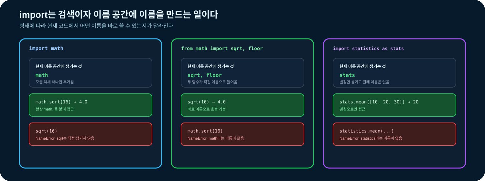
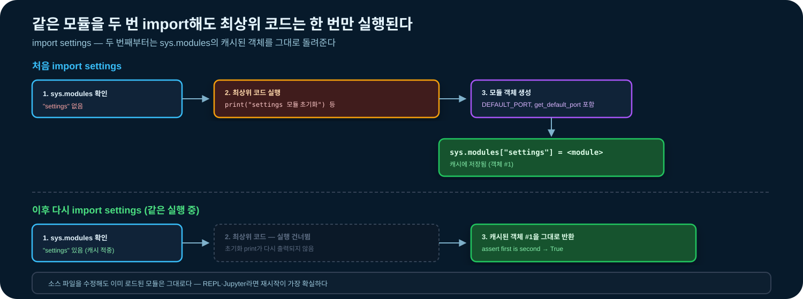
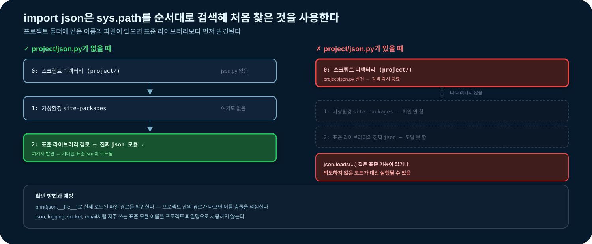
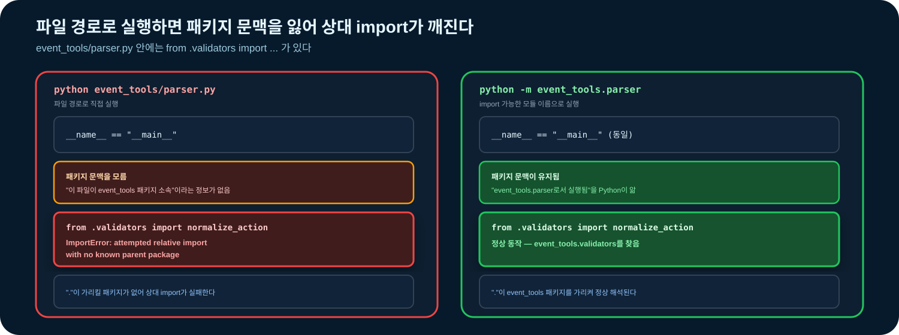

# 03-7. 모듈과 패키지

프로그램이 길어지면 한 파일에서 모든 입력, 검증, 처리, 출력을 관리하기 어렵다. **모듈**은 코드를 파일 단위로 나누고, **패키지**는 관련 모듈을 이름 공간 아래 묶는다. 이 절에서는 파일을 나누는 것뿐 아니라 Python이 모듈을 찾고 실행하는 규칙까지 학습한다.


### 🧭 학습 목표

- 모듈, 일반 패키지, 배포 패키지의 차이를 설명한다.
- `import`, `from ... import ...`, `as`가 현재 이름 공간에 만드는 이름을 예측한다.
- import 시 모듈의 최상위 코드가 실행되고 모듈 객체가 캐시됨을 설명한다.
- `sys.path`와 현재 실행 위치를 확인해 `ModuleNotFoundError`를 진단한다.
- 패키지 내부에서 절대 import와 상대 import를 사용한다.
- 직접 실행, import, `python -m` 실행을 구분한다.
- `main()`과 `__main__.py`로 실행 진입점을 구성한다.
- 표준·외부·프로젝트 모듈을 구분하고 의존성을 재현한다.
- 이후 과정의 주요 표준 모듈과 외부 패키지를 목적에 맞게 선택한다.
- 순환 import, 이름 충돌, import 부수 효과 같은 안티패턴을 피한다.


## 학습 우선순위

| 구분 | 내용 |
| --- | --- |
| 필수 | 모듈·일반 패키지, import 문, 사용자 모듈, `main()`과 실행 가드 |
| 권장 | 상대 import, `python -m`, import 오류 진단, 가상환경과 의존성 재현 |
| 심화 | namespace package, 모듈 캐시·검색 경로, 순환 import, 공급망 안전 |

## 선행 지식과 학습 연결

- 함수 계약과 스코프는 [03-5](03-5-functions.md)에서 학습했다.
- 예외 전파와 이벤트 행 파서는 [03-6](03-6-exceptions.md)에서 학습했다.
- 가상환경 생성과 패키지 설치는 [02장](../02-python-setup.md)에서 학습했다.
- 이 절에서는 03-6의 이벤트 파서를 여러 모듈로 분리한다.
- 다음 [03-8](03-8-classes-dataclasses.md)에서는 데이터와 동작을 클래스로 묶는다.

전용 실습은 [`notebooks/03-7-modules-packages.ipynb`](../notebooks/03-7-modules-packages.ipynb)에서 진행한다.

## 시작 전 확인

다음 질문의 답을 먼저 예상한다.

1. `import math`를 실행하면 `sqrt`라는 이름도 바로 생길까?
2. 같은 모듈을 두 번 import하면 최상위 코드는 두 번 실행될까?
3. 프로젝트에 `json.py`를 만들면 `import json`은 무엇을 가져올까?
4. 패키지 안의 모듈을 파일 경로로 직접 실행하는 것과 `python -m`으로 실행하는 것은 같을까?
5. PyPI에서 설치하는 이름과 Python 코드에서 import하는 이름은 항상 같을까?

학습 후 코드 실행 결과와 함께 다시 답한다.

## 1. 모듈·패키지·라이브러리 용어

용어가 비슷하지만 가리키는 범위가 다르다.

| 용어 | 의미 | 예 |
| --- | --- | --- |
| 모듈(module) | Python 정의와 문장을 담은 하나의 모듈 단위 | `parser.py`, `math` |
| 일반 패키지(regular package) | 보통 `__init__.py`를 가진 모듈 디렉터리 | `event_tools/` |
| 하위 패키지(subpackage) | 패키지 안에 포함된 패키지 | `event_tools/formats/` |
| 라이브러리 | 재사용 가능한 모듈·패키지를 부르는 일반적인 표현 | Python 표준 라이브러리 |
| 배포 패키지(distribution package) | `pip`가 설치·업데이트하는 배포 단위 | `beautifulsoup4` |

하나의 배포 패키지가 여러 import 패키지를 제공할 수 있고 설치 이름과 import 이름도 다를 수 있다. 예를 들어 `beautifulsoup4`를 설치한 뒤에는 `bs4`를 import한다.


이 절의 **패키지**는 주로 Python 코드 구조를 뜻한다. `pip install`의 설치 단위와 혼동하지 않는다.


### 1.1 일반 패키지와 namespace package

입문 프로젝트에서는 디렉터리에 `__init__.py`를 두는 일반 패키지를 사용한다. Python은 `__init__.py`가 없는 여러 디렉터리를 하나로 합치는 namespace package도 지원하지만, 이는 여러 배포판이 이름 공간을 공유할 때 사용하는 심화 기능이다.

```text
event_tools/
├── __init__.py
├── parser.py
└── report.py
```

`__init__.py`는 비어 있어도 된다. 패키지 초기화와 공개 이름 구성이 필요할 때만 최소한의 코드를 둔다.

## 2. 코드를 나누는 기준

파일 수를 늘리는 것이 목적은 아니다. 함께 변경되는 책임을 가까이 두고, 서로 다른 책임을 분리한다.

| 책임 | 예시 모듈 |
| --- | --- |
| 입력값 검증·정규화 | `validators.py` |
| 텍스트를 구조화 | `parser.py` |
| 결과 집계·표현 | `report.py` |
| 실행 흐름 조정 | `__main__.py` 또는 `main.py` |

다음 신호가 나타나면 분리를 검토한다.

- 한 파일에서 서로 무관한 기능이 자주 함께 수정된다.
- 같은 함수를 여러 프로그램에서 복사해 사용한다.
- 일부 기능만 독립적으로 검증하기 어렵다.
- 입력·출력 코드 때문에 핵심 계산 함수를 재사용하기 어렵다.

반대로 한두 줄짜리 함수마다 파일을 만들면 탐색 비용과 import 관계만 늘어난다.

### 응용 인사이트: 모듈 경계는 함께 바뀌는 이유를 따른다

모듈을 단순히 코드 길이로 나누면 요구사항이 바뀔 때 여러 파일을 동시에 수정하게 된다. 실제 프로그램에서는 **변경 이유가 같은 코드**를 가까이 두는 편이 유리하다.

| 변경 요구 | 주로 바뀌어야 하는 모듈 | 그대로여야 하는 모듈 |
| --- | --- | --- |
| 이벤트 원문 형식에 시간 필드 추가 | `parser.py` | `report.py`, `__main__.py` |
| 차단 포트 판단 기준 변경 | `policy.py` | `parser.py`, 출력 포맷 |
| 요약을 표 대신 JSON으로 표현 | `report.py` | 파서와 판단 규칙 |

예를 들어 이벤트를 해석하는 함수 안에서 곧바로 경고 문장을 출력하면 입력 형식, 판단 정책, 출력 형식이 한 함수에 결합된다. 반대로 모든 함수를 별도 파일로 만들면 import를 따라다니는 비용이 커진다. 처음에는 `parser.py`, `report.py`, `main.py` 정도로 시작하고, **서로 다른 이유로 변경되는 코드가 실제로 보일 때** 경계를 추가한다.

생각해 볼 질문: 출력 형식만 바꿨는데 파서 테스트까지 대량으로 수정해야 한다면 현재 모듈 경계가 무엇을 잘못 섞고 있는가?

## 3. import는 검색과 이름 바인딩이다

import는 필요한 모듈을 찾고 불러온 뒤 현재 이름 공간에서 사용할 이름을 만든다.

### 3.1 모듈 이름을 가져오기

```python
import math

assert math.sqrt(16) == 4.0
assert math.__name__ == "math"
```

현재 이름 공간에는 `math`가 생긴다. `sqrt`는 `math.sqrt`로 접근한다.

### 3.2 필요한 이름만 가져오기

```python
from math import sqrt, floor

assert sqrt(16) == 4.0
assert floor(3.8) == 3
```

현재 이름 공간에는 `sqrt`와 `floor`가 직접 생기지만 `math`라는 이름은 생기지 않는다.

### 3.3 별칭 사용

```python
import statistics as stats
from pathlib import Path as FilePath

assert stats.mean([10, 20, 30]) == 20
assert FilePath("report.txt").suffix == ".txt"
```



별칭은 긴 이름을 줄이거나 충돌을 피할 때 사용한다. 지나치게 짧거나 팀에서 낯선 별칭은 가독성을 해친다.

### 3.4 `import *`를 피하는 이유

```python
# 어떤 이름이 들어오는지 코드만 보고 알기 어렵다.
# from module_a import *
# from module_b import *
```

`import *`는 현재 이름 공간에 여러 이름을 한꺼번에 넣어 충돌 원인을 감춘다. 대화형 탐색이 아니라면 필요한 모듈이나 이름을 명시한다.

## 4. 모듈도 객체이며 이름 공간을 가진다

모듈에는 함수·변수뿐 아니라 모듈 자체의 정보가 들어 있다.

```python
import json

assert json.__name__ == "json"
assert "loads" in dir(json)
assert callable(json.loads)
```

- `module.__name__`: 모듈의 정규 이름
- `module.__file__`: 파일 기반 모듈이 로드된 경로
- `dir(module)`: 모듈에서 접근 가능한 이름 탐색
- `help(module)` 또는 `help(module.name)`: 문서 확인

환경에 따라 모든 모듈에 `__file__`이 있는 것은 아니다. 경로를 확인할 때는 안전하게 `getattr()`을 사용할 수 있다.

```python
import json

origin = getattr(json, "__file__", None)
print(origin)
```

## 5. import할 때 실행되는 코드

Python은 모듈을 처음 import할 때 함수와 클래스 정의를 포함한 **최상위 코드**를 실행해 모듈 객체를 초기화한다.

```python
# settings.py
print("settings 모듈 초기화")

DEFAULT_PORT = 443

def get_default_port():
    return DEFAULT_PORT
```

```python
# main.py
import settings

print(settings.get_default_port())
```

`main.py`를 실행하면 import 과정에서 초기화 메시지가 먼저 출력된다. 데이터베이스 접속, 네트워크 요청, 사용자 입력처럼 큰 작업을 최상위에서 실행하면 단순 import만으로도 예상하지 못한 부수 효과가 생긴다.

### 5.1 정의는 최상위, 실행은 함수 안에

```python
# 좋은 구조
DEFAULT_PORT = 443

def load_settings():
    return {"port": DEFAULT_PORT}
```

상수와 함수·클래스 정의는 최상위에 두되 실제 작업은 함수 호출 시 수행한다.

### 5.2 모듈 캐시

성공적으로 import한 모듈 객체는 `sys.modules`에 저장된다. 같은 인터프리터에서 다시 import하면 보통 같은 객체를 재사용한다.

```python
import json
import sys

first = json
import json as second

assert first is second
assert sys.modules["json"] is json
```



소스 파일을 수정했는데 Jupyter나 REPL에서 결과가 그대로라면 이전 모듈 객체가 남아 있을 수 있다. 입문 단계에서는 커널이나 인터프리터를 재시작하는 것이 가장 명확하다. `importlib.reload()`은 상태 관계를 이해한 뒤 제한적으로 사용한다.

### 응용 인사이트: import 가능성은 재사용성과 검증 가능성의 계약이다

모듈을 import하는 행위만으로 파일을 덮어쓰거나 서버에 연결하거나 입력을 기다리면, 그 모듈을 테스트 코드와 다른 프로그램에서 안전하게 재사용하기 어렵다. **import는 정의를 준비하고, 실제 작업은 명시적인 함수 호출에서 시작한다**는 계약을 세운다.

```python
# settings.py
def load_settings(environment):
    return {
        "mode": environment.get("APP_MODE", "training"),
    }
```

호출자는 운영체제 환경을 직접 읽게 두는 대신 필요한 딕셔너리를 전달할 수 있다. 테스트에서는 `{"APP_MODE": "test"}`를 넘기고, 실제 진입점에서만 `os.environ`을 전달한다. 의존성을 인자로 받는 방식은 호출 코드가 조금 길어지는 대신 숨은 전역 상태와 import 부수 효과를 줄인다.

흔한 실패는 “한 번만 초기화하려고” 연결 객체나 설정 파일 읽기를 모듈 최상위에 두는 것이다. 모듈 캐시 때문에 첫 import 시점의 실패와 상태가 인터프리터 전체에 영향을 줄 수 있다.

생각해 볼 질문: 단위 테스트가 `import report`만 했는데 실제 설정 파일을 요구한다면 실행 책임은 어느 경계로 이동해야 하는가?

## 6. Python은 모듈을 어디서 찾는가

`import name`을 만나면 Python은 built-in 모듈과 import 시스템을 확인하고, 파일 기반 모듈은 `sys.path`에 있는 디렉터리에서 찾는다.

```python
import sys

for position, directory in enumerate(sys.path):
    print(position, directory)
```

`sys.path`에는 보통 다음 정보가 반영된다.

- 실행한 스크립트가 있는 디렉터리 또는 대화형 실행의 현재 디렉터리
- 가상환경과 Python 설치의 표준 라이브러리·`site-packages`
- 필요하면 환경 변수나 실행 방식이 제공한 추가 경로

실행 위치와 명령이 달라지면 첫 검색 위치도 달라질 수 있다. 그래서 프로젝트 루트에서 일관된 명령으로 실행하는 습관이 중요하다.

### 6.1 모듈을 찾을 수 있는지 확인

```python
from importlib.util import find_spec

assert find_spec("json") is not None
assert find_spec("module_that_does_not_exist_12345") is None
```

### 6.2 이름 가림(shadowing)

프로젝트에 표준 모듈과 같은 이름의 파일을 만들면 그 파일이 먼저 발견될 수 있다.

```text
project/
├── json.py       # 표준 json을 가릴 수 있음
└── main.py
```

`json.py`, `logging.py`, `socket.py`, `email.py`처럼 자주 사용하는 표준 모듈 이름을 프로젝트 파일명으로 사용하지 않는다. 의심되면 다음을 확인한다.

```python
import json

print(json.__file__)
```


import 문제를 해결하려고 코드에서 무조건 `sys.path.append(...)`를 추가하지 않는다. 실행 위치와 프로젝트 구조를 먼저 확인하고, 패키지는 프로젝트 루트에서 `python -m ...` 방식으로 실행한다.




### 응용 인사이트: 이름 충돌은 철자 문제가 아니라 실행 대상 선택 문제다

`import json`이 성공했다는 사실만으로 표준 `json`을 불러왔다고 단정할 수 없다. Python은 검색 순서에서 처음 발견한 대상을 사용하므로, 이름 가림은 실행 결과와 공급망 신뢰에 모두 영향을 준다.

```python
from importlib.util import find_spec

spec = find_spec("json")
assert spec is not None
print(spec.origin)
```

예상하지 않은 프로젝트 경로가 출력되면 같은 이름의 파일·디렉터리를 찾고 이름을 바꾼다. 이미 import한 모듈은 `sys.modules`에 남아 있을 수 있으므로 파일명을 바꾼 뒤에는 새 인터프리터에서 다시 확인한다.

`from module import name`은 호출부를 짧게 만들지만 이름의 출처를 덜 보이게 한다. 보안·파싱처럼 출처가 중요한 코드에서는 `json.loads`, `policy.is_allowed`처럼 모듈 이름을 남기는 편이 검토에 유리하다.

생각해 볼 질문: `secrets.py`라는 프로젝트 파일을 추가한 뒤 기존 난수 관련 코드의 동작이 달라졌다면, 함수 구현보다 먼저 무엇을 확인해야 하는가?

## 7. 사용자 모듈 만들기

가장 단순한 구조는 같은 디렉터리에 모듈과 실행 파일을 두는 것이다.

```text
project/
├── calculator.py
└── main.py
```

```python
# calculator.py
def add(left, right):
    return left + right
```

```python
# main.py
import calculator

result = calculator.add(2, 3)
assert result == 5
```

프로젝트 디렉터리에서 실행한다.

```bash
python main.py
```

`calculator.add`처럼 모듈 이름을 남기면 함수의 출처가 명확하다. 반복 호출이 많고 충돌 가능성이 낮을 때만 `from calculator import add`를 선택한다.

## 8. 일반 패키지 만들기

모듈이 늘어나면 공통 패키지 이름 아래 묶는다.

```text
project/
├── event_tools/
│   ├── __init__.py
│   ├── parser.py
│   └── report.py
└── main.py
```

### 8.1 `__init__.py`의 역할

입문 프로젝트에서는 다음 역할로 이해한다.

1. 디렉터리가 일반 패키지임을 명확히 한다.
2. 패키지가 import될 때 필요한 최소 초기화를 수행한다.
3. 사용자가 접근할 공개 이름을 편리하게 노출할 수 있다.

```python
# event_tools/__init__.py
from .parser import parse_event_line

__all__ = ["parse_event_line"]
```

```python
# main.py
from event_tools import parse_event_line

event = parse_event_line("ALLOW 10.0.0.5 443")
```

`__init__.py`에서 많은 하위 모듈을 무조건 import하거나 무거운 작업을 실행하면 패키지 import가 느리고 복잡해진다. 공개 API가 필요하지 않으면 빈 파일로 시작한다.

## 9. 절대 import와 상대 import

패키지 외부 사용자는 전체 패키지 이름을 쓰는 절대 import가 명확하다.

```python
# main.py
from event_tools.parser import parse_event_line
```

패키지 내부 모듈은 현재 패키지를 기준으로 상대 import를 사용할 수 있다.

```python
# event_tools/parser.py
from .validators import normalize_action, parse_port
```

- `.`: 현재 패키지
- `..`: 상위 패키지
- `from . import report`: 현재 패키지의 `report` 하위 모듈

상대 import는 현재 모듈이 어느 패키지에 속하는지 알아야 동작한다. 그래서 `python event_tools/parser.py`처럼 패키지 내부 파일을 직접 실행하면 실패할 수 있다. 프로젝트 루트에서 `python -m event_tools.parser`처럼 모듈 이름으로 실행한다.

## 10. 직접 실행, import, `python -m`

### 10.1 `__name__` 값

모듈이 import되면 `__name__`은 모듈의 정규 이름이다. 프로그램의 최상위 진입점으로 실행되면 `"__main__"`이 된다.

```python
# demo.py
print(__name__)
```

```bash
python demo.py
# __main__

python -c "import demo"
# demo
```

### 10.2 `main()`과 실행 가드

```python
def main():
    print("프로그램 시작")
    return 0

if __name__ == "__main__":
    raise SystemExit(main())
```

실행 가드는 import 시 `main()`이 자동 호출되는 것을 막는다. 가드 안에는 복잡한 처리 대신 `main()` 호출만 둔다. 핵심 로직을 함수로 분리하면 import와 검증이 쉬워진다.

### 10.3 `python -m`

`-m`은 파일 경로가 아니라 import 가능한 모듈 이름을 찾아 최상위 프로그램으로 실행한다.

```bash
python -m event_tools.parser
```

패키지 문맥을 유지하므로 패키지 내부 상대 import를 사용하는 프로그램에 적합하다.



### 10.4 패키지 실행과 `__main__.py`

패키지 자체를 실행하려면 `__main__.py`를 둔다.

```text
event_tools/
├── __init__.py
├── __main__.py
├── parser.py
└── validators.py
```

```python
# event_tools/__main__.py
from .parser import parse_event_line

def main():
    event = parse_event_line("ALLOW 10.0.0.5 443")
    print(event)
    return 0

raise SystemExit(main())
```

```bash
python -m event_tools
```

`__main__.py` 자체는 패키지가 `-m`으로 실행될 때만 선택되므로 보통 별도의 실행 가드 없이 짧게 유지한다.

## 11. import 오류 진단

오류 메시지를 숨기지 말고 유형과 검색 위치를 확인한다.

### 11.1 `ModuleNotFoundError`

요청한 모듈이나 그 하위 import를 찾지 못했다.

```python
try:
    import module_that_does_not_exist_12345
except ModuleNotFoundError as exc:
    assert exc.name == "module_that_does_not_exist_12345"
    print(type(exc).__name__, exc.name)
```

확인 순서:

1. 철자와 대소문자가 맞는가?
2. 현재 가상환경에 외부 배포 패키지를 설치했는가?
3. `python -m pip --version`과 실행 중인 `sys.executable`이 같은 환경인가?
4. 프로젝트 루트에서 실행했는가?
5. 로컬 파일이 같은 이름의 패키지를 가리고 있지 않은가?

### 11.2 `ImportError`

모듈은 찾았지만 요청한 이름을 가져오지 못할 때 발생할 수 있다.

```python
try:
    from math import function_that_does_not_exist
except ImportError as exc:
    print(type(exc).__name__)
```

모듈 문서와 `dir(module)`로 실제 공개 이름을 확인한다.

### 11.3 `AttributeError`

모듈 import는 성공했지만 존재하지 않는 속성에 접근한 경우다.

```python
import math

try:
    math.function_that_does_not_exist()
except AttributeError as exc:
    print(type(exc).__name__)
```

### 11.4 순환 import

`a.py`가 `b.py`를 import하고, `b.py`가 초기화 중인 `a.py`의 이름을 다시 요구하면 일부만 초기화된 모듈을 보게 된다.

```text
a.py  ── imports ──▶ b.py
 ▲                    │
 └──── imports ───────┘
```

해결 원칙:

- 두 모듈이 함께 쓰는 정의를 세 번째 모듈로 이동한다.
- 책임 방향을 다시 정해 한쪽 의존성을 제거한다.
- 단순히 함수 안으로 import를 숨기는 방식은 원인을 이해한 뒤 제한적으로 사용한다.

### 응용 인사이트: 의존 방향은 입출력 계층에서 핵심 정책 쪽을 향한다

모듈 관계를 화살표로 그리면 순환 import가 생기기 전에도 결합 문제를 발견할 수 있다.

```text
__main__.py → cli.py → service.py → models.py
                           ↓
                       policy.py
```

`models.py`는 데이터 규칙만 알고 터미널 입력이나 출력 형식을 몰라야 한다. `cli.py`가 모델과 서비스를 사용하는 것은 자연스럽지만, 모델이 오류 문구를 출력하려고 `cli.py`를 import하면 아래 계층이 위 계층에 의존해 순환과 재사용 문제가 생긴다.

필요한 동작이 바깥 계층에 있다면 함수나 객체를 인자로 전달할 수 있다. 이 방식은 작은 스크립트에서는 과하게 느껴질 수 있으므로, 먼저 단방향 import로 해결하고 교체·테스트가 필요한 의존성에만 주입을 적용한다.

흔한 실패는 순환 import를 만났을 때 양쪽 import를 함수 안으로 옮겨 증상만 늦추는 것이다. 공통 모델을 별도 모듈로 옮기거나 책임 방향을 다시 정하는 것이 근본 해결이다.

생각해 볼 질문: `report.py`가 이벤트를 만들고 `parser.py`가 보고서를 출력한다면 두 모듈의 책임 이름과 실제 의존 방향이 일치하는가?

## 12. 표준·외부·프로젝트 모듈 구분

```python
# 표준 라이브러리
import json
from pathlib import Path

# 외부 패키지가 제공하는 모듈: 설치 후 사용
# import requests

# 현재 프로젝트 모듈
# from event_tools import parser
```

| 종류 | 제공 위치 | 설치 필요 | 예 |
| --- | --- | --- | --- |
| built-in·표준 라이브러리 | Python | 별도 설치 없음 | `sys`, `json`, `pathlib` |
| 외부 모듈·패키지 | PyPI 등 | 가상환경에 설치 | `requests`, `bs4` |
| 프로젝트 모듈 | 현재 저장소 | 프로젝트 구조 필요 | `event_tools` |

import 문은 보통 표준 라이브러리, 외부 패키지, 프로젝트 모듈 순으로 그룹 사이에 빈 줄을 둔다.

### 12.1 이후 과정의 모듈·패키지 지도

앞으로 모든 도구를 한꺼번에 외우지는 않는다. 먼저 **표준 라이브러리인지 외부 패키지인지**, **어떤 문제를 해결하는지**, **입력과 출력이 무엇인지**를 구분한다. 세부 함수는 해당 장에서 직접 실습한다.

| 과정 | 주로 사용할 모듈·패키지 | 해결하는 문제 |
| --- | --- | --- |
| 04. 파일 입출력 | `pathlib`, `csv`, `json`, `io`, `hashlib` | 경로, 텍스트·CSV·JSON, 메모리 스트림, 해시 |
| 05. 텍스트·데이터 | `re`, `unicodedata`, `datetime`, `collections`, `ipaddress`, NumPy, pandas | 정규화, 추출, 시간·IP 검증, 집계, 배열·표 분석 |
| 06. 네트워크 | `socket`, `struct`, `ipaddress`, `time` | TCP·UDP, 메시지 경계, 바이너리 형식, 타임아웃 |
| 07. HTTP·API | `urllib.parse`, `http.server`, requests, `json` | URL 분해, 로컬 학습 서버, HTTP 요청·응답 |
| 08. 시스템 자동화 | `os`, `pathlib`, `subprocess`, `argparse`, `logging` | 운영체제 정보, 명령 실행, CLI, 실행 기록 |
| 09. 테스트·디버깅 | pytest, `unittest.mock`, `traceback` | 자동 검증, 의존성 대체, 실패 원인 확인 |
| 10. 프로그램 구조화 | `typing`, `dataclasses`, 패키징 도구 | 인터페이스 표현, 데이터 모델, 프로젝트 배포 구조 |
| 11. 동시성·비동기 | `concurrent.futures`, `threading`, `asyncio` | 여러 I/O 작업 조정, 비동기 실행 |
| 보안 심화 실습 | Beautiful Soup, lxml, Scapy, pwntools, PyCryptodome | HTML 파싱, 패킷, 바이너리 통신, 암호 연산 |

08~12장의 세부 구성에 따라 일부 모듈의 첫 실습 위치는 조정될 수 있다. 이 표는 “설치 목록”이 아니라 어떤 도구를 언제 선택하는지 보여 주는 학습 지도다.

### 12.2 자주 사용할 표준 라이브러리

표준 라이브러리는 Python과 함께 제공되므로 보통 별도 `pip install`이 필요 없다.

#### 파일·데이터 처리

| import | 역할 | 기억할 점 |
| --- | --- | --- |
| `from pathlib import Path` | 운영체제에 맞는 경로와 파일 작업 | 경로를 문자열 `+`로 조합하지 않고 `/` 연산자나 메서드를 사용한다. |
| `import csv` | CSV 행 읽기·쓰기 | 파일을 열 때 인코딩과 `newline=""`을 명시한다. |
| `import json` | Python 값과 JSON 텍스트 변환 | 파싱 성공이 데이터 구조와 값의 유효성을 보장하지는 않는다. |
| `from io import StringIO, BytesIO` | 문자열·바이트를 파일처럼 처리 | 테스트와 메모리 변환에 유용하다. |
| `import hashlib` | 데이터의 해시 계산 | 해시는 암호화가 아니며 일반 해시만으로 비밀번호를 저장하지 않는다. |

```python
from io import StringIO
from pathlib import Path
import csv
import hashlib
import json

payload = {"action": "ALLOW", "port": 443}
encoded = json.dumps(payload, ensure_ascii=False).encode("utf-8")
digest = hashlib.sha256(encoded).hexdigest()

rows = list(csv.DictReader(StringIO("action,port\nALLOW,443\n")))

assert Path("logs/events.json").suffix == ".json"
assert rows == [{"action": "ALLOW", "port": "443"}]
assert len(digest) == 64
```

#### 텍스트·시간·주소 처리

| import | 역할 | 기억할 점 |
| --- | --- | --- |
| `import re` | 정규표현식 검색·추출·치환 | 정규식 문자열은 보통 raw string `r"..."`을 사용하고 복잡도를 제한한다. |
| `import unicodedata` | Unicode 정규화와 문자 정보 | 화면상 같은 문자열도 코드 포인트가 다를 수 있다. |
| `from datetime import datetime, timezone` | 날짜·시간 파싱과 계산 | 시스템 간 교환에서는 시간대가 있는 값을 우선한다. |
| `from collections import Counter, defaultdict` | 빈도 집계와 그룹화 | 직접 카운트 딕셔너리를 만드는 반복 코드를 줄인다. |
| `from ipaddress import ip_address, ip_network` | IP 주소·네트워크 파싱과 범위 판정 | 문자열 형식 검증 도구이며 실제 네트워크 연결을 수행하지 않는다. |

```python
from collections import Counter
from datetime import datetime, timezone
from ipaddress import ip_address
import re
import unicodedata

normalized = unicodedata.normalize("NFC", "Cafe\u0301")
match = re.fullmatch(r"[A-Z]+", "ALLOW")
timestamp = datetime.fromisoformat("2026-08-26T12:00:00+00:00")
address = ip_address("192.0.2.10")
counts = Counter(["ALLOW", "DENY", "ALLOW"])

assert normalized == "Café"
assert match is not None
assert timestamp.tzinfo == timezone.utc
assert address.version == 4
assert counts["ALLOW"] == 2
```

#### 네트워크·HTTP 기반 모듈

| import | 역할 | 기억할 점 |
| --- | --- | --- |
| `import socket` | TCP·UDP와 DNS 주소 해석 | 항상 타임아웃과 메시지 경계를 고려한다. |
| `import struct` | 정수와 바이너리 필드의 pack·unpack | 바이트 순서와 필드 크기를 명시한다. |
| `from urllib.parse import urlsplit, urljoin` | URL 분해와 결합 | 파싱되었다는 사실만으로 URL이 안전하거나 허용된 대상이라는 뜻은 아니다. |
| `from http.server import ...` | 로컬 HTTP 학습 서버 | 개발·교육용이며 운영 서비스로 사용하지 않는다. |
| `import ssl` | TLS 설정과 인증서 처리 | 인증서 검증을 임의로 끄지 않는다. |

```python
from urllib.parse import urlsplit
import struct

parts = urlsplit("https://example.test:8443/api/events?q=allow")
header = struct.pack("!I", 1024)

assert parts.scheme == "https"
assert parts.hostname == "example.test"
assert parts.port == 8443
assert struct.unpack("!I", header)[0] == 1024
```

`socket`과 `http.server`는 해당 장의 로컬·허가된 실습 환경에서 실행한다. 03-7에서는 import 가능 여부와 역할만 이해한다.

#### 프로그램 운영과 구조화

| import | 역할 | 기억할 점 |
| --- | --- | --- |
| `import sys` | 인터프리터, 인자, 종료 상태, 검색 경로 | `sys.executable`로 현재 Python을 확인한다. |
| `import os` | 환경 변수와 일부 운영체제 기능 | 비밀값을 출력하거나 로그에 남기지 않는다. |
| `import subprocess` | 외부 프로그램 실행 | 가능하면 인자 리스트와 `shell=False`를 사용하고 입력을 검증한다. |
| `import argparse` | 명령줄 인자 정의·도움말·검증 | CLI 입력을 함수 인자로 변환하는 경계 역할을 한다. |
| `import logging` | 수준별·구조적 실행 기록 | 비밀번호, 토큰, 전체 민감 원문을 기록하지 않는다. |
| `from dataclasses import dataclass` | 데이터 중심 클래스 작성 | 03-8에서 딕셔너리와 클래스의 선택 기준을 다룬다. |
| `from typing import ...` | 함수·데이터 형태 표현 | 실행 중 데이터 검증을 자동으로 대신하지는 않는다. |

### 12.3 자주 사용할 외부 패키지

외부 패키지는 활성화한 가상환경에 설치한다. 설치 이름과 import 이름을 함께 확인한다.

| 설치 이름 | 대표 import | 주 사용 과정 | 역할과 주의점 |
| --- | --- | --- | --- |
| `requests` | `import requests` | 07장 | HTTP 클라이언트. 타임아웃, 상태 코드, 응답 크기·형식을 호출자가 검증한다. |
| `numpy` | `import numpy as np` | 05-7 | 같은 자료형의 다차원 배열과 벡터 연산. 자료형과 shape를 확인한다. |
| `pandas` | `import pandas as pd` | 05-8~9 | 표 형식 데이터의 필터·집계·결합. 큰 파일은 열·dtype·chunksize를 조절한다. |
| `pytest` | `import pytest` | 09장 | 간결한 assert, fixture, 예외 검증. 테스트가 외부 네트워크에 의존하지 않게 한다. |
| `jupyterlab` | 명령: `jupyter lab` | 전 과정 실습 | 노트북 실행 도구다. 보통 `import jupyterlab`을 학습 코드에 쓰지 않는다. |
| `ipykernel` | 커널 등록·선택 | 전 과정 실습 | 노트북 커널과 패키지를 설치한 Python 환경을 일치시킨다. |

```python
# 외부 패키지는 해당 과정의 가상환경에서 설치한 뒤 사용한다.
# import numpy as np
# import pandas as pd
# import pytest
# import requests
```

외부 패키지 선택 기준:

- 단순한 CSV 순회는 표준 `csv`, 표 전체의 집계·결합은 pandas를 우선 검토한다.
- 일반 Python 리스트로 충분한 작은 계산에 NumPy를 억지로 사용하지 않는다.
- HTTP에서는 저수준 `socket`으로 프로토콜 원리를 먼저 이해하고, 실제 API 작업은 requests로 추상화한다.
- 검증 코드를 실행 예제에만 두지 않고 09장에서 pytest 테스트로 분리한다.

### 12.4 보안 심화 과정에서 사용할 외부 패키지

다음 패키지는 환경 구성에서 미리 소개하지만, 현재 기초 문법의 필수 import는 아니다. 허가된 실습 환경과 해당 심화 장에서 사용한다.

| 설치 이름 | 대표 import | 주요 용도 | 주의점 |
| --- | --- | --- | --- |
| `beautifulsoup4` | `from bs4 import BeautifulSoup` | HTML 문서 탐색·요소 추출 | 설치명과 import명이 다르다. 파서 선택에 따라 결과가 달라질 수 있다. |
| `lxml` | `from lxml import etree` | 빠른 HTML·XML 파싱 | 신뢰하지 않는 XML의 외부 개체·네트워크 접근 설정을 제한한다. |
| `scapy` | `from scapy.all import IP, TCP` | 패킷 구성·분석·캡처 실습 | 관리자 권한과 네트워크 영향이 있을 수 있어 허가된 랩에서만 사용한다. |
| `pwntools` | `from pwn import process, remote` | 프로세스·소켓·바이트 중심 CTF 실습 | 설치명과 import명이 다르며 Windows에서는 WSL2를 우선한다. |
| `pycryptodome` | `from Crypto.Cipher import AES` | 해시·대칭키·공개키 암호 실습 | 설치명과 import명이 다르다. 실제 보안 설계에서 알고리즘·모드를 임의 조합하지 않는다. |

```python
# 설치 이름과 import 이름의 차이 예
# python -m pip install beautifulsoup4 pycryptodome pwntools

# from bs4 import BeautifulSoup
# from Crypto.Cipher import AES
# from pwn import process
```


`bs4`, `Crypto`, `pwn`을 import하지 못한다고 해서 그 이름으로 된 임의의 PyPI 패키지를 설치하지 않는다. 과정 문서의 정확한 배포 패키지 이름을 확인한다.


### 12.5 어떤 도구를 선택할지 묻는 순서

새 문제를 만났을 때 다음 순서로 판단한다.

1. Python 기본 문법과 자료구조만으로 명확하게 해결할 수 있는가?
2. 표준 라이브러리에 이미 목적에 맞는 모듈이 있는가?
3. 외부 패키지가 복잡도와 오류 가능성을 실제로 줄이는가?
4. 패키지의 출처·버전·라이선스·실행 권한을 확인했는가?
5. 입력 크기, 타임아웃, 메모리, 민감정보 등 실패 조건을 처리했는가?
6. 그 선택을 requirements와 실행 문서로 재현할 수 있는가?

### 응용 인사이트: 패키지 선택에는 재검토 조건까지 기록한다

“유명하다”는 이유만으로 외부 패키지를 추가하면 설치 시간, 버전 충돌, 취약점 대응, 배포 크기까지 함께 늘어난다. 반대로 표준 라이브러리만 고집하면 이미 검증된 추상화를 다시 구현할 수 있다. 선택 당시의 조건과 **언제 선택을 바꿀지**를 짧게 기록한다.

| 판단 기준 | 확인 질문 |
| --- | --- |
| 문제 적합성 | 핵심 요구를 직접 해결하는가, 부가 기능만 많은가? |
| 입력 규모 | 표 전체 연산이 필요한가, 행 단위 순회면 충분한가? |
| 운영 비용 | 지원 Python 버전, 업데이트 주기, 라이선스를 확인했는가? |
| 안전성 | 출처·배포자·의존성·권한 범위를 검토했는가? |
| 재현성 | 버전을 기록하고 깨끗한 환경에서 설치할 수 있는가? |
| 교체 비용 | 패키지 API가 핵심 로직 전체에 퍼져 있는가? |

예를 들어 작은 CSV를 한 줄씩 읽어 건수만 세면 표준 `csv`가 단순하다. 여러 파일을 열 기준으로 결합하고 결측값을 분석해야 한다면 pandas의 장점이 커진다. 다음처럼 선택 근거를 남기면 데이터 규모와 요구가 바뀌었을 때 다시 판단할 수 있다.

```text
선택: csv 표준 모듈
근거: 행 단위 검증만 필요하며 입력이 메모리보다 클 수 있음
재검토 조건: 여러 파일 결합이나 열 단위 통계가 핵심 요구가 될 때
```

흔한 실패는 외부 패키지 객체를 모든 모듈의 반환형으로 사용해 교체 비용을 키우는 것이다. 입력 경계에서 프로젝트가 사용하는 단순 자료구조나 객체로 변환하면 의존 범위를 줄일 수 있다.

생각해 볼 질문: requests를 제거해야 할 때 HTTP 호출 모듈 하나만 바뀌는가, 아니면 프로그램 전체가 함께 바뀌는가?

## 13. 가상환경과 의존성 재현

가상환경 생성·활성화는 [02장](../02-python-setup.md)에서 실습했다. 이 절에서는 import와 의존성의 관계만 확인한다.

```python
import sys

print(sys.executable)
```

```bash
python -m pip --version
```

두 결과가 같은 가상환경을 가리켜야 한다. `pip` 대신 `python -m pip`를 사용하면 현재 실행할 Python과 연결된 pip를 명확히 선택할 수 있다.

### 13.1 requirements 파일

```text
# requirements.txt
requests==2.32.5
```

```bash
python -m pip install -r requirements.txt
```

깨끗한 가상환경에서 재현해야 다른 프로젝트의 패키지가 섞이지 않는다.

```bash
python -m pip freeze > requirements.txt
```

`pip freeze`는 현재 환경에 설치된 직접·간접 의존성을 모두 기록하므로, 과정 전체 가상환경에서 실행하면 실습 하나에 필요하지 않은 항목도 포함될 수 있다. 입문 과정에서는 명시한 requirements와 깨끗한 가상환경의 재현을 구분해 이해한다. 잠금 파일과 배포용 `pyproject.toml`은 프로그램 구조화 과정에서 확장한다.

## 14. import와 공급망 안전

import는 Python 코드를 실행할 수 있다. 출처를 확인하지 않은 외부 패키지를 단지 이름이 비슷하다는 이유로 설치하거나 import하지 않는다.

- 공식 문서에서 정확한 설치 이름과 import 이름을 확인한다.
- 프로젝트별 가상환경을 사용한다.
- 설치 전 패키지 이름, 출처, 버전을 다시 확인한다.
- 비슷한 철자의 패키지를 임의로 설치해 import 오류를 해결하지 않는다.
- 로컬 모듈명으로 표준·외부 패키지를 가리지 않는다.
- import 시 비밀값 출력, 파일 변경, 네트워크 요청 같은 부수 효과를 만들지 않는다.

## 15. 흔한 안티패턴

### 모든 이름을 가져오기

```python
# from event_tools.parser import *
```

출처와 충돌 관계가 불명확해진다. 모듈 또는 필요한 이름을 명시한다.

### 패키지 내부 파일 직접 실행

```bash
# 상대 import가 있는 모듈에서는 실패할 수 있다.
python event_tools/parser.py

# 프로젝트 루트에서 모듈로 실행한다.
python -m event_tools.parser
```

### import 오류를 `sys.path` 수정으로만 덮기

프로젝트 루트, 실행 명령, 패키지 구조의 문제를 먼저 해결한다.

### import 시 실제 작업 수행

모듈 최상위에서 사용자 입력, 대용량 파일 처리, 네트워크 호출을 시작하지 않는다. 함수로 만들고 진입점에서 호출한다.

### 양방향 의존성

두 모듈이 서로의 구현 세부사항을 import하면 변경과 테스트가 어려워진다. 공통 책임을 별도 모듈로 분리한다.

## 16. 미니 실습: 이벤트 파서 패키지로 분리

03-6의 한 파일짜리 이벤트 파서를 책임별로 나눈다.

### 16.1 목표 구조

```text
event-project/
└── event_tools/
    ├── __init__.py
    ├── __main__.py
    ├── parser.py
    ├── report.py
    └── validators.py
```

### 16.2 검증 모듈

```python
# event_tools/validators.py
def parse_port(value):
    if type(value) not in {int, str}:
        raise TypeError("port는 정수 또는 정수 문자열이어야 합니다")

    try:
        port = int(value)
    except ValueError as exc:
        raise ValueError("port를 정수로 변환할 수 없습니다") from exc

    if not 1 <= port <= 65535:
        raise ValueError("port는 1~65535 범위여야 합니다")
    return port


def normalize_action(action):
    if not isinstance(action, str):
        raise TypeError("action은 문자열이어야 합니다")

    normalized = action.strip().upper()
    if normalized not in {"ALLOW", "DENY"}:
        raise ValueError("action은 ALLOW 또는 DENY여야 합니다")
    return normalized
```

### 16.3 파서 모듈

```python
# event_tools/parser.py
from .validators import normalize_action, parse_port


def parse_event_line(line):
    if not isinstance(line, str):
        raise TypeError("이벤트 행은 문자열이어야 합니다")

    parts = line.split()
    if len(parts) != 3:
        raise ValueError("필드 수는 3개여야 합니다")

    action_text, ip, port_text = parts
    return {
        "action": normalize_action(action_text),
        "ip": ip,
        "port": parse_port(port_text),
    }


def parse_event_lines(lines):
    events = []
    errors = []

    for line_number, line in enumerate(lines, start=1):
        try:
            event = parse_event_line(line)
        except (TypeError, ValueError) as exc:
            errors.append({
                "line": line_number,
                "type": type(exc).__name__,
                "message": str(exc),
            })
            continue
        events.append(event)

    return {"events": events, "errors": errors}
```

### 16.4 보고 모듈

```python
# event_tools/report.py
def summarize(result):
    return {
        "event_count": len(result["events"]),
        "error_count": len(result["errors"]),
        "allowed": sum(
            event["action"] == "ALLOW"
            for event in result["events"]
        ),
        "denied": sum(
            event["action"] == "DENY"
            for event in result["events"]
        ),
    }
```

### 16.5 패키지 공개 API

```python
# event_tools/__init__.py
from .parser import parse_event_line, parse_event_lines
from .report import summarize

__all__ = ["parse_event_line", "parse_event_lines", "summarize"]
```

패키지 사용자는 내부 파일 배치를 모두 알지 않아도 공개된 이름을 사용할 수 있다. 입문 실습에서는 공개 API를 작게 유지한다.

### 16.6 실행 진입점

```python
# event_tools/__main__.py
from .parser import parse_event_lines
from .report import summarize


def main():
    lines = [
        "ALLOW 10.0.0.5 443",
        "DENY 198.51.100.9 22",
        "BLOCK 203.0.113.10 80",
    ]
    result = parse_event_lines(lines)
    print(summarize(result))
    return 0


raise SystemExit(main())
```

프로젝트 루트인 `event-project/`에서 실행한다.

```bash
python -m event_tools
```

예상 출력:

```text
{'event_count': 2, 'error_count': 1, 'allowed': 1, 'denied': 1}
```

### 16.7 import 사용 검증

```python
from event_tools import parse_event_line, summarize

event = parse_event_line("ALLOW 10.0.0.5 443")
summary = summarize({"events": [event], "errors": []})

assert event == {
    "action": "ALLOW",
    "ip": "10.0.0.5",
    "port": 443,
}
assert summary == {
    "event_count": 1,
    "error_count": 0,
    "allowed": 1,
    "denied": 0,
}
```

## 17. 단계별 연습문제

### 17.1 import 이름 예측

다음 각 문장 뒤 현재 이름 공간에 생기는 이름을 적는다.

1. `import pathlib`
2. `import pathlib as paths`
3. `from pathlib import Path`
4. `from pathlib import Path as FilePath`

### 17.2 모듈 객체 탐색

`json` 모듈의 `__name__`, `__file__`, `dir(json)`에서 `loads`의 존재 여부를 확인한다.

### 17.3 import 캐시

같은 모듈을 서로 다른 별칭으로 두 번 import하고 두 객체가 동일한지 `is`로 확인한다. `sys.modules`에서도 확인한다.

### 17.4 검색 경로 진단

현재 `sys.executable`, 작업 디렉터리, `sys.path`의 처음 세 항목을 출력한다. 프로젝트 모듈이 검색되지 않을 때 어떤 값을 먼저 확인할지 설명한다.

### 17.5 이름 가림

프로젝트에 `random.py`라는 파일이 있을 때 `import random` 결과가 달라질 수 있는 이유와 안전한 파일명을 제안한다.

### 17.6 실행 방식 비교

`event_tools/parser.py` 안의 상대 import가 직접 실행에서는 실패할 수 있지만 `python -m event_tools.parser`에서는 동작하는 이유를 설명한다.

### 17.7 오류 분류

다음 상황을 `ModuleNotFoundError`, `ImportError`, `AttributeError` 중 가장 적절한 유형과 연결한다.

1. 존재하지 않는 `not_here` 모듈 import
2. `from math import not_here`
3. `math.not_here()` 호출

### 17.8 패키지 확장

미니 실습에 `format_summary(summary)` 함수를 추가한다.

- `report.py`에 함수를 정의한다.
- 공개 API가 필요하면 `__init__.py`를 갱신한다.
- `__main__.py`에서 문자열 결과를 출력한다.
- import해 호출할 때는 프로그램이 자동 실행되지 않음을 확인한다.

### 17.9 전이 연습 — 도서 대출 패키지

보안 이벤트 대신 다음 책임을 가진 `library_tools` 패키지를 설계한다.

- `models.py`: 도서 딕셔너리 생성
- `loans.py`: 대출 가능 여부와 대출 처리
- `report.py`: 도서·대출 요약 문자열 생성
- `__init__.py`: 외부에 공개할 이름 선택
- `__main__.py`: 예제 데이터를 사용한 실행 진입점

프로젝트 루트에서 `python -m library_tools`로 실행하고, `import library_tools`만 했을 때는 예제 출력이 발생하지 않아야 한다.

## 18. 정답과 해설

<details>
<summary>정답과 해설 펼치기</summary>

### 18.1 import 이름

1. `pathlib`
2. `paths`
3. `Path`
4. `FilePath`

`from pathlib import Path`는 `pathlib` 이름을 현재 공간에 만들지 않는다.

### 18.2 모듈 객체

```python
import json

assert json.__name__ == "json"
assert json.__file__.endswith(("json/__init__.py", "json\\__init__.py"))
assert "loads" in dir(json)
```

설치와 구현에 따라 경로 전체는 달라질 수 있으므로 특정 절대 경로를 정답으로 가정하지 않는다.

### 18.3 import 캐시

```python
import json
import json as json_again
import sys

assert json is json_again
assert sys.modules["json"] is json
```

### 18.4 검색 경로

```python
from pathlib import Path
import sys

print(sys.executable)
print(Path.cwd())
print(sys.path[:3])
```

인터프리터, 프로젝트 루트, 모듈이 있는 디렉터리가 검색 경로에 포함되는지 순서대로 확인한다.

### 18.5 이름 가림

스크립트 디렉터리가 표준 라이브러리보다 먼저 검색될 수 있으므로 로컬 `random.py`가 선택될 수 있다. 기능을 나타내는 `random_helpers.py`처럼 충돌하지 않는 이름을 사용한다.

### 18.6 실행 방식

직접 파일 실행은 `parser.py`를 패키지 구성원이 아닌 최상위 코드처럼 시작할 수 있다. `-m` 실행은 프로젝트 루트에서 정규 모듈 이름을 찾아 패키지 문맥을 설정하므로 `.validators`가 현재 패키지를 기준으로 해석된다.

### 18.7 오류 분류

1. `ModuleNotFoundError`
2. `ImportError`
3. `AttributeError`

### 18.8 패키지 확장 예

```python
# event_tools/report.py
def format_summary(summary):
    return (
        f"정상 {summary['event_count']}건, "
        f"오류 {summary['error_count']}건"
    )
```

공개 함수로 제공한다면 `__init__.py`의 명시적 import와 `__all__`에도 추가한다.

### 18.9 전이 연습 예시 구조

```text
library_tools/
├── __init__.py
├── __main__.py
├── loans.py
├── models.py
└── report.py
```

```python
# library_tools/models.py
def make_book(title):
    return {"title": title, "available": True}


# library_tools/loans.py
def loan(book):
    if not book["available"]:
        raise ValueError("이미 대출 중입니다")
    book["available"] = False


# library_tools/report.py
def format_book(book):
    status = "대출 가능" if book["available"] else "대출 중"
    return f"{book['title']}: {status}"
```

`__main__.py`는 위 함수를 조합해 출력하고, `__init__.py`는 학습자가 외부에 공개할 최소 API만 import한다.

</details>

## 19. 완료 기준

다음은 권장·심화 내용을 포함한 장 전체의 최종 완료 기준이다. 첫 학습에서는 앞의 학습 우선순위 표에서 필수 항목을 먼저 확인하고 나머지를 단계적으로 확장한다.

- [ ] 모듈, 일반 패키지, 배포 패키지를 구분한다.
- [ ] 이후 과정에서 사용할 파일·데이터·네트워크·HTTP·테스트 도구의 역할을 설명한다.
- [ ] 외부 패키지의 설치 이름과 import 이름이 다를 수 있음을 예로 설명한다.
- [ ] 각 import 문이 현재 이름 공간에 만드는 이름을 예측한다.
- [ ] 모듈 최상위 코드의 실행 시점과 캐시를 설명한다.
- [ ] `__name__`, `__file__`, `dir()`, `sys.modules`로 모듈을 확인한다.
- [ ] `sys.path`와 실행 위치로 import 실패를 진단한다.
- [ ] 표준 모듈을 가리는 로컬 파일명을 찾을 수 있다.
- [ ] 일반 패키지를 만들고 `__init__.py` 역할을 설명한다.
- [ ] 절대 import와 상대 import를 구분한다.
- [ ] 직접 실행, import, `python -m` 실행의 차이를 설명한다.
- [ ] `main()`과 `__main__.py`로 import 가능한 실행 프로그램을 만든다.
- [ ] `ModuleNotFoundError`, `ImportError`, `AttributeError`를 구분한다.
- [ ] 순환 import를 책임 재배치로 해결한다.
- [ ] 변경 이유를 기준으로 모듈 경계를 설명하고 과도한 파일 분리를 피한다.
- [ ] 모듈 의존 방향을 그려 핵심 계층이 입출력 계층을 import하지 않게 한다.
- [ ] 현재 Python과 pip가 같은 가상환경을 가리키는지 확인한다.
- [ ] import 부수 효과와 검증되지 않은 패키지 설치를 피한다.
- [ ] 외부 패키지 선택 근거와 재검토 조건을 기록한다.
- [ ] 도서 대출 전이 연습을 import 부수 효과 없는 패키지로 설계한다.

## 핵심 정리

- 모듈은 재사용 가능한 이름 공간이며 패키지는 관련 모듈을 계층적으로 구성한다.
- import는 모듈을 검색·초기화하고 현재 이름 공간에 이름을 연결한다.
- 최초 import의 최상위 코드는 실행되며 성공한 모듈 객체는 `sys.modules`에 캐시된다.
- import 오류는 임의의 경로 추가보다 실행 위치, `sys.path`, 파일명 충돌부터 확인한다.
- 입문 패키지는 `__init__.py`가 있는 일반 패키지로 명확하게 구성한다.
- 패키지 내부 상대 import가 있다면 프로젝트 루트에서 `python -m`으로 실행한다.
- 실행 로직은 `main()`에 두고 import 가능한 함수와 분리한다.
- `__main__.py`는 패키지를 `python -m package`로 실행하는 진입점이다.
- 앞으로 사용할 도구는 표준 라이브러리, 과정 핵심 외부 패키지, 보안 심화 패키지로 구분해 선택한다.
- 설치 이름과 import 이름이 다른 `beautifulsoup4`/`bs4`, `pwntools`/`pwn`, `pycryptodome`/`Crypto`를 혼동하지 않는다.
- 의존성은 깨끗한 가상환경과 명시적인 파일로 재현한다.
- import는 코드를 실행하므로 출처, 이름 충돌, 부수 효과를 함께 관리한다.
- 모듈 경계는 파일 길이보다 변경 이유와 단방향 의존성을 기준으로 정한다.
- 외부 패키지는 기능뿐 아니라 출처·운영 비용·교체 범위·재검토 조건까지 평가한다.

---

다음 절: [03-8. 클래스 기초](03-8-classes-dataclasses.md)
