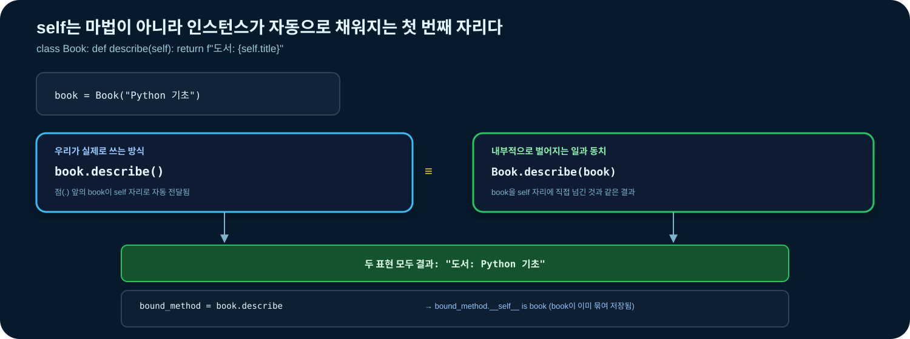
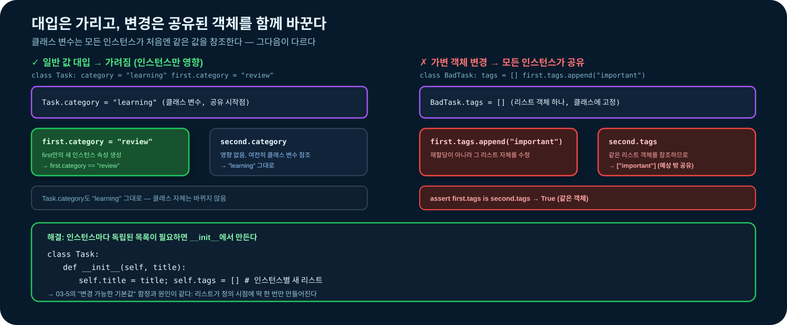
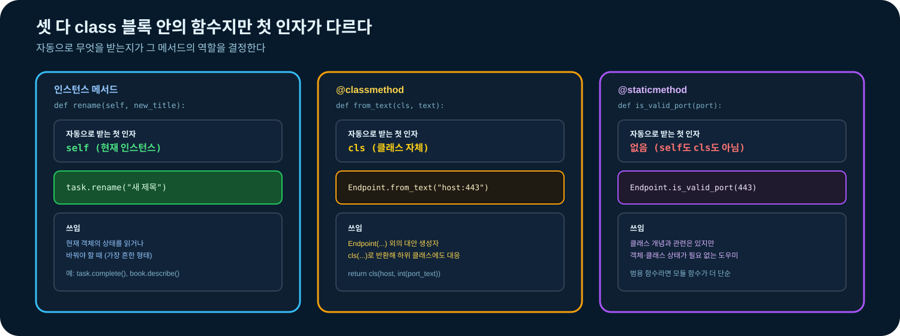
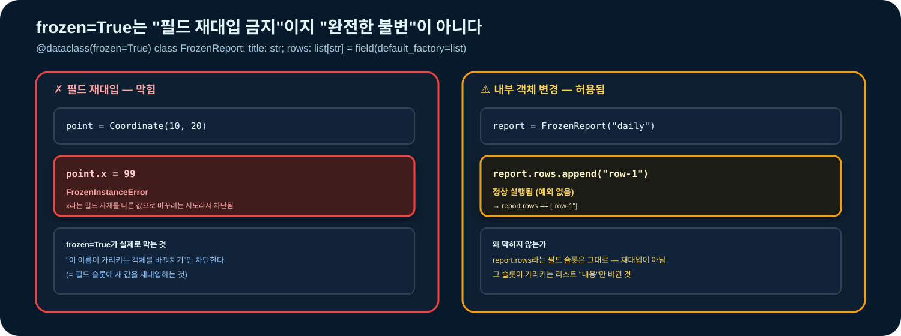

# 03-8. 클래스 기초

클래스는 관련 데이터와 그 데이터를 다루는 동작을 하나의 **새로운 자료형**으로 정의한다. 단순히 변수와 함수를 class 블록 안으로 옮기는 것이 아니라, 객체가 어떤 상태를 가질 수 있고 어떤 규칙을 지켜야 하는지 표현하는 도구다.


### 🧭 학습 목표

- 클래스와 인스턴스, 객체와 이름의 관계를 설명한다.
- `__init__`, `self`, 인스턴스 메서드의 호출 방식을 이해한다.
- 인스턴스 변수와 클래스 변수를 구분한다.
- 변경 가능한 클래스 변수의 공유 문제를 예방한다.
- 메서드로 상태를 안전하게 변경하고 잘못된 전이를 예외로 거부한다.
- 인스턴스 메서드, 클래스 메서드, 정적 메서드를 목적에 맞게 선택한다.
- 비공개 이름 관례와 `property`를 이용한 속성 검증을 이해한다.
- `__repr__`, `__str__`, `__eq__` 같은 대표 특수 메서드의 역할을 설명한다.
- `dataclass`, `field(default_factory=...)`, `__post_init__`, `frozen=True`를 사용한다.
- 상속과 합성을 구분하고 단순한 관계에 맞는 설계를 선택한다.
- 딕셔너리, 데이터클래스, 일반 클래스 중 필요한 표현을 선택한다.


## 학습 우선순위

| 구분 | 내용 |
| --- | --- |
| 필수 | 클래스·인스턴스, `__init__`, `self`, 인스턴스 메서드·변수 |
| 권장 | 상태 전이, 데이터클래스, `default_factory`, `__post_init__`, 합성 |
| 심화 | 클래스·정적 메서드, property·특수 메서드, `frozen=True`, 상속 |

## 선행 지식과 학습 연결

- 객체 별칭과 변경 가능성은 [03-2](03-2-strings-collections.md)에서 학습했다.
- 함수 계약과 스코프는 [03-5](03-5-functions.md)에서 학습했다.
- 잘못된 상태를 예외로 표현하는 방법은 [03-6](03-6-exceptions.md)에서 학습했다.
- 모듈과 패키지 구조는 [03-7](03-7-modules-packages.md)에서 학습했다.
- 이 절에서는 03-7의 이벤트 딕셔너리를 객체로 표현한다.
- 다음 [03-9](03-9-practical-syntax.md)에서 자료구조·함수·예외·모듈·클래스를 종합한다.

전용 실습은 [`notebooks/03-8-classes-dataclasses.ipynb`](../notebooks/03-8-classes-dataclasses.ipynb)에서 진행한다.

## 시작 전 확인

결과를 실행 전에 예상한다.

1. 같은 클래스로 만든 두 인스턴스의 속성은 항상 같은가?
2. `task.complete()`을 호출할 때 `self` 인자를 직접 전달해야 할까?
3. 클래스 본문에 선언한 빈 리스트는 모든 인스턴스가 공유할까?
4. 타입 힌트가 `int`인 필드에 문자열을 넣으면 자동으로 오류가 발생할까?
5. `@dataclass(frozen=True)` 객체 안에 리스트가 있다면 리스트 내용도 바꿀 수 없을까?

## 1. 클래스가 필요한 경우

모든 데이터를 클래스로 바꿀 필요는 없다.

| 상황 | 먼저 고려할 표현 |
| --- | --- |
| 잠깐 사용하는 단순 키·값 묶음 | 딕셔너리 |
| 데이터 필드와 값 비교가 중심 | `dataclass` |
| 상태 규칙과 동작을 함께 보장 | 일반 클래스 또는 메서드가 있는 `dataclass` |
| 입력을 변환하고 결과만 반환 | 함수 |
| 서로 다른 구현을 같은 인터페이스로 사용 | 상속·프로토콜 등, 이후 과정에서 확장 |

클래스를 검토할 신호:

- 여러 함수가 항상 같은 데이터 묶음을 인자로 받는다.
- 잘못된 상태가 만들어지지 않도록 생성과 변경을 통제해야 한다.
- 데이터의 의미에 맞는 동작 이름을 제공하고 싶다.
- 같은 구조의 독립적인 값을 여러 개 만들어야 한다.

클래스가 오히려 복잡하게 만드는 신호:

- 상태가 없고 입력을 계산해 반환하는 함수 하나면 충분하다.
- 속성만 담지만 딕셔너리로도 의미가 명확한 일회성 데이터다.
- 모든 메서드가 사실상 서로 무관한 유틸리티 함수다.

### 응용 인사이트: 필드보다 불변식을 먼저 모델링한다

클래스를 설계할 때 “어떤 속성이 필요한가?”만 묻기보다 “이 객체가 살아 있는 동안 무엇이 항상 참이어야 하는가?”를 먼저 적는다. 이 항상 참인 규칙을 **불변식(invariant)**이라고 한다.

예를 들어 학습용 인증 시도 예산 객체라면 다음 규칙을 정할 수 있다.

- 최대 시도 횟수는 1 이상이다.
- 사용한 횟수는 0 이상이며 최대 횟수를 넘지 않는다.
- 남은 횟수는 `최대 횟수 - 사용한 횟수`로 계산한다.
- 시도 한 건을 기록할 때 관련 상태는 함께 변경된다.

딕셔너리로도 이 필드를 저장할 수 있지만, 아무 코드나 `used = -1`로 바꿀 수 있다. 상태를 변경하는 경로가 많고 규칙이 중요해질수록 클래스의 생성자와 메서드로 변경 지점을 모으는 가치가 커진다. 반대로 규칙 없이 전달만 하는 일회성 응답이라면 클래스가 불필요한 층이 될 수 있다.

흔한 실패는 외부 입력의 필드 구조를 그대로 클래스 속성으로 복사해 “데이터 모델링을 했다”고 생각하는 것이다. 입력 형식과 도메인 규칙은 다르므로, 원문을 정규화하고 불필요한 필드는 제거한 뒤 유효한 객체를 만든다.

생각해 볼 질문: 객체의 모든 공개 메서드를 호출한 뒤에도 반드시 참이어야 할 문장을 세 개 적을 수 있는가?

## 2. 클래스·인스턴스·객체

클래스는 새 자료형을 정의하는 객체이고, 클래스를 호출해 만든 값이 인스턴스다.

```python
class Book:
    pass


first = Book()
second = Book()

assert isinstance(first, Book)
assert type(first) is Book
assert first is not second
```

`first`와 `second`는 같은 클래스의 서로 다른 인스턴스다. `is`는 동일한 객체인지, `==`는 값이 동등한지를 묻는다.

```python
alias = first

assert alias is first
assert alias is not second
```

이름 `alias`와 `first`가 같은 객체를 가리킨다. 변경 가능한 객체를 별칭으로 공유하면 한 이름을 통한 변경이 다른 이름에서도 보인다.

## 3. `__init__`으로 초기 상태 만들기

클래스를 호출하면 새 인스턴스가 만들어지고, 클래스에 `__init__`이 있으면 새 인스턴스를 초기화하도록 자동 호출된다.

```python
class Book:
    def __init__(self, title, author):
        self.title = title
        self.author = author


book = Book("Python 기초", "교육팀")

assert book.title == "Python 기초"
assert book.author == "교육팀"
```

- `self.title = title`의 오른쪽 `title`은 함수 인자다.
- 왼쪽 `self.title`은 인스턴스에 저장하는 속성이다.
- `__init__`은 값을 반환하는 일반 생성 함수가 아니므로 `return`으로 다른 객체를 반환하지 않는다.

### 3.1 생성 시 계약 검증

객체가 처음부터 유효한 상태가 되도록 검사한다.

```python
class Book:
    def __init__(self, title, author):
        if not isinstance(title, str):
            raise TypeError("title은 문자열이어야 합니다")
        if not title.strip():
            raise ValueError("title은 비어 있을 수 없습니다")
        if not isinstance(author, str):
            raise TypeError("author는 문자열이어야 합니다")
        if not author.strip():
            raise ValueError("author는 비어 있을 수 없습니다")

        self.title = title.strip()
        self.author = author.strip()
```

생성 후에 별도 `validate()` 호출을 잊지 않게 생성 경계에서 필수 규칙을 적용한다.

## 4. `self`와 인스턴스 메서드

클래스 본문에 정의한 함수는 인스턴스를 통해 접근할 때 결합된 메서드가 된다.

```python
class Book:
    def __init__(self, title):
        self.title = title

    def describe(self):
        return f"도서: {self.title}"


book = Book("Python 기초")

assert book.describe() == "도서: Python 기초"
assert Book.describe(book) == "도서: Python 기초"
```

`book.describe()`를 호출하면 Python이 `book`을 첫 인자로 전달한다. `self`는 예약어는 아니지만 Python 코드가 따르는 강한 관례다.

```python
bound_method = book.describe

assert bound_method.__self__ is book
assert bound_method() == "도서: Python 기초"
```

메서드는 변수에 담아 나중에 호출할 수도 있다.



## 5. 인스턴스 변수와 클래스 변수

### 5.1 인스턴스 변수

각 객체가 독립적으로 가져야 하는 상태는 `self.name`에 저장한다.

```python
class Task:
    def __init__(self, title):
        self.title = title
        self.done = False


first = Task("교안 읽기")
second = Task("문제 풀기")
first.done = True

assert first.done is True
assert second.done is False
```

### 5.2 클래스 변수

모든 인스턴스가 공유하는 분류·설정·상수는 클래스 속성으로 둘 수 있다.

```python
class Task:
    category = "learning"

    def __init__(self, title):
        self.title = title


first = Task("교안 읽기")
second = Task("문제 풀기")

assert first.category == "learning"
assert second.category == "learning"
assert Task.category == "learning"
```

인스턴스에 같은 이름을 대입하면 그 인스턴스의 속성이 클래스 속성을 가린다.

```python
first.category = "review"

assert first.category == "review"
assert second.category == "learning"
assert Task.category == "learning"
```

### 5.3 변경 가능한 클래스 변수 함정

```python
class BadTask:
    tags = []

    def __init__(self, title):
        self.title = title


first = BadTask("교안 읽기")
second = BadTask("문제 풀기")
first.tags.append("important")

assert second.tags == ["important"]  # 같은 리스트를 공유한다.
assert first.tags is second.tags
```

각 인스턴스의 목록이라면 `__init__`에서 새 리스트를 만든다.

```python
class Task:
    def __init__(self, title):
        self.title = title
        self.tags = []


first = Task("교안 읽기")
second = Task("문제 풀기")
first.tags.append("important")

assert first.tags == ["important"]
assert second.tags == []
assert first.tags is not second.tags
```



## 6. 메서드로 상태 전이 지키기

속성을 어디서나 직접 바꾸게 두면 유효하지 않은 상태가 만들어질 수 있다. 의미 있는 동작을 메서드로 제공한다.

```python
class Task:
    def __init__(self, title):
        if not title.strip():
            raise ValueError("title은 비어 있을 수 없습니다")
        self.title = title.strip()
        self.done = False

    def complete(self):
        if self.done:
            raise ValueError("이미 완료된 작업입니다")
        self.done = True


task = Task("실습 완료")
task.complete()

assert task.done is True
```

상태를 변경하는 메서드는 다음을 분명히 한다.

- 변경 전 허용 조건
- 어떤 속성이 바뀌는지
- 실패 시 예외 유형과 메시지
- 반환값이 필요한지

### 응용 인사이트: 상태 전이는 검증한 뒤 한 번에 적용한다

여러 속성이 하나의 의미 있는 상태를 이룬다면 일부만 바뀐 채 실패하지 않도록 순서를 설계한다. 먼저 인자와 현재 상태를 모두 검증하고, 새 값을 계산한 뒤 마지막에 객체를 변경한다.

```python
class AttemptBudget:
    def __init__(self, limit):
        if type(limit) is not int:
            raise TypeError("limit는 정수여야 합니다")
        if limit < 1:
            raise ValueError("limit는 1 이상이어야 합니다")
        self.limit = limit
        self.used = 0

    def consume(self):
        if self.used >= self.limit:
            raise ValueError("남은 시도 횟수가 없습니다")

        next_used = self.used + 1
        remaining = self.limit - next_used
        self.used = next_used
        return remaining
```

검증 전에 `self.used += 1`을 실행하면 한도 초과 예외가 발생해도 잘못된 횟수가 남는다. 파일·데이터베이스처럼 객체 밖의 작업까지 포함하면 완전한 원자성을 별도 방식으로 다뤄야 하지만, 기초 단계에서도 **실패 전후의 객체 상태가 무엇인지**는 명확히 정할 수 있다.

같은 메서드를 두 번 호출했을 때 예외로 거부할지, 이미 원하는 상태이므로 성공으로 간주할지도 요구사항이다. `Task.complete()`은 중복 완료를 오류로 보지만, 반복 호출이 가능한 시스템에서는 아무 변화 없이 성공하는 멱등 정책이 더 적합할 수 있다.

생각해 볼 질문: `consume()`이 실패한 직후 `used`와 남은 횟수는 호출 전과 정확히 같아야 하는가?

## 7. 세 가지 메서드 형태

### 7.1 인스턴스 메서드

현재 객체의 상태를 읽거나 바꿀 때 사용한다.

```python
class Task:
    def __init__(self, title):
        self.title = title

    def rename(self, new_title):
        self.title = new_title
```

### 7.2 클래스 메서드

`@classmethod`는 클래스 객체를 첫 인자 `cls`로 받는다. 대체 생성 방식에 자주 사용한다.

```python
class Endpoint:
    def __init__(self, host, port):
        self.host = host
        self.port = port

    @classmethod
    def from_text(cls, text):
        host, port_text = text.rsplit(":", 1)
        return cls(host, int(port_text))


endpoint = Endpoint.from_text("example.test:443")

assert endpoint.host == "example.test"
assert endpoint.port == 443
```

`Endpoint(...)` 외에 의미 있는 생성 경로를 제공하면서 하위 클래스에서도 `cls`를 사용할 수 있다.

### 7.3 정적 메서드

`@staticmethod`는 `self`나 `cls`를 자동으로 받지 않는다.

```python
class Endpoint:
    @staticmethod
    def is_valid_port(port):
        return type(port) is int and 1 <= port <= 65535


assert Endpoint.is_valid_port(443) is True
assert Endpoint.is_valid_port(True) is False
```

클래스 개념과 밀접한 작은 도우미라면 정적 메서드가 가능하다. 객체·클래스 상태와 관계없는 범용 함수라면 모듈 함수가 더 단순하다.



## 8. 비공개 관례와 `property`

Python에는 다른 언어와 같은 강제 private 필드가 없다. 앞에 밑줄 하나를 붙인 이름은 외부에서 직접 사용하지 않는 구현 세부사항이라는 관례다.

```python
class Percentage:
    def __init__(self, value):
        self._value = 0
        self.value = value

    @property
    def value(self):
        return self._value

    @value.setter
    def value(self, new_value):
        if type(new_value) is not int:
            raise TypeError("value는 정수여야 합니다")
        if not 0 <= new_value <= 100:
            raise ValueError("value는 0~100 범위여야 합니다")
        self._value = new_value


progress = Percentage(30)
progress.value = 80

assert progress.value == 80
```

호출자는 `progress.value`처럼 속성 문법을 유지하면서 클래스는 변경 규칙을 지킨다. 모든 속성에 getter·setter를 만들지는 않는다. 단순 공개 데이터는 그대로 두고 검증·계산이 필요한 경우에만 `property`를 고려한다.

이중 밑줄 `__name`은 완전한 보안 경계가 아니라 상속에서 이름 충돌을 줄이는 name mangling 기능이다. 입문 코드에서 private처럼 남용하지 않는다.

### 응용 인사이트: 캡슐화는 협력 규칙이지 보안 장벽이 아니다

`_events`라는 이름이나 `property`는 “이 경로를 통해 사용하라”는 인터페이스를 알려 주지만, 악의적인 호출자가 내부 상태에 절대 접근하지 못하게 하지는 않는다. Python 객체 내부에 비밀값을 넣고 밑줄만 붙인다고 보호되는 것은 아니다.

캡슐화의 실제 가치는 정상적인 호출 코드가 실수로 불변식을 깨뜨리지 않게 하는 데 있다. 내부의 변경 가능한 컬렉션을 그대로 반환하면 호출자가 메서드를 우회할 수 있다.

```python
class EventBatch:
    def __init__(self):
        self._events = []

    def add(self, event):
        self._events.append(event)

    def snapshot(self):
        return tuple(self._events)
```

튜플 스냅샷은 목록 자체의 `append()`를 막지만, 목록 안의 객체까지 자동으로 불변으로 만들지는 않는다. 데이터가 매우 크면 매번 복사하거나 튜플로 변환하는 비용도 생긴다. 따라서 작은 컬렉션은 안전한 스냅샷을 우선하고, 큰 데이터는 반복자·페이지 단위 조회·명시적인 읽기 전용 인터페이스를 이후 과정에서 검토한다.

흔한 실패는 getter가 내부 리스트를 그대로 반환하면서 필드명만 밑줄로 숨기는 것이다. 호출자가 반환값을 변경해도 객체 규칙이 유지되는지 확인한다.

생각해 볼 질문: `snapshot()[0]`이 변경 가능한 객체라면 튜플을 반환하는 것만으로 어떤 문제까지 막을 수 있고 무엇은 막지 못하는가?

## 9. 대표 특수 메서드

양쪽에 이중 밑줄이 있는 이름은 Python 문법과 내장 함수가 사용하는 특별한 동작을 정의한다.

```python
class Book:
    def __init__(self, title, author):
        self.title = title
        self.author = author

    def __repr__(self):
        return f"Book(title={self.title!r}, author={self.author!r})"

    def __str__(self):
        return f"{self.title} / {self.author}"

    def __eq__(self, other):
        if not isinstance(other, Book):
            return NotImplemented
        return (self.title, self.author) == (other.title, other.author)


first = Book("Python 기초", "교육팀")
second = Book("Python 기초", "교육팀")

assert repr(first) == "Book(title='Python 기초', author='교육팀')"
assert str(first) == "Python 기초 / 교육팀"
assert first == second
assert first is not second
```

- `__repr__`: 개발자가 객체 상태를 식별하기 좋은 표현
- `__str__`: 사용자가 읽기 좋은 표현
- `__eq__`: `==`의 값 동등성

특수 메서드를 직접 `obj.__str__()`처럼 호출하기보다 `str(obj)`, `repr(obj)`, `obj == other`를 사용한다. 필요한 동작만 구현한다.

## 10. `dataclass`로 데이터 중심 클래스 만들기

필드가 중심인 클래스의 반복적인 `__init__`, `__repr__`, `__eq__`를 자동 생성할 수 있다.

```python
from dataclasses import dataclass


@dataclass
class Contact:
    name: str
    email: str


first = Contact("민지", "minji@example.test")
second = Contact("민지", "minji@example.test")

assert first.name == "민지"
assert first == second
assert "Contact" in repr(first)
```

타입 힌트는 필드 정의에 사용되지만 실행 중 타입 검사를 자동으로 수행하지 않는다.

```python
contact = Contact(123, "not-an-email")

assert contact.name == 123  # 타입 힌트만으로는 거부되지 않는다.
```

실행 중 계약이 필요하면 `__post_init__`이나 별도 생성 경계에서 검증한다.

### 응용 인사이트: 딕셔너리·데이터클래스·일반 클래스는 데이터의 생애 주기로 선택한다

같은 데이터를 한 가지 표현으로 끝까지 유지할 필요는 없다. 실제 프로그램에서는 경계마다 적합한 표현이 다를 수 있다.

```text
외부 입력 딕셔너리
  ↓ 필드 존재·타입·값 검증
SecurityEvent 데이터클래스
  ↓ 여러 객체의 추가·삭제 정책
EventStore 일반 클래스
```

| 표현 | 강점 | 비용·한계 | 적합한 위치 |
| --- | --- | --- | --- |
| 딕셔너리 | 동적인 필드와 외부 형식에 유연함 | 키 오타와 누락을 늦게 발견함 | 아직 신뢰하지 않는 입력 경계 |
| `dataclass` | 필드, 값 비교, 표현이 명확함 | 자동 실행 검증은 제공하지 않음 | 검증을 마친 데이터 전달·비교 |
| 일반 클래스 | 생성·상태 전이·공개 API를 세밀하게 통제함 | 코드와 설계 부담이 큼 | 수명이 길고 동작 규칙이 있는 상태 |

딕셔너리를 받자마자 데이터클래스로 바꾸면 내부 코드는 `data["aciton"]` 같은 키 오타를 줄일 수 있다. 반대로 필드가 매번 달라지는 탐색 데이터에 고정 데이터클래스를 만들면 변환 코드만 늘어난다. 일반 클래스는 상태 규칙이 실제로 있을 때 선택한다.

흔한 실패는 데이터클래스가 타입 힌트대로 값을 자동 검증한다고 믿는 것이다. 데이터클래스는 반복 코드를 줄이는 도구이며, 신뢰 경계의 검증 책임은 `__post_init__`이나 변환 함수가 맡는다.

생각해 볼 질문: 외부 딕셔너리를 프로그램 전체에 전달했을 때 필드명이 바뀌면 어디까지 수정해야 하며, 경계에서 객체로 변환했다면 영향 범위가 어떻게 달라지는가?

## 11. 기본값과 `default_factory`

### 11.1 변경 불가능한 기본값

```python
from dataclasses import dataclass


@dataclass
class Task:
    title: str
    done: bool = False
```

기본값이 있는 필드는 기본값이 없는 필드 뒤에 둔다.

### 11.2 변경 가능한 기본값

각 인스턴스에 새 리스트·딕셔너리·집합이 필요하면 `field(default_factory=...)`를 사용한다.

```python
from dataclasses import dataclass, field


@dataclass
class Task:
    title: str
    tags: list[str] = field(default_factory=list)


first = Task("교안 읽기")
second = Task("문제 풀기")
first.tags.append("important")

assert first.tags == ["important"]
assert second.tags == []
assert first.tags is not second.tags
```

다음처럼 작성하면 인스턴스가 기본 리스트를 공유할 수 있으므로 데이터클래스는 대표적인 변경 가능 기본값을 오류로 거부한다.

```python
# 잘못된 예: 클래스 정의 시 ValueError가 발생할 수 있다.
# @dataclass
# class BadTask:
#     title: str
#     tags: list[str] = []
```

## 12. `__post_init__` 검증

데이터클래스가 생성한 `__init__` 뒤에 자동 실행되는 후처리 메서드다.

```python
from dataclasses import dataclass


@dataclass
class Endpoint:
    host: str
    port: int

    def __post_init__(self):
        if not isinstance(self.host, str):
            raise TypeError("host는 문자열이어야 합니다")
        self.host = self.host.strip()
        if not self.host:
            raise ValueError("host는 비어 있을 수 없습니다")
        if type(self.port) is not int:
            raise TypeError("port는 정수여야 합니다")
        if not 1 <= self.port <= 65535:
            raise ValueError("port는 1~65535 범위여야 합니다")


endpoint = Endpoint(" example.test ", 443)

assert endpoint.host == "example.test"
```

외부 시스템 전체를 호출하거나 무거운 작업을 수행하지 않고 인스턴스 자체의 필드 규칙을 검증하는 데 사용한다.

## 13. `frozen=True`와 불변성의 범위

필드 재대입을 막는 데이터 중심 값 객체를 만들 수 있다.

```python
from dataclasses import FrozenInstanceError, dataclass


@dataclass(frozen=True)
class Coordinate:
    x: int
    y: int


point = Coordinate(10, 20)

try:
    point.x = 99
except FrozenInstanceError:
    changed = False
else:
    changed = True

assert changed is False
```

`frozen=True`는 완전한 깊은 불변성을 보장하지 않는다.

```python
from dataclasses import dataclass, field


@dataclass(frozen=True)
class FrozenReport:
    title: str
    rows: list[str] = field(default_factory=list)


report = FrozenReport("daily")
report.rows.append("row-1")

assert report.rows == ["row-1"]
```



필드가 가리키는 리스트 자체는 여전히 변경 가능하다. 깊은 불변성이 필요하면 튜플처럼 변경 불가능한 필드 타입을 선택한다.

## 14. 클래스 메서드로 변환 경계 만들기

03-7의 파서는 딕셔너리를 반환했다. 클래스 메서드로 딕셔너리를 검증된 객체로 변환할 수 있다.

```python
from dataclasses import dataclass


@dataclass(frozen=True)
class SecurityEvent:
    action: str
    ip: str
    port: int

    @classmethod
    def from_mapping(cls, data):
        required = {"action", "ip", "port"}
        missing = required - data.keys()
        if missing:
            raise ValueError(f"필수 필드 누락: {sorted(missing)}")
        return cls(
            action=data["action"],
            ip=data["ip"],
            port=data["port"],
        )


event = SecurityEvent.from_mapping({
    "action": "ALLOW",
    "ip": "192.0.2.10",
    "port": 443,
})

assert event.action == "ALLOW"
```

파싱과 객체 생성 책임은 연결되지만 동일하지 않다.

- 파서: 문자열 구조를 해석해 기본 값을 만든다.
- 객체: 필드의 의미와 상태 규칙을 지킨다.
- 보고 함수·객체: 여러 이벤트를 집계한다.

## 15. 상속 기초

상속은 기존 클래스의 속성과 메서드를 이어받아 **is-a** 관계를 표현한다.

```python
class NamedItem:
    def __init__(self, name):
        if not name.strip():
            raise ValueError("name은 비어 있을 수 없습니다")
        self.name = name.strip()

    def label(self):
        return self.name


class Book(NamedItem):
    def __init__(self, name, author):
        super().__init__(name)
        self.author = author

    def label(self):
        return f"{super().label()} / {self.author}"


book = Book("Python 기초", "교육팀")

assert isinstance(book, Book)
assert isinstance(book, NamedItem)
assert book.label() == "Python 기초 / 교육팀"
```

- `super()`는 현재 클래스 다음의 부모 구현을 협력적으로 호출한다.
- 하위 클래스는 부모 메서드를 재정의할 수 있다.
- 입문 과정에서는 명확한 단일 상속만 다룬다.

### 15.1 상속보다 합성

한 객체가 다른 객체를 **가지고(has-a)** 협력하는 관계라면 합성을 선택한다.

```python
class ReportFormatter:
    def format_count(self, count):
        return f"총 {count}건"


class EventReport:
    def __init__(self, events, formatter):
        self.events = list(events)
        self.formatter = formatter

    def summary(self):
        return self.formatter.format_count(len(self.events))


report = EventReport([1, 2, 3], ReportFormatter())

assert report.summary() == "총 3건"
```

`EventReport`는 `ReportFormatter`의 한 종류가 아니라 포매터를 사용하므로 상속보다 합성이 자연스럽다.

### 응용 인사이트: 합성은 바뀌는 정책을 교체 가능한 의존성으로 만든다

합성의 장점은 코드 재사용만이 아니다. 데이터 보관 방식과 판단 정책처럼 서로 다른 변화 축을 분리해 실험하고 검증할 수 있다.

```python
class ThresholdPolicy:
    def __init__(self, threshold):
        self.threshold = threshold

    def should_alert(self, failure_count):
        return failure_count >= self.threshold


class AttemptMonitor:
    def __init__(self, policy):
        self.policy = policy

    def evaluate(self, failure_count):
        return self.policy.should_alert(failure_count)


strict_monitor = AttemptMonitor(ThresholdPolicy(3))
relaxed_monitor = AttemptMonitor(ThresholdPolicy(5))

assert strict_monitor.evaluate(4) is True
assert relaxed_monitor.evaluate(4) is False
```

`AttemptMonitor`를 상속해 임곗값마다 새 하위 클래스를 만드는 대신 정책 객체를 전달했다. 테스트에서는 경계값이 명확한 작은 정책을 넣을 수 있고, 모니터의 집계 로직은 그대로 유지한다.

모든 조건을 별도 클래스로 만들 필요는 없다. 정책이 고정되고 함수 하나로 충분하면 함수를 인자로 받는 편이 단순하다. 설정 조합과 독립적인 상태·검증이 생길 때 객체 합성의 이점이 커진다.

흔한 실패는 교체 가능성을 얻으려고 한 줄짜리 클래스 수십 개를 미리 만드는 것이다. 실제로 두 번째 구현이나 독립 테스트가 필요한 변화 축부터 분리한다.

생각해 볼 질문: 실패 기준을 3회에서 “10분 동안 3회”로 바꾸면 모니터와 정책 중 어느 책임이 새 시간 정보를 가져야 하는가?

## 16. 객체 컬렉션 다루기

인스턴스도 리스트·딕셔너리에 저장하고 반복할 수 있다.

```python
from dataclasses import dataclass


@dataclass
class Task:
    title: str
    priority: int
    done: bool = False


tasks = [
    Task("교안 읽기", 2),
    Task("문제 풀기", 1, done=True),
    Task("복습하기", 3),
]

pending = [task for task in tasks if not task.done]
ordered = sorted(tasks, key=lambda task: task.priority)

assert [task.title for task in pending] == ["교안 읽기", "복습하기"]
assert [task.priority for task in ordered] == [1, 2, 3]
```

데이터클래스에 무조건 `order=True`를 적용하지 않는다. 정렬 기준이 상황마다 다르면 `key` 함수를 명시하는 편이 분명하다.

## 17. 타입 힌트와 실행 중 검증

```python
class Task:
    def __init__(self, title: str, priority: int) -> None:
        self.title = title
        self.priority = priority
```

타입 힌트는 사람과 정적 분석 도구가 의도를 이해하도록 돕지만, Python이 자동으로 값을 거부하지는 않는다.

```python
task = Task(123, "high")

assert task.title == 123
assert task.priority == "high"
```

외부 입력과 핵심 상태 규칙은 명시적으로 검증한다. 타입 힌트와 실행 검증은 서로 대체 관계가 아니다.

## 18. 흔한 안티패턴

### 클래스 변수에 인스턴스 목록 저장

각 객체의 변경 가능한 상태는 `__init__`이나 `default_factory`로 생성한다.

### getter·setter만 있는 과도한 래퍼

규칙 없이 단순히 필드를 읽고 쓰는 메서드만 추가하면 Python의 간단한 속성 사용보다 복잡하다.

### 모든 함수를 정적 메서드로 모으기

관련 없는 유틸리티 함수 묶음은 클래스가 아니라 모듈로 구성한다.

### 타입 힌트를 검증으로 착각

외부 입력은 `__init__`, `__post_init__`, 변환 함수 등 실제 실행 경계에서 검사한다.

### 상속으로 코드만 재사용

개념적인 is-a 관계가 없다면 합성이나 모듈 함수를 먼저 검토한다.

### 속성을 외부에서 임의 변경

객체의 핵심 규칙이 깨질 수 있는 변경은 의미 있는 메서드나 property를 통해 수행한다.

### 거대한 만능 클래스

입력·파일·네트워크·분석·출력을 한 클래스가 모두 맡지 않는다. 03-7에서 배운 모듈 책임과 함께 분리한다.

## 19. 미니 실습: 보안 이벤트 객체와 배치 합성

03-7의 이벤트 딕셔너리를 검증된 값 객체로 바꾸고 여러 이벤트를 담는 객체와 합성한다.

### 19.1 이벤트 값 객체

```python
from dataclasses import dataclass


@dataclass(frozen=True)
class SecurityEvent:
    action: str
    ip: str
    port: int

    def __post_init__(self):
        if not isinstance(self.action, str):
            raise TypeError("action은 문자열이어야 합니다")
        normalized_action = self.action.strip().upper()
        if normalized_action not in {"ALLOW", "DENY"}:
            raise ValueError("action은 ALLOW 또는 DENY여야 합니다")

        if not isinstance(self.ip, str):
            raise TypeError("ip는 문자열이어야 합니다")
        normalized_ip = self.ip.strip()
        if not normalized_ip:
            raise ValueError("ip는 비어 있을 수 없습니다")

        if type(self.port) is not int:
            raise TypeError("port는 정수여야 합니다")
        if not 1 <= self.port <= 65535:
            raise ValueError("port는 1~65535 범위여야 합니다")

        object.__setattr__(self, "action", normalized_action)
        object.__setattr__(self, "ip", normalized_ip)

    @classmethod
    def from_mapping(cls, data):
        if not isinstance(data, dict):
            raise TypeError("data는 딕셔너리여야 합니다")

        required = {"action", "ip", "port"}
        missing = required - data.keys()
        if missing:
            raise ValueError(f"필수 필드 누락: {sorted(missing)}")

        return cls(
            action=data["action"],
            ip=data["ip"],
            port=data["port"],
        )

    def endpoint(self):
        return f"{self.ip}:{self.port}"
```

`frozen=True`에서 정규화된 값을 초기화 중 저장하기 위해 `object.__setattr__`을 제한적으로 사용한다. 생성이 끝난 뒤 일반 필드 재대입은 거부된다.

### 19.2 배치 객체

```python
from dataclasses import dataclass, field


@dataclass
class EventBatch:
    events: list[SecurityEvent] = field(default_factory=list)

    def add(self, event):
        if not isinstance(event, SecurityEvent):
            raise TypeError("SecurityEvent만 추가할 수 있습니다")
        self.events.append(event)

    def count_by_action(self):
        counts = {"ALLOW": 0, "DENY": 0}
        for event in self.events:
            counts[event.action] += 1
        return counts

    def find_by_action(self, action):
        normalized = action.strip().upper()
        if normalized not in {"ALLOW", "DENY"}:
            raise ValueError("action은 ALLOW 또는 DENY여야 합니다")
        return [
            event
            for event in self.events
            if event.action == normalized
        ]
```

### 19.3 딕셔너리에서 객체로 변환

```python
parsed_events = [
    {"action": "allow", "ip": "192.0.2.10", "port": 443},
    {"action": "DENY", "ip": "198.51.100.4", "port": 22},
    {"action": "ALLOW", "ip": "203.0.113.8", "port": 80},
]

batch = EventBatch()
for data in parsed_events:
    batch.add(SecurityEvent.from_mapping(data))

assert batch.count_by_action() == {"ALLOW": 2, "DENY": 1}
assert [event.endpoint() for event in batch.find_by_action("allow")] == [
    "192.0.2.10:443",
    "203.0.113.8:80",
]
```

구조는 다음 책임을 가진다.

- `SecurityEvent`: 한 이벤트의 유효성·정규화·값 동작
- `EventBatch`: 여러 이벤트의 보관·검색·집계
- 03-7 파서: 원문 문자열을 딕셔너리로 변환
- 실행 모듈: 입력, 파서, 객체 변환, 출력 순서를 조정

## 20. 단계별 연습문제

### 20.1 클래스와 인스턴스

`Student` 클래스와 서로 다른 두 인스턴스를 만든다. `isinstance`, `type`, `is`로 클래스와 객체 관계를 확인한다.

### 20.2 메서드 바인딩

`Counter` 클래스에 `increment()`를 정의한다. `counter.increment()`와 `Counter.increment(counter)`가 같은 결과를 만드는지 확인한다.

### 20.3 클래스 변수 구분

모든 인스턴스가 공유할 `category = "education"`과 각 인스턴스의 `title`을 가진 `Resource`를 작성한다. 한 인스턴스의 `title` 변경이 다른 인스턴스에 영향을 주지 않음을 검증한다.

### 20.4 공유 리스트 오류 수정

클래스 변수 `items = []`를 가진 잘못된 `Cart`를 재현하고 각 인스턴스가 별도 목록을 갖도록 수정한다.

### 20.5 상태 전이

`Ticket` 클래스에 `close()`를 작성한다. 열린 티켓만 닫을 수 있고 이미 닫힌 티켓은 `ValueError`를 발생시킨다.

### 20.6 클래스 메서드

`User.from_mapping(data)`를 작성해 `{"name": "min", "role": "student"}`를 인스턴스로 바꾼다. 필수 필드 누락도 검사한다.

### 20.7 property 검증

1~5 범위의 별점을 관리하는 `Rating`을 작성한다. 생성과 재대입 모두 같은 규칙을 적용한다.

### 20.8 데이터클래스

`Finding(title, severity, tags)`를 데이터클래스로 작성한다. `tags`는 `default_factory=list`를 사용하고 두 인스턴스가 목록을 공유하지 않음을 검증한다.

### 20.9 `__post_init__`

`Finding.severity`를 대문자로 정규화하고 `LOW`, `MEDIUM`, `HIGH` 외 값은 거부한다.

### 20.10 상속과 합성 선택

다음 관계에 상속과 합성 중 더 자연스러운 것을 선택하고 이유를 적는다.

1. `AdminUser`와 `User`
2. `Report`와 `Formatter`
3. `TcpClient`와 `RetryPolicy`

### 20.11 미니 실습 확장

`EventBatch`에 다음을 추가한다.

- 포트별 건수를 반환하는 `count_by_port()`
- 중복 이벤트 추가를 거부하거나 별도 집계하는 정책
- 빈 배치·단일 이벤트·중복 이벤트 테스트

### 20.12 전이 연습 — 작업 보드 객체

`Task` 데이터클래스와 여러 작업을 관리하는 `TaskBoard` 일반 클래스를 작성한다.

- `Task`: `title`, `priority`, `completed` 필드
- 제목은 비어 있을 수 없고 priority는 `LOW`, `MEDIUM`, `HIGH`만 허용
- `complete()`는 미완료 작업만 완료 상태로 변경
- `TaskBoard.add()`는 중복 작업을 거부
- `TaskBoard.find_by_priority()`는 내부 리스트가 아닌 튜플을 반환
- 두 `TaskBoard` 인스턴스가 작업 목록을 공유하지 않는지 검증

## 21. 정답과 해설

<details>
<summary>정답과 해설 펼치기</summary>

### 21.1 클래스와 인스턴스

```python
class Student:
    def __init__(self, name):
        self.name = name


first = Student("min")
second = Student("jin")

assert isinstance(first, Student)
assert type(first) is Student
assert first is not second
```

### 21.2 메서드 바인딩

```python
class Counter:
    def __init__(self):
        self.value = 0

    def increment(self):
        self.value += 1


counter = Counter()
counter.increment()
Counter.increment(counter)

assert counter.value == 2
```

### 21.3 클래스 변수

```python
class Resource:
    category = "education"

    def __init__(self, title):
        self.title = title


first = Resource("Python")
second = Resource("Network")
first.title = "Python Basic"

assert first.category == second.category == "education"
assert second.title == "Network"
```

### 21.4 공유 리스트 수정

```python
class Cart:
    def __init__(self):
        self.items = []
```

인스턴스를 만들 때마다 `__init__`이 새 리스트를 만든다.

### 21.5 상태 전이

```python
class Ticket:
    def __init__(self):
        self.closed = False

    def close(self):
        if self.closed:
            raise ValueError("이미 닫힌 티켓입니다")
        self.closed = True
```

### 21.6 클래스 메서드

```python
class User:
    def __init__(self, name, role):
        self.name = name
        self.role = role

    @classmethod
    def from_mapping(cls, data):
        required = {"name", "role"}
        missing = required - data.keys()
        if missing:
            raise ValueError(f"필수 필드 누락: {sorted(missing)}")
        return cls(data["name"], data["role"])
```

### 21.7 property

```python
class Rating:
    def __init__(self, score):
        self._score = 1
        self.score = score

    @property
    def score(self):
        return self._score

    @score.setter
    def score(self, value):
        if type(value) is not int:
            raise TypeError("score는 정수여야 합니다")
        if not 1 <= value <= 5:
            raise ValueError("score는 1~5 범위여야 합니다")
        self._score = value
```

### 21.8~9 데이터클래스와 검증

```python
from dataclasses import dataclass, field


@dataclass
class Finding:
    title: str
    severity: str
    tags: list[str] = field(default_factory=list)

    def __post_init__(self):
        self.severity = self.severity.strip().upper()
        if self.severity not in {"LOW", "MEDIUM", "HIGH"}:
            raise ValueError("지원하지 않는 severity입니다")
```

### 21.10 상속과 합성

1. `AdminUser`가 정말 `User`의 한 종류이고 같은 계약을 지킨다면 상속을 고려한다.
2. `Report`는 `Formatter`를 사용하는 관계이므로 합성이 자연스럽다.
3. `TcpClient`는 재시도 정책을 가지므로 합성이 자연스럽다.

### 21.11 미니 실습 확장 예

```python
def count_by_port(self):
    counts = {}
    for event in self.events:
        counts[event.port] = counts.get(event.port, 0) + 1
    return counts
```

이 메서드는 `EventBatch` 클래스 안에 정의한다. 중복 정책은 값이 같은 이벤트를 허용하는지 요구사항으로 먼저 정한 뒤 구현한다.

### 21.12 전이 연습 예시 답안

```python
from dataclasses import dataclass, field


@dataclass
class Task:
    title: str
    priority: str
    completed: bool = False

    def __post_init__(self):
        self.title = self.title.strip()
        self.priority = self.priority.strip().upper()
        if not self.title:
            raise ValueError("title은 비어 있을 수 없습니다")
        if self.priority not in {"LOW", "MEDIUM", "HIGH"}:
            raise ValueError("지원하지 않는 priority입니다")

    def complete(self):
        if self.completed:
            raise ValueError("이미 완료한 작업입니다")
        self.completed = True


@dataclass
class TaskBoard:
    _tasks: list[Task] = field(default_factory=list)

    def add(self, task):
        if task in self._tasks:
            raise ValueError("동일한 작업이 이미 있습니다")
        self._tasks.append(task)

    def find_by_priority(self, priority):
        normalized = priority.strip().upper()
        return tuple(
            task for task in self._tasks
            if task.priority == normalized
        )
```

</details>

## 22. 완료 기준

다음은 권장·심화 내용을 포함한 장 전체의 최종 완료 기준이다. 첫 학습에서는 앞의 학습 우선순위 표에서 필수 항목을 먼저 확인하고 나머지를 단계적으로 확장한다.

- [ ] 클래스, 인스턴스, 객체, 이름의 관계를 구분한다.
- [ ] `is`, `==`, `isinstance`, `type`의 차이를 설명한다.
- [ ] `__init__`과 `self`의 역할을 설명한다.
- [ ] 결합된 인스턴스 메서드의 호출 방식을 설명한다.
- [ ] 인스턴스 변수와 클래스 변수를 구분한다.
- [ ] 변경 가능한 클래스 변수 공유 문제를 재현하고 수정한다.
- [ ] 상태 변경 메서드로 객체 규칙을 지킨다.
- [ ] 객체가 항상 지켜야 하는 불변식을 문장으로 정의한다.
- [ ] 상태 전이 실패 뒤 객체 상태가 호출 전과 같은지 검증한다.
- [ ] 인스턴스·클래스·정적 메서드를 목적에 맞게 선택한다.
- [ ] 밑줄 관례와 property의 사용 목적을 설명한다.
- [ ] 캡슐화 관례와 보안 경계를 구분하고 변경 가능한 내부 상태 노출을 피한다.
- [ ] `__repr__`, `__str__`, `__eq__`의 차이를 설명한다.
- [ ] 데이터클래스가 생성하는 대표 메서드를 설명한다.
- [ ] 변경 가능한 기본값에 `default_factory`를 사용한다.
- [ ] `__post_init__`에서 타입·값 규칙을 검증한다.
- [ ] `frozen=True`가 깊은 불변성을 보장하지 않음을 설명한다.
- [ ] 단순한 상속과 메서드 재정의, `super()`를 사용할 수 있다.
- [ ] is-a 관계는 상속, has-a 관계는 합성을 우선 검토한다.
- [ ] 타입 힌트와 실행 중 검증을 구분한다.
- [ ] 데이터 수명 주기에 따라 딕셔너리·데이터클래스·일반 클래스를 선택한다.
- [ ] 딕셔너리를 데이터클래스 객체로 변환하고 객체 목록을 집계한다.
- [ ] 교체가 필요한 정책을 합성으로 분리하고 과도한 추상화를 피한다.
- [ ] 작업 보드 전이 연습에서 값 객체와 저장소 객체를 분리한다.

## 핵심 정리

- 클래스는 데이터와 동작뿐 아니라 유효한 상태 규칙을 표현하는 새 자료형이다.
- 인스턴스는 같은 클래스에서 만들어져도 독립적인 객체이며 여러 이름이 같은 객체를 가리킬 수 있다.
- `obj.method()`는 객체가 첫 인자로 결합된 메서드 호출이다.
- 객체별 변경 상태는 인스턴스 변수로 만들고 공유 상수·설정만 클래스 변수로 둔다.
- 변경 가능한 목록·딕셔너리는 클래스 변수나 직접 기본값으로 공유하지 않는다.
- 대체 생성자는 클래스 메서드, 객체와 무관한 범용 기능은 모듈 함수를 먼저 검토한다.
- property는 필요한 속성 규칙을 유지하되 불필요한 getter·setter를 만들지 않는다.
- 데이터클래스는 데이터 중심 객체의 `__init__`, `__repr__`, `__eq__` 반복을 줄인다.
- `default_factory`는 인스턴스마다 새 변경 가능 값을 만든다.
- `__post_init__`은 데이터클래스 생성 후 필드 정규화와 검증에 사용한다.
- `frozen=True`는 필드 재대입을 막지만 내부의 변경 가능한 객체까지 얼리지는 않는다.
- 타입 힌트는 실행 중 검증을 자동으로 수행하지 않는다.
- 명확한 is-a 관계에는 상속을 고려하고, 객체 협력에는 합성을 우선한다.
- 클래스가 필요 없는 계산은 함수와 모듈로 단순하게 유지한다.
- 좋은 데이터 모델은 필드 목록뿐 아니라 생성·변경 뒤에도 지켜지는 불변식을 표현한다.
- 캡슐화는 정상적인 협력 경로를 안내하지만 비밀정보를 보호하는 보안 장벽은 아니다.
- 외부 입력은 유연한 자료구조로 받고 검증 뒤 명확한 값 객체로 변환할 수 있다.
- 합성은 독립적으로 변하는 정책을 교체하고 검증할 수 있게 한다.

## 더 읽기

- [Python 공식 튜토리얼: 클래스](https://docs.python.org/3/tutorial/classes.html)
- [Python 표준 라이브러리: dataclasses](https://docs.python.org/3/library/dataclasses.html)

---

다음 절: [03-9. 문법 종합 실습](03-9-practical-syntax.md)
