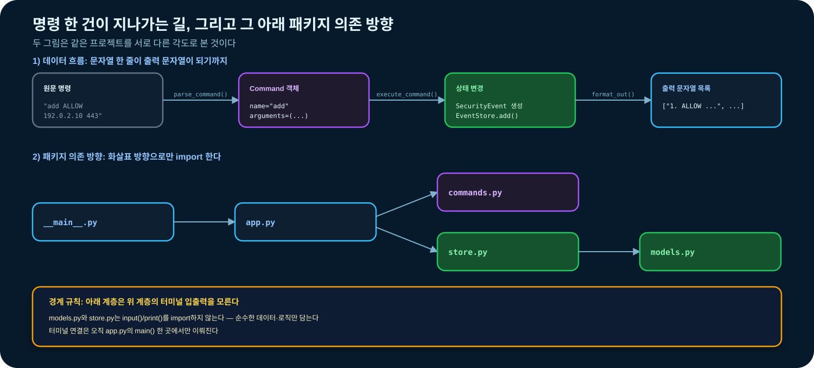
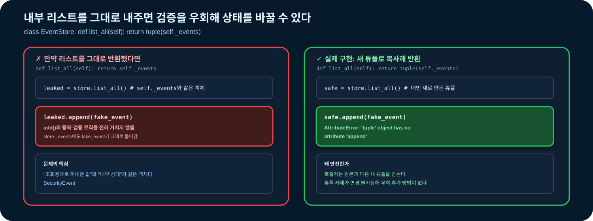
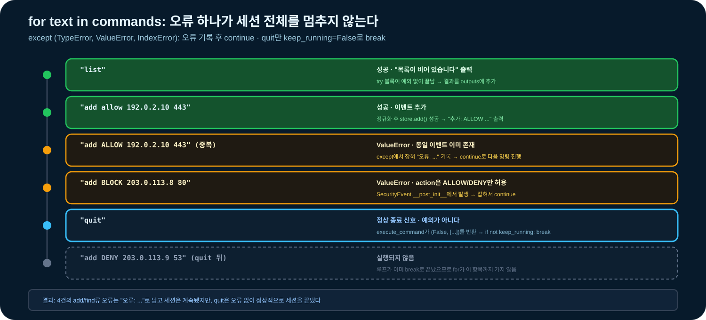

# 03-9. 문법 종합 실습

03-1부터 03-8까지 학습한 개념을 하나의 **메모리 기반 이벤트 검토 프로그램**으로 연결한다. 문자열 명령을 해석하고, 입력을 검증된 객체로 바꾸며, 목록·검색·집계·삭제를 수행하고, 예상 가능한 오류를 프로그램 경계에서 처리한다.

파일 저장은 [04장](../04-file-io.md), 실제 네트워크 통신은 [06장](../06-network-programming.md), HTTP 요청은 [07장](../07-http-api.md), pytest 자동화는 [09장](../09-testing-debugging.md)에서 확장한다. 이 실습에서는 03장의 Python 문법과 프로그램 구조에만 집중한다.


### 🧭 종합 실습 목표

- 자료형과 문자열 메서드로 사용자 명령을 정규화한다.
- 리스트·딕셔너리·튜플로 여러 값과 결과를 표현한다.
- 조건문과 논리 연산자로 명령·입력 규칙을 판정한다.
- 반복문으로 명령 세션과 객체 목록을 처리한다.
- 함수 계약으로 파싱·실행·표현 책임을 분리한다.
- 예상 가능한 입력 실패를 구체적인 예외로 처리한다.
- 여러 파일의 패키지로 프로그램을 구조화한다.
- 데이터클래스와 일반 객체로 이벤트와 저장소를 표현한다.
- 정상·오류·경계·상태 시나리오를 assert로 검증한다.
- 요구사항, 실행 방법, 완료 기준을 다른 사람이 재현할 수 있게 기록한다.


## 실습 진행 순서

03-9는 새로운 난이도 단계를 배우는 절이 아니라 03-1~03-8의 기본 문법을 통합하는 프로젝트다. 따라서 난이도 수준으로 구분하지 않고 구현 순서와 기본과정 평가 범위로 나눈다.

| 단계 | 내용 | 기본과정 완료에 포함 |
| --- | --- | --- |
| 1. 핵심 기능 구현 | 인수 조건, 이벤트 데이터클래스·저장소·명령 파서, 오류 복구 세션, 패키지 실행 | 포함 |
| 2. 검증과 정리 | 테스트 매트릭스, 자동 시나리오, 코드 품질 점검, 평가 루브릭 | 포함 |
| 선택 활동 | 명령 확장, 저장소 정책 변경, 다른 도메인 전이, 교사 제공 인증 챌린지 | 포함하지 않음 |

1단계에서 프로그램을 완성하고 2단계에서 동작과 코드 품질을 검증하면 기본과정을 완료한다. 선택 활동은 같은 문법을 다른 문제에 적용해 보는 추가 실습이며 기본과정의 선수 조건이나 평가 항목이 아니다.

## 선행 지식

03-1부터 03-8까지 완료해야 한다.

| 선행 절 | 이 프로젝트에서 사용하는 개념 |
| --- | --- |
| 03-1 | 문자열·정수·불리언, 명시적 형변환 |
| 03-2 | 문자열 정규화, 리스트·딕셔너리·튜플·집합 |
| 03-3 | 명령 분기, 입력 규칙, 논리식 |
| 03-4 | 세션 반복, 검색·집계·필터 패턴 |
| 03-5 | 작은 함수, 인자·반환값, 기본값 |
| 03-6 | 구체적인 예외, 오류를 처리할 위치, 오류 뒤 계속 실행하기 |
| 03-7 | 모듈·패키지, 상대 import, `python -m` |
| 03-8 | 데이터클래스, 인스턴스 상태, 메서드 |

코드를 직접 완성할 때는 [`학생용 시작 코드`](../examples/03-9-event-review-starter/README.md)를 사용한다. [`셀 단위 실행 노트북`](../notebooks/03-9-syntax-project.ipynb)은 구현을 마친 뒤 전체 흐름을 다시 확인하는 복습 자료다.

이 절의 `python` 명령은 Python 3 실행 파일을 뜻한다. Linux나 macOS에서 `python` 명령이 없다면 같은 위치에 `python3`를 사용한다.

## 1. 프로젝트 개요

### 1.1 문제 상황

다음 형태의 이벤트를 메모리에 등록하고 검토한다.

```text
ACTION IP PORT
```

예:

```text
ALLOW 192.0.2.10 443
DENY 198.51.100.4 22
```

이벤트는 교육용 예시 데이터이며 실제 시스템·네트워크에 연결하지 않는다.

### 1.2 지원 명령

| 명령 | 인자 | 동작 |
| --- | --- | --- |
| `add` | `ACTION IP PORT` | 검증 후 이벤트 추가 |
| `list` | 없음 | 등록 순서대로 전체 표시 |
| `find` | `ACTION` | `ALLOW` 또는 `DENY` 이벤트를 번호 없이 검색 |
| `summary` | 없음 | 전체·ALLOW·DENY 건수 집계 |
| `remove` | `NUMBER` | `list`에 표시된 1부터 시작하는 번호로 삭제 |
| `quit` | 없음 | 세션 종료 |

명령 이름은 소문자로 정규화하고 action은 대문자로 정규화한다.

완성된 프로그램의 한 세션은 다음과 같다. 출력 문구 전체를 암기하기보다 **입력 한 건이 상태와 다음 출력에 어떤 영향을 주는지** 먼저 관찰한다.

```console
$ python -m event_review
명령: add/list/find/summary/remove/quit
event> list
목록이 비어 있습니다
event> add allow 192.0.2.10 443
추가: ALLOW 192.0.2.10:443
event> add BLOCK 203.0.113.8 80
오류: action은 ALLOW 또는 DENY여야 합니다
event> summary
total=1 ALLOW=1 DENY=0
event> quit
종료합니다
```

오류가 발생한 뒤에도 `summary`가 실행되고, `quit`에서만 세션이 끝나는지가 이 예시의 핵심이다.

### 1.3 프로젝트 경계

핵심 이벤트 검토 프로젝트에서 하지 않는 작업:

- 파일·CSV·JSON 저장
- 소켓·HTTP 연결
- 실제 방화벽·패킷 조작
- 외부 패키지 설치
- 사용자 인증이나 권한 관리
- 병렬·비동기 처리

기능을 제한해야 현재 학습 목표를 명확히 검증할 수 있다.

16.3의 인증 챌린지는 예외적으로 로컬 HTTP 환경을 사용하지만, 서버 구현은 교사가 제공하며 학생 구현 범위에 포함하지 않는다.

## 2. 인수 조건

프로그램은 다음 조건을 만족해야 한다.

### 2.1 정상 기능

- 유효한 이벤트를 등록한다.
- 목록은 `1. ACTION IP PORT` 형태로 출력한다.
- action 검색은 대소문자를 구분하지 않고, 검색 결과에는 삭제 번호와 혼동할 번호를 붙이지 않는다.
- 요약은 항상 `total`, `ALLOW`, `DENY`를 포함한다.
- 삭제 후 목록 번호는 다시 1부터 연속으로 표시한다.
- `quit` 뒤의 입력은 처리하지 않는다.

### 2.2 검증 규칙

- action은 `ALLOW` 또는 `DENY`만 허용한다.
- IP는 이 절에서는 비어 있지 않은 문자열이어야 한다. 정확한 IP 주소 검증은 05장에서 `ipaddress`로 확장한다.
- port는 정수 또는 정수 문자열을 받아 1~65535로 제한한다.
- `True`는 정수 포트로 허용하지 않는다.
- 동일한 action·IP·port 이벤트는 중복 등록하지 않는다.
- 삭제 번호는 정수이며 현재 목록 범위 안이어야 한다.

### 2.3 오류 정책

- 잘못된 사용자 입력 한 건은 `오류: ...` 메시지로 남기고 다음 명령을 계속 처리한다.
- 텍스트 명령에서 발생할 수 있는 `ValueError`, `IndexError`만 세션 경계에서 처리한다.
- 공개 함수에 잘못된 타입을 전달했을 때의 `TypeError`는 함수 단위로 검증하며 세션에서 숨기지 않는다.
- 예상하지 못한 프로그래밍 오류를 `except Exception`으로 숨기지 않는다.
- 오류 메시지에 비밀번호·토큰 같은 민감정보를 넣지 않는다.

## 3. 먼저 설계하기

코드를 쓰기 전에 책임과 데이터 흐름을 정한다.

### 3.1 책임 분리

| 구성 요소 | 책임 | 알지 않아도 되는 것 |
| --- | --- | --- |
| `SecurityEvent` | 이벤트 필드 정규화·검증 | 명령어, 목록 저장 방식 |
| `Command` | 해석된 명령 이름과 인자 보관 | 이벤트 규칙 |
| `parse_command()` | 원문 명령을 `Command`로 변환 | 저장소 상태 |
| `EventStore` | 이벤트 추가·조회·검색·삭제·집계 | 입력·출력 방식 |
| `execute_command()` | 명령과 저장소 동작 연결 | `input()`·`print()` |
| `run_session()` | 여러 입력 처리와 오류 복구 | 객체 내부 구현 |
| `main()` | 터미널 입력·출력 연결 | 도메인 계산 세부사항 |

### 3.2 데이터 흐름

```text
원문 명령
  ↓ parse_command
Command
  ↓ execute_command
SecurityEvent / EventStore
  ↓ format_event / summary
출력 문자열 목록
```

### 3.3 패키지 구조

```text
event-review-project/
└── event_review/
    ├── __init__.py
    ├── __main__.py
    ├── app.py
    ├── commands.py
    ├── models.py
    └── store.py
```

의존 방향:

```text
__main__ → app → commands
               → store → models
```

아래 계층이 위 계층의 터미널 입출력을 import하지 않게 한다.



### 3.4 학습자용 TODO 골격

[`학생용 시작 코드`](../examples/03-9-event-review-starter/README.md)에는 아래 계약과 공개 검증기만 들어 있다. 먼저 시작 코드를 복사해 `python verify.py`를 실행하고, 가장 먼저 실패한 계약부터 구현한다. 각 `NotImplementedError`를 하나씩 제거하고 해당 단계 검증을 통과한 뒤 다음 책임으로 이동한다.

1. `verify.py`를 실행해 첫 실패 지점을 확인한다.
2. 관련 모듈 하나만 구현하고 다시 검증한다.
3. 실패 이유와 수정 내용을 한 문장으로 기록한다.
4. 스스로 해결하기 어려울 때만 4~10절의 접힌 참고 구현을 확인한다.

아래 골격은 파일별로 구현할 공개 이름을 빠르게 확인하는 용도다.

```python
# models.py
def parse_port(value):
    raise NotImplementedError


class SecurityEvent:
    # 실습 과제: dataclass, 정규화, 검증, endpoint()
    pass


# store.py
class EventStore:
    def add(self, event):
        raise NotImplementedError

    def list_all(self):
        raise NotImplementedError

    def find_by_action(self, action):
        raise NotImplementedError

    def remove(self, number):
        raise NotImplementedError

    def summary(self):
        raise NotImplementedError


# commands.py
class Command:
    # 실습 과제: 명령 이름과 인자를 보관하는 데이터클래스
    pass


def parse_command(text):
    raise NotImplementedError


# app.py
def format_event(number, event):
    raise NotImplementedError


def format_events(events):
    raise NotImplementedError


def format_matches(events):
    raise NotImplementedError


def format_summary(summary):
    raise NotImplementedError


def execute_command(store, command):
    raise NotImplementedError


def process_input(store, text):
    raise NotImplementedError


def run_session(commands, store=None):
    raise NotImplementedError


def main():
    raise NotImplementedError


# __init__.py
# 실습 과제: 공개할 이름을 상대 import하고 __all__ 지정


# __main__.py
# 실습 과제: app.main을 상대 import하고 실행 가드에서 호출
```

구현 순서:

1. 값 한 건의 정규화와 경계값
2. 여러 값의 상태와 중복 정책
3. 문자열 명령의 구조화
4. 명령과 상태 변경 연결
5. 오류 한 건 뒤 계속 실행
6. 터미널 입출력 연결
7. 패키지 공개 API와 실행 진입점 연결

참고 구현을 그대로 옮기는 것은 실습 완료로 보지 않는다. 공개 검증이 통과해야 하며, 현재 실패가 어느 계약에서 발생했고 왜 수정했는지 설명할 수 있어야 한다.

### 응용 인사이트: 경계에서 정규화하고 내부에서는 의미를 신뢰한다

이 프로젝트의 각 단계는 단순한 함수 분리가 아니라 **신뢰 수준이 바뀌는 경계**다.

| 단계 | 아직 믿을 수 없는 것 | 경계를 통과한 뒤 보장되는 것 |
| --- | --- | --- |
| `parse_command()` | 빈 문자열, 철자, 인자 개수 | 지원 명령과 정확한 인자 수 |
| `SecurityEvent` | action 대소문자, 공백, port 문자열 | 정규화된 action·IP와 범위 안의 정수 port |
| `EventStore.add()` | 객체 종류, 중복 여부 | 유효한 고유 이벤트만 저장됨 |
| `execute_command()` | 명령과 동작의 연결 | 상태 변화와 출력 메시지가 함께 결정됨 |

같은 `strip().upper()`를 파서, 저장소, 보고 함수에서 반복하면 각 층이 서로 다른 규칙을 적용할 수 있다. 외부 원문은 경계에서 한 번 정규화하고, 안쪽 함수는 검증된 객체를 받는 계약으로 단순화한다. 다만 보안상 중요한 규칙을 “앞에서 했을 것”이라고 막연히 생략하지는 않는다. 각 공개 경계가 어떤 타입과 상태를 받는지 명시해야 한다.

엄격한 경계는 오류를 일찍 발견하지만, 아직 요구사항이 자주 바뀌는 탐색 단계에서는 변환 코드가 부담이 될 수 있다. 먼저 딕셔너리로 문제를 탐색하고 구조가 안정되면 데이터클래스로 옮기는 것도 합리적인 순서다.

흔한 실패는 출력 직전에야 port 범위를 확인해 이미 잘못된 이벤트가 저장소에 들어간 뒤 발견하는 것이다. 유효하지 않은 상태가 처음 만들어지는 지점에서 거부한다.

생각해 볼 질문: `EventStore.summary()`가 action을 다시 대문자로 바꾸고 있다면 어느 앞 단계의 계약이 약하거나 중복되어 있는가?

## 4. 1단계: 이벤트 데이터클래스

`event_review/models.py`를 작성한다.

구현 계약:

- `parse_port()`는 정수와 정수 문자열을 정수로 바꾸고, 타입·범위 오류를 구분한다.
- `SecurityEvent`는 생성 시 action·IP·port를 한 번 정규화하고 검증한다.
- 생성 시 규칙을 통과하지 못한 이벤트는 거부한다.

<details>
<summary>참고 구현 보기 — 4.1 단계 검증을 먼저 시도한다</summary>

```python
# event_review/models.py
from dataclasses import dataclass


def parse_port(value):
    if type(value) not in {int, str}:
        raise TypeError("port는 정수 또는 정수 문자열이어야 합니다")

    try:
        port = int(value)
    except ValueError:
        raise ValueError("port를 정수로 변환할 수 없습니다")

    if not 1 <= port <= 65535:
        raise ValueError("port는 1~65535 범위여야 합니다")
    return port


@dataclass
class SecurityEvent:
    action: str
    ip: str
    port: int

    def __post_init__(self):
        if not isinstance(self.action, str):
            raise TypeError("action은 문자열이어야 합니다")
        self.action = self.action.strip().upper()
        if self.action not in {"ALLOW", "DENY"}:
            raise ValueError("action은 ALLOW 또는 DENY여야 합니다")

        if not isinstance(self.ip, str):
            raise TypeError("ip는 문자열이어야 합니다")
        self.ip = self.ip.strip()
        if not self.ip:
            raise ValueError("ip는 비어 있을 수 없습니다")

        self.port = parse_port(self.port)

    def endpoint(self):
        return f"{self.ip}:{self.port}"
```

</details>

이 기본 실습에서는 일반 데이터클래스를 사용하며, 객체를 변경 불가능하게 만드는 추가 설정은 요구하지 않는다.

### 4.1 단계 검증

```python
event = SecurityEvent(" allow ", " 192.0.2.10 ", "443")

assert event == SecurityEvent("ALLOW", "192.0.2.10", 443)
assert event.endpoint() == "192.0.2.10:443"
```

검증할 오류:

- `SecurityEvent("BLOCK", "192.0.2.10", 443)`
- `SecurityEvent("ALLOW", "", 443)`
- `SecurityEvent("ALLOW", "192.0.2.10", 0)`
- `SecurityEvent("ALLOW", "192.0.2.10", True)`

## 5. 2단계: 저장소 객체

`event_review/store.py`를 작성한다. 이벤트 목록은 `EventStore` 인스턴스마다 별도로 가져야 한다.

구현 계약:

- `add()`는 `SecurityEvent`만 받고 중복 이벤트를 거부한다.
- `list_all()`과 `find_by_action()`은 호출자가 내부 목록을 바꿀 수 없는 결과를 반환한다.
- `remove()`는 `list`에 표시된 1부터 시작하는 번호를 사용한다.
- `summary()`는 빈 저장소에서도 세 키를 모두 반환한다.

<details>
<summary>참고 구현 보기 — 5.1 단계 검증을 먼저 시도한다</summary>

```python
# event_review/store.py
from dataclasses import dataclass, field

from .models import SecurityEvent


@dataclass
class EventStore:
    _events: list[SecurityEvent] = field(default_factory=list)

    def add(self, event):
        if not isinstance(event, SecurityEvent):
            raise TypeError("SecurityEvent만 추가할 수 있습니다")
        if event in self._events:
            raise ValueError("동일한 이벤트가 이미 있습니다")
        self._events.append(event)

    def list_all(self):
        return tuple(self._events)

    def find_by_action(self, action):
        if not isinstance(action, str):
            raise TypeError("action은 문자열이어야 합니다")
        normalized = action.strip().upper()
        if normalized not in {"ALLOW", "DENY"}:
            raise ValueError("action은 ALLOW 또는 DENY여야 합니다")
        matches = []
        for event in self._events:
            if event.action == normalized:
                matches.append(event)
        return tuple(matches)

    def remove(self, number):
        if type(number) is not int:
            raise TypeError("삭제 번호는 정수여야 합니다")
        if not 1 <= number <= len(self._events):
            raise IndexError("삭제 번호가 목록 범위를 벗어났습니다")
        return self._events.pop(number - 1)

    def summary(self):
        counts = {"total": len(self._events), "ALLOW": 0, "DENY": 0}
        for event in self._events:
            counts[event.action] += 1
        return counts
```

</details>

`list_all()`이 내부 리스트가 아니라 튜플을 반환하므로 호출자가 `append()`로 저장소 상태를 우회 변경하지 못한다.



### 5.1 단계 검증

```python
store = EventStore()
allow_event = SecurityEvent("ALLOW", "192.0.2.10", 443)
deny_event = SecurityEvent("DENY", "198.51.100.4", 22)

store.add(allow_event)
store.add(deny_event)

assert store.list_all() == (allow_event, deny_event)
assert store.find_by_action("allow") == (allow_event,)
assert store.summary() == {"total": 2, "ALLOW": 1, "DENY": 1}
assert store.remove(2) == deny_event
assert store.summary() == {"total": 1, "ALLOW": 1, "DENY": 0}
```

## 6. 3단계: 명령 파싱

`event_review/commands.py`를 작성한다.

구현 계약:

- 명령 앞뒤와 단어 사이의 불필요한 공백을 허용한다.
- 명령 이름은 소문자로 정규화하고 인자는 입력 순서대로 보존한다.
- 빈 입력·미지원 명령·잘못된 인자 개수를 구체적인 `ValueError`로 구분한다.

<details>
<summary>참고 구현 보기 — 6.1 단계 검증을 먼저 시도한다</summary>

```python
# event_review/commands.py
from dataclasses import dataclass


@dataclass
class Command:
    name: str
    arguments: tuple[str, ...] = ()


COMMAND_ARGUMENT_COUNTS = {
    "add": 3,
    "list": 0,
    "find": 1,
    "summary": 0,
    "remove": 1,
    "quit": 0,
}


def parse_command(text):
    if not isinstance(text, str):
        raise TypeError("명령은 문자열이어야 합니다")

    parts = text.split()
    if not parts:
        raise ValueError("명령이 비어 있습니다")

    name = parts[0].lower()
    arguments = tuple(parts[1:])

    if name not in COMMAND_ARGUMENT_COUNTS:
        raise ValueError(f"지원하지 않는 명령: {name}")

    expected = COMMAND_ARGUMENT_COUNTS[name]
    if len(arguments) != expected:
        raise ValueError(
            f"{name} 명령은 인자 {expected}개가 필요합니다: "
            f"현재 {len(arguments)}개"
        )

    return Command(name=name, arguments=arguments)
```

</details>

### 6.1 단계 검증

```python
assert parse_command(" ADD allow 192.0.2.10 443 ") == Command(
    "add",
    ("allow", "192.0.2.10", "443"),
)
assert parse_command("summary") == Command("summary")
assert parse_command("quit") == Command("quit")
```

## 7. 4단계: 출력 형식과 명령 실행

`event_review/app.py`의 핵심 함수를 작성한다. `execute_command()`는 직접 출력하지 않고 출력할 문자열 목록을 반환한다.

구현 계약:

- 출력 형식 함수는 저장소 상태를 바꾸지 않는다.
- `execute_command()`는 명령 하나를 실행해 `(계속 실행 여부, 출력 문자열 목록)`을 반환한다.
- `input()`과 `print()`은 호출하지 않는다.
- 파서가 허용한 명령을 실행기가 빠뜨리면 사용자 오류가 아닌 프로그래밍 오류로 드러낸다.

<details>
<summary>참고 구현 보기 — 명령별 상태 변화와 반환값을 먼저 적어 본다</summary>

```python
# event_review/app.py 일부
from .commands import Command, parse_command
from .models import SecurityEvent
from .store import EventStore


def format_event(number, event):
    return f"{number}. {event.action} {event.ip} {event.port}"


def format_events(events):
    if not events:
        return ["목록이 비어 있습니다"]

    messages = []
    for number, event in enumerate(events, start=1):
        messages.append(format_event(number, event))
    return messages


def format_matches(events):
    if not events:
        return ["검색 결과가 없습니다"]

    messages = []
    for event in events:
        messages.append(f"{event.action} {event.ip} {event.port}")
    return messages


def format_summary(summary):
    return (
        f"total={summary['total']} "
        f"ALLOW={summary['ALLOW']} "
        f"DENY={summary['DENY']}"
    )


def execute_command(store, command):
    if not isinstance(store, EventStore):
        raise TypeError("store는 EventStore여야 합니다")
    if not isinstance(command, Command):
        raise TypeError("command는 Command여야 합니다")

    if command.name == "add":
        action, ip, port = command.arguments
        event = SecurityEvent(action, ip, port)
        store.add(event)
        return True, [f"추가: {event.action} {event.endpoint()}"]

    if command.name == "list":
        return True, format_events(store.list_all())

    if command.name == "find":
        (action,) = command.arguments
        return True, format_matches(store.find_by_action(action))

    if command.name == "summary":
        return True, [format_summary(store.summary())]

    if command.name == "remove":
        (number_text,) = command.arguments
        try:
            number = int(number_text)
        except ValueError:
            raise ValueError("삭제 번호를 정수로 변환할 수 없습니다")
        removed = store.remove(number)
        return True, [f"삭제: {removed.action} {removed.endpoint()}"]

    if command.name == "quit":
        return False, ["종료합니다"]

    raise RuntimeError(f"처리되지 않은 명령: {command.name}")
```

</details>

마지막 `RuntimeError`는 사용자 입력 오류가 아니라 파서와 실행기의 지원 명령이 불일치하는 프로그래밍 오류를 드러낸다.

단계 검증에서는 `add` 전후의 `store.summary()`와 반환 메시지를 함께 확인한다. 출력만 맞고 상태가 바뀌지 않거나, 상태만 바뀌고 메시지가 틀린 구현은 계약을 절반만 만족한 것이다.

## 8. 5단계: 세션 경계와 오류 복구

터미널 입출력과 분리된 세션 함수를 먼저 만든다.

구현 계약:

- 명령 하나의 입력 오류는 오류 문자열로 바꾸고 다음 명령을 계속 처리한다.
- 정상적인 `quit`은 반복을 끝내며 이후 명령은 실행하지 않는다.
- 예상하지 못한 프로그래밍 오류는 넓은 예외 처리로 숨기지 않는다.

<details>
<summary>참고 구현 보기 — 오류 다음 명령과 quit 이후 명령을 먼저 검증한다</summary>

```python
# event_review/app.py 일부
def process_input(store, text):
    command = parse_command(text)
    return execute_command(store, command)


def run_session(commands, store=None):
    if store is None:
        store = EventStore()

    outputs = []
    for text in commands:
        try:
            keep_running, messages = process_input(store, text)
        except (ValueError, IndexError) as exc:
            outputs.append(f"오류: {exc}")
            continue

        outputs.extend(messages)
        if not keep_running:
            break

    return store, outputs
```

</details>

오류가 발생한 명령만 건너뛰고 다음 명령을 계속 처리하는 정책이다. `quit`은 정상 종료 신호이므로 예외로 표현하지 않는다.



### 8.1 대표 시나리오

```python
commands = [
    "list",
    "add allow 192.0.2.10 443",
    "add DENY 198.51.100.4 22",
    "add ALLOW 192.0.2.10 443",  # 중복
    "add BLOCK 203.0.113.8 80",   # 잘못된 action
    "add ALLOW 203.0.113.8 https",  # 잘못된 port
    "find allow",
    "summary",
    "remove 2",
    "summary",
    "unknown",
    "quit",
    "add DENY 203.0.113.9 53",  # quit 뒤라 실행되지 않음
]

store, outputs = run_session(commands)

assert store.summary() == {"total": 1, "ALLOW": 1, "DENY": 0}
assert outputs[0] == "목록이 비어 있습니다"
assert outputs[-1] == "종료합니다"
error_count = 0
for output in outputs:
    if output.startswith("오류:"):
        error_count += 1

assert error_count == 4
```

## 9. 6단계: 터미널 입출력 연결

핵심 함수는 그대로 두고 `input()`과 `print()`을 가장 바깥에서만 연결한다.

구현 계약:

- 실제 입출력은 `main()` 한 곳에서만 연결한다.
- 자동 검증은 입출력이 없는 `run_session()`으로 수행하고, `main()`은 같은 핵심 함수를 호출한다.
- `quit`을 처리하면 종료 코드 `0`을 반환한다.

<details>
<summary>참고 구현 보기 — run_session()으로 전체 흐름을 먼저 검증한다</summary>

```python
# event_review/app.py 일부
def main():
    store = EventStore()
    print("명령: add/list/find/summary/remove/quit")

    while True:
        text = input("event> ")

        try:
            keep_running, messages = process_input(store, text)
        except (ValueError, IndexError) as exc:
            print(f"오류: {exc}")
            continue

        for message in messages:
            print(message)

        if not keep_running:
            return 0
```

</details>

`main()`은 터미널 연결만 담당한다. 계산과 상태 변경은 이미 검증한 `process_input()`에 맡기므로 같은 규칙을 두 곳에 다시 작성하지 않는다.

### 9.1 터미널 밖에서 전체 흐름 검증

```python
commands = [
    "add ALLOW 192.0.2.10 443",
    "summary",
    "quit",
]

store, outputs = run_session(commands)

assert store.summary() == {"total": 1, "ALLOW": 1, "DENY": 0}
assert "total=1 ALLOW=1 DENY=0" in outputs
assert outputs[-1] == "종료합니다"
```

## 10. 7단계: 패키지 공개 API와 진입점

### 10.1 `__init__.py`

<details>
<summary>참고 구현 보기 — 외부에 공개할 이름을 먼저 선택한다</summary>

```python
# event_review/__init__.py
from .app import process_input, run_session
from .models import SecurityEvent
from .store import EventStore

__all__ = ["EventStore", "SecurityEvent", "process_input", "run_session"]
```

</details>

### 10.2 `__main__.py`

<details>
<summary>참고 구현 보기 — import와 실행의 차이를 먼저 설명한다</summary>

```python
# event_review/__main__.py
from .app import main


if __name__ == "__main__":
    raise SystemExit(main())
```

</details>

프로젝트 루트에서 실행한다.

```bash
python -m event_review
```

패키지 내부 파일인 `event_review/app.py`를 직접 실행하지 않는다.

## 11. 테스트 매트릭스

한두 개 정상 입력만 실행해서는 완료가 아니다. 학생용 시작 코드의 프로젝트 루트에서 `python verify.py`를 실행하면 아래 공개 계약을 순서대로 확인할 수 있다. 검증기는 정답 코드의 변수명이나 반복문 모양을 비교하지 않고 반환값·예외·상태 변화·출력만 확인한다.

| ID | 분류·검증 대상 | 입력·상태 | 관찰 증거 |
| --- | --- | --- | --- |
| V01 | 정상·`run_session()` | `add ALLOW 192.0.2.10 443` | 정규화된 이벤트와 추가 메시지 |
| V02 | 정상·`find_by_action()` | `find allow` | 대소문자와 관계없이 ALLOW만 반환 |
| V03 | 정상·`summary()` | 빈 저장소 | 세 값이 모두 0 |
| V04 | 정상·`parse_command()` | 명령 앞뒤 공백·대문자 명령 | 공백 제거·명령 이름 정규화 |
| V05 | 경계·`SecurityEvent` | port 1·65535 | 두 경계 모두 허용 |
| V06 | 오류·`SecurityEvent` | port 0·65536 | `ValueError` |
| V07 | 오류·`SecurityEvent` | port `https` | 변환 실패를 설명하는 `ValueError` |
| V08 | 오류·`SecurityEvent` | port `True` | `TypeError` |
| V09 | 오류·`SecurityEvent` | action `BLOCK` | `ValueError` |
| V10 | 오류·`SecurityEvent` | 공백뿐인 IP·문자열이 아닌 IP | 각각 `ValueError`·`TypeError` |
| V11 | 오류 복구·`run_session()` | 빈 명령 다음에 `summary` | 오류 메시지 뒤 다음 명령 실행 |
| V12 | 오류·`parse_command()` | 인자 부족·초과 | 필요한 개수를 설명하는 `ValueError` |
| V13 | 오류·`execute_command()` | `remove abc` | 변환 실패를 설명하는 `ValueError` |
| V14 | 상태·`EventStore.add()` | 공백·대소문자만 다른 동일 이벤트 | 정규화 후 중복 거부 |
| V15 | 상태·`EventStore.remove()` | 빈 목록, 번호 0·음수·상한 초과 | 각각 `IndexError` |
| V16 | 상태·`list`와 `remove` | 세 이벤트 중 2번 삭제 | 남은 목록 번호가 1부터 다시 이어짐 |
| V17 | 상태·`list_all()` | 반환 결과 변경 시도 | 내부 저장소 상태가 바뀌지 않음 |
| V18 | 상태·두 `EventStore` | 한 저장소에만 이벤트 추가 | 다른 저장소는 비어 있음 |
| V19 | 검색·`find` | 일치 없음·혼합 action 목록 | 빈 결과 메시지 또는 일치 이벤트만, 삭제 번호 없음 |
| V20 | 집계·`summary()` | ALLOW 2건·DENY 1건 | total 3과 action별 건수 일치 |
| V21 | 출력·`list` | 입력 순서가 다른 두 이벤트 | `1. ACTION IP PORT` 순서와 형식 유지 |
| V22 | 종료·`run_session()` | quit 뒤 add | 뒤의 명령을 실행하지 않음 |
| V23 | 예외 경계·`run_session()` | 문자열이 아닌 명령 | `TypeError`를 오류 메시지로 숨기지 않음 |
| V24 | 구조·패키지 import | `import event_review` | 입력 대기·출력·세션 시작 없음 |
| V25 | 통합·`run_session()` | 추가·오류·검색·요약·삭제·종료 | 터미널 없이 전체 흐름 재현 |

### 11.1 예외 검증 도우미

```python
def expect_exception(expected_type, function, *args, **kwargs):
    try:
        function(*args, **kwargs)
    except expected_type as exc:
        return str(exc)
    except Exception as exc:
        raise AssertionError(
            f"{expected_type.__name__} 대신 {type(exc).__name__} 발생"
        )
    raise AssertionError(f"{expected_type.__name__}이 발생하지 않음")
```

### 11.2 핵심 검증 예

```python
assert SecurityEvent("ALLOW", "192.0.2.10", 1).port == 1
assert SecurityEvent("DENY", "192.0.2.10", 65535).port == 65535

expect_exception(ValueError, SecurityEvent, "ALLOW", "192.0.2.10", 0)
expect_exception(ValueError, SecurityEvent, "ALLOW", "192.0.2.10", 65536)
expect_exception(TypeError, SecurityEvent, "ALLOW", "192.0.2.10", True)
expect_exception(ValueError, parse_command, "add ALLOW 192.0.2.10")
expect_exception(ValueError, parse_command, "unsupported")
```

### 응용 인사이트: 관찰 가능한 증거로 구현을 평가한다

좋은 검증은 내부 필드 배치보다 공개 동작을 확인한다. 학생마다 반복문과 함수 분리는 달라도 같은 입력에 같은 상태 변화·반환값·예외 계약을 만족할 수 있다.

```python
store = EventStore()
before = store.list_all()

store.add(SecurityEvent("allow", "192.0.2.10", "443"))
after = store.list_all()

assert before == ()
assert len(after) == 1
assert after[0].action == "ALLOW"
assert store.summary()["total"] == 1
```

이 검증은 `_events`의 자료구조나 내부 함수 개수를 요구하지 않는다. 관찰 증거는 다음 네 범주로 정리한다.

- 반환값: 정규화된 객체, 검색 결과, 요약 딕셔너리
- 상태 변화: 추가·삭제 전후의 공개 스냅샷
- 예외: 잘못된 타입·값·범위에 대한 구체적인 유형
- 출력: 사용자가 이해할 수 있는 안정된 핵심 메시지

오류 문장 전체를 글자 단위로 고정하면 표현 개선만으로 테스트가 깨질 수 있다. 교육 목표가 예외 구분이라면 유형과 핵심 문맥을 검사하고, 사용자 인터페이스 문구 자체가 계약일 때만 전체 문자열을 고정한다.

흔한 실패는 구현 파일을 열어 특정 변수명이나 반복문 모양을 채점하는 것이다. 결과만 맞추는 편법을 막으려면 정상 입력뿐 아니라 오류·경계·상태 변화 시나리오를 조합한다.

생각해 볼 질문: 두 학생의 `EventStore` 내부 구현이 달라도 공정하게 같은 점수를 줄 수 있는 최소 관찰 증거는 무엇인가?

## 12. 단계별 작업 순서

한 번에 전체 정답을 복사하지 않고 4~10절의 일곱 단계를 그대로 따른다. 각 단계에서는 `python verify.py`의 첫 실패만 해결하고, 막힐 때 해당 절의 참고 구현을 펼친다.

| 단계·교안 | 먼저 구현할 책임 | 먼저 확인할 증거 | 완료 신호 |
| --- | --- | --- | --- |
| 1·4절 | `parse_port()`, `SecurityEvent` | V05~V10 | 생성 시 유효하지 않은 이벤트를 거부함 |
| 2·5절 | `EventStore`의 추가·조회·검색·삭제·집계 | V03, V14~V18, V20 | 모든 상태 변경이 저장소 메서드를 거침 |
| 3·6절 | `Command`, `parse_command()` | V04, V12 | 원문이 유효한 명령 또는 구체적 예외가 됨 |
| 4·7절 | 출력 형식, `execute_command()` | V01, V13, V19~V21 | 상태 변화와 반환 메시지가 함께 맞음 |
| 5·8절 | `process_input()`, `run_session()` | V11, V22~V23, V25 | 오류 뒤 계속하고 quit 뒤 멈춤 |
| 6·9절 | `main()`의 터미널 연결 | 1.2의 실행 예 | 핵심 규칙을 중복 구현하지 않음 |
| 7·10절 | 공개 API, 실행 진입점 | V24, `python -m event_review` | import 부작용 없이 패키지로 실행됨 |

검증 하나가 실패하면 다음 단계 파일까지 동시에 고치지 않는다. 입력, 기대 결과, 실제 결과를 나란히 적으면 어느 계약이 깨졌는지 더 빨리 찾을 수 있다.

## 13. 코드 품질 점검

### 이름

- 클래스는 `SecurityEvent`, `EventStore`처럼 명사형 CamelCase를 사용한다.
- 함수와 변수는 `parse_command`, `keep_running`처럼 snake_case를 사용한다.
- `data`, `item`, `temp` 같은 모호한 이름은 범위가 작을 때만 사용한다.

### 함수

- 함수 하나가 파싱·상태 변경·출력을 모두 하지 않는다.
- 반환값과 예외 조건을 설명할 수 있다.
- 숨겨진 전역 목록 대신 인자와 객체 상태를 사용한다.

### 예외

- 맨몸 `except`와 `except Exception: pass`를 사용하지 않는다.
- 복구 가능한 입력 오류만 사용자 경계에서 처리한다.
- 변환 실패 메시지에 어떤 값의 변환이 실패했는지 알 수 있는 문맥을 붙인다.

### 클래스

- 클래스 변수로 변경 가능한 인스턴스 상태를 공유하지 않는다.
- 데이터클래스의 리스트 기본값은 `default_factory`를 사용한다.
- 상속이 필요 없는 관계에 상속을 사용하지 않는다.

### 모듈

- 서로 순환 import하지 않는다.
- 모듈 import 시 입력 루프가 시작되지 않는다.
- 실행은 패키지 루트에서 `python -m`을 사용한다.

## 14. 흔한 실패와 진단

### `attempted relative import with no known parent package`

패키지 내부 파일을 직접 실행했는지 확인한다. 프로젝트 루트에서 `python -m event_review`로 실행한다.

### 테스트할 때 `input()`에서 멈춤

핵심 로직 안에서 직접 `input()`을 호출하지 않는다. 명령 목록을 받는 `run_session()`으로 자동 시나리오를 실행한다.

### 중복 이벤트가 계속 추가됨

`SecurityEvent`의 데이터클래스 값 동등성과 `event in self._events`를 확인한다.

### 오류 뒤 세션이 종료됨

예상 가능한 입력 예외를 명령 단위로 처리하는지, try 범위가 반복 전체가 아닌 현재 명령인지 확인한다.

### 삭제 번호가 한 칸씩 어긋남

사용자 번호는 1부터, 리스트 인덱스는 0부터다. 범위를 먼저 확인한 뒤 `number - 1`을 사용한다.

### `True`가 포트 1로 허용됨

`bool`이 `int`의 하위 타입이므로 `isinstance(True, int)` 대신 이 계약에서는 `type(value) is int` 또는 허용 타입의 정확한 집합을 사용한다.

## 15. 평가 루브릭

| 영역 | 배점 | 확인 기준 |
| --- | ---: | --- |
| 기능 완성 | 20 | 6개 명령과 종료 동작 |
| 데이터·검증 | 15 | action·IP·port·중복·번호 규칙 |
| 조건·반복·자료구조 | 10 | 분기·세션·검색·집계 패턴 |
| 함수 계약 | 10 | 파싱·실행·표현 분리 |
| 예외 처리 | 10 | 구체적 유형, 명령별 복구, 오류 문맥 |
| 클래스 설계 | 10 | 데이터클래스, 인스턴스별 저장소 상태, 메서드 동작 |
| 모듈 구조 | 10 | 단방향 의존성, `python -m` 실행 |
| 검증 | 10 | 정상·오류·경계·상태·통합 시나리오 |
| 문서화 | 5 | 실행 방법·규칙·완료 기준 |
| 합계 | 100 | 아래 통과 조건 충족 후 80점 이상이면 완료 |

점수로 보완할 수 없는 통과 조건은 2절의 인수 조건, V01~V25 공개 검증, `python -m event_review` 실행을 모두 만족하는 것이다. 그다음 반환값·상태·예외·출력은 동작 증거로, 함수 책임·인스턴스 상태·import 방향은 제한적인 코드 검토 증거로, README는 재현 증거로 평가한다.

오류를 숨겨 우연히 실행되는 프로그램은 높은 점수를 받을 수 없다. 각 선택을 설명하고 재현할 수 있어야 한다.

## 16. 확장 과제

### 16.1 03장 범위 확장

- `find port 443` 형태의 포트 검색
- 중복 이벤트를 거부하지 않고 발생 횟수를 집계하는 정책
- `clear` 명령과 확인 단계
- 명령 별칭 `ls`, `rm`, `exit`
- 정렬 기준 action·port 선택
- 읽기 전용 `EventStore` 스냅샷 비교

### 16.2 이후 장 연결

- 04장: 이벤트를 CSV·JSON으로 저장하고 다시 읽기
- 05장: `ipaddress`, 정규식, 날짜·시간, pandas 집계
- 06장: 로컬 TCP에서 이벤트 메시지 수신
- 07장: 로컬 HTTP API 응답 검증
- 09장: assert 시나리오를 pytest 테스트로 분리
- 10장: 설정·로깅·의존성 구조화

현재 절에서 이후 장 기능을 미리 구현하지 않는다. 확장 지점을 설명할 수 있으면 충분하다.

### 16.3 교사 제공 선택 실습: 블랙박스 인증 챌린지


이 절은 핵심 이벤트 검토 프로젝트와 검증을 모두 마친 뒤 선택한다. HTTP 서버 구현과 인증 지식은 기본과정의 학습·채점 범위에 포함하지 않는다.


정답이 완성 코드에 노출되면 탐구 동기가 낮아질 수 있다. 이를 보완하려면 교사가 [`03-9 로컬 인증 챌린지 서버`](../examples/03-9-auth-challenge/README.md)를 Linux 실행 파일로 제공하고, 학생은 서버 내부 구현을 보지 않은 채 인증 인터페이스와 이벤트만 사용한다.

이 선택 실습에서 HTTP 서버 구현은 03장의 학습 목표가 아니라 **제공 환경**이다. HTTP 개념은 [07장](../07-http-api.md)을 참고자료로 제공하고, 평가는 다음 Python 기초문법에 집중한다.

```text
교사 제공 Linux 실행 파일
  ↓ 127.0.0.1:8000/login
학습자 레드팀 코드: 후보 리스트 → 중첩 반복 → 성공 시 중단
  ↓ 비밀번호를 기록하지 않는 메모리 인증 이벤트
학습자 블루팀 코드: 계정·출발지별 집계 → 성공 계정 식별
```

#### 16.3.1 탐구 절차: 정답 코드 대신 가설·실험·증거를 제출한다

서버는 실행할 때마다 후보 중 정답 조합을 무작위로 선택한다. 따라서 이전 실행에서 알아낸 계정이나 비밀번호를 코드에 고정해도 다음 실행의 답이 되지 않는다. 학생은 다음 탐구 순서를 기록한다.

1. 관찰: `get_challenge()`가 반환한 키, 후보 개수, `attempt_limit`을 확인한다.
2. 가설: 어떤 반복 순서로 모든 허용 조합을 빠짐없이 확인할지 설명한다.
3. 실험: 제공된 `attempt_login()`만 사용해 후보 한 쌍씩 결과를 관찰한다.
4. 중단: 성공 또는 시도 상한이라는 종료 조건을 적용한다.
5. 증거: 비밀번호를 제외한 시도 횟수, 성공 계정, 블루팀 이벤트 집계를 비교한다.
6. 해석: 예상과 실제가 다르면 반복 범위·중단 위치·상태 변수 중 무엇을 수정했는지 적는다.

무작위 환경은 답안 복사를 줄이는 대신 실행마다 성공 계정과 정확한 시도 횟수가 달라진다. 따라서 특정 출력값이 아니라 “후보 밖의 값을 만들지 않음”, “상한 안에서 중단함”, “레드팀 보고와 블루팀 로그가 일치함” 같은 성질을 평가한다.

흔한 실패는 서버를 중간에 다시 시작한 뒤 이전 실행의 블루팀 토큰이나 예상 결과를 사용하는 것이다. 재시작하면 정답·토큰·이벤트가 모두 초기화되므로 한 평가 시나리오는 같은 서버 실행 안에서 완료한다.

생각해 볼 질문: 성공 계정과 시도 횟수를 정답으로 미리 고정할 수 없다면 어떤 불변 조건으로 프로그램의 정확성을 증명할 수 있는가?

#### 16.3.2 레드팀 과제: 제한된 후보 탐색

1. 제공 함수 `get_challenge()`로 `accounts`, `passwords`, `attempt_limit`을 받는다.
2. 후보 개수의 곱이 시도 상한 안에 들어오는지 먼저 확인한다.
3. 중첩 반복문으로 제공된 후보 조합만 만든다.
4. `attempt_login()`을 호출하고 반환 딕셔너리의 `result`를 판정한다.
5. `SUCCESS`이면 안쪽 반복문만이 아니라 전체 탐색을 중단한다.
6. 매 시도 뒤 횟수가 상한을 넘지 않았는지 확인한다.
7. 비밀번호 원문을 출력하거나 결과 리스트에 저장하지 않고 성공 계정과 총시도 횟수만 보고한다.

실행마다 다른 `source` 값을 하나 정해 모든 요청에 사용한다. 이 값은 실제 IP가 아니라 같은 서버에 섞인 다른 실습 이벤트와 자신의 이벤트를 구분하기 위한 학습용 표식이다.

반복 순서는 평균 시도 횟수에 영향을 줄 수 있지만 정답 분포에 대한 근거가 없다면 특정 순서가 항상 우수하다고 말할 수 없다. 이 실습의 핵심은 추측 기법이 아니라 **두 목록의 조합, 중첩 반복, 상태 변수, 전체 반복 중단**을 정확히 연결하는 것이다.

흔한 실패는 `break`가 가장 가까운 반복문 하나만 종료한다는 사실을 놓쳐 성공 뒤에도 요청을 계속 보내는 것이다. 성공 여부를 별도 상태로 보관하거나 탐색 함수를 만들고 `return`으로 종료하는 설계를 비교한다.

#### 16.3.3 블루팀 과제: 이벤트에서 행위를 재구성한다

1. 레드팀 실행을 마친 뒤 교사가 전달한 현재 실행의 블루팀 토큰으로 `get_events()`를 호출한다.
2. 자신이 정한 `source`와 일치하는 이벤트만 골라 전체·성공·실패 횟수를 계산하고 `전체 = 성공 + 실패`인지 확인한다.
3. 시도한 계정 집합과 계정별 실패 횟수를 구한다.
4. `source` 값별 로그인 시도를 집계한다.
5. `sequence` 순서로 반복 실패 뒤 인증에 성공한 계정과 성공 전 실패 횟수를 식별한다.
6. 레드팀의 총시도 횟수·성공 계정과 같은 `source`의 블루팀 집계가 일치하는지 비교한다.

레드팀은 요청 한 건의 결과를 보고 다음 동작을 결정하고, 블루팀은 누적 이벤트에서 패턴을 찾는다. 두 역할은 같은 사건을 보지만 사용하는 자료구조가 다르다. 레드팀은 현재 결과와 종료 상태가 중요하고, 블루팀은 계정·출발지별 카운트 딕셔너리와 성공 계정 집합이 중요하다.

흔한 실패는 성공 이벤트만 보고 앞선 실패를 연결하지 않거나, 이벤트의 현재 리스트 위치를 서버가 제공한 `sequence`와 혼동하는 것이다. 어떤 필드를 정렬·그룹화·판정에 사용하는지 먼저 표로 정한다.

#### 응용 인사이트: 로그는 보여 주는 것과 보여 주지 않는 것을 함께 해석한다

제공 이벤트의 관찰 가능한 필드는 다음 네 개다.

| 필드 | 직접 확인할 수 있는 사실 | 단정할 수 없는 것 |
| --- | --- | --- |
| `sequence` | 서버가 기록한 시도 순서 | 실제 시각이나 시도 간 시간 간격 |
| `username` | 요청에 사용한 학습용 계정명 | 실제 사람의 신원 |
| `source` | 학습자 코드가 붙인 출발지 표시 | 검증된 실제 IP 주소 |
| `result` | 해당 요청의 `SUCCESS`·`FAIL` | 사용한 비밀번호 원문 |

비밀번호가 로그에 없다는 것은 블루팀이 성공 비밀번호를 복구할 수 없다는 뜻이며, 의도적인 안전 설계다. 블루팀은 관찰된 필드만으로 “어떤 계정에서 몇 번 실패한 뒤 성공했는가”를 말할 수 있지만 “어떤 비밀번호가 성공했는가”는 결론 내리지 않는다.

로그가 많아도 필요한 필드나 시간 정보가 없으면 모든 질문에 답할 수 없다. 반대로 민감정보를 더 기록하면 분석은 쉬워질 수 있지만 노출 피해가 커진다. **탐지에 필요한 최소 정보**와 **기록해서는 안 되는 정보**의 균형이 로깅 설계의 핵심이다.

생각해 볼 질문: `source`별 실패 횟수가 높다는 사실만으로 서로 다른 실제 공격자가 있었다고 말할 수 없는 이유는 무엇인가?

#### 응용 인사이트: 안전 경계와 평가 기준을 하나의 계약으로 만든다

이 실습의 격리는 부가 안내가 아니라 과제의 인수 조건이다.

- 교사가 제공한 Linux 실행 파일과 `lab_client.py`를 같은 실습 폴더에서 사용한다.
- 실행 파일은 `127.0.0.1`에만 바인딩하고 클라이언트 대상도 해당 루프백(loopback) 주소로 고정한다.
- 실제 계정정보를 입력하지 않고 서버가 제공한 더미 후보만 사용한다.
- 외부 주소를 받는 옵션, 병렬 요청, 우회 로직, 범용 대상 입력 기능을 추가하지 않는다.
- 기본 40회인 시도 상한을 넘지 않으며 서버 응답의 `attempt_limit`도 확인한다.
- 실행마다 고유한 학습용 `source` 값을 정하고 모든 요청에서 같은 값을 사용한다.
- 레드팀 실행과 블루팀 분석 사이에 서버를 재시작하지 않는다.
- 학습자 보고서와 학습자 프로그램의 출력에 비밀번호 원문·블루팀 토큰을 다시 남기지 않는다. 교사 제공 서버가 실행 직후 토큰을 전달하는 화면은 예외다.

외부 시스템과 유사한 관찰 경험을 일부 포기하는 대신, 모든 학생이 같은 범위에서 반복 가능하고 타인에게 영향을 주지 않는 실험을 수행한다. 실제 네트워크 대상에 적용하는 기능은 이 과정의 확장이 아니라 범위 위반이다.

| 평가 증거 | 확인 기준 |
| --- | --- |
| 탐구 기록 | 후보 개수·상한·반복 순서·중단 조건을 실행 전에 설명함 |
| 레드팀 결과 | 제공 후보만 사용하고 성공 또는 상한에서 멈추며 비밀번호를 보고하지 않음 |
| 블루팀 결과 | 계정·출발지·성공 전 실패를 이벤트 필드로 근거화함 |
| 교차 검증 | 레드팀 시도 횟수와 같은 `source`의 블루팀 이벤트 수가 일치함 |
| 안전성 | 루프백·더미 데이터·순차 요청·민감정보 비기록 조건을 지킴 |
| 한계 설명 | GET 노출 문제와 로그로 단정할 수 없는 사실을 구분함 |

교사는 특정 성공 계정이나 정확한 시도 횟수를 정답표로 사용하지 않는다. 실행마다 달라지는 값 대신 위 계약과 결과 간 일관성을 확인한다.

흔한 실패는 “로컬 실습이므로 안전 규칙은 채점하지 않아도 된다”고 보는 것이다. 대상 고정, 상한 준수, 민감정보 비기록은 학생이 기술을 적용할 때 범위를 함께 설계했는지 보여 주는 핵심 결과다.

생각해 볼 질문: 기능 결과가 맞더라도 외부 대상 입력 옵션을 추가하거나 비밀번호를 출력한 제출물에 감점해야 하는 이유는 무엇인가?


GET 로그인은 URL에 입력값이 노출되는 문제를 관찰하기 위한 의도적인 취약 실습이다. 실제 계정정보를 입력하지 않으며 외부 사이트에는 적용하지 않는다. 실제 인증에서 POST와 HTTPS, 비밀번호 비기록은 필요한 기본 조건이지만 이것만으로 충분하지 않다. 인증·세션·CSRF 방어·시도 제한 등은 [07장](../07-http-api.md)에서 추가로 검토한다.


선택 실습을 수행했다면 다음 증거도 함께 제출한다.

- [ ] 제공된 루프백 서버와 더미 후보만 사용하고 시도 상한을 지킨다.
- [ ] 레드팀은 성공 또는 상한에서 중단하고 비밀번호 원문을 보고하지 않는다.
- [ ] 블루팀은 이벤트 필드로 계정·출발지·성공 전 실패를 근거화한다.
- [ ] 레드팀 시도 횟수와 같은 `source`의 블루팀 이벤트 수를 같은 서버 실행에서 교차 검증한다.
- [ ] 로그로 직접 관찰한 사실과 추론할 수 없는 사실을 구분한다.

## 17. 선택 전이 실습: 다른 주제로 바꾸기

같은 구조를 유지하면서 도메인만 바꿀 수 있다.

| 이벤트 검토 | 연락처 | 도서 | 작업 | 재고 |
| --- | --- | --- | --- | --- |
| action | group | category | status | category |
| ip | name | title | title | product |
| port | phone | year | priority | quantity |
| `EventStore` | `ContactBook` | `Library` | `TaskBoard` | `Inventory` |
| action 검색 | group 검색 | 제목 검색 | 상태 검색 | 분류 검색 |

도메인을 바꿔도 다음 구조는 유지한다.

```text
원문 입력 → 파싱·검증 → 데이터클래스 → 저장소 → 검색·집계 → 출력
```

다음 중 하나를 선택해 이벤트 검토 큐의 코드를 복사하지 않고 같은 설계 원칙으로 다시 작성한다.

1. 데이터클래스의 필드와 유효성 규칙을 정의한다.
2. 지원 명령 6개와 각 인자 개수를 정한다.
3. 정상·오류·경계·상태 입력을 각각 한 개 이상 만든다.
4. 기존 루브릭에서 도메인 이름만 바꿔 자기점검한다. 이 결과는 기본과정 100점에 반영하지 않는다.
5. 이벤트 검토 구현과 동일한 점, 달라진 점을 각각 두 가지 설명한다.

## 18. 최종 제출물

- `event_review/` 패키지 전체
- 실행 방법·지원 명령·현재 범위와 이후 장에서 구현할 범위를 설명한 README
- 공개 검증기 `verify.py`와 `python verify.py` 실행 결과
- `python -m event_review` 실행을 보여 주는 짧은 입력·출력 기록
- 설계 선택 설명: 딕셔너리 대신 객체를 쓴 이유, 이벤트와 저장소의 책임을 나눈 이유

비밀키, 실제 공격 대상, 개인 데이터, 운영 시스템 로그는 제출물에 포함하지 않는다.

## 19. 완료 기준

다음은 1단계 핵심 기능과 2단계 검증을 포함한 기본과정 완료 기준이다. 16~17절의 선택 활동은 아래 체크리스트와 기본과정 점수에 포함하지 않는다.

- [ ] 요구 동작에 맞는 자료형·조건문·반복문·함수·예외·클래스·모듈을 적절히 사용한다.
- [ ] `add`, `list`, `find`, `summary`, `remove`, `quit`가 동작한다.
- [ ] 정상·오류·경계·상태 입력을 구분해 검증한다.
- [ ] 잘못된 명령 한 건이 전체 세션을 종료시키지 않는다.
- [ ] quit 이후 명령을 처리하지 않는다.
- [ ] 내부 이벤트 목록을 호출자가 직접 변경할 수 없게 한다.
- [ ] 변경 가능한 기본값을 인스턴스끼리 공유하지 않는다.
- [ ] 파싱·상태·출력·입력 책임이 함수와 모듈로 분리되어 있다.
- [ ] 각 경계가 무엇을 검증하고 다음 단계에 무엇을 보장하는지 설명한다.
- [ ] import만으로 대화형 프로그램이 시작되지 않는다.
- [ ] 프로젝트 루트에서 `python -m event_review`로 실행된다.
- [ ] 전체 시나리오를 수동 입력 없이 다시 실행할 수 있다.
- [ ] 내부 구현이 아니라 반환값·상태 변화·예외·출력으로 기능을 검증한다.
- [ ] 구현하지 않은 파일·네트워크 기능이 다음 장 범위임을 설명한다.

## 핵심 정리

- 종합 실습의 목표는 많은 기능이 아니라 이미 배운 개념을 명확한 책임으로 연결하는 것이다.
- 원문 입력은 파싱하고, 이벤트는 생성 시 값을 검증하며, 저장소는 여러 객체의 상태를 관리한다.
- 입력·출력을 핵심 계산에서 분리하면 자동 시나리오 검증이 가능하다.
- 사용자 오류는 명령 단위로 복구하되 프로그래밍 오류를 넓은 except로 숨기지 않는다.
- 모듈 의존 방향을 단순하게 유지하고 패키지는 `python -m`으로 실행한다.
- 파일과 네트워크가 없어도 자료형·조건·반복·함수·예외·모듈·클래스를 모두 검증할 수 있다.
- 다음 장부터 이 메모리 모델에 저장·파싱·통신 기능을 한 층씩 추가한다.
- 경계마다 신뢰 수준을 높이고, 내부 구현보다 관찰 가능한 증거로 계약을 검증한다.

---

다음 장: [04. 파일 입출력과 데이터 형식](../04-file-io.md)
