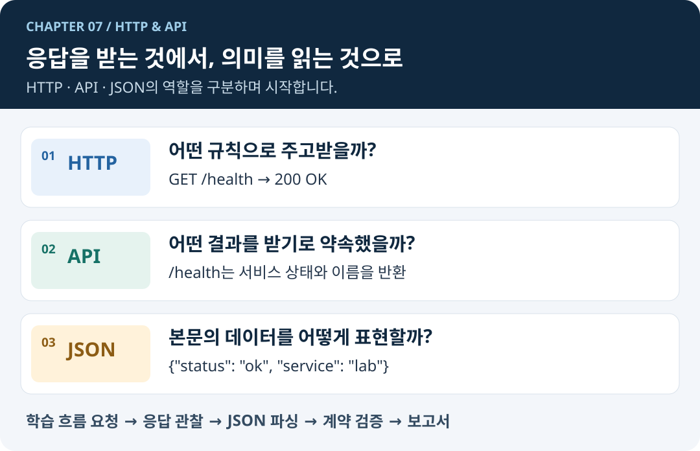
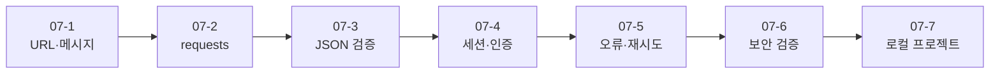
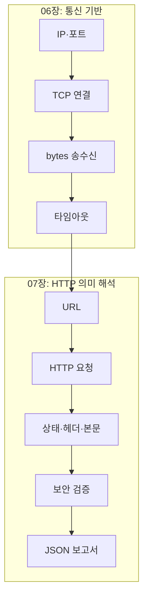

# 07. HTTP와 API

06장에서 소켓으로 바이트를 직접 주고받았다면, 이 장에서는 그 위에서 동작하는 HTTP의 규칙을 학습합니다. URL, 요청·응답, 상태 코드, 헤더, JSON API를 이해하고 Python으로 안전하게 검증합니다.


## 🧭 학습 목표

- TCP와 HTTP의 관계를 설명합니다.
- URL과 HTTP 요청·응답을 구성 요소별로 읽습니다.
- `requests`로 API를 호출하고 응답을 검증합니다.
- 세션·쿠키·인증정보의 역할과 주의점을 설명합니다.
- 타임아웃·리다이렉트·응답 크기를 제한합니다.
- 로컬 서비스의 연결성과 HTTP 보안 설정을 점검합니다.


## 선행 지식

- 06-1의 IP·포트·소켓
- 06-2의 TCP 연결
- 06-6의 이름 해석
- 06-7의 타임아웃과 예외 처리

## 학습 순서

1. [07-1. URL과 HTTP 메시지](07-http-api/07-1-url-http-messages.md)
2. [07-2. requests 기초](07-http-api/07-2-requests-basics.md)
3. [07-3. JSON API와 응답 검증](07-http-api/07-3-json-api.md)
4. [07-4. 세션·쿠키·인증](07-http-api/07-4-sessions-cookies-auth.md)
5. [07-5. 오류·타임아웃·재시도](07-http-api/07-5-errors-timeouts-retries.md)
6. [07-6. HTTP 보안 검증 기초](07-http-api/07-6-http-security-validation.md)
7. [07-7. 로컬 네트워크·웹 보안 점검 프로젝트](07-http-api/07-7-local-web-security-project.md)

### 한눈에 보는 학습 지도


그림의 화살표는 단순 목차가 아니라 **앞 절의 산출물이 다음 절의 입력이 되는 관계**를 뜻합니다. 예를 들어 07-2에서 받은 `Response` 객체를 07-3에서 검증하고, 그 검증 함수를 07-7 프로젝트에서 재사용합니다.


## 06장과 07장의 연결

HTTP는 네트워크와 별개의 기술이 아닙니다. 클라이언트가 서버의 IP와 포트에 TCP로 연결한 뒤, HTTP 형식의 요청을 보내고 응답을 받습니다. `requests`가 소켓 처리의 상당 부분을 대신하지만 연결 실패, 시간 제한, 잘린 응답은 여전히 고려해야 합니다.

## 안전한 실습 원칙


- 종합 실습 대상은 `127.0.0.1` 또는 `localhost`로 제한합니다.
- 자신이 소유하거나 명시적으로 허가받은 서비스만 점검합니다.
- 비밀번호 추측, 취약점 악용, 임의 포트·주소 범위 탐색은 다루지 않습니다.
- 토큰과 쿠키를 코드·로그·Git 저장소에 남기지 않습니다.
- 상태 코드 하나만으로 취약점이나 침해를 확정하지 않습니다.


## 종합 실습

로컬 학습용 HTTP 서버와 보안 점검기를 구현합니다. 점검기는 TCP 연결 여부, JSON 응답 구조, 보안 헤더, 리다이렉트 목적지를 검사하고 결과를 JSON 보고서로 저장합니다.


## ✅ 완료 기준

- [ ] TCP와 HTTP의 계층 관계를 설명할 수 있습니다.
- [ ] 메서드·상태 코드·헤더·본문을 구분할 수 있습니다.
- [ ] 요청마다 연결·읽기 타임아웃을 지정할 수 있습니다.
- [ ] 응답의 상태·Content-Type·JSON 구조를 검증할 수 있습니다.
- [ ] 리다이렉트와 응답 크기를 제한할 수 있습니다.
- [ ] 로컬 보안 점검 결과를 근거와 함께 보고서로 남길 수 있습니다.


---

다음 장: [08. 시스템 자동화](08-system-automation.md)
