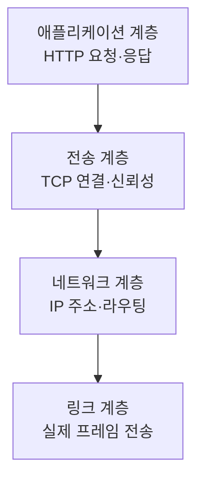
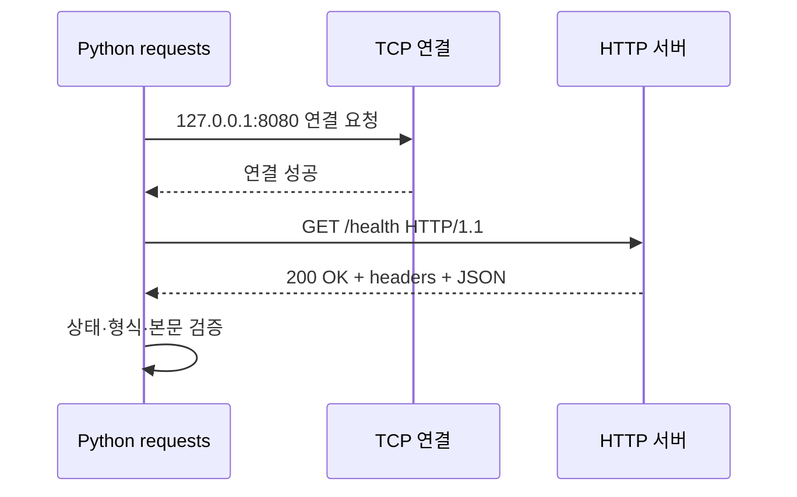
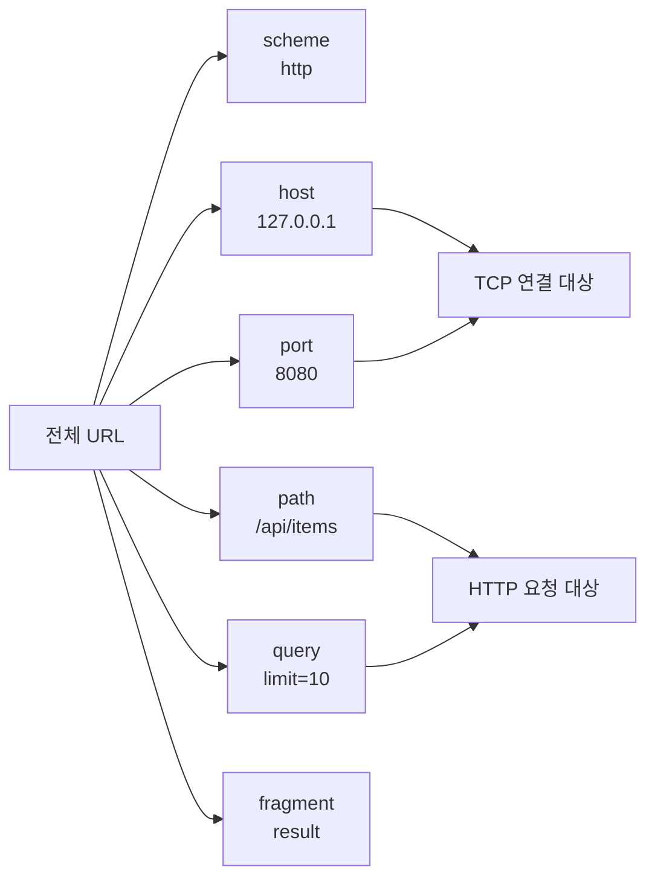

# 07-1. URL과 HTTP 메시지

HTTP를 코드로 사용하기 전에 브라우저와 서버가 어떤 정보를 주고받는지 읽는 법을 익힙니다.

## 1. HTTP는 어디에서 동작하는가



`http://127.0.0.1:8080/health`에 요청하면 먼저 `127.0.0.1`의 8080번 포트에 TCP 연결을 만들고, 그 연결로 HTTP 메시지를 주고받습니다.



위 그림에서 `requests.get()` 한 줄은 내부적으로 **연결 → HTTP 전송 → 응답 수신** 단계를 수행합니다. 오류가 발생한 위치에 따라 `ConnectionError`, `Timeout`, `HTTPError`, 데이터 검증 오류로 나누어야 합니다.

## 2. URL 구성 요소

```text
http://127.0.0.1:8080/api/items?limit=10#result
└─scheme └─host    └port└─path    └query  └fragment
```

| 구성 요소 | 역할 | 서버 전송 여부 |
| --- | --- | --- |
| scheme | 통신 방식 `http`, `https` | 연결 방식 결정 |
| host | 대상 호스트 | 전송됨 |
| port | 대상 프로세스의 포트 | 연결에 사용 |
| path | 서버 자원의 경로 | 전송됨 |
| query | 필터·검색 등 매개변수 | 전송됨 |
| fragment | 브라우저 내부 위치 | 일반적으로 전송되지 않음 |

```python
from urllib.parse import urlsplit

parts = urlsplit("http://127.0.0.1:8080/api/items?limit=10")
print(parts.hostname)  # 127.0.0.1
print(parts.port)      # 8080
print(parts.path)      # /api/items
print(parts.query)     # limit=10
```

예상 출력:

```text
127.0.0.1
8080
/api/items
limit=10
```

### URL을 읽는 순서



`urlsplit()`은 분리 도구이지 보안 검증기가 아닙니다. scheme, host, port를 애플리케이션의 허용 규칙과 다시 비교해야 합니다.

## 3. 요청 메시지

```http
GET /health HTTP/1.1
Host: 127.0.0.1:8080
Accept: application/json
User-Agent: python-requests
```

- 요청 줄: 메서드, 요청 대상, HTTP 버전
- 헤더: 요청 조건과 메타데이터
- 빈 줄: 헤더의 끝
- 본문: POST 등에서 보낼 데이터

## 4. 응답 메시지

```http
HTTP/1.1 200 OK
Content-Type: application/json; charset=utf-8
Content-Length: 33

{"status": "ok", "service": "lab"}
```

응답은 상태 줄, 헤더, 빈 줄, 본문으로 구성됩니다. `200`이어도 예상한 JSON 구조가 아닐 수 있으므로 본문까지 검증해야 합니다.

## 5. 주요 메서드와 상태 코드

| 항목 | 일반적 의미 |
| --- | --- |
| GET | 자원 조회 |
| POST | 데이터 전송·처리 요청 |
| PUT/PATCH | 전체·부분 변경 |
| DELETE | 자원 삭제 요청 |
| 2xx | 요청 처리 성공 범주 |
| 3xx | 다른 위치로 이동 필요 |
| 4xx | 클라이언트 요청 문제 범주 |
| 5xx | 서버 처리 문제 범주 |

상태 코드 범주는 출발점일 뿐입니다. API 명세와 응답 본문을 함께 확인합니다.

## 확인 문제

1. HTTP 요청 전에 TCP 연결이 필요한 이유는 무엇인가요?
2. URL의 fragment가 서버 로그에 보이지 않을 수 있는 이유는 무엇인가요?
3. `200 OK`만 확인하면 부족한 이유는 무엇인가요?

---

다음: [07-2. requests 기초](07-2-requests-basics.md)
