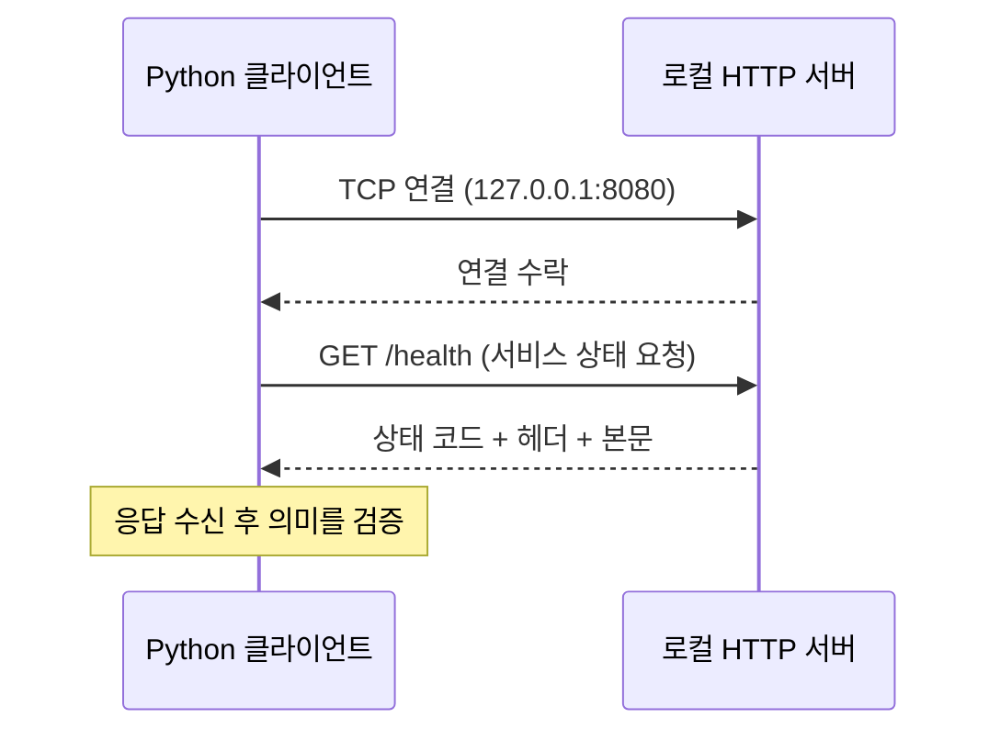
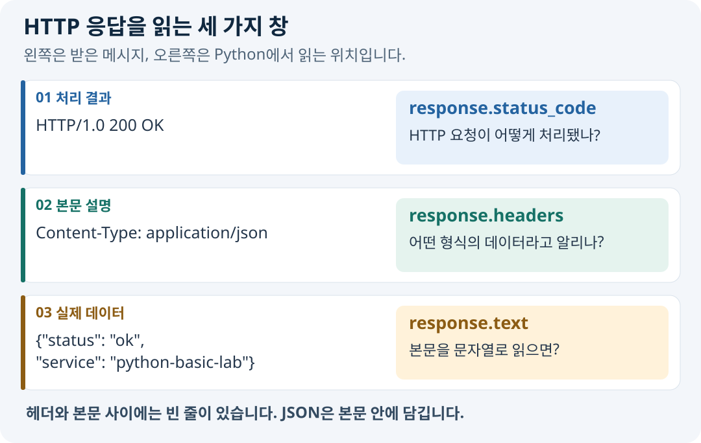

# 07-1. URL과 HTTP 메시지

> 실습 준비: [이 절의 노트북 보기](../notebooks/07-1-url-http-messages.ipynb) · [07장 교육자료 ZIP 받기](https://github.com/zxz3650/Python/raw/refs/heads/master/downloads/chapter-07.zip) · [자료 준비·실행 안내](../PRACTICE.md#download)
>
> 07장 ZIP을 새 폴더에 풀고 폴더 구조를 유지한다. 다음 갱신 때도 이 장의 자료 버전이 바뀐 경우에만 다시 받는다.

> **핵심 질문** · 서버에 “어디의 무엇”을 요청하고, 응답의 어느 부분에서 결과를 읽을까요?

06장의 소켓 연결은 데이터를 주고받을 통로를 만듭니다. HTTP는 그 통로에서 요청과 응답을 해석할 규칙을 제공합니다. 먼저 메시지를 읽을 수 있어야 다음 절의 `requests.get()`이 대신 처리하는 일을 이해할 수 있습니다.

## 1. 연결과 요청은 다른 단계입니다



TCP 연결 성공은 서버 프로세스에 접속했다는 뜻입니다. 원하는 경로가 있는지, 요청이 처리되었는지, 본문이 올바른지는 HTTP 응답에서 확인합니다. 예를 들어 연결은 성공해도 없는 경로를 요청하면 `404`를 받을 수 있습니다.

이 절은 TCP 기반 HTTP 예제로 설명합니다. HTTPS에서는 전송 구간 보호를 위한 TLS와 인증서 확인도 필요하지만, 처음에는 로컬 HTTP 메시지 구조에 집중합니다.

## 2. URL을 두 묶음으로 읽습니다

```text
http://127.0.0.1:8080/api/echo?text=hello#result
```

| 묶음 | 구성 요소 | 예제의 값 | 역할 |
| --- | --- | --- | --- |
| 연결 대상 | scheme | `http` | 통신 방식 |
| 연결 대상 | host | `127.0.0.1` | 접속할 호스트 |
| 연결 대상 | port | `8080` | 접속할 서비스의 포트 |
| 요청 대상 | path | `/api/echo` | 서버에서 처리할 경로 |
| 요청 대상 | query | `text=hello` | 경로에 전달할 매개변수 |
| 클라이언트 참조 | fragment | `result` | 문서 내부 위치 등; HTTP 요청 대상에 포함되지 않음 |

쿼리는 서버에 전달되므로 비밀번호나 토큰을 넣지 않습니다. 경로와 쿼리는 서버 로그 등에 기록될 수 있습니다.

### 실행: URL 분리하기 — 서버 불필요

```python
from urllib.parse import urlsplit

parts = urlsplit("http://127.0.0.1:8080/api/echo?text=hello#result")
print(parts.hostname, parts.port)
print(parts.path, parts.query)
print(parts.fragment)
```

```text
127.0.0.1 8080
/api/echo text=hello
result
```

`urlsplit()`은 구성 요소를 분리합니다. 이 URL에 접속해도 되는지 판단하는 기능은 아니므로 대상 허용 여부는 별도로 확인합니다.

## 3. 요청 메시지: 무엇을 원하는지 전달하기

아래는 읽기 쉽게 표현한 HTTP/1.1 요청입니다. 실제 전송에는 줄 끝과 헤더 종료를 나타내는 바이트도 들어갑니다.

```http
GET /health HTTP/1.1
Host: 127.0.0.1:8080
Accept: application/json

```

| 부분 | 읽는 방법 |
| --- | --- |
| `GET /health HTTP/1.1` | HTTP/1.1 형식으로 `/health`를 조회 |
| `Host` | 요청을 처리할 호스트 정보 |
| `Accept` | 클라이언트가 받고 싶은 응답 형식 |
| 빈 줄 | 헤더 종료; 본문이 있다면 이 뒤에 위치 |

`application/json`은 **JSON 형식의 데이터**를 뜻하는 미디어 타입입니다. 여기서는 서버에 “JSON으로 응답해 주세요”라고 알립니다. JSON의 문법과 Python 변환은 07-3에서 다룹니다. 이 GET 요청에는 본문이 없습니다.

## 4. 응답 메시지: 처리 결과와 데이터를 분리하기



학습 서버가 돌려주는 응답에서 일부 헤더만 발췌하면 다음과 같습니다. 서버 구현의 기본 응답 버전은 HTTP/1.0입니다.

```http
HTTP/1.0 200 OK
Content-Type: application/json; charset=utf-8
Content-Length: 47

{"status": "ok", "service": "python-basic-lab"}
```

| 부분 | 답하는 질문 | 다음 절에서 읽을 위치 |
| --- | --- | --- |
| 상태 코드 `200` | HTTP 요청이 어떻게 처리되었나? | `response.status_code` |
| `Content-Type` | 본문은 어떤 형식이라고 선언되어 있나? | `response.headers` |
| `Content-Length` | 본문의 바이트 수는 얼마인가? | `response.headers` |
| 본문 | 실제 전달할 데이터는 무엇인가? | `response.text` 또는 `response.content` |

`charset=utf-8`은 문자 인코딩을 나타냅니다. `Content-Length`는 글자 수가 아닌 **바이트 수**이며, 특히 한글이 있을 때 두 수가 달라집니다. Requests와 서버 라이브러리가 메시지 구성과 해석을 처리하므로 직접 헤더 길이를 계산해 보낼 필요는 없습니다.


### Accept와 Content-Type

`Accept`는 요청자가 원하는 응답 형식이고, `Content-Type`은 해당 메시지에 담긴 본문의 형식입니다. 요청자 희망과 서버 응답이 항상 같지는 않으므로 응답 헤더를 확인합니다. 선언이 JSON이어도 본문이 올바른지는 파싱해 보아야 합니다.


## 5. 메서드와 상태 코드

| 메서드 | 의도 | 이 장에서의 사용 |
| --- | --- | --- |
| GET | 자원 조회 | 학습 서버의 상태와 응답 조회 |
| POST | 데이터 제출·처리 요청 | 07-3에서 전송할 메시지만 준비 |
| PUT / PATCH | 전체 교체 / 부분 변경 | 의미만 구분 |
| DELETE | 자원 삭제 요청 | 의미만 구분 |

| 상태 코드 | 읽는 출발점 | 로컬 예 |
| --- | --- | --- |
| 200 | 요청 처리 성공 | `/health` |
| 302 | 다른 위치로 이동 안내 | `/redirect`와 `Location` 헤더 |
| 404 | 요청한 자원을 찾지 못함 | `/missing` |
| 405 | 해당 메서드를 허용하지 않음 | 학습 서버에 POST 요청 |
| 5xx | 서버 측 처리 실패 범주 | 이 장의 오류 분류 개념 |

모든 성공 응답이 `200`인 것은 아닙니다. 이 장의 `/health`는 정확히 `200`을 기대한다는 **API 계약**을 사용합니다. 상태 코드가 맞더라도 본문에 필요한 값이 없을 수 있습니다.

## 직접 확인하기

1. `/api/echo?text=hello`에서 연결 대상과 요청 대상을 나누어 적습니다.
2. `Accept: application/json`을 보냈는데 `Content-Type: text/html`을 받으면 어떤 단계에서 차이를 알 수 있나요?
3. `404` 응답을 받았다면 TCP 연결도 실패했다고 말할 수 있나요?

<details>
<summary>해설 확인</summary>

1. 연결 대상은 `127.0.0.1:8080`, 요청 경로는 `/api/echo`, 쿼리는 `text=hello`입니다.
2. 응답 헤더를 읽는 단계입니다. 본문을 무조건 JSON으로 파싱하지 않습니다.
3. 아닙니다. HTTP 응답을 받았으므로 연결과 메시지 교환이 이루어졌습니다. 요청한 경로를 찾지 못한 것입니다.

</details>

## 정리와 다음 단계

- [ ] URL의 연결 대상과 요청 대상을 구분합니다.
- [ ] 상태·헤더·본문이 서로 다른 질문에 답함을 설명합니다.
- [ ] HTTP 본문이 항상 JSON인 것은 아님을 설명합니다.

메시지를 읽었다면 이제 직접 조립하는 일을 라이브러리에 맡겨 봅니다. 다음 절에서는 같은 응답을 Python 객체의 속성으로 읽습니다.

참고: [MDN — HTTP 메시지](https://developer.mozilla.org/en-US/docs/Web/HTTP/Guides/Messages)

---

[장 안내](../07-http-api.md) · 다음: [07-2. requests 기초](07-2-requests-basics.md)
