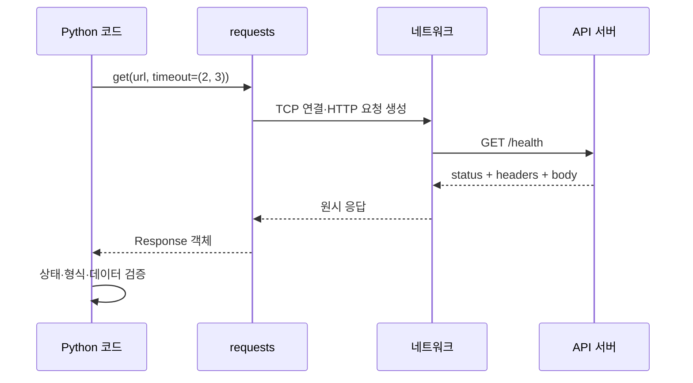
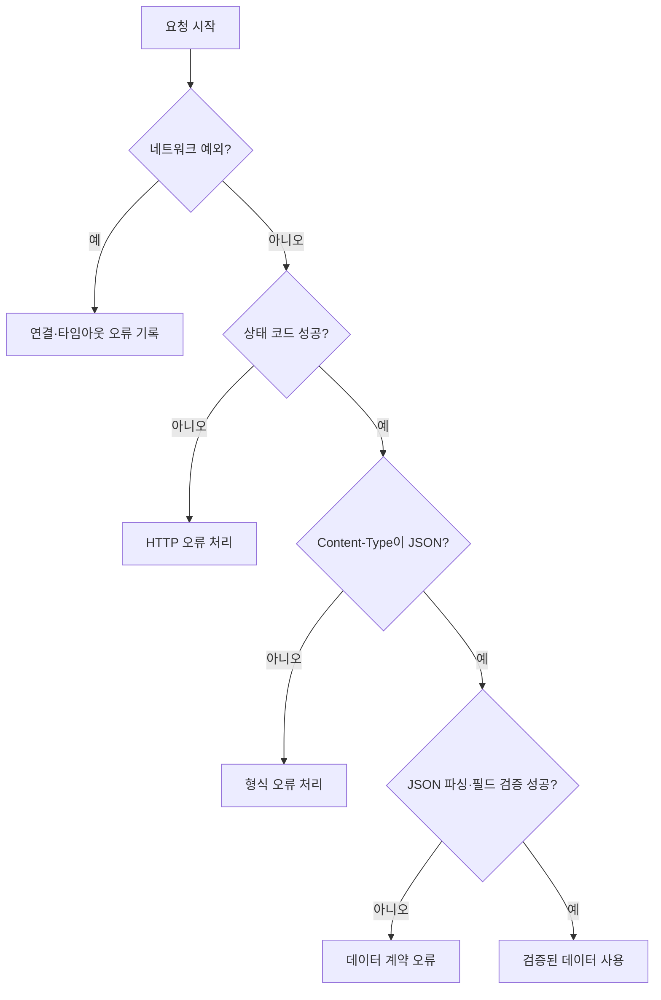

# 07-2. requests 기초

`requests`는 소켓 연결과 HTTP 메시지 처리를 감싸는 라이브러리입니다. 편리함과 별개로 대상, 시간, 응답 형식은 호출자가 검증해야 합니다.



## 1. 기본 요청

```python
import requests

response = requests.get(
    "http://127.0.0.1:8080/health",
    timeout=(2, 3),
)

print(response.status_code)
print(response.headers.get("Content-Type"))
print(response.text)
```

예상 출력:

```text
200
application/json; charset=utf-8
{"status": "ok", "service": "python-basic-lab"}
```

`response`는 단순 문자열이 아닙니다. 상태는 `status_code`, 헤더는 `headers`, 텍스트 본문은 `text`, 원본 바이트는 `content`로 나누어 접근합니다.

`timeout=(2, 3)`은 연결 대기와 읽기 대기를 나누어 제한합니다. 전체 실행 시간의 정확한 상한과 같은 뜻은 아닙니다.

## 2. 쿼리 매개변수

문자열을 직접 이어 붙이지 말고 `params`를 사용합니다.

```python
response = requests.get(
    "http://127.0.0.1:8080/api/echo",
    params={"text": "한글 메시지"},
    timeout=(2, 3),
)
print(response.url)
```

라이브러리가 URL 인코딩을 처리하므로 공백, 한글, 예약 문자를 더 안전하고 일관되게 전달할 수 있습니다.

## 3. 응답 확인 순서

```python
response.raise_for_status()

content_type = response.headers.get("Content-Type", "")
if "application/json" not in content_type.lower():
    raise ValueError("JSON 응답이 아닙니다")

data = response.json()
```

1. 네트워크 예외
2. 상태 코드
3. Content-Type
4. 본문 파싱
5. 필수 필드와 자료형



## 4. 헤더 보내기

```python
headers = {
    "Accept": "application/json",
    "User-Agent": "python-basic-lab/1.0",
}
response = requests.get(url, headers=headers, timeout=(2, 3))
```

인증 토큰을 예제 문자열로 하드코딩하지 않습니다. 실제 토큰은 환경변수나 비밀 관리 체계에서 가져옵니다.

## 5. 실패 사례

```python
# 타임아웃이 없어 오래 멈출 수 있음
requests.get(url)

# 상태와 형식을 확인하지 않고 바로 사용
user_id = requests.get(url, timeout=3).json()["id"]
```


`response.json()`이 성공했다는 사실은 HTTP 요청이 성공했거나 데이터가 신뢰할 수 있다는 뜻이 아닙니다. 오류 응답도 JSON일 수 있습니다.


## 실습

로컬 서버의 `/health`와 존재하지 않는 `/missing`을 호출하고 상태 코드, Content-Type, 본문을 비교합니다.

---

다음: [07-3. JSON API와 응답 검증](07-3-json-api.md)
