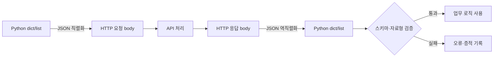
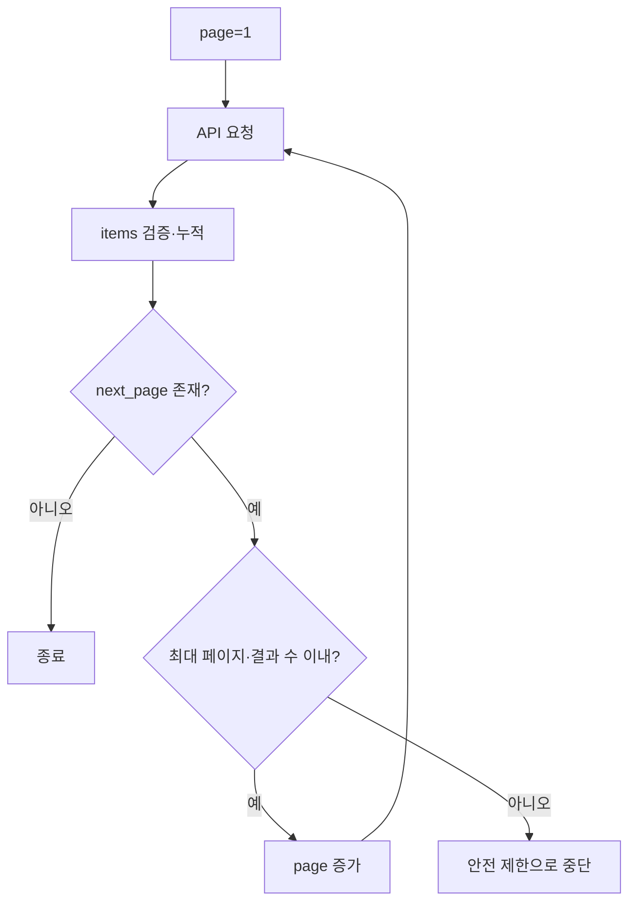

# 07-3. JSON API와 응답 검증

API는 프로그램끼리 합의한 입력과 출력의 규칙입니다. JSON 파싱은 문자열을 Python 객체로 바꾸는 작업이고, 검증은 그 객체가 약속한 구조인지 확인하는 작업입니다.



## 1. JSON과 Python 자료형

| JSON | Python |
| --- | --- |
| object | `dict` |
| array | `list` |
| string | `str` |
| number | `int`, `float` |
| true/false | `True`, `False` |
| null | `None` |

## 2. JSON 요청

```python
payload = {"event": "login", "success": True}
response = requests.post(
    url,
    json=payload,
    timeout=(2, 3),
)
```

`json=payload`는 직렬화와 `Content-Type: application/json` 설정을 처리합니다.

## 3. 응답 구조 검증

```python
def validate_health(data):
    if not isinstance(data, dict):
        raise ValueError("최상위 값은 객체여야 합니다")
    if data.get("status") != "ok":
        raise ValueError("status가 ok가 아닙니다")
    if not isinstance(data.get("service"), str):
        raise ValueError("service는 문자열이어야 합니다")
```

검증 항목:

- 최상위 자료형
- 필수 키 존재 여부
- 값의 자료형과 허용 범위
- 빈 문자열·빈 목록 허용 여부
- 예상하지 못한 필드 처리 방식

### 정상·오류·경계 입력을 함께 시험하기

```python
test_cases = [
    {"status": "ok", "service": "lab"},       # 정상
    {"status": "ok"},                           # 필수 키 누락
    ["status", "ok"],                            # 최상위 자료형 오류
]

for index, case in enumerate(test_cases, start=1):
    try:
        validate_health(case)
        print(index, "PASS")
    except ValueError as error:
        print(index, "FAIL", error)
```

예상 출력:

```text
1 PASS
2 FAIL service는 문자열이어야 합니다
3 FAIL 최상위 값은 객체여야 합니다
```

이처럼 예제는 성공 경로 하나만 확인하지 않고 **필드 누락과 잘못된 자료형**까지 포함해야 합니다.

## 4. 페이지네이션

대량 결과를 여러 페이지로 제공하는 API가 있습니다.

```python
page = 1
while True:
    response = session.get(url, params={"page": page}, timeout=(2, 3))
    response.raise_for_status()
    data = response.json()
    items.extend(data["items"])

    if not data.get("next_page"):
        break
    page += 1
```

무한 반복을 막기 위해 최대 페이지 수와 최대 결과 수를 함께 제한합니다.



## 5. Rate Limit

`429 Too Many Requests`는 요청 빈도를 낮춰야 한다는 신호입니다. `Retry-After`가 있으면 정책 범위에서 존중하고, 요청 횟수와 대기 시간을 로그로 남깁니다.

## 실습

정상 JSON, 키가 누락된 JSON, HTML 오류 페이지 세 가지 응답에 대해 검증 함수를 실행하고 실패 이유를 구분합니다.

---

다음: [07-4. 세션·쿠키·인증](07-4-sessions-cookies-auth.md)
