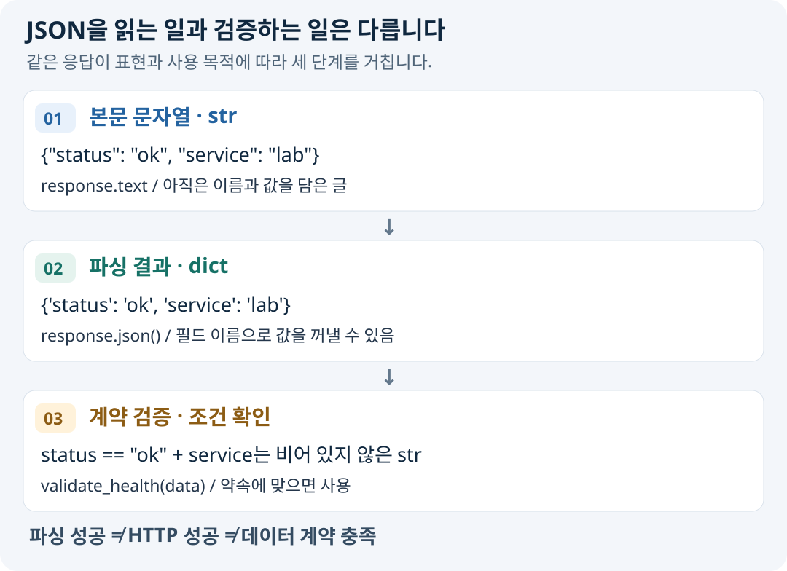

# 07-3. JSON API와 응답 검증

> 실습 준비: [이 절의 노트북 보기](../notebooks/07-3-json-api.ipynb) · [07장 교육자료 ZIP 받기](https://github.com/zxz3650/Python/raw/refs/heads/master/downloads/chapter-07.zip) · [자료 준비·실행 안내](../PRACTICE.md#download)
>
> 07장 ZIP을 새 폴더에 풀고 폴더 구조를 유지한다. 다음 갱신 때도 이 장의 자료 버전이 바뀐 경우에만 다시 받는다.

> **핵심 질문** · 본문의 글을 Python 데이터로 바꾸는 일과, 그 데이터를 사용해도 되는지 판단하는 일은 어떻게 다를까요?

07-2에서 `/health`의 본문을 출력했습니다. 사람은 `"status": "ok"`를 보고 의미를 읽지만, 프로그램이 조건문으로 판정하려면 이름과 값을 구조적으로 꺼낼 수 있어야 합니다. 이 절에서는 **문자열 → Python 객체 → 검증된 데이터**의 순서로 진행합니다.

## 1. 이 과정에서 JSON이 필요한 이유

JSON(JavaScript Object Notation)은 이름·값, 목록, 숫자, 참·거짓 등을 표현하는 텍스트 형식입니다. 이름에 JavaScript가 들어가지만 여러 언어가 주고받을 수 있는 데이터 형식입니다. 서버가 Python 객체 자체를 보내는 것이 아니라, 서로 읽을 수 있는 JSON 본문을 보내는 것입니다.

| 하고 싶은 일 | JSON 구조를 쓰면 가능한 접근 |
| --- | --- |
| 서비스가 정상인지 확인 | `status` 필드의 값을 조건문으로 비교 |
| 자산 목록을 순서대로 처리 | 배열을 `list`로 바꾸어 반복 |
| 점검 결과와 근거를 함께 보관 | 객체와 배열을 중첩해 보고서 저장 |

[04-6](../04-file-io/04-6-json-jsonl.md)에서는 **파일에 저장된 JSON**을 읽었습니다. 여기서는 **HTTP 본문에 실려 온 JSON**을 읽습니다. 문법은 같고 데이터가 도착하는 경로가 달라집니다. HTML·CSV 등 다른 형식의 API도 있으므로 JSON 사용 여부는 응답 계약으로 확인합니다.



## 2. 서버 없이 변환부터 관찰합니다

```python
import json

body = '{"status": "ok", "service": "lab", "maintenance": false}'
data = json.loads(body)

print(type(body).__name__)
print(type(data).__name__)
print(data["status"])
print(data["maintenance"])
```

```text
str
dict
ok
False
```

`json.loads()`는 JSON 문자열을 Python 값으로 바꿉니다. 이를 **파싱** 또는 **역직렬화**라고 합니다. 반대로 `json.dumps()`로 Python 값을 JSON 문자열로 표현하는 것을 **직렬화**라고 합니다.

| JSON 값 | Python 값 | 읽을 때 주의할 점 |
| --- | --- | --- |
| object `{...}` | `dict` | JSON 키는 큰따옴표로 감싼 문자열 |
| array `[...]` | `list` | 최상위 값이 목록일 수도 있음 |
| string `"ok"` | `str` | `"200"`은 숫자가 아닌 문자열 |
| number `200`, `1.5` | `int`, `float` | 사용 목적에 맞는 범위 확인 |
| `true`, `false` | `True`, `False` | 철자와 대소문자가 다름 |
| `null` | `None` | 키 자체가 없는 경우와 구분 |

`{'status': 'ok'}`는 Python 딕셔너리 표기이며 JSON 문법이 아닙니다. 외부 문자열을 `eval()`로 처리하지 않고 JSON 파서를 사용합니다.

## 3. HTTP 응답에서는 response.json()을 사용합니다

다음 예제는 **파싱이 무엇을 하는지 관찰**하기 위한 코드입니다. 두 경로의 HTTP 상태와 파싱 결과를 비교합니다.

```python
import requests

for path in ("/health", "/missing"):
    with requests.get(
        "http://127.0.0.1:8080" + path,
        timeout=(2, 3),
        allow_redirects=False,
    ) as response:
        data = response.json()
        print(path, response.status_code, type(data).__name__, sorted(data))
```

```text
/health 200 dict ['service', 'status']
/missing 404 dict ['error']
```


### json()이 하는 일과 하지 않는 일

`response.json()`은 **이미 받은 본문을 Python 값으로 변환**합니다. 새로운 HTTP 요청을 보내지 않으며, 상태 코드가 성공인지 또는 필수 키가 있는지는 판단하지 않습니다. 위 예제에서 `404`도 파싱이 성공하는 이유입니다.


## 4. 검증을 네 질문으로 나눕니다

| 순서 | 질문 | 실패 예 |
| --- | --- | --- |
| ① HTTP 상태 | 이 경로가 약속한 상태인가? | `/health`에서 `404` |
| ② 선언된 형식 | 기대한 미디어 타입인가? | `text/html` |
| ③ JSON 문법 | 본문을 JSON으로 읽을 수 있는가? | `{"status":`처럼 잘린 본문 |
| ④ 데이터 계약 | 필요한 키·자료형·값인가? | `service` 누락, 빈 이름, `status="down"` |

앞의 세 단계를 통과해도 마지막 검증이 필요합니다. **데이터 계약**은 어떤 필드가 필수이고 어떤 값을 허용하는지 정한 규칙입니다. 이 절은 `/health`에 다음 규칙을 사용합니다.

- 최상위 값은 `dict`입니다.
- `status`는 문자열 `"ok"`입니다.
- `service`는 공백을 제외한 내용이 있는 문자열입니다.
- 추가 필드는 허용하지만 판정에 사용하지 않습니다.

### 실행: 검사 함수와 HTTP 요청 연결하기

```python
import requests


def validate_health(data):
    if not isinstance(data, dict):
        raise ValueError("최상위 값은 객체여야 합니다")
    if data.get("status") != "ok":
        raise ValueError("status가 ok가 아닙니다")
    service = data.get("service")
    if not isinstance(service, str) or not service.strip():
        raise ValueError("service는 비어 있지 않은 문자열이어야 합니다")
    return data


with requests.get(
    "http://127.0.0.1:8080/health",
    timeout=(2, 3),
    allow_redirects=False,
) as response:
    response.raise_for_status()
    if response.status_code != 200:
        raise ValueError("예상 상태는 200입니다")
    media_type = response.headers.get("Content-Type", "").split(";", 1)[0].strip().lower()
    if media_type != "application/json":
        raise ValueError("예상 형식은 application/json입니다")
    try:
        data = response.json()
    except requests.exceptions.JSONDecodeError as error:
        raise ValueError("본문의 JSON 문법 오류") from error
    checked = validate_health(data)
    print("확인한 서비스:", checked["service"])
```

```text
확인한 서비스: python-basic-lab
```

이 단계에서는 네트워크 예외가 발생하면 프로그램이 중단됩니다. 실패를 사용자 메시지로 나누는 방법과 읽기 크기 제한은 07-5에서 보완합니다.

### 실행: 정상·오류·경계 데이터 비교 — 서버 불필요

바로 위 코드의 `validate_health()` 함수 정의만 먼저 실행한 뒤 아래를 실행합니다.

```python
cases = [
    {"status": "ok", "service": "lab"},
    {"status": "ok"},
    {"status": "ok", "service": "   "},
    ["status", "ok"],
]
for number, case in enumerate(cases, 1):
    try:
        validate_health(case)
        print(number, "PASS")
    except ValueError as error:
        print(number, "FAIL", error)
```

```text
1 PASS
2 FAIL service는 비어 있지 않은 문자열이어야 합니다
3 FAIL service는 비어 있지 않은 문자열이어야 합니다
4 FAIL 최상위 값은 객체여야 합니다
```

## 5. JSON을 보내는 쪽에서는 무엇이 달라질까요?

응답을 읽을 때는 JSON을 `dict`로 바꿨습니다. 보낼 때는 반대 방향입니다. Requests의 `json=payload`는 Python 값을 JSON 본문으로 만들고 Content-Type을 설정합니다.

**아래 예제는 요청 준비만 수행하며 서버에 전송하지 않습니다.** 제공 서버는 POST를 처리하지 않고 `405`를 반환하므로, 전송과 저장에 성공하는 실습으로 해석하지 않습니다.

```python
import json
import requests

payload = {"event": "login", "success": True}
prepared = requests.Request(
    "POST",
    "http://127.0.0.1:8080/api/events",
    json=payload,
).prepare()

print(prepared.method)
print(prepared.headers["Content-Type"])
print(json.loads(prepared.body) == payload)
```

```text
POST
application/json
True
```

| 인자 | 데이터 위치·형식 | 용도 |
| --- | --- | --- |
| `params={...}` | URL 쿼리 | 검색·필터 등 매개변수 |
| `json={...}` | JSON 요청 본문 | JSON을 받기로 한 API |
| `data={...}` | 일반적으로 폼 인코딩 본문 | HTML 폼 방식의 입력을 받는 API |

같은 딕셔너리를 넘겨도 서버에 전달되는 형식은 다릅니다. API의 입력 계약에 맞는 인자를 선택합니다.

## 6. 더 많은 결과를 읽을 때 — 확장 개념

자산이나 이벤트가 많으면 API가 한 번에 일부만 반환할 수 있습니다. 이를 **페이지네이션**이라고 합니다. 제공 서버는 이 기능이 없으므로 여기서는 응답 구조만 읽습니다.

```json
{"items": [{"id": 1}, {"id": 2}], "next_page": 2}
```

`items`는 이번 페이지의 결과이고 `next_page`는 다음 요청을 위한 값입니다. 구현 시에는 API 문서의 커서·페이지 규칙을 따르고, 최대 페이지 수·결과 수·전체 처리 시간을 제한합니다. 다음 페이지 값의 반복도 중단 조건으로 다룹니다.

요청 횟수에 제한이 걸리면 `429`가 올 수 있습니다. 반복 요청과 재시도는 JSON 문법의 문제가 아니라 **호출 정책**이므로 07-5의 실패 처리와 연결합니다.

## 직접 확인하기

1. HTTP 수업에서 JSON을 사용하는 이유를 “본문”, “필드”, “Python 객체” 세 단어로 설명합니다.
2. `{"error": "not found"}`가 파싱되면 요청이 성공했다고 말할 수 있나요?
3. `service`가 빈 문자열일 때 문법 오류와 계약 오류 중 무엇인가요?

<details>
<summary>해설 확인</summary>

1. HTTP 본문의 JSON을 Python 객체로 변환하면 이름이 있는 필드로 값을 읽고 자동화에 사용할 수 있습니다.
2. 아닙니다. JSON 문법을 읽을 수 있다는 뜻이며 HTTP 상태와 해당 API의 계약을 별도로 확인해야 합니다.
3. JSON 문법은 올바르지만 이 절에서 정한 비어 있지 않은 서비스 이름 규칙을 어긴 계약 오류입니다.

</details>

## 정리와 다음 단계

- [ ] 파일 JSON과 HTTP 본문 JSON의 공통점을 설명합니다.
- [ ] 직렬화·파싱·계약 검증을 구분합니다.
- [ ] 누락·잘못된 자료형·빈 값을 검사합니다.

다음 절에서는 올바른 요청을 여러 번 보낼 때, 서버가 사용자와 상태를 어떻게 이어서 다루는지 살펴봅니다.

참고: [Python — json](https://docs.python.org/3/library/json.html), [Requests — JSON 응답](https://requests.readthedocs.io/en/latest/user/quickstart/#json-response-content)

---

이전: [07-2. requests 기초](07-2-requests-basics.md) · 다음: [07-4. 세션·쿠키·인증](07-4-sessions-cookies-auth.md)
