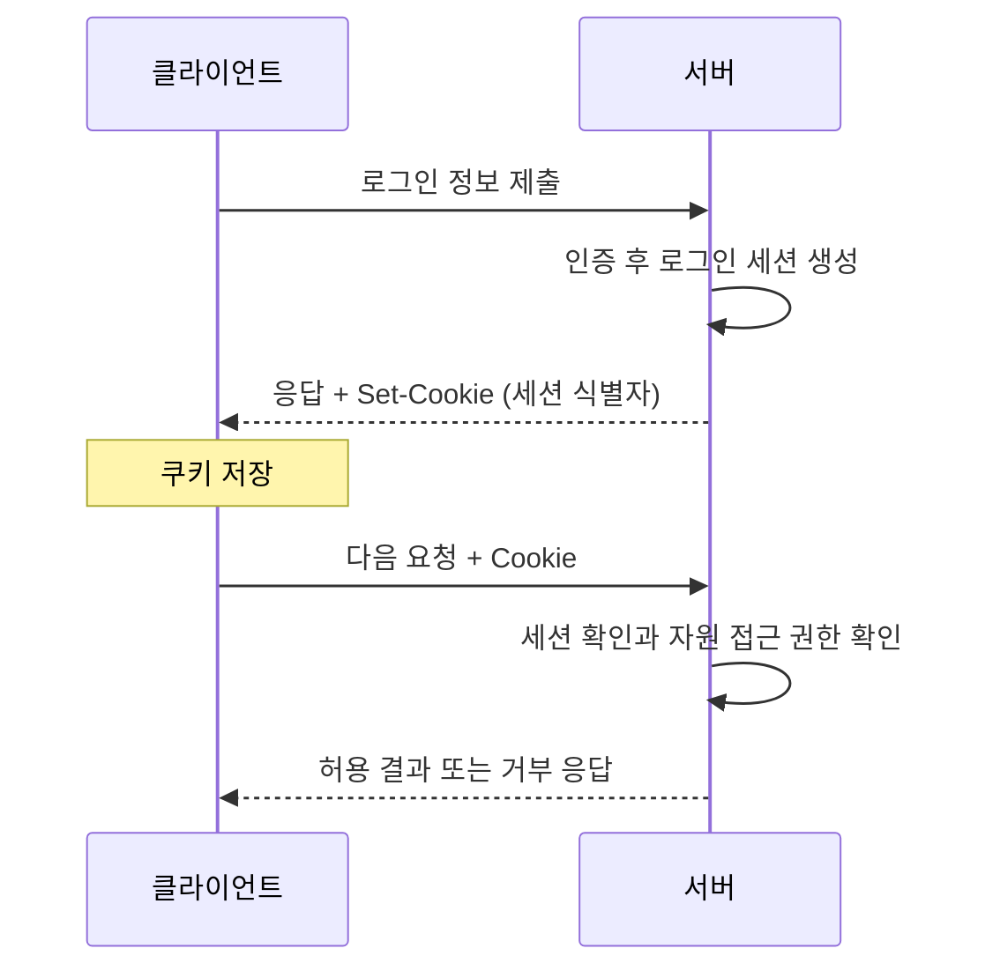

# 07-4. 세션·쿠키·인증

> **핵심 질문** · 한 번 로그인한 사용자를 서버는 다음 요청에서 어떻게 알아볼까요?

앞 절에서는 요청 하나의 상태와 본문을 확인했습니다. 실제 웹 서비스는 여러 요청을 연결해 장바구니나 로그인 상태를 유지해야 합니다. HTTP가 이전 요청의 사용자를 자동으로 기억해 주는 것은 아니므로 애플리케이션이 쿠키·세션·토큰 같은 수단을 사용합니다.

## 1. 비슷한 용어부터 구분합니다

| 용어 | 역할 | 혼동하기 쉬운 점 |
| --- | --- | --- |
| 쿠키 | 클라이언트가 저장하고 조건에 맞는 요청에 보내는 값 | 모든 쿠키가 로그인용은 아님 |
| 서버의 로그인 세션 | 여러 요청을 로그인 상태와 연결하는 관리 방식 | 쿠키에는 상태 전체 대신 식별자만 담을 수도 있음 |
| `requests.Session` | 쿠키·공통 설정·연결 풀을 유지하는 Python 클라이언트 객체 | 객체를 만들었다고 로그인되는 것은 아님 |
| 인증 | 누구인지 또는 어떤 자격을 제시했는지 확인 | 작업 권한 확인과 별개 |
| 인가 | 해당 자원·작업을 허용할지 판단 | 로그인 성공이 모든 권한을 뜻하지 않음 |

## 2. 쿠키로 로그인 상태를 이어 가는 개념



이 그림은 로그인 기능이 있는 서비스의 **개념 흐름**입니다. 제공 학습 서버에는 로그인 경로와 세션 쿠키 발급이 없으므로 이 흐름 전체를 실행하는 실습은 아닙니다.

`Set-Cookie`는 서버가 쿠키를 설정하도록 보내는 응답 헤더이고, `Cookie`는 이후 클라이언트가 전달하는 요청 헤더입니다. 서버는 전달된 식별자를 확인해 로그인 상태와 연결할 수 있습니다.

## 3. Session의 공통 설정 관찰하기 — 로컬 서버 사용

```python
import requests

base_url = "http://127.0.0.1:8080"
with requests.Session() as session:
    session.trust_env = False  # 로컬 실습에서 환경 프록시·netrc 설정을 사용하지 않음
    session.headers.update({"Accept": "application/json"})
    for path in ("/health", "/api/echo"):
        with session.get(base_url + path, timeout=(2, 3), allow_redirects=False) as response:
            print(path, response.status_code, response.request.headers["Accept"])
```

```text
/health 200 application/json
/api/echo 200 application/json
```

두 요청에 같은 `Accept`가 적용됩니다. Session은 조건이 맞으면 연결도 재사용할 수 있지만, 이 예제의 출력만으로 실제 연결 재사용까지 확인한 것은 아닙니다. 서버는 쿠키를 발급하지 않으므로 다음 예제에서는 가상의 쿠키를 직접 넣고 전송 준비 결과만 봅니다.

### 실행: 쿠키가 붙을 요청 준비하기 — 서버 불필요, 전송 없음

```python
import requests

with requests.Session() as session:
    session.trust_env = False
    session.cookies.set("lab_demo", "training-only", domain="127.0.0.1", path="/")
    prepared = session.prepare_request(
        requests.Request("GET", "http://127.0.0.1:8080/health")
    )
    print("쿠키 헤더 존재:", "Cookie" in prepared.headers)
```

```text
쿠키 헤더 존재: True
```

이 값은 실제 인증정보가 아니며 로그인 효과가 없습니다. 실제 세션 쿠키는 값을 출력하지 않고 존재 여부만 관찰합니다.

## 4. 쿠키 속성은 왜 필요한가요?

| 속성 | 줄이려는 노출 | 이해할 범위 |
| --- | --- | --- |
| Secure | 보호되지 않은 연결로 쿠키 전송 | 운영 HTTPS 서비스의 전송 정책 |
| HttpOnly | 브라우저 JavaScript의 쿠키 읽기 | 스크립트 접근 제한; 모든 스크립트 위험의 해결책은 아님 |
| SameSite | 교차 사이트 요청에서의 쿠키 전송 | 요청 맥락과 서비스 로그인 흐름을 함께 고려 |
| Expires / Max-Age | 쿠키가 오래 유지되는 상황 | 클라이언트 만료와 서버 세션 만료는 별도 |

브라우저와 Python 클라이언트의 동작을 동일하게 가정하지 않습니다. Requests는 JavaScript를 실행하는 브라우저가 아니며 브라우저의 SameSite 정책까지 재현하는 도구도 아닙니다. 속성 이름을 읽었다는 사실만으로 브라우저 동작 검증을 마쳤다고 판단할 수 없습니다.

## 5. Authorization과 토큰 — 개념

일부 API는 쿠키 대신 `Authorization` 요청 헤더에 토큰을 넣도록 요구합니다. **Bearer 토큰**은 그 값을 가진 쪽이 사용할 수 있는 자격 증명으로 취급하므로 비밀값 관리가 필요합니다.

```http
Authorization: Bearer <발급된 토큰>
```

실제 토큰은 환경변수나 비밀 관리 도구에서 읽고, 인증된 HTTPS 대상에만 전달합니다. 제공 서버에는 토큰 검증 기능이 없으므로 이 절에서는 실제 토큰을 입력하거나 보내지 않습니다.

| 상태 | 의미를 읽는 출발점 | 다음 행동 |
| --- | --- | --- |
| 401 | 유효한 인증 자격이 필요함 | API의 인증 방식과 자격 유효성 확인 |
| 403 | 서버가 요청을 이해했지만 처리를 거부함 | 접근 정책·권한 등 거부 사유 확인 |

403만 보고 사용자의 인증이 반드시 성공했다고 단정하지 않습니다. 실제 의미는 API 명세와 응답 근거로 확인합니다.

## 직접 확인하기

1. Session 객체를 새로 만들면 로그인되는지 설명합니다.
2. 쿠키를 준비하는 예제에서 `path="/"`를 `path="/other"`로 바꾸고 `/health` 요청의 헤더 존재 여부를 비교합니다.
3. 로그에 남길 값과 남기지 않을 값을 나누어 봅니다.

<details>
<summary>해설 확인</summary>

1. 로그인되지 않습니다. Session은 클라이언트 상태를 관리하며 서버 인증은 별도로 필요합니다.
2. `/other`에 제한된 쿠키는 `/health` 요청의 경로 조건과 맞지 않아 붙지 않습니다.
3. 경로·상태 코드·요청 ID·인증 헤더 존재 여부는 필요한 범위에서 기록할 수 있습니다. 토큰·세션 쿠키·비밀번호 원문은 기록하지 않습니다.

</details>

## 정리와 다음 단계

- [ ] 클라이언트 Session과 서버 로그인 세션을 구분합니다.
- [ ] 쿠키 속성을 브라우저의 역할과 연결해 설명합니다.
- [ ] 인증과 인가, 401과 403을 구분합니다.

다음 절에서는 상태를 유지하며 요청하던 중 실패했을 때, 다시 보내도 되는지 판단합니다.

참고: [Requests — Session 객체](https://requests.readthedocs.io/en/latest/user/advanced/#session-objects), [MDN — HTTP 쿠키](https://developer.mozilla.org/en-US/docs/Web/HTTP/Guides/Cookies), [MDN — 403](https://developer.mozilla.org/en-US/docs/Web/HTTP/Reference/Status/403)

---

이전: [07-3. JSON API와 응답 검증](07-3-json-api.md) · 다음: [07-5. 오류·타임아웃·재시도](07-5-errors-timeouts-retries.md)
