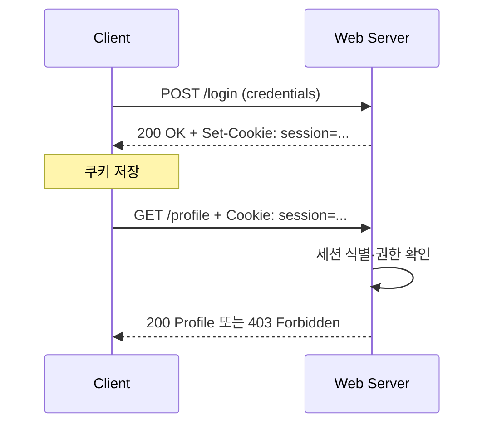
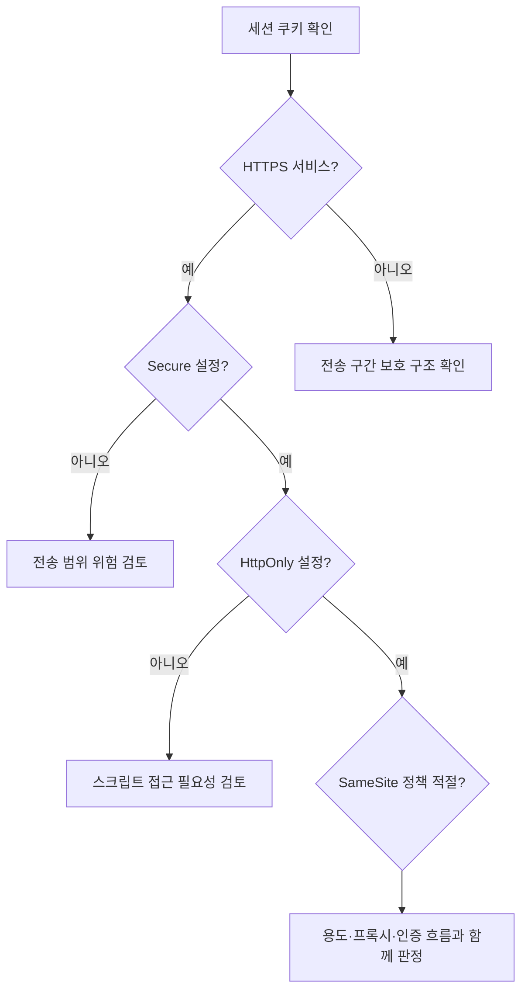
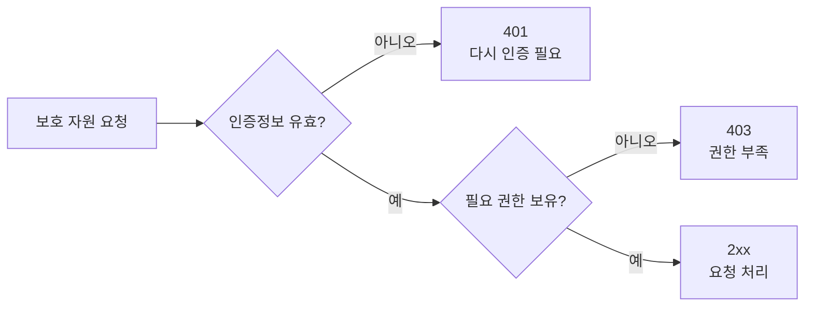

# 07-4. 세션·쿠키·인증

HTTP는 요청 단위의 프로토콜이지만, 웹 애플리케이션은 쿠키와 토큰으로 여러 요청의 상태와 사용자를 연결합니다.



첫 요청에서 인증이 끝나는 것이 아니라, 서버가 발급한 세션 식별자를 이후 요청에 다시 제시하면서 상태가 이어집니다.

## 1. Session

```python
import requests

with requests.Session() as session:
    session.headers.update({"Accept": "application/json"})
    first = session.get(base_url + "/health", timeout=(2, 3))
    second = session.get(base_url + "/api/echo", timeout=(2, 3))
```

`Session`은 쿠키와 공통 설정을 유지하고 같은 호스트의 연결을 재사용할 수 있습니다.

```text
첫 번째 요청  → 쿠키 수신·저장
두 번째 요청  → 저장된 쿠키 자동 전송
같은 호스트   → TCP 연결 풀 재사용 가능
```


`Session`은 로그인 기능 자체가 아닙니다. **쿠키와 공통 설정을 여러 요청에 유지하는 클라이언트 객체**입니다.


## 2. 쿠키

쿠키는 서버가 클라이언트에 저장하도록 전달하는 작은 값입니다. 세션 식별자일 수 있으므로 다음 속성을 이해해야 합니다.

| 속성 | 목적 |
| --- | --- |
| Secure | HTTPS 연결에서만 전송 |
| HttpOnly | JavaScript 접근 제한 |
| SameSite | 교차 사이트 전송 범위 제한 |
| Expires/Max-Age | 유효 기간 제한 |

쿠키 속성이 없다는 사실만으로 즉시 취약점을 확정하지 말고 용도와 서비스 구조를 확인합니다.



## 3. 인증 헤더

```python
import os

token = os.environ["LAB_API_TOKEN"]
headers = {"Authorization": f"Bearer {token}"}
response = requests.get(url, headers=headers, timeout=(2, 3))
```


토큰, 세션 쿠키, 비밀번호를 소스 코드·Notebook 출력·URL 쿼리·Git 기록에 넣지 않습니다. 로그에는 전체 값 대신 존재 여부나 마스킹된 식별자만 남깁니다.


## 4. 401과 403

- `401 Unauthorized`: 인증정보가 없거나 유효하지 않은 상황에 주로 사용
- `403 Forbidden`: 신원은 확인했지만 해당 작업 권한이 없는 상황에 주로 사용

실제 의미는 API 명세와 응답 본문을 함께 확인합니다.



### 민감정보를 제외한 로그 예제

```python
safe_log = {
    "path": "/profile",
    "status": response.status_code,
    "has_authorization": "Authorization" in headers,
    "request_id": response.headers.get("X-Request-ID"),
}
print(safe_log)
```

토큰 값 자체는 남기지 않고 인증정보의 **존재 여부와 요청 식별자**만 기록합니다.

## 5. 로그 작성 원칙

기록할 수 있는 항목:

- 요청 시각과 경로
- 상태 코드와 처리 시간
- 요청 ID
- 재시도 횟수

기록하지 않을 항목:

- Authorization 전체 값
- 세션 쿠키
- 비밀번호와 개인 데이터 원문

---

다음: [07-5. 오류·타임아웃·재시도](07-5-errors-timeouts-retries.md)
