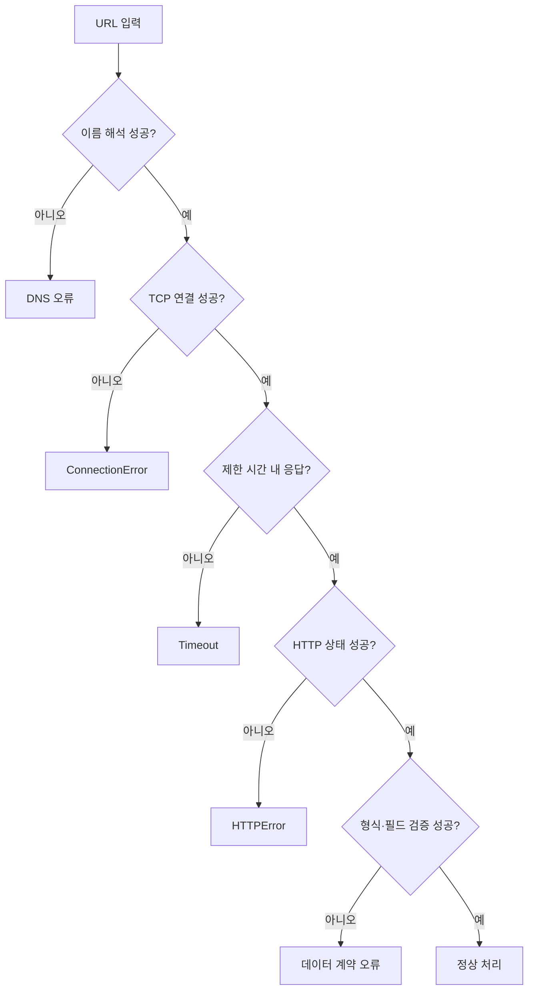
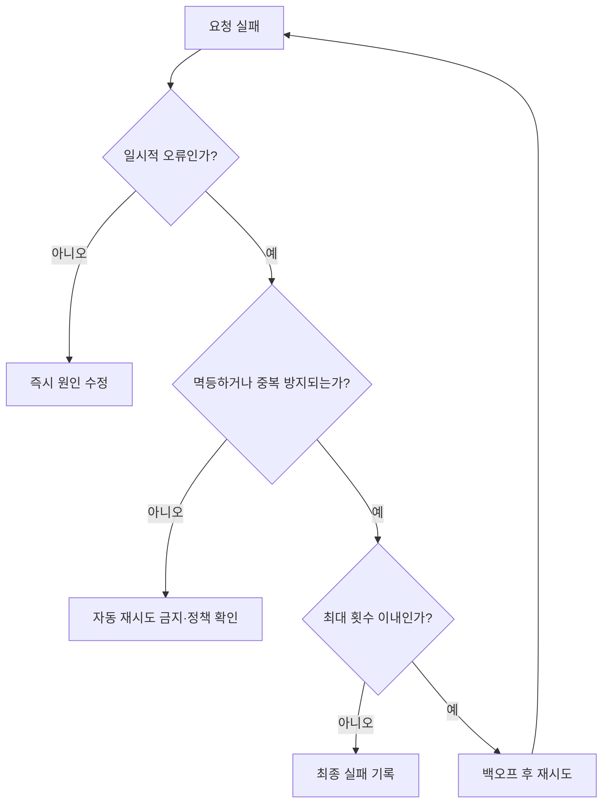
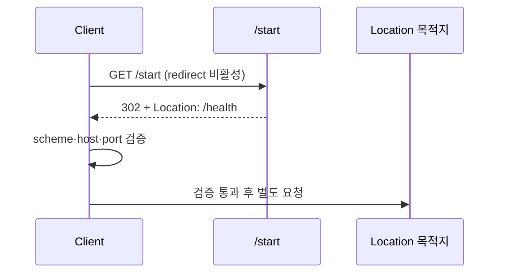

# 07-5. 오류·타임아웃·재시도

네트워크 프로그램은 실패를 예외 상황이 아니라 정상적으로 발생 가능한 상태로 다뤄야 합니다.

## 1. 오류 계층



같은 “API 실패”라도 원인과 대응이 다르므로 단계별로 구분합니다.

## 2. 예외 처리

```python
import requests

try:
    response = requests.get(url, timeout=(2, 3))
    response.raise_for_status()
except requests.Timeout:
    print("연결 또는 응답 시간이 초과되었습니다")
except requests.ConnectionError:
    print("서버에 연결할 수 없습니다")
except requests.HTTPError as error:
    print(f"HTTP 오류: {error.response.status_code}")
except requests.RequestException as error:
    print(f"요청 처리 오류: {error}")
```

## 3. 재시도할 수 있는 경우

일시적인 연결 실패, 일부 `5xx`, 정책에 따른 `429`는 재시도 후보가 될 수 있습니다. 인증 실패나 잘못된 입력처럼 다시 보내도 달라지지 않는 오류는 원인을 수정해야 합니다.

```python
for attempt in range(3):
    try:
        return request_once()
    except requests.Timeout:
        if attempt == 2:
            raise
        time.sleep(2 ** attempt)
```

재시도에는 최대 횟수, 지수 백오프, 전체 작업 제한을 둡니다. POST처럼 중복 실행의 영향이 있는 요청은 멱등성과 API 정책을 먼저 확인합니다.



지수 백오프 예시:

```text
1차 실패 → 1초 대기
2차 실패 → 2초 대기
3차 실패 → 재시도 종료
```

재시도는 오류를 숨기는 기능이 아니라 **일시적인 실패에 한해서 회복 기회를 제한적으로 제공하는 기능**입니다.

## 4. 리다이렉트

Requests는 일반적인 GET 요청의 리다이렉트를 기본적으로 따라갑니다. 보안 점검에서는 목적지를 먼저 확인하도록 자동 이동을 끕니다.

```python
response = requests.get(
    url,
    allow_redirects=False,
    timeout=(2, 3),
)
location = response.headers.get("Location")
```



## 5. 응답 크기 제한

```python
def read_limited(response, max_bytes=1_048_576):
    chunks = []
    size = 0
    for chunk in response.iter_content(8192):
        size += len(chunk)
        if size > max_bytes:
            raise ValueError("응답이 허용 크기를 초과했습니다")
        chunks.append(chunk)
    return b"".join(chunks)
```

`stream=True`와 함께 사용하면 읽는 도중 제한을 적용할 수 있습니다.

## 실습

서버 미실행, 404, 잘못된 JSON, 크기 초과 응답을 각각 만들고 오류 메시지가 원인을 구분하는지 확인합니다.

---

다음: [07-6. HTTP 보안 검증 기초](07-6-http-security-validation.md)
