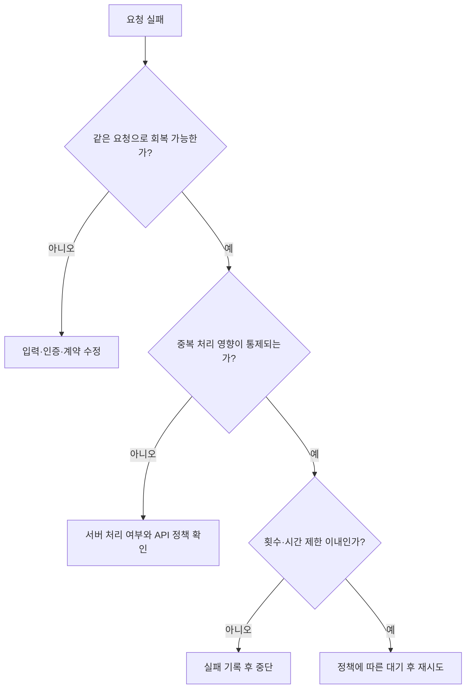

# 07-5. 오류·타임아웃·재시도

> 실습 준비: [이 절의 노트북 보기](../notebooks/07-5-errors-timeouts-retries.ipynb) · [07장 교육자료 ZIP 받기](https://github.com/zxz3650/Python/raw/refs/heads/master/downloads/chapter-07.zip) · [자료 준비·실행 안내](../PRACTICE.md#download)
>
> 07장 ZIP을 새 폴더에 풀고 폴더 구조를 유지한다. 다음 갱신 때도 이 장의 자료 버전이 바뀐 경우에만 다시 받는다.

> **핵심 질문** · 응답을 못 받았거나 기대와 다른 응답을 받았다면, 멈춰야 할까요 아니면 다시 요청해야 할까요?

정상 응답을 읽는 코드만으로는 자동화를 오래 실행할 수 없습니다. 서버 중단, 지연, HTTP 오류, 본문 오류를 구분해야 각 상황에 맞게 복구하거나 중단할 수 있습니다.

## 1. 어느 단계가 실패했는지 찾습니다

| 단계 | 상황 | 처리의 출발점 |
| --- | --- | --- |
| 연결 | 이름 해석·연결 거부 등 | `ConnectionError`, 대상과 서버 상태 확인 |
| 시간 | 연결 또는 읽기가 제한 시간을 넘음 | `Timeout`, 대기 정책 확인 |
| HTTP | 응답은 받았지만 4xx·5xx | `raise_for_status()`가 발생시킨 `HTTPError` |
| 형식 | JSON을 기대했는데 HTML | `Content-Type` 계약 오류 |
| 파싱 | JSON 본문이 잘렸거나 문법이 잘못됨 | `JSONDecodeError` |
| 데이터 | 필수 값 누락·자료형 오류 | 직접 구현한 계약 검증 오류 |

응답이 없으면 헤더의 존재 여부도 판정할 수 없습니다. “요청 실패”와 “헤더 누락”을 같은 결과로 기록하지 않습니다.

## 2. 예외를 사용자 메시지로 연결합니다

### 실행: 없는 경로 요청 — 로컬 서버 사용

```python
import requests

url = "http://127.0.0.1:8080/missing"
try:
    with requests.get(url, timeout=(2, 3), allow_redirects=False) as response:
        response.raise_for_status()
        print("수신한 상태:", response.status_code)
except requests.Timeout:
    print("연결 또는 읽기 대기 시간이 초과되었습니다")
except requests.ConnectionError:
    print("연결 실패: 서버 실행 여부와 주소·포트를 확인하세요")
except requests.HTTPError as error:
    print("HTTP 오류:", error.response.status_code)
except requests.RequestException as error:
    print("그 밖의 요청 오류:", type(error).__name__)
```

서버가 실행 중이면 `HTTP 오류: 404`가 나옵니다. 서버를 종료한 뒤 같은 코드를 실행하면 연결 실패로 분류됩니다. 예외 이름만으로 실제 장애 원인을 확정하지 말고, 해당 계층부터 조사합니다.

이 코드는 오류 분류를 보여 주며 JSON 계약을 검사하지 않습니다. 전체 검사에서는 07-3의 상태·형식·문법·필드 확인을 연결합니다.

## 3. timeout은 전체 실행 시간과 다릅니다

```text
timeout=(2, 3)
         │  └ 읽기 대기 제한: 서버 데이터 수신을 기다리는 시간
         └ 연결 대기 제한: 연결을 설정하는 시간
```

읽기 제한은 요청 전체의 총 소요 시간 상한이 아닙니다. 응답이 조금씩 계속 도착하거나 여러 번 재시도하면 총 실행 시간이 길어질 수 있습니다. 자동화 작업에는 별도의 전체 기한과 종료 정책도 필요합니다.

## 4. 재시도는 제한된 복구 정책입니다



**멱등성**은 동일 요청을 반복해도 의도한 서버 상태 변화가 한 번 수행한 것과 같다는 성질입니다. 요청을 보낸 뒤 응답만 유실될 수도 있으므로 “응답을 못 받음”이 “서버가 처리하지 않음”을 뜻하지는 않습니다. 데이터 생성 등 중복 영향이 있는 요청은 무조건 다시 보내지 않습니다.

### 실행: 통신 없이 재시도 흐름 관찰

다음은 처음 두 번 실패하고 세 번째에 성공하는 모의 함수입니다. 실제 요청은 보내지 않으며, 수업 중 빠르게 확인하도록 기다릴 시간만 출력합니다.

```python
import requests


def retry_timeout(request_once, pause, max_attempts=3):
    if max_attempts < 1:
        raise ValueError("최대 시도 횟수는 1 이상이어야 합니다")
    for attempt in range(max_attempts):
        try:
            return request_once()
        except requests.Timeout:
            if attempt == max_attempts - 1:
                raise
            pause(2 ** attempt)


attempts = iter([False, False, True])


def simulated_request():
    if not next(attempts):
        raise requests.Timeout("학습용 지연")
    return "성공"


result = retry_timeout(simulated_request, lambda seconds: print("대기 계획:", seconds, "초"))
print(result)
```

```text
대기 계획: 1 초
대기 계획: 2 초
성공
```

이 함수는 타임아웃 재시도 구조만 보여 줍니다. 운영 정책에는 전체 기한, 대기 상한, 중복 처리 방지, 종료 시점의 기록이 더 필요합니다. `429`와 일부 `5xx`는 API 정책에 따른 재시도 후보이며, `Retry-After`가 있으면 허용된 대기 범위와 함께 판단합니다. `401`이나 잘못된 JSON 계약은 반복 요청만으로 해결되지 않습니다.

## 5. 리다이렉트는 다른 요청으로 이어질 수 있습니다

리다이렉트는 서버가 `Location`으로 이동할 위치를 알려 주는 응답입니다. 자동으로 따라가면 최초의 `302` 대신 최종 응답만 보게 될 수 있습니다.

```python
import requests

with requests.get(
    "http://127.0.0.1:8080/redirect",
    allow_redirects=False,
    timeout=(2, 3),
) as response:
    print(response.status_code)
    print(response.headers.get("Location"))
```

```text
302
/health
```

이 예제는 이동 안내를 읽고 끝납니다. 목적지의 scheme·host·port가 허용된 범위인지 확인하는 원칙은 다음 절에서 설명합니다.

## 6. 본문을 읽는 동안 크기를 제한합니다

`.text`나 `.json()`에 접근하기 전에 이미 큰 본문을 모두 내려받았다면 그 뒤의 길이 검사로 수신 메모리를 제한할 수 없습니다. `stream=True`로 응답을 열고 청크를 읽으면서 누적량을 확인합니다.

```python
import requests


def read_limited(response, max_bytes=1_048_576):
    chunks = []
    size = 0
    for chunk in response.iter_content(chunk_size=8192):
        size += len(chunk)
        if size > max_bytes:
            raise ValueError("응답이 허용 크기를 초과했습니다")
        chunks.append(chunk)
    return b"".join(chunks)


with requests.get(
    "http://127.0.0.1:8080/health",
    timeout=(2, 3),
    allow_redirects=False,
    stream=True,
) as response:
    response.raise_for_status()
    body = read_limited(response)
    print(type(body).__name__, len(body) <= 1_048_576)
```

```text
bytes True
```

1 MiB는 `1,048,576`바이트입니다. 실제 읽은 청크를 기준으로 제한하며, 압축이 있다면 Requests가 풀어 준 본문 크기가 누적됩니다. 이 방식도 청크·라이브러리 버퍼와 마지막 결합에 메모리를 사용하므로 프로세스 메모리의 정확한 상한을 뜻하지 않습니다.

## 직접 확인하기

| 실험 | 실행 방법 | 기대 분류 |
| --- | --- | --- |
| 없는 경로 | 2절 예제 실행 | HTTP 오류 `404` |
| 서버 중단 | 서버를 종료하고 2절 예제 재실행 | 연결 실패 |
| JSON 문법 오류 | `json.loads('{"status":')`를 예외 처리 | JSON 파싱 오류; 서버 불필요 |
| 작은 읽기 한도 | 서버를 다시 시작하고 `read_limited(response, max_bytes=8)` 실행 | 크기 초과 `ValueError` |

제공 서버에 지연·대용량·잘못된 JSON 전용 경로는 없습니다. 위 실험은 서버를 임의로 바꾸지 않고 실패 지점을 구분하도록 구성했습니다.

<details>
<summary>확인 문제: 데이터 생성 요청에서 타임아웃이 났으면 바로 다시 보내도 될까요?</summary>

서버가 처리한 뒤 응답만 도착하지 않았을 수 있습니다. 중복 실행의 영향과 API의 중복 방지·처리 상태 확인 정책을 확인한 뒤 판단합니다.

</details>

## 정리와 다음 단계

- [ ] 연결·HTTP·파싱·데이터 오류를 구분합니다.
- [ ] 타임아웃과 전체 기한을 구분합니다.
- [ ] 재시도 횟수와 대기를 제한하고 중복 영향을 설명합니다.
- [ ] 스트리밍 수신 중 크기를 확인합니다.

다음 절에서는 실패 처리까지 갖춘 요청 결과를 어떤 근거로 기록할지 살펴봅니다.

참고: [Requests — 타임아웃](https://requests.readthedocs.io/en/latest/user/quickstart/#timeouts), [Requests — 스트리밍 응답](https://requests.readthedocs.io/en/latest/user/advanced/#body-content-workflow)

---

이전: [07-4. 세션·쿠키·인증](07-4-sessions-cookies-auth.md) · 다음: [07-6. HTTP 보안 검증 기초](07-6-http-security-validation.md)
