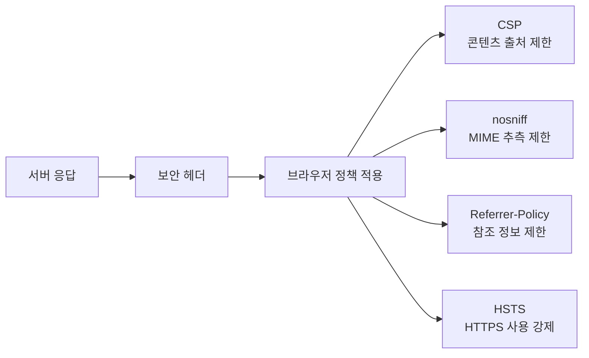
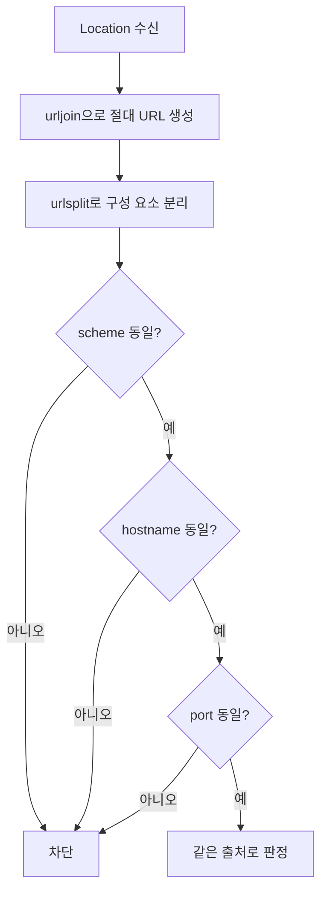

# 07-6. HTTP 보안 검증 기초

> 실습 준비: [이 절의 노트북 보기](../notebooks/07-6-http-security-validation.ipynb) · [07장 교육자료 ZIP 받기](https://github.com/zxz3650/Python/raw/refs/heads/master/downloads/chapter-07.zip) · [자료 준비·실행 안내](../PRACTICE.md#download)
>
> 07장 ZIP을 새 폴더에 풀고 폴더 구조를 유지한다. 다음 갱신 때도 이 장의 자료 버전이 바뀐 경우에만 다시 받는다.

> **핵심 질문** · 관찰한 응답으로 무엇을 확인할 수 있고, 어떤 판단에는 근거가 더 필요할까요?

앞 절까지는 응답을 읽고 잘못된 데이터를 구분했습니다. 보안 점검에서는 여기에 **검사 목적과 근거 기록**을 더합니다. 이 절은 제공 로컬 서버의 응답 계약과 기본 설정을 관찰하고, 확인한 사실과 판단의 한계를 구분하는 연습입니다.


검사의 순서가 중요한 이유는 앞 단계가 실패하면 뒤 단계의 결과를 신뢰하기 어렵기 때문입니다. 예를 들어 TCP 연결이 되지 않았다면 보안 헤더가 “누락”된 것이 아니라 **응답 자체를 받지 못한 것**입니다.

## 1. 점검 질문을 먼저 정한다

| 관점 | 질문 | 확인 정보 |
| --- | --- | --- |
| 연결성 | 지정 호스트·포트에 연결되는가? | TCP 연결 결과·시간 |
| 프로토콜 | 예상 메서드와 상태인가? | method·status |
| 데이터 | JSON 형식과 필수 필드가 맞는가? | Content-Type·schema |
| 브라우저 보호 | 기본 보안 헤더가 있는가? | 응답 헤더 |
| 이동 경로 | 리다이렉트가 허용된 출처로 향하는가? | Location |
| 안정성 | 무한 대기·과도한 응답을 막는가? | timeout·크기 제한 |

## 2. 주요 보안 헤더

07-1에서 헤더는 본문을 설명하거나 처리 조건을 전달하는 정보라고 배웠습니다. 보안 헤더는 그중 브라우저에 콘텐츠·참조 정보·연결 정책을 알리는 항목입니다. 따라서 JSON의 필드 검증과 별도로 헤더를 읽습니다.

| 헤더 | 학습 관점의 확인 목적 |
| --- | --- |
| Content-Security-Policy | 브라우저가 로드할 콘텐츠 출처 제한 |
| X-Content-Type-Options | MIME 추측 방지 설정 확인 |
| Referrer-Policy | 다른 사이트로 전달되는 참조 정보 범위 확인 |
| Strict-Transport-Security | HTTPS 사용 강제 정책 확인 |

HSTS는 HTTPS 서비스에서 의미가 있습니다. 로컬 HTTP 실습에서 없다는 결과는 취약점 확정이 아니라 “운영 HTTPS 환경에서 별도 확인” 항목입니다.

### 브라우저에서 헤더가 작동하는 위치



헤더는 서버에서 보내지만 정책을 실제로 적용하는 주체는 주로 브라우저입니다. API 전용 클라이언트에서는 같은 헤더의 의미가 달라질 수 있습니다.

## 3. 같은 출처 리다이렉트 검증

**출처(origin)**는 scheme·host·port의 조합입니다. 07-5에서 읽은 `Location: /health`를 기준 URL과 합친 뒤 구성 요소를 비교합니다. 다음 예제는 URL 문자열만 비교하며 요청을 보내지 않습니다.

```python
from urllib.parse import urljoin, urlsplit

base_url = "http://127.0.0.1:8080"
location = "/health"
destination = urlsplit(urljoin(base_url, location))
base = urlsplit(base_url)

# 생략된 기본 포트와 명시한 기본 포트를 같은 값으로 비교합니다.
default_ports = {"http": 80, "https": 443}
destination_port = destination.port if destination.port is not None else default_ports.get(destination.scheme)
base_port = base.port if base.port is not None else default_ports.get(base.scheme)
same_origin = (
    destination.scheme == base.scheme
    and destination.hostname == base.hostname
    and destination_port == base_port
)
print(same_origin)  # True
```

문자열의 접두사만 비교하면 `trusted.example.evil.test` 같은 다른 호스트를 잘못 허용할 수 있습니다. 파싱 후 scheme, host, port를 비교합니다.



## 4. 판정과 근거 분리

서버가 보낸 JSON을 읽는 것에서 한 단계 나아가, 이제 **우리가 만든 점검 결과도 JSON으로 저장**합니다. 반복 결과를 배열로 모으고 다른 프로그램이 판정·근거 필드를 읽을 수 있기 때문입니다. 04장의 JSON 파일 저장이 07장의 HTTP 관찰 결과와 연결되는 지점입니다.

```json
{
  "check": "security_headers",
  "status": "warning",
  "evidence": "X-Content-Type-Options header is missing",
  "recommendation": "응답에 nosniff 정책 적용을 검토"
}
```

보고서에는 점검 대상, 시각, 검사 규칙, 관찰값, 판정, 권고를 남깁니다. 헤더 하나가 없다는 사실만으로 공격 성공이나 침해를 의미하지 않습니다.

| 구분 | 예 | 해석 |
| --- | --- | --- |
| 관찰값 | 응답에 `X-Content-Type-Options`가 없음 | 응답에서 직접 확인한 사실 |
| 판정 | `warning` | 이번 실습의 검사 규칙에 따른 분류 |
| 추가 확인 | HTML 제공 여부·프록시 설정 등 | 실제 서비스에 미치는 영향 판단에 필요한 맥락 |

위 JSON의 `recommendation`은 권고를 덧붙인 설계 예입니다. 07-7의 제공 점검기는 개별 결과에 `check`, `status`, `evidence`를 기록합니다.

## 5. 범위 통제

종합 실습의 검증기는 입력 URL을 파싱하고 해석된 모든 IP가 loopback인지 확인합니다. 외부 호스트나 사용자정보가 포함된 URL은 실행 전에 거부합니다.

다음은 제공 코드의 검사 조건을 발췌한 부분입니다. `hostname`과 `resolved`를 구하는 과정을 포함한 전체 함수는 07-7에서 읽습니다. 이 블록만 단독 실행하는 예제는 아닙니다.

```python
allowed_hosts = {"127.0.0.1", "localhost", "::1"}

if hostname not in allowed_hosts:
    raise ValueError("외부 호스트는 허용하지 않습니다")

if not all(ipaddress.ip_address(ip).is_loopback for ip in resolved):
    raise ValueError("loopback 주소만 허용합니다")
```

호스트 이름의 허용 목록과 실제 해석된 IP 주소를 모두 확인해 **요청을 보내기 전** 범위를 통제합니다.


실무 도구로 확장할 때는 기술적 제한만 제거하지 말고 승인된 자산 목록, 점검 시간, 요청률, 담당자, 증적 보존 기준을 먼저 설계합니다.


## 직접 확인하기

1. 응답을 받지 못한 상황을 “보안 헤더 누락”으로 쓰면 왜 부정확한지 설명합니다.
2. `Location`이 `/health`일 때와 포트가 다른 로컬 URL일 때 출처 비교 결과를 확인합니다. 문자열 비교만 수행합니다.
3. 헤더 누락 한 건을 관찰값·판정·추가 확인 항목으로 나누어 기록합니다.

<details>
<summary>해설 확인</summary>

응답이 없으면 헤더도 관찰하지 못했으므로 연결·요청 실패로 기록합니다. 출처 비교에서는 포트가 다르면 같은 호스트라도 다른 출처입니다. 헤더 누락은 확인한 사실이지만 실제 위험과 조치 우선순위에는 서비스 맥락이 더 필요합니다.

</details>

## 정리와 다음 단계

- [ ] JSON 본문 검증과 보안 헤더 관찰의 목적을 구분합니다.
- [ ] 출처의 세 구성 요소를 설명합니다.
- [ ] 근거·판정·추가 확인 사항을 나누어 기록합니다.

다음 절에서는 기존 학습 코드를 조합한 점검기를 실행하고 실제 보고서를 읽습니다.

---

이전: [07-5. 오류·타임아웃·재시도](07-5-errors-timeouts-retries.md) · 다음: [07-7. 로컬 네트워크·웹 보안 점검 프로젝트](07-7-local-web-security-project.md)
