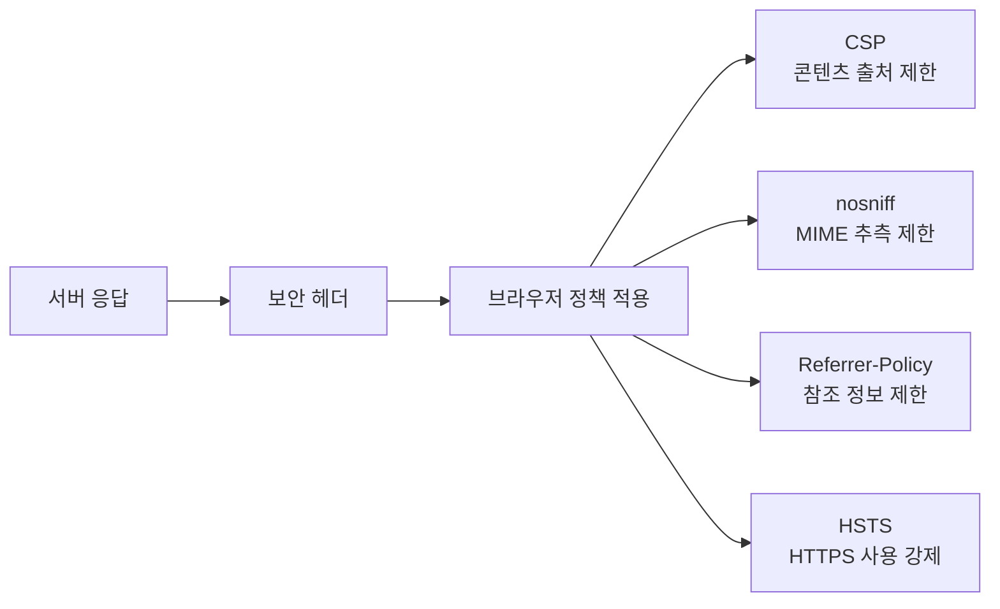
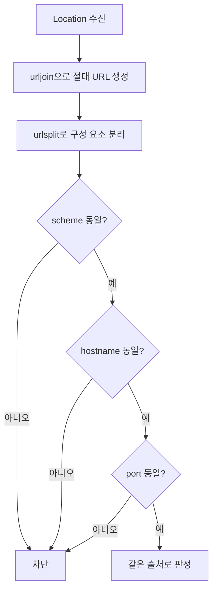

# 07-6. HTTP 보안 검증 기초

이 절의 목표는 취약점을 악용하는 것이 아니라, 허가된 웹 서비스의 기본 보안 설정과 응답 계약을 재현 가능하게 확인하는 것입니다.


검사의 순서가 중요한 이유는 앞 단계가 실패하면 뒤 단계의 결과를 신뢰하기 어렵기 때문입니다. 예를 들어 TCP 연결이 되지 않았다면 보안 헤더가 “누락”된 것이 아니라 **응답 자체를 받지 못한 것**입니다.

## 1. 점검 질문을 먼저 정한다

| 관점 | 질문 | 확인 정보 |
| --- | --- | --- |
| 연결성 | 지정 호스트·포트에 연결되는가? | TCP 연결 결과·시간 |
| 프로토콜 | 예상 메서드와 상태인가? | method·status |
| 데이터 | JSON 형식과 필수 필드가 맞는가? | Content-Type·schema |
| 브라우저 보호 | 기본 보안 헤더가 있는가? | 응답 헤더 |
| 이동 경로 | 리다이렉트가 허용된 출처로 향하는가? | Location |
| 안정성 | 무한 대기·과도한 응답을 막는가? | timeout·크기 제한 |

## 2. 주요 보안 헤더

| 헤더 | 학습 관점의 확인 목적 |
| --- | --- |
| Content-Security-Policy | 브라우저가 로드할 콘텐츠 출처 제한 |
| X-Content-Type-Options | MIME 추측 방지 설정 확인 |
| Referrer-Policy | 다른 사이트로 전달되는 참조 정보 범위 확인 |
| Strict-Transport-Security | HTTPS 사용 강제 정책 확인 |

HSTS는 HTTPS 서비스에서 의미가 있습니다. 로컬 HTTP 실습에서 없다는 결과는 취약점 확정이 아니라 “운영 HTTPS 환경에서 별도 확인” 항목입니다.

### 브라우저에서 헤더가 작동하는 위치



헤더는 서버에서 보내지만 정책을 실제로 적용하는 주체는 주로 브라우저입니다. API 전용 클라이언트에서는 같은 헤더의 의미가 달라질 수 있습니다.

## 3. 같은 출처 리다이렉트 검증

```python
from urllib.parse import urljoin, urlsplit

destination = urlsplit(urljoin(base_url, location))
base = urlsplit(base_url)

same_origin = (
    destination.scheme == base.scheme
    and destination.hostname == base.hostname
    and destination.port == base.port
)
```

문자열의 접두사만 비교하면 `trusted.example.evil.test` 같은 다른 호스트를 잘못 허용할 수 있습니다. 파싱 후 scheme, host, port를 비교합니다.



## 4. 판정과 근거 분리

```json
{
  "check": "security_header",
  "result": "warning",
  "evidence": "X-Content-Type-Options header is missing",
  "recommendation": "응답에 nosniff 정책 적용을 검토"
}
```

보고서에는 점검 대상, 시각, 검사 규칙, 관찰값, 판정, 권고를 남깁니다. 헤더 하나가 없다는 사실만으로 공격 성공이나 침해를 의미하지 않습니다.

## 5. 범위 통제

종합 실습의 검증기는 입력 URL을 파싱하고 해석된 모든 IP가 loopback인지 확인합니다. 외부 호스트나 사용자정보가 포함된 URL은 실행 전에 거부합니다.

```python
allowed_hosts = {"127.0.0.1", "localhost", "::1"}

if hostname not in allowed_hosts:
    raise ValueError("외부 호스트는 허용하지 않습니다")

if not all(ipaddress.ip_address(ip).is_loopback for ip in resolved):
    raise ValueError("loopback 주소만 허용합니다")
```

호스트 이름의 허용 목록과 실제 해석된 IP 주소를 모두 확인해 **요청을 보내기 전** 범위를 통제합니다.


실무 도구로 확장할 때는 기술적 제한만 제거하지 말고 승인된 자산 목록, 점검 시간, 요청률, 담당자, 증적 보존 기준을 먼저 설계합니다.


---

다음: [07-7. 로컬 네트워크·웹 보안 점검 프로젝트](07-7-local-web-security-project.md)
