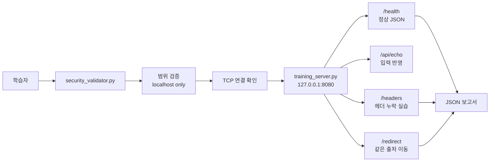
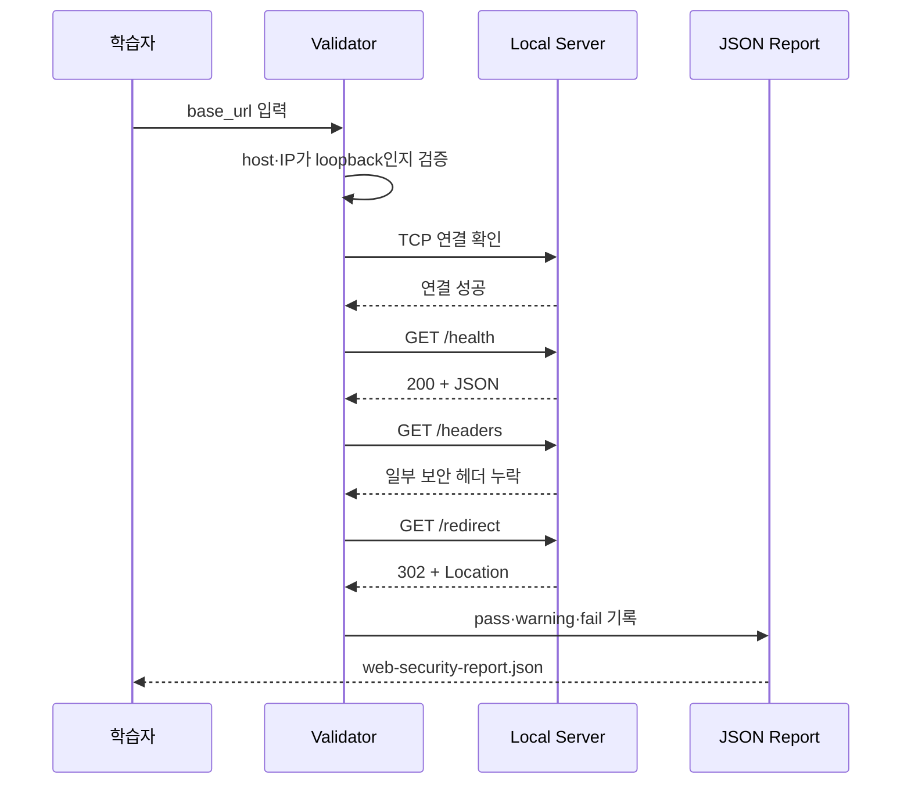
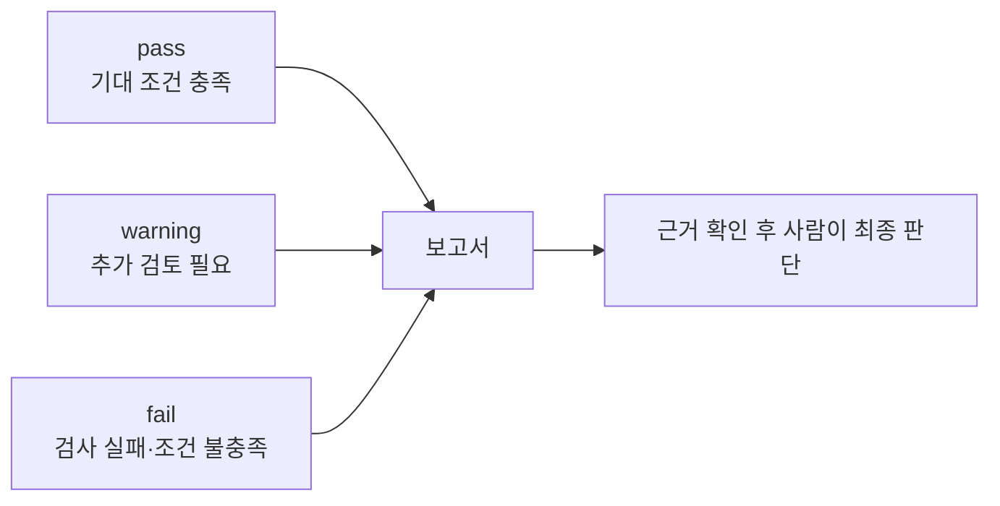

# 07-7. 로컬 네트워크·웹 보안 점검 프로젝트

> **핵심 질문** · HTTP로 받은 데이터와 우리가 만든 점검 결과를 어떻게 연결해 설명할까요?

06장의 TCP 연결 확인과 07장의 HTTP 검증을 결합합니다. 학습용 서버를 `127.0.0.1`에서 실행하고, 점검기가 연결성·응답 계약·보안 헤더·리다이렉트를 확인해 JSON 보고서를 만듭니다.

## 이번 프로젝트에서 JSON이 등장하는 두 위치

| 위치 | 누가 만드는가? | 왜 JSON을 쓰는가? |
| --- | --- | --- |
| `/health` 응답 본문 | 학습 서버 | 클라이언트가 `status` 필드를 읽도록 서비스 상태 전달 |
| 점검 보고서 파일 | Python 점검기 | 검사별 판정·근거를 목록으로 저장하고 요약 건수 계산 |

**서버 JSON을 그대로 저장하는 작업은 아닙니다.** 응답을 검사해 새 결과를 만든 뒤 그 결과를 JSON 파일로 저장합니다. “통신 → 파싱 → 검증 → 기록”이 하나의 흐름으로 이어집니다.


## 🧭 프로젝트 목표

- 소켓과 HTTP 라이브러리의 역할을 구분합니다.
- 점검 관점과 구현 코드를 연결해 설명합니다.
- 안전 경계를 코드로 강제합니다.
- 관찰 결과와 취약점 확정을 구분합니다.


## 실습 코드

- [`training_server.py`](https://github.com/zxz3650/Python/blob/master/examples/07-local-web-security-lab/training_server.py)
- [`security_validator.py`](https://github.com/zxz3650/Python/blob/master/examples/07-local-web-security-lab/security_validator.py)

## 1. 프로젝트 구조



## 2. 점검 관점과 코드 연결

| 점검 관점 | 구현 코드 | 결과 해석 |
| --- | --- | --- |
| 대상 범위 | `validate_loopback_url()` | 외부 주소면 요청 전 중단 |
| 네트워크 연결 | `check_tcp_connection()` | 06장의 socket 연결 확인 |
| API 계약 | `check_health()` | 상태·형식·필수 값 검증 |
| 헤더 정책 | `check_security_headers()` | 누락 헤더를 warning으로 기록 |
| 이동 경로 | `check_redirect()` | scheme·host·port가 같은지 확인 |
| 자원 제한 | timeout, `read_limited()` | 무한 대기·과도한 응답 방지 |

07-3에서 작성한 `validate_health()`는 서비스 이름의 자료형과 빈 값까지 검사했습니다. 제공 점검기의 `check_health()`는 학습용 최소 구현으로 `200`, JSON 미디어 타입 포함 여부, 객체의 `status=ok`를 확인합니다. 두 검사의 범위가 같지는 않습니다. 코드 읽기 과제에서는 어떤 조건이 더 필요한지 비교해 봅니다.

또한 보안 헤더 검사는 기대한 헤더 이름의 존재 여부를 확인합니다. 정책 값의 적절성이나 브라우저에서의 실제 효과까지 검증한 결과는 아닙니다.

### 한 번의 실행에서 일어나는 일



## 3. 실행

의존성을 설치합니다.

```bash
python -m pip install -r requirements.txt
```

첫 번째 터미널에서 서버를 실행합니다.

앞 절의 실습 서버를 계속 실행 중이라면 다시 시작하지 않고 그대로 사용합니다.

```bash
python examples/07-local-web-security-lab/training_server.py
```

두 번째 터미널에서 점검기를 실행합니다.

```bash
python examples/07-local-web-security-lab/security_validator.py \
  http://127.0.0.1:8080
```

기본 보고서는 `web-security-report.json`에 저장됩니다.

같은 경로로 실행하면 기존 보고서를 덮어씁니다. 비교할 결과를 보관하려면 `--output report-run-02.json`처럼 새 파일명을 지정합니다. 출력의 상위 폴더는 미리 존재해야 합니다.

### 핵심 코드 읽기

다음은 전체 프로그램에서 처리 순서를 발췌한 코드입니다. 함수 정의와 `base_url`은 제공 파일에 있으므로 이 블록을 단독 실행하지 않습니다.

```python
host, port, normalized = validate_loopback_url(base_url)
checks = [check_tcp_connection(host, port)]

with requests.Session() as session:
    checks.extend([
        check_health(session, normalized),
        check_security_headers(session, normalized),
        check_redirect(session, normalized),
    ])
```

코드의 실행 순서는 위 시퀀스 다이어그램과 같습니다. 먼저 대상을 제한하고 TCP 연결을 확인한 뒤, HTTP 검사를 작은 함수 단위로 실행합니다.

## 4. 예상 결과

- TCP 연결: pass
- `/health` JSON 계약: pass
- `/headers` 보안 헤더: warning
- `/redirect` 같은 출처 이동: pass

`warning`은 프로젝트가 의도적으로 만든 누락 설정을 발견한 결과입니다. 실제 환경에서는 애플리케이션 용도, 프록시, HTTPS 종단 위치를 함께 확인해야 합니다.

예상 보고서의 발췌본입니다. 아래에는 전체 검사 4건 중 2건만 표시했으며, 실제 파일에는 `checked_at`과 나머지 검사 결과도 들어 있습니다.

```json
{
  "target": "http://127.0.0.1:8080",
  "scope": "loopback-only training lab",
  "summary": {"pass": 3, "warning": 1, "fail": 0},
  "checks": [
    {
      "check": "tcp_connection",
      "status": "pass",
      "evidence": "connected to 127.0.0.1:8080"
    },
    {
      "check": "security_headers",
      "status": "warning",
      "evidence": "missing: Content-Security-Policy, X-Content-Type-Options, Referrer-Policy"
    }
  ]
}
```



`warning`과 `fail`은 침해 확정이 아니라 관찰된 사실을 분류한 값입니다.

### 실행: 보고서 파일을 Python으로 다시 읽기

기본 출력 경로로 점검한 뒤 같은 작업 폴더에서 실행합니다.

```python
import json
from pathlib import Path

report = json.loads(Path("web-security-report.json").read_text(encoding="utf-8"))
print(report["summary"])
print("검사 수:", len(report["checks"]))
print("건수 일치:", sum(report["summary"].values()) == len(report["checks"]))
```

```text
{'pass': 3, 'warning': 1, 'fail': 0}
검사 수: 4
건수 일치: True
```

이번에는 HTTP의 `response.json()` 대신 파일 내용을 `json.loads()`로 읽었습니다. 입력 경로는 다르지만 결과가 Python 객체라는 점은 같습니다. 제공 프로그램은 보고서 작성에 성공하면 검사에 `fail`이 있어도 정상 종료할 수 있으므로 자동화에서는 종료 코드뿐 아니라 `summary`의 실패 건수도 확인합니다.

## 5. 안전장치 확인

```bash
python examples/07-local-web-security-lab/security_validator.py \
  https://example.com
```

외부 주소는 요청을 보내기 전에 거부되어야 합니다. `localhost`가 다른 주소로 바뀌도록 hosts/DNS 설정을 조작한 경우에도 해석된 주소가 loopback인지 재확인합니다.

## 6. 분석 질문

1. TCP 연결이 성공했는데 `/health`가 500이면 어느 계층의 문제인가요?
2. Content-Type이 JSON이지만 본문 파싱이 실패하면 무엇을 기록해야 하나요?
3. 보안 헤더 누락을 즉시 취약점으로 확정하면 안 되는 이유는 무엇인가요?
4. 리다이렉트를 자동으로 따르기 전에 목적지를 확인하는 이유는 무엇인가요?

<details>
<summary>해설 확인</summary>

1. TCP 연결 이후 HTTP 서버 처리 단계의 문제입니다. 연결 성공이 API 성공을 보장하지 않습니다.
2. 본문 형식을 JSON이라고 선언했지만 파싱할 수 없었다는 사실을 기록합니다. 민감한 본문 원문은 그대로 로그에 남기지 않습니다.
3. 헤더의 목적과 서비스 종류, 프록시·HTTPS 구조에 따라 영향이 달라질 수 있기 때문입니다.
4. 처음 정한 대상 범위를 벗어나는 요청을 막고 이동 응답 자체를 관찰하기 위해서입니다.

</details>

## 7. 확장 과제

1. 점검별 처리 시간을 보고서에 추가합니다.
2. 서버 미실행·잘못된 JSON·응답 지연 테스트를 추가합니다.
3. 예상 상태와 헤더 정책을 별도 JSON 설정 파일로 분리합니다.
4. 08장에서 CLI 옵션과 `logging`을 추가합니다.
5. 09장에서 서버를 별도 프로세스로 실행하지 않는 pytest를 작성합니다.


이 프로젝트는 로컬 학습용입니다. 외부 주소 허용, 주소 범위 반복, 인증 추측, 공격 페이로드 전송 기능을 추가하지 않습니다. 실무 점검은 명시적인 승인과 범위 통제 아래 수행합니다.


## 완료 기준

- [ ] 서버와 점검기를 서로 다른 터미널에서 실행할 수 있습니다.
- [ ] 외부 URL이 요청 전에 거부되는 것을 확인했습니다.
- [ ] TCP·HTTP·데이터 검증 실패를 구분할 수 있습니다.
- [ ] warning의 근거와 추가 확인 사항을 설명할 수 있습니다.
- [ ] JSON 보고서를 재실행해 같은 구조로 생성할 수 있습니다.

---

다음 장: [08. 시스템 자동화](../08-system-automation.md)
