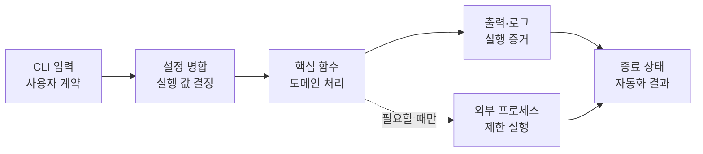

# 08. 시스템 자동화

앞 장에서 만든 프로그램을 터미널에서 반복 실행할 수 있는 도구로 발전시킨다. 명령줄 입력, 설정, 환경 변수, 종료 상태와 실행 로그를 하나의 실행 계약으로 묶고, 필요한 경우에만 외부 프로세스를 제한적으로 호출한다. 마지막에는 07장의 로컬 HTTP 점검기에 이러한 요소를 적용해 재현 가능한 명령줄 도구를 완성한다.


### 🧭 학습 목표

- 명령줄 입력과 Python 함수의 입력을 분리한다.
- 성공·입력 오류·실행 실패를 종료 상태로 구분한다.
- 기본값·설정 파일·환경 변수·CLI의 우선순위를 설계한다.
- 비밀값을 코드와 로그에서 분리한다.
- 로그 수준과 출력 대상을 목적에 맞게 선택한다.
- 외부 프로세스를 고정된 프로그램과 검증된 인자로 실행한다.
- 기존 프로그램을 설치·실행·검증 가능한 CLI 도구로 발전시킨다.


## 선행 지식

- 03-5의 함수와 반환값, 03-6의 예외 처리, 03-7의 모듈·패키지와 `python -m` 실행을 이해해야 한다.
- 04장의 경로 검증, JSON 읽기·쓰기와 안전한 출력 방법을 사용할 수 있어야 한다.
- 07장의 URL 검증, HTTP 타임아웃과 로컬 HTTP 점검기 구조를 이해해야 한다.

## 이 장의 범위

시스템 자동화는 운영체제의 모든 기능을 배우는 과정이 아니다. 이 장에서는 **이미 작성한 Python 프로그램을 사람이 반복해서 사용할 수 있는 도구로 만드는 경계**에 집중한다.

| 구분 | 이 장에서 다루는 내용 | 연결되는 선행·후속 과정 |
| --- | --- | --- |
| 입력 경계 | CLI 인자, 도움말, 입력 검증 | 03장의 함수·예외를 외부 입력에 적용 |
| 실행 설정 | 기본값, JSON 설정, 환경 변수, CLI 우선순위 | 04장의 JSON과 경로 처리 재사용 |
| 실행 증거 | 로그 수준, 출력 대상, 민감정보 제외 | 09장의 실패 재현과 디버깅으로 연결 |
| 운영체제 연동 | 제한된 외부 프로세스 실행 | 필요한 경우에만 선택적으로 사용 |
| 도구화 | 07장 점검기에 CLI·설정·로그·종료 상태 추가 | 09장의 pytest와 10장의 구조화로 확장 |

다음 내용은 이 장에서 다시 설명하지 않는다.

- 파일 생성·복사·이동·삭제와 작업 범위 검증: 04-1~04-2에서 학습했다.
- 파일 해시와 메타데이터 분석: 04-9 파일 분석기에서 학습했다.
- 예약 실행, 스프레드시트·문서·GUI 자동화: 보충 과정인 13장에서 다룬다.
- 셸 스크립트 문법과 운영체제 관리 명령: 이 Python 기본과정의 범위가 아니다.

## 학습 우선순위

| 구분 | 내용 | 학습 판단 |
| --- | --- | --- |
| 필수 | CLI, 종료 상태, 설정 우선순위, 환경 변수, 로깅 | 종합 실습에 직접 적용한다. |
| 권장 | 설정 파일 경로 검증, stdout·stderr 분리, 비밀값 비기록 | 오류 대응과 운영 안전성을 높인다. |
| 선택 | `subprocess`로 외부 프로그램 실행 | 실제 자동화 과제에서 필요할 때 적용한다. |

`subprocess`는 시스템 자동화의 전부가 아니며 모든 학습자에게 필요한 기능도 아니다. 외부 프로그램을 호출해야 하는 명확한 요구가 있을 때만 사용하고, 종합 실습의 필수 기능에는 포함하지 않는다.

## 학습 순서

1. [08-1. 명령줄 인터페이스와 종료 상태](08-system-automation/08-1-cli-exit-status.md)
2. [08-2. 설정 우선순위와 환경 변수](08-system-automation/08-2-configuration-environment.md)
3. [08-3. 실행 로그와 관찰 가능성](08-system-automation/08-3-logging-observability.md)
4. [08-4. 안전한 외부 프로세스 실행](08-system-automation/08-4-safe-subprocess.md)
5. [08-5. 로컬 HTTP 점검기 도구화 프로젝트](08-system-automation/08-5-toolization-project.md)

### 이 순서로 학습하는 이유

도구의 사용자에게 가장 먼저 보이는 것은 명령행과 종료 상태다. 입력 계약을 정한 뒤 여러 설정 출처를 하나의 값으로 합치고, 결정된 설정과 실행 결과를 로그로 관찰한다. 외부 프로세스 실행은 앞의 입력 검증과 로그 원칙을 모두 적용해야 하므로 뒤에 배치한다. 마지막에는 필수 개념을 기존 HTTP 점검기에 통합한다.



## 입력·설정·로그를 구분하는 기준

같은 문자열이라도 역할에 따라 다르게 처리한다.

| 종류 | 예 | 처리 원칙 |
| --- | --- | --- |
| 사용자 입력 | URL, 출력 경로, 제한 시간 | 형식과 의미를 검증한 뒤 핵심 함수에 전달한다. |
| 설정 | 기본 포트, 로그 수준, 보고서 경로 | 출처와 우선순위를 기록하고 하나의 설정 객체로 합친다. |
| 비밀값 | API 토큰, 비밀번호 | 코드·설정 예제·로그·Git 저장소에 기록하지 않는다. |
| 처리 결과 | 점검 요약, 보고서 경로 | 사람이 읽을 출력과 다른 프로그램이 사용할 형식을 구분한다. |
| 실행 증거 | 시작·종료·경고·오류 로그 | 판정 결과와 사실 기록을 구분하고 민감정보를 제외한다. |

`print()` 출력, 로그, JSON 보고서와 종료 상태는 서로 대체 관계가 아니다.

- 표준 출력은 사용자가 요청한 정상 결과를 전달한다.
- 표준 오류와 로그는 경고·실패 원인을 전달한다.
- JSON 보고서는 다른 프로그램이 다시 읽을 구조화 결과를 보존한다.
- 종료 상태는 호출자가 성공 여부를 빠르게 판단하게 한다.

## 안전한 자동화 원칙


- 실습 대상과 출력 경로는 본인이 소유하거나 명시적으로 허가받은 범위로 제한한다.
- CLI 인자를 셸 명령 문자열로 이어 붙이지 않는다.
- 비밀번호·토큰·쿠키·전체 개인정보를 인자, 로그 또는 보고서에 남기지 않는다.
- 외부 프로세스에는 실행 파일, 인자, 시간 제한과 허용 범위를 명시한다.
- 파일 변경이나 외부 전송이 포함되면 미리보기와 사람의 확인 단계를 설계한다.
- 로그 한 줄만으로 보안 사고나 취약점을 확정하지 않는다.


## 학습 방법

각 절은 다음 순서로 학습한다.

1. 예제를 실행하기 전에 도움말, 출력과 종료 상태를 예상한다.
2. 명령행 파싱과 핵심 처리 함수를 분리해 작성한다.
3. 기본값, 명시적 입력, 잘못된 입력을 각각 실행한다.
4. 설정 출처가 겹칠 때 실제로 선택되는 값을 확인한다.
5. 로그에 필요한 실행 정보만 남고 비밀값은 제외되는지 점검한다.
6. 자동 검증 시나리오를 통해 같은 결과를 다시 재현한다.


이 장의 핵심인 도움말, 종료 상태, stdout·stderr, 환경 변수와 외부 프로세스는 **프로세스 실행 경계**에서 확인해야 하므로 터미널 실습을 기본으로 한다. Notebook에서는 분리된 핵심 함수를 호출할 수 있지만 CLI 인수 조건을 대신할 수는 없다. 08-5의 제공 예제와 `unittest` 명령으로 실제 실행 계약을 검증한다.


## 종합 실습

08-5에서는 07장의 로컬 HTTP 보안 점검기를 다음과 같은 CLI 도구로 발전시킨다.

```text
python examples/08-toolization-project/local_http_tool.py \
  --target http://127.0.0.1:8080 \
  --config examples/08-toolization-project/config.example.json \
  --output artifacts/web-security-report.json \
  --log-level INFO
```

도구는 다음 계약을 만족해야 한다.

- loopback 주소만 허용하고 외부 대상은 요청 전에 거부한다.
- CLI·환경 변수·설정 파일·기본값을 정해진 우선순위로 병합한다.
- 정상 결과는 JSON 보고서로 저장하고 요약은 표준 출력에 표시한다.
- 입력 오류와 실행 실패를 서로 다른 종료 상태로 반환한다.
- 로그에는 실행 단계와 오류 유형을 남기되 토큰과 전체 민감 원문은 남기지 않는다.
- `main(argv)`를 직접 호출해 명령행 입력 없이도 검증할 수 있게 설계한다.

## 완료 기준

- [ ] `argparse`의 역할과 핵심 함수의 역할을 구분한다.
- [ ] 도움말·기본값·잘못된 입력의 동작을 설명한다.
- [ ] 성공·사용자 입력 오류·실행 실패의 종료 상태를 구분한다.
- [ ] 기본값·설정 파일·환경 변수·CLI의 우선순위를 코드로 구현한다.
- [ ] 환경 변수의 문자열 값을 필요한 자료형으로 검증해 변환한다.
- [ ] 로그 수준과 stdout·stderr·보고서의 역할을 구분한다.
- [ ] 로그와 오류 메시지에서 비밀값을 제외한다.
- [ ] 외부 프로세스를 사용할 때 인자 리스트·시간 제한·종료 상태를 확인한다.
- [ ] 07장 점검기를 재현 가능한 CLI 도구로 실행한다.

---

다음 장: [09. 테스트와 디버깅](09-testing-debugging.md)
