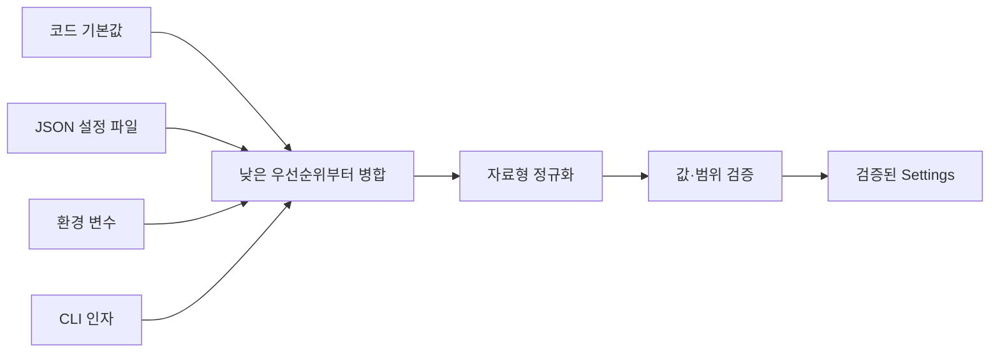

# 08-2. 설정 우선순위와 환경 변수

설정(configuration)은 프로그램의 동작을 바꾸지만 소스 코드 자체는 아닌 값이다. 대상 URL, 제한 시간, 출력 경로, 로그 수준을 코드에 고정하면 실행 환경이 바뀔 때마다 소스 코드를 수정해야 한다. 설정을 기본값, JSON 파일, 환경 변수, CLI 인자로 분리하면 같은 프로그램을 여러 환경에서 안전하게 재사용할 수 있다.

이 절에서는 네 설정 층을 **기본값 < JSON 설정 파일 < 환경 변수 < CLI 인자** 순서로 병합한다. 각 값이 어디에서 왔든 하나의 검증 경계를 통과하게 하고, 비밀값은 일반 설정과 다른 생애 주기로 다룬다.


### 🧭 학습 목표

- 설정과 비밀값을 소스 코드에서 분리해야 하는 이유를 설명한다.
- 기본값, JSON 설정 파일, 환경 변수, CLI 인자의 우선순위를 적용한다.
- 환경 변수의 값이 항상 문자열이라는 사실을 반영해 자료형을 변환한다.
- CLI에서 지정하지 않은 값과 명시적으로 지정한 값을 구분한다.
- `pathlib.Path`로 기본 설정 경로와 사용자가 지정한 설정 경로를 구성한다.
- JSON 구조, 허용 키, 자료형, 범위를 검증한다.
- 비밀값의 존재 여부를 검증하되 값 자체를 출력하거나 기록하지 않는다.
- 정상·오류·경계 설정으로 병합 결과를 확인한다.


## 선행 지식과 연결

- 딕셔너리 병합과 없는 키 처리는 [03-2. 문자열과 자료구조](../03-python-basics/03-2-strings-collections.md)에서 학습했다.
- 조건 검증과 예외 전달은 [03-3](../03-python-basics/03-3-conditions.md)과 [03-6](../03-python-basics/03-6-exceptions.md)에서 학습했다.
- 데이터클래스로 검증된 상태를 표현하는 방법은 [03-8](../03-python-basics/03-8-classes-dataclasses.md)에서 학습했다.
- JSON 읽기와 형식 검증은 [04-6. JSON과 JSONL](../04-file-io/04-6-json-jsonl.md)에서 학습했다.
- CLI 인자와 종료 상태는 [08-1](08-1-cli-exit-status.md)에서 학습했다.

## 이 절의 핵심 질문

```text
프로그램이 제공하는 안전한 기본값은 무엇인가?
  ↓
설정 파일에 어떤 값을 허용할 것인가?
  ↓
현재 실행 환경이 어떤 값을 덮어쓰는가?
  ↓
사용자가 이번 실행에서 무엇을 명시했는가?
  ↓
병합한 값을 어떤 자료형과 범위로 검증할 것인가?
  ↓
공개해도 되는 설정과 숨겨야 할 비밀값은 무엇인가?
```



## 0. 학습 전 확인

다음 네 값이 있을 때 최종 `timeout`을 예상한다.

```text
코드 기본값: 3.0
config.json: 5.0
환경 변수 PYTHON_BASIC_TIMEOUT: "2.5"
CLI 인자 --timeout: 1.0
```

다음 질문에도 답해 본다.

1. 환경 변수의 `"2.5"`는 문자열인가, 실수인가?
2. CLI의 `--timeout`을 생략했을 때 파서 기본값을 `3.0`으로 정하면 어떤 설정 층이 사라지는가?
3. JSON에서 `timeot`처럼 키 이름을 잘못 쓰면 조용히 무시해야 하는가?
4. `bool("false")`의 결과는 무엇인가?
5. API 토큰을 JSON 파일에 저장하고 Git에 올리면 어떤 문제가 생기는가?
6. 상대 경로인 `config.json`은 어느 위치를 기준으로 해석되는가?

절의 마지막에서 같은 질문에 다시 답한다.

## 1. 설정과 비밀값 구분하기

설정은 실행마다 달라질 수 있는 동작 선택이다.

| 설정 예 | 역할 | 공개 가능 여부 |
| --- | --- | --- |
| `target` | 작업 대상 URL | 일반적으로 가능하나 내부 주소는 주의 |
| `timeout` | 최대 대기 시간 | 가능 |
| `output` | 결과 파일 경로 | 사용자·시스템 정보가 있으면 주의 |
| `log_level` | 로그 상세 수준 | 가능 |

비밀값(secret)은 알고 있는 주체에게 권한이나 신뢰를 부여할 수 있는 값이다.

| 비밀값 예 | 노출될 때의 영향 |
| --- | --- |
| 비밀번호 | 계정 접근 가능성 |
| API 토큰 | API 권한 사용 가능성 |
| 세션 쿠키 | 기존 인증 상태 재사용 가능성 |
| 개인키 | 서명 또는 복호화 권한 악용 가능성 |

둘 다 코드 밖에서 주입할 수 있지만 같은 방식으로 다뤄서는 안 된다.

- 일반 설정은 도움말이나 안전한 설정 요약에 표시할 수 있다.
- 비밀값은 저장 위치, 접근 권한, 회전, 폐기 정책이 필요하다.
- 비밀값의 오류 메시지는 **변수 이름과 필요한 조건**만 알려 주고 실제 값을 포함하지 않는다.
- 일반 설정 파일에 비밀값 키가 들어오면 조용히 읽지 않고 거부하는 편이 안전하다.


환경 변수도 암호화된 비밀 저장소는 아니다. 같은 권한의 프로세스, 진단 덤프, 잘못 작성한 로그에서 노출될 수 있다. 실제 운영 환경에서는 조직이 승인한 비밀 관리 도구와 실행 시점 주입 방식을 사용하고, 이 교안에서는 값의 하드코딩·버전 관리·출력을 피하는 기본 원칙에 집중한다.


## 2. 네 설정 층과 우선순위

이 교안에서는 다음 우선순위를 사용한다.

```text
기본값 < JSON 설정 파일 < 환경 변수 < CLI 인자
```

오른쪽에 있는 층이 같은 키의 이전 값을 덮어쓴다.

| 층 | 목적 | 예 |
| --- | --- | --- |
| 기본값 | 별도 설정 없이 안전하게 시작 | `timeout=3.0` |
| JSON 파일 | 사용자·프로젝트가 반복 사용할 설정 | `timeout: 5.0` |
| 환경 변수 | 배포·실행 환경별 재정의 | `PYTHON_BASIC_TIMEOUT=2.5` |
| CLI 인자 | 이번 한 번의 실행에서 명시적 재정의 | `--timeout 1.0` |

```python
defaults = {"timeout": 3.0, "log_level": "INFO"}
file_values = {"timeout": 5.0}
environment_values = {"timeout": "2.5"}
cli_values = {"timeout": 1.0}

merged = {
    **defaults,
    **file_values,
    **environment_values,
    **cli_values,
}

print(merged["timeout"])  # 1.0
```

병합 순서는 단순한 구현 세부가 아니라 **누가 어떤 범위에서 결정을 바꿀 수 있는지 정하는 정책**이다. 순서를 문서와 코드에서 같게 유지한다.

### 응용 인사이트: 우선순위는 권한과 영향 범위를 표현한다

기본값은 프로그램 작성자가 제공하고, 설정 파일은 반복 실행의 기준을 저장하며, 환경 변수는 실행 환경이 재정의하고, CLI는 이번 실행의 사용자가 마지막 결정을 내린다. 우선순위가 문서화되지 않으면 같은 명령도 사용자가 예상하지 못한 설정으로 동작할 수 있다.

## 3. `Path`로 설정 파일 위치 정하기

문자열을 이어 붙이지 않고 `Path`로 경로를 구성한다.

```python
from pathlib import Path


APP_CONFIG_DIR = Path.home() / ".config" / "python-basic"
DEFAULT_CONFIG_PATH = APP_CONFIG_DIR / "config.json"

print(DEFAULT_CONFIG_PATH)
```

이 경로는 이 교안에서 사용하는 사용자별 기본 위치 예시다. 운영체제나 조직마다 설정 파일 관례가 다를 수 있으므로 실제 프로젝트에서는 배포 대상의 정책을 확인한다.

`Path` 객체를 만들었다고 디렉터리나 파일이 생성되지는 않는다. 설정을 읽기만 하는 프로그램이 자동으로 빈 파일을 만들 필요도 없다.

### 3.1 명시한 경로와 기본 경로 구분

사용자가 `--config`를 지정했다면 그 파일이 없을 때 오류로 처리한다. 기본 경로를 사용했는데 파일이 없다면 기본값만으로 실행할 수 있다.

```python
def choose_config_path(cli_path: Path | None) -> tuple[Path, bool]:
    if cli_path is None:
        return DEFAULT_CONFIG_PATH, False

    path = cli_path.expanduser()
    if not path.is_absolute():
        path = Path.cwd() / path

    return path.resolve(strict=False), True
```

반환값의 두 번째 요소는 사용자가 경로를 명시했는지를 뜻한다.

```python
path, required = choose_config_path(None)
path, required = choose_config_path(Path("config.json"))
```

- `None`: 사용자별 기본 경로를 선택하고 파일이 없어도 된다.
- `Path("config.json")`: 현재 작업 디렉터리를 기준으로 해석하며 파일이 반드시 있어야 한다.
- `Path("~/tool/config.json")`: `expanduser()`가 사용자 홈 경로로 확장한다.


상대 경로의 기준을 문서화한다. 이 절의 `--config config.json`은 **현재 작업 디렉터리**를 기준으로 한다. 프로그램 파일이 있는 디렉터리를 기준으로 자동 추측하지 않는다.


## 4. JSON 설정 파일 읽고 구조 검증하기

예제 설정 파일은 다음 네 개의 일반 설정만 포함한다.

```json
{
  "target": "http://127.0.0.1:8000/health",
  "output": "reports/summary.json",
  "timeout": 5.0,
  "log_level": "INFO"
}
```

실습 대상은 자신이 실행했거나 명시적으로 허가받은 로컬 서비스로 제한한다. 비밀번호나 토큰은 이 파일에 넣지 않는다.

`target`은 공개 가능한 서비스 위치만 표현한다. URL의 사용자정보, 쿼리 문자열, 프래그먼트에는 인증정보나 추적용 비밀값이 들어갈 수 있으므로 이 예제에서는 세 요소가 하나라도 있으면 거부한다. 요청 매개변수와 인증값은 설정 URL에 합치지 않고 필요한 요청을 만드는 순간에 별도로 전달한다. 경로에도 비밀값을 넣지 않는다는 계약을 함께 지킨다.

파일을 읽을 때는 다음을 확인한다.

1. 필요한 파일인가?
2. 일반 파일인가?
3. UTF-8로 읽고 JSON으로 해석할 수 있는가?
4. 최상위 값이 객체인가?
5. 허용하지 않은 키가 있는가?
6. 비밀값 키가 들어 있지 않은가?

```python
from __future__ import annotations

import json
from pathlib import Path
from typing import Any


ALLOWED_CONFIG_KEYS = {
    "target",
    "output",
    "timeout",
    "log_level",
}

FORBIDDEN_SECRET_KEYS = {
    "api_token",
    "password",
    "secret",
}


def load_json_config(path: Path, required: bool) -> dict[str, Any]:
    if not path.exists():
        if required:
            raise FileNotFoundError(f"설정 파일이 없습니다: {path}")
        return {}

    if not path.is_file():
        raise ValueError(f"설정 경로가 일반 파일이 아닙니다: {path}")

    try:
        data = json.loads(path.read_text(encoding="utf-8"))
    except json.JSONDecodeError as exc:
        raise ValueError(
            f"설정 파일의 JSON 형식이 올바르지 않습니다: {path}"
        ) from exc

    if not isinstance(data, dict):
        raise ValueError("설정 JSON의 최상위 값은 객체여야 합니다")

    secret_keys = set(data) & FORBIDDEN_SECRET_KEYS
    if secret_keys:
        names = ", ".join(sorted(secret_keys))
        raise ValueError(
            f"일반 설정 파일에 비밀값 키를 넣을 수 없습니다: {names}"
        )

    unknown_keys = set(data) - ALLOWED_CONFIG_KEYS
    if unknown_keys:
        names = ", ".join(sorted(unknown_keys))
        raise ValueError(f"알 수 없는 설정 키입니다: {names}")

    return data
```

`timeot`처럼 철자를 잘못 쓴 키를 무시하면 사용자는 값이 적용되었다고 오해한다. 허용 키 목록과 비교해 즉시 오류로 알려 주는 편이 문제를 빨리 발견하게 한다.

### 4.1 오류 메시지에 원문 전체를 넣지 않는다

JSON 해석 오류가 발생했다고 파일 전체 내용을 오류 메시지에 붙이지 않는다. 일반 설정이라고 예상했더라도 실수로 민감한 값이 들어 있을 수 있다. 파일 경로와 형식 오류라는 사실만으로도 사용자가 수정 위치를 찾을 수 있다.

## 5. 환경 변수는 항상 문자열이다

`os.environ`은 환경 변수 이름과 값을 문자열로 제공하는 매핑이다.

```python
import os

raw_timeout = os.environ.get("PYTHON_BASIC_TIMEOUT")

print(type(raw_timeout))  # 값이 있다면 str
```

셸에서 `PYTHON_BASIC_TIMEOUT=2.5`로 설정해도 Python에는 문자열 `"2.5"`가 들어온다. 정수, 실수, 불리언, 경로는 프로그램이 명시적으로 변환해야 한다.

환경 변수에는 다른 프로그램과 충돌하지 않도록 접두사를 붙인다.

| 환경 변수 | 설정 키 | 변환 전 자료형 |
| --- | --- | --- |
| `PYTHON_BASIC_TARGET` | `target` | `str` |
| `PYTHON_BASIC_OUTPUT` | `output` | `str` |
| `PYTHON_BASIC_TIMEOUT` | `timeout` | `str` |
| `PYTHON_BASIC_LOG_LEVEL` | `log_level` | `str` |

```python
from collections.abc import Mapping
from typing import Any


ENVIRONMENT_MAP = {
    "PYTHON_BASIC_TARGET": "target",
    "PYTHON_BASIC_OUTPUT": "output",
    "PYTHON_BASIC_TIMEOUT": "timeout",
    "PYTHON_BASIC_LOG_LEVEL": "log_level",
}


def environment_layer(
    environ: Mapping[str, str],
) -> dict[str, Any]:
    values: dict[str, Any] = {}

    for environment_name, setting_name in ENVIRONMENT_MAP.items():
        if environment_name in environ:
            values[setting_name] = environ[environment_name]

    return values
```

이 단계에서는 존재하는 값만 가져온다. 자료형 변환과 범위 검증은 네 층을 병합한 뒤 한곳에서 수행한다.

### 5.1 불리언 문자열을 `bool()`로 변환하지 않는다

```python
print(bool("false"))  # True
print(bool("0"))      # True
```

비어 있지 않은 문자열은 모두 참이다. 환경 변수로 불리언을 받아야 한다면 허용 문자열을 명시한다.

```python
def parse_boolean(value: object, setting_name: str) -> bool:
    if isinstance(value, bool):
        return value

    normalized = str(value).strip().casefold()

    if normalized in {"1", "true", "yes", "on"}:
        return True
    if normalized in {"0", "false", "no", "off"}:
        return False

    raise ValueError(
        f"{setting_name}은 true/false 형식이어야 합니다"
    )
```

허용 표현을 늘릴수록 편리하지만 오타를 정상값으로 오해할 가능성도 커진다. 프로젝트가 지원하는 표현을 문서화하고 그 밖의 값은 거부한다.

## 6. CLI에서 ‘지정하지 않음’을 보존하기

CLI가 가장 높은 우선순위라 해도 사용자가 실제로 지정한 값만 아래 층을 덮어써야 한다.

다음 설정은 문제가 있다.

```python
parser.add_argument("--timeout", type=float, default=3.0)
```

사용자가 `--timeout`을 생략해도 `3.0`이 CLI 값처럼 들어와 JSON과 환경 변수의 `timeout`을 덮어쓸 수 있다. 계층형 설정에서는 `None`을 “이번 CLI에서 지정하지 않음”으로 사용한다.

```python
import argparse
from pathlib import Path


def build_parser() -> argparse.ArgumentParser:
    parser = argparse.ArgumentParser(
        description="네 설정 층을 병합하고 검증한다."
    )
    parser.add_argument(
        "--config",
        type=Path,
        default=None,
        metavar="FILE",
        help="읽을 JSON 설정 파일",
    )
    parser.add_argument("--target", default=None)
    parser.add_argument("--output", type=Path, default=None)
    parser.add_argument("--timeout", type=float, default=None)
    parser.add_argument(
        "--log-level",
        choices=("DEBUG", "INFO", "WARNING", "ERROR"),
        default=None,
    )
    return parser
```

`--config`는 어떤 설정 파일을 읽을지 정하는 **부트스트랩 인자**다. 설정 파일 내부 값과 병합하지 않고 먼저 처리한다.

CLI 층에는 `None`이 아닌 값만 넣는다.

```python
def cli_layer(args: argparse.Namespace) -> dict[str, object]:
    candidates = {
        "target": args.target,
        "output": args.output,
        "timeout": args.timeout,
        "log_level": args.log_level,
    }

    return {
        key: value
        for key, value in candidates.items()
        if value is not None
    }
```

값의 존재 여부를 `if value`로 판단하지 않는다. `0`, `False`, 빈 컬렉션처럼 거짓으로 평가되지만 명시적으로 지정된 값이 사라질 수 있다. 이 경우에는 `is not None`으로 “지정하지 않음”만 제외한다.

## 7. 병합한 값을 한곳에서 정규화·검증하기

설정 층마다 같은 변환 코드를 반복하면 처리 규칙이 달라질 수 있다. 낮은 우선순위부터 병합한 뒤 최종값을 한 번 정규화하고 검증한다.

```python
from dataclasses import dataclass
from pathlib import Path
from urllib.parse import urlsplit


DEFAULTS: dict[str, object] = {
    "target": "http://127.0.0.1:8000/health",
    "output": "reports/summary.json",
    "timeout": 3.0,
    "log_level": "INFO",
}


@dataclass(frozen=True)
class Settings:
    target: str
    output: Path
    timeout: float
    log_level: str


def normalize_output_path(value: str | Path, base_dir: Path) -> Path:
    path = Path(str(value)).expanduser()

    if not path.is_absolute():
        path = base_dir / path

    return path.resolve(strict=False)


def validate_settings(
    raw: dict[str, object],
    base_dir: Path,
) -> Settings:
    raw_target = raw["target"]
    if not isinstance(raw_target, str) or not raw_target.strip():
        raise ValueError("target은 비어 있지 않은 문자열이어야 합니다")
    target = raw_target.strip()
    parsed = urlsplit(target)

    if parsed.scheme not in {"http", "https"} or not parsed.hostname:
        raise ValueError(
            "target은 http 또는 https URL이어야 합니다"
        )

    if parsed.username is not None or parsed.password is not None:
        raise ValueError("target URL에 인증정보를 포함할 수 없습니다")

    if parsed.query or parsed.fragment:
        raise ValueError(
            "target URL에 쿼리 문자열이나 프래그먼트를 포함할 수 없습니다"
        )

    try:
        _ = parsed.port
    except ValueError as exc:
        raise ValueError("target URL의 포트 형식이 올바르지 않습니다") from exc

    raw_timeout = raw["timeout"]
    if isinstance(raw_timeout, bool):
        raise ValueError("timeout은 불리언이 아닌 숫자여야 합니다")

    try:
        timeout = float(raw_timeout)
    except (TypeError, ValueError) as exc:
        raise ValueError("timeout은 숫자여야 합니다") from exc

    if not 0 < timeout <= 60:
        raise ValueError("timeout은 0보다 크고 60 이하여야 합니다")

    raw_log_level = raw["log_level"]
    if not isinstance(raw_log_level, str):
        raise ValueError("log_level은 문자열이어야 합니다")
    log_level = raw_log_level.strip().upper()
    allowed_levels = {"DEBUG", "INFO", "WARNING", "ERROR"}
    if log_level not in allowed_levels:
        raise ValueError(
            "log_level은 DEBUG, INFO, WARNING, ERROR 중 하나여야 합니다"
        )

    raw_output = raw["output"]
    if not isinstance(raw_output, (str, Path)) or not str(raw_output).strip():
        raise ValueError("output은 비어 있지 않은 문자열 또는 Path여야 합니다")
    output = normalize_output_path(raw_output, base_dir)

    return Settings(
        target=target,
        output=output,
        timeout=timeout,
        log_level=log_level,
    )
```

`Settings`를 만든 뒤에는 각 필드의 자료형과 범위가 검증되었다고 신뢰할 수 있다. `frozen=True`는 실행 도중 우연히 값이 바뀌는 일을 줄인다.

Python에서 `bool`은 `int`의 하위 자료형이므로 `float(True)`는 `1.0`이 된다. 숫자로 변환하기 전에 불리언을 명시적으로 거부해야 JSON의 `true`가 유효한 timeout으로 통과하지 않는다. `None`이나 리스트도 `str()`로 먼저 바꾸면 그럴듯한 경로나 URL이 될 수 있으므로 변환 전에 허용 자료형을 검사한다.

`resolve(strict=False)`는 경로를 정리할 뿐 해당 경로에 써도 된다는 권한을 부여하지 않는다. 실제로 결과 파일을 쓸 때는 [04-1의 안전한 경로 검증](../04-file-io/04-1-paths-filesystem.md)을 적용해 허용된 출력 디렉터리 안인지 별도로 확인한다.

### 응용 인사이트: 경계에서 한 번 변환하고 내부에서는 검증된 값을 사용한다

환경 변수의 문자열, JSON의 숫자, CLI의 `Path`처럼 입력 표현은 서로 다르다. 내부 함수마다 다시 변환하면 규칙이 중복된다. 입력 경계에서 하나의 `Settings`로 바꾼 뒤 핵심 로직은 `settings.timeout`이 양의 실수이고 `settings.output`이 절대 `Path`라는 계약을 사용할 수 있다.

## 8. 비밀값을 별도로 읽고 검증하기

비밀값은 일반 설정 병합 딕셔너리에 넣지 않는다. 이 예제에서는 `PYTHON_BASIC_API_TOKEN` 환경 변수가 필요한 작업 직전에 존재 여부만 검사한다.

```python
from collections.abc import Mapping


def require_api_token(environ: Mapping[str, str]) -> str:
    variable_name = "PYTHON_BASIC_API_TOKEN"
    value = environ.get(variable_name)

    if value is None or not value.strip():
        raise ValueError(
            f"필수 비밀값 환경 변수가 설정되지 않았습니다: {variable_name}"
        )

    return value
```

오류 메시지는 변수 이름만 보여 주고 실제 값은 포함하지 않는다. 형식이나 길이를 검증해야 한다면 사용하는 서비스의 명확한 계약에 따라 검사하되, 실패한 원문을 메시지에 넣지 않는다.

설정 여부를 표시해야 할 때도 값 대신 불리언 상태만 사용한다.

```python
def secret_status(environ: Mapping[str, str]) -> dict[str, bool]:
    token = environ.get("PYTHON_BASIC_API_TOKEN")
    return {"api_token_configured": bool(token and token.strip())}
```

다음 동작은 피한다.

```python
# 하지 않는다.
print(os.environ)
print(f"token={token}")
logger.debug("token=%s", token)
raise ValueError(f"잘못된 토큰: {token}")
```


마스킹한 일부 문자열도 토큰 형식이나 길이 정보를 불필요하게 노출할 수 있다. 디버깅 목적이라도 가능하면 값 대신 `설정됨/설정되지 않음`, 요청 식별자, 실패 단계처럼 비밀이 아닌 정보를 기록한다.


## 9. 통합 예제: 설정 로더

다음 프로그램은 표준 라이브러리만 사용해 네 설정 층을 병합하고 검증된 공개 설정만 JSON으로 출력한다. 네트워크 요청이나 파일 쓰기는 수행하지 않는다.

```python
from __future__ import annotations

import argparse
import json
import os
import sys
from collections.abc import Mapping
from dataclasses import dataclass
from pathlib import Path
from typing import Any
from urllib.parse import urlsplit


APP_CONFIG_DIR = Path.home() / ".config" / "python-basic"
DEFAULT_CONFIG_PATH = APP_CONFIG_DIR / "config.json"

DEFAULTS: dict[str, object] = {
    "target": "http://127.0.0.1:8000/health",
    "output": "reports/summary.json",
    "timeout": 3.0,
    "log_level": "INFO",
}

ALLOWED_CONFIG_KEYS = set(DEFAULTS)
FORBIDDEN_SECRET_KEYS = {"api_token", "password", "secret"}

ENVIRONMENT_MAP = {
    "PYTHON_BASIC_TARGET": "target",
    "PYTHON_BASIC_OUTPUT": "output",
    "PYTHON_BASIC_TIMEOUT": "timeout",
    "PYTHON_BASIC_LOG_LEVEL": "log_level",
}


@dataclass(frozen=True)
class Settings:
    target: str
    output: Path
    timeout: float
    log_level: str


def build_parser() -> argparse.ArgumentParser:
    parser = argparse.ArgumentParser(
        description="기본값, JSON, 환경 변수, CLI 설정을 병합한다."
    )
    parser.add_argument(
        "--config",
        type=Path,
        default=None,
        metavar="FILE",
        help="읽을 JSON 설정 파일",
    )
    parser.add_argument("--target", default=None)
    parser.add_argument("--output", type=Path, default=None)
    parser.add_argument("--timeout", type=float, default=None)
    parser.add_argument(
        "--log-level",
        choices=("DEBUG", "INFO", "WARNING", "ERROR"),
        default=None,
    )
    return parser


def choose_config_path(cli_path: Path | None) -> tuple[Path, bool]:
    if cli_path is None:
        return DEFAULT_CONFIG_PATH, False

    path = cli_path.expanduser()
    if not path.is_absolute():
        path = Path.cwd() / path

    return path.resolve(strict=False), True


def load_json_config(path: Path, required: bool) -> dict[str, Any]:
    if not path.exists():
        if required:
            raise FileNotFoundError(f"설정 파일이 없습니다: {path}")
        return {}

    if not path.is_file():
        raise ValueError(f"설정 경로가 일반 파일이 아닙니다: {path}")

    try:
        data = json.loads(path.read_text(encoding="utf-8"))
    except json.JSONDecodeError as exc:
        raise ValueError(
            f"설정 파일의 JSON 형식이 올바르지 않습니다: {path}"
        ) from exc

    if not isinstance(data, dict):
        raise ValueError("설정 JSON의 최상위 값은 객체여야 합니다")

    secret_keys = set(data) & FORBIDDEN_SECRET_KEYS
    if secret_keys:
        names = ", ".join(sorted(secret_keys))
        raise ValueError(
            f"일반 설정 파일에 비밀값 키를 넣을 수 없습니다: {names}"
        )

    unknown_keys = set(data) - ALLOWED_CONFIG_KEYS
    if unknown_keys:
        names = ", ".join(sorted(unknown_keys))
        raise ValueError(f"알 수 없는 설정 키입니다: {names}")

    return data


def environment_layer(
    environ: Mapping[str, str],
) -> dict[str, object]:
    values: dict[str, object] = {}

    for environment_name, setting_name in ENVIRONMENT_MAP.items():
        if environment_name in environ:
            values[setting_name] = environ[environment_name]

    return values


def cli_layer(args: argparse.Namespace) -> dict[str, object]:
    candidates = {
        "target": args.target,
        "output": args.output,
        "timeout": args.timeout,
        "log_level": args.log_level,
    }

    return {
        key: value
        for key, value in candidates.items()
        if value is not None
    }


def normalize_output_path(value: str | Path, base_dir: Path) -> Path:
    path = Path(str(value)).expanduser()

    if not path.is_absolute():
        path = base_dir / path

    return path.resolve(strict=False)


def validate_settings(
    raw: dict[str, object],
    base_dir: Path,
) -> Settings:
    raw_target = raw["target"]
    if not isinstance(raw_target, str) or not raw_target.strip():
        raise ValueError("target은 비어 있지 않은 문자열이어야 합니다")
    target = raw_target.strip()
    parsed = urlsplit(target)
    if parsed.scheme not in {"http", "https"} or not parsed.hostname:
        raise ValueError(
            "target은 http 또는 https URL이어야 합니다"
        )

    if parsed.username is not None or parsed.password is not None:
        raise ValueError("target URL에 인증정보를 포함할 수 없습니다")

    if parsed.query or parsed.fragment:
        raise ValueError(
            "target URL에 쿼리 문자열이나 프래그먼트를 포함할 수 없습니다"
        )

    try:
        _ = parsed.port
    except ValueError as exc:
        raise ValueError("target URL의 포트 형식이 올바르지 않습니다") from exc

    raw_timeout = raw["timeout"]
    if isinstance(raw_timeout, bool):
        raise ValueError("timeout은 불리언이 아닌 숫자여야 합니다")

    try:
        timeout = float(raw_timeout)
    except (TypeError, ValueError) as exc:
        raise ValueError("timeout은 숫자여야 합니다") from exc

    if not 0 < timeout <= 60:
        raise ValueError("timeout은 0보다 크고 60 이하여야 합니다")

    raw_log_level = raw["log_level"]
    if not isinstance(raw_log_level, str):
        raise ValueError("log_level은 문자열이어야 합니다")
    log_level = raw_log_level.strip().upper()
    allowed_levels = {"DEBUG", "INFO", "WARNING", "ERROR"}
    if log_level not in allowed_levels:
        raise ValueError(
            "log_level은 DEBUG, INFO, WARNING, ERROR 중 하나여야 합니다"
        )

    raw_output = raw["output"]
    if not isinstance(raw_output, (str, Path)) or not str(raw_output).strip():
        raise ValueError("output은 비어 있지 않은 문자열 또는 Path여야 합니다")
    output = normalize_output_path(raw_output, base_dir)

    return Settings(
        target=target,
        output=output,
        timeout=timeout,
        log_level=log_level,
    )


def load_settings(
    args: argparse.Namespace,
    environ: Mapping[str, str],
    base_dir: Path,
) -> Settings:
    config_path, required = choose_config_path(args.config)
    file_values = load_json_config(config_path, required)

    merged = {
        **DEFAULTS,
        **file_values,
        **environment_layer(environ),
        **cli_layer(args),
    }

    return validate_settings(merged, base_dir)


def public_view(settings: Settings) -> dict[str, object]:
    return {
        "target": settings.target,
        "output": str(settings.output),
        "timeout": settings.timeout,
        "log_level": settings.log_level,
    }


def main(
    argv: list[str] | None = None,
    environ: Mapping[str, str] | None = None,
) -> int:
    parser = build_parser()
    args = parser.parse_args(argv)
    current_environment = os.environ if environ is None else environ

    try:
        settings = load_settings(
            args,
            current_environment,
            base_dir=Path.cwd(),
        )
    except (OSError, ValueError) as exc:
        print(f"설정 오류: {exc}", file=sys.stderr)
        return 1

    print(
        json.dumps(
            public_view(settings),
            ensure_ascii=False,
            indent=2,
        )
    )
    return 0


if __name__ == "__main__":
    raise SystemExit(main())
```

### 9.1 실행 순서 확인

먼저 `config.json`을 준비한다.

```json
{
  "target": "http://127.0.0.1:8000/status",
  "output": "reports/from-config.json",
  "timeout": 5.0,
  "log_level": "WARNING"
}
```

설정 파일만 적용한다.

```bash
python settings_demo.py --config config.json
```

환경 변수로 `timeout`을 덮어쓴다.

```bash
PYTHON_BASIC_TIMEOUT=2.5 python settings_demo.py --config config.json
```

CLI로 다시 덮어쓴다.

```bash
PYTHON_BASIC_TIMEOUT=2.5 python settings_demo.py \
    --config config.json \
    --timeout 1.0
```

마지막 명령의 `timeout`은 `1.0`이다. CLI에서 `--timeout`을 생략하면 환경 변수 `2.5`가 적용되고, 환경 변수까지 없으면 JSON의 `5.0`이 적용된다.

### 9.2 테스트 가능한 입력 경계

`main()`이 환경 변수 매핑을 인자로 받을 수 있으므로 실제 운영체제 환경을 바꾸지 않고 설정 조합을 확인할 수 있다.

```python
result = main(
    ["--timeout", "1.5"],
    environ={"PYTHON_BASIC_LOG_LEVEL": "ERROR"},
)
```

`argv`와 `environ`을 외부에서 전달할 수 있게 하는 구조는 전역 상태에 대한 의존을 줄인다. 09장에서 임시 설정 파일과 함께 자동 테스트로 확장할 수 있다.

## 10. 설정 출력과 로그의 안전한 경계

문제 해결을 위해 현재 설정을 출력하는 기능은 유용하지만 모든 값을 그대로 직렬화해서는 안 된다.

```python
def public_view(settings: Settings) -> dict[str, object]:
    return {
        "target": settings.target,
        "output": str(settings.output),
        "timeout": settings.timeout,
        "log_level": settings.log_level,
    }
```

출력할 필드를 명시적으로 선택하는 허용 목록 방식을 사용한다. `settings.__dict__`나 전체 환경 변수를 그대로 출력하면 나중에 비밀 필드가 추가되었을 때 자동으로 노출될 수 있다.

이 예제에서 `public_view()`가 `target` 원문을 출력할 수 있는 이유는 `validate_settings()`가 URL의 사용자정보, 쿼리 문자열, 프래그먼트를 먼저 거부하고, URL 경로에도 비밀값을 넣지 않는다는 설정 계약을 적용하기 때문이다. API 토큰은 `target`과 분리해 환경 변수에서만 읽는다. 이 검증이나 계약을 완화해 민감한 경로·쿼리를 허용하는 프로젝트라면 원문 URL을 공개 필드로 간주해서는 안 되며, `target`을 출력에서 제외하거나 안전한 구성요소만 다시 조합해야 한다.

공개 설정도 항상 무해한 것은 아니다.

- 내부 호스트 이름은 시스템 구조를 드러낼 수 있다.
- 사용자 홈 절대 경로는 계정 이름을 드러낼 수 있다.
- 출력 파일 이름은 조사 대상이나 사건 이름을 포함할 수 있다.

따라서 설정 요약의 독자와 저장 위치를 고려해 필요한 항목만 출력한다.

## 11. 대표적인 실패 사례

### 11.1 우선순위가 코드와 문서에서 다르다

문서에는 CLI가 가장 높다고 적었지만 코드에서 환경 변수를 마지막에 병합하면 사용자의 명시적 인자가 무시된다. 낮은 우선순위부터 높은 우선순위 순서로 병합한다.

### 11.2 `or`로 설정을 선택한다

```python
timeout = cli_timeout or env_timeout or file_timeout or 3.0
```

`0`, `False`, 빈 문자열처럼 거짓으로 평가되는 값과 “값이 없음”을 구분하지 못한다. `None`을 부재 표시로 사용하고 `is not None`으로 확인한다. `0`이 최종 검증에서 거부될 값이더라도 병합 단계가 그 값을 임의로 다른 값으로 바꾸면 오류 원인을 숨긴다.

### 11.3 CLI 기본값이 아래 설정을 덮어쓴다

계층형 옵션에 `default=3.0`을 지정하면 사용자가 옵션을 생략해도 CLI 값처럼 보인다. 파서는 `None`을 반환하게 하고 실제 기본값은 가장 낮은 설정 층에 둔다.

### 11.4 환경 변수 문자열을 바로 사용한다

```python
timeout = os.environ["PYTHON_BASIC_TIMEOUT"]
time.sleep(timeout)  # 문자열이므로 오류
```

환경 변수는 문자열이다. 병합 후 자료형을 변환하고 범위를 검사한다.

### 11.5 알 수 없는 JSON 키를 무시한다

`"timeot": 1.0`이 무시되면 사용자는 제한 시간이 적용되었다고 오해할 수 있다. 허용 키 목록을 두고 오타와 지원하지 않는 설정을 즉시 거부한다.

### 11.6 상대 경로 기준이 실행마다 달라진다

`Path("config.json")`은 현재 작업 디렉터리를 기준으로 한다. 기본 경로, CLI 상대 경로, 출력 상대 경로의 기준을 각각 문서화하고 `Path.cwd()` 같은 기준값을 한 번 선택한다.

### 11.7 비밀값을 일반 설정과 함께 출력한다

전체 딕셔너리, `os.environ`, 데이터클래스의 모든 필드를 그대로 출력하지 않는다. 공개 필드 허용 목록을 만들고 비밀값은 설정 여부만 필요한 경우에도 값이 아닌 불리언 상태로 표현한다.

### 11.8 모듈을 import할 때 설정을 확정한다

```python
TIMEOUT = float(os.environ.get("PYTHON_BASIC_TIMEOUT", "3.0"))
```

import 순간의 전역 환경에 고정되어 조합별 테스트와 재사용이 어려워진다. 실행 경계에서 `load_settings()`를 호출하고 필요한 환경 매핑을 인자로 전달한다.

## 12. 연습문제

### 연습 1. 우선순위 계산

다음 입력에서 최종 `target`, `output`, `timeout`, `log_level`을 구한다.

```text
기본값:
  target=http://127.0.0.1:8000/health
  output=reports/default.json
  timeout=3.0
  log_level=INFO

JSON:
  output=reports/config.json
  timeout=5.0

환경 변수:
  PYTHON_BASIC_TIMEOUT="2.5"
  PYTHON_BASIC_LOG_LEVEL="ERROR"

CLI:
  --target http://127.0.0.1:9000/status
  --timeout 1.0
```

### 연습 2. 환경 변수 자료형 설명

다음 코드가 기대와 다르게 동작하는 이유를 설명하고 수정한다.

```python
dry_run = bool(os.environ.get("PYTHON_BASIC_DRY_RUN", "false"))
```

### 연습 3. 알 수 없는 키 검증

허용 키가 `{"target", "timeout"}`일 때 다음 JSON을 거부하는 코드를 작성한다.

```json
{
  "target": "http://127.0.0.1:8000/health",
  "timeot": 1.0
}
```

### 연습 4. 설정 경로 선택

`choose_config_path()`의 결과를 설명한다.

1. `cli_path=None`
2. 현재 작업 디렉터리가 `/work/lab`이고 `cli_path=Path("settings/config.json")`
3. `cli_path=Path("~/course/config.json")`

운영체제와 사용자 홈에 따라 전체 절대 경로가 달라진다는 점도 함께 설명한다.

### 연습 5. 비밀값 오류 수정

다음 코드의 노출 문제를 찾고 안전한 오류 메시지로 수정한다.

```python
token = os.environ.get("PYTHON_BASIC_API_TOKEN")
if not token:
    raise ValueError(f"잘못된 토큰: {token}")
```

### 연습 6. 미니 실습

통합 예제에 `dry_run` 설정을 추가한다.

- 기본값은 `False`다.
- JSON 키는 `dry_run`이다.
- 환경 변수는 `PYTHON_BASIC_DRY_RUN`이다.
- CLI는 `--dry-run`과 `--no-dry-run`을 지원한다.
- CLI에서 두 플래그를 모두 생략하면 아래 설정 층을 보존한다.
- 허용되지 않은 문자열은 오류로 처리한다.
- 공개 설정 요약에는 불리언값만 출력한다.

## 13. 정답과 해설

<details>
<summary>연습 1 정답</summary>

```text
target=http://127.0.0.1:9000/status
output=reports/config.json
timeout=1.0
log_level=ERROR
```

- `target`은 CLI가 기본값을 덮어쓴다.
- `output`은 더 높은 층에 값이 없으므로 JSON 값이 유지된다.
- `timeout`은 JSON, 환경 변수를 거쳐 가장 높은 CLI 값이 적용된다.
- `log_level`은 CLI 값이 없으므로 환경 변수 값이 적용된다.

</details>

<details>
<summary>연습 2 정답</summary>

`os.environ.get()`은 문자열을 반환한다. 비어 있지 않은 문자열 `"false"`를 `bool()`에 전달하면 `True`다.

```python
raw_dry_run = os.environ.get("PYTHON_BASIC_DRY_RUN", "false")
dry_run = parse_boolean(raw_dry_run, "dry_run")
```

`parse_boolean()`은 지원하는 참·거짓 표현만 받아들이고 나머지는 `ValueError`로 거부한다.

</details>

<details>
<summary>연습 3 정답 예시</summary>

```python
allowed = {"target", "timeout"}
data = {
    "target": "http://127.0.0.1:8000/health",
    "timeot": 1.0,
}

unknown = set(data) - allowed
if unknown:
    names = ", ".join(sorted(unknown))
    raise ValueError(f"알 수 없는 설정 키입니다: {names}")
```

이 예제에서는 `timeot`이 오류로 보고된다. 조용히 무시하면 사용자가 의도한 제한 시간이 적용되지 않는다.

</details>

<details>
<summary>연습 4 정답</summary>

1. `None`이면 `Path.home() / ".config" / "python-basic" / "config.json"`을 선택하며 파일은 선택 사항이다.
2. `/work/lab/settings/config.json`으로 정리되며 사용자가 명시했으므로 파일이 필요하다.
3. 현재 사용자의 홈 아래 `course/config.json`으로 확장되며 파일이 필요하다.

특정 사용자 홈 경로나 드라이브 문자를 정답으로 고정하지 않는다. `Path.home()`, 현재 작업 디렉터리, 운영체제에 따라 절대 경로 표현이 달라진다.

</details>

<details>
<summary>연습 5 정답</summary>

```python
variable_name = "PYTHON_BASIC_API_TOKEN"
token = os.environ.get(variable_name)

if token is None or not token.strip():
    raise ValueError(
        f"필수 비밀값 환경 변수가 설정되지 않았습니다: {variable_name}"
    )
```

실패한 비밀값 자체를 오류 메시지에 넣지 않는다. 실제 값이 없을 때 `None`을 출력하는 것조차 불필요하며, 이후 코드가 바뀌어 유효하지 않은 실제 토큰을 포함하게 될 위험도 줄인다.

</details>

<details>
<summary>연습 6 구현 힌트</summary>

기본값과 허용 키에 `dry_run`을 추가한다.

```python
DEFAULTS["dry_run"] = False
ALLOWED_CONFIG_KEYS = set(DEFAULTS)
ENVIRONMENT_MAP["PYTHON_BASIC_DRY_RUN"] = "dry_run"
```

CLI에서는 두 옵션을 상호 배타적으로 정의하고 `None`을 기본값으로 사용한다.

```python
group = parser.add_mutually_exclusive_group()
group.add_argument(
    "--dry-run",
    dest="dry_run",
    action="store_true",
)
group.add_argument(
    "--no-dry-run",
    dest="dry_run",
    action="store_false",
)
parser.set_defaults(dry_run=None)
```

`cli_layer()`에는 `dry_run`이 `None`이 아닐 때만 포함하고, `validate_settings()`에서 `parse_boolean(raw["dry_run"], "dry_run")`을 호출한다. 정상 입력 `true`, `false`, 경계 입력인 대소문자·앞뒤 공백, 오류 입력 `maybe`, 빈 문자열을 각각 확인한다.

</details>

## 14. 응용 인사이트 정리

### 설정 병합은 값 복사가 아니라 결정 정책이다

어떤 층이 마지막에 적용되는지는 작성자, 프로젝트, 실행 환경, 현재 사용자의 결정 중 무엇을 우선할지 정한다. 우선순위를 도움말이나 운영 문서에 명시하고 예제로 검증한다.

### 설정값의 출처보다 최종 계약이 중요하다

JSON 숫자와 환경 변수 문자열은 표현이 다르지만 핵심 로직에는 같은 `float` 제한 시간으로 전달되어야 한다. 병합 후 한 번 정규화하면 모든 입력 경로에 같은 규칙을 적용할 수 있다.

### 상대 경로에는 항상 숨은 기준 위치가 있다

`config.json`이나 `reports/result.json` 같은 상대 경로는 스스로 완전한 위치가 아니다. 현재 작업 디렉터리, 설정 파일 디렉터리, 프로젝트 루트 중 무엇을 기준으로 할지 정하고 코드와 문서에서 같게 유지한다.

### 비밀값은 일반 설정과 다른 생애 주기를 가진다

일반 설정은 비교·출력·버전 관리가 가능할 수 있지만 비밀값은 발급, 제한, 회전, 폐기가 필요하다. 같은 딕셔너리에 섞으면 출력과 로그에서 우연히 노출될 가능성이 커진다.

### 검증된 `Settings`는 실행 시점의 스냅숏이다

환경 변수를 핵심 함수마다 다시 읽으면 한 실행 안에서도 값의 출처와 검증 시점이 불분명해진다. 시작할 때 한 번 읽고 불변 `Settings`로 전달하면 어떤 설정으로 결과가 만들어졌는지 추적하기 쉽다.

## 15. 완료 기준

- [ ] 설정과 비밀값의 차이를 설명할 수 있다.
- [ ] 기본값 < JSON < 환경 변수 < CLI 순서로 값을 병합할 수 있다.
- [ ] CLI에서 생략한 값이 아래 설정 층을 덮어쓰지 않게 만들 수 있다.
- [ ] 환경 변수의 숫자와 불리언을 명시적으로 변환할 수 있다.
- [ ] `Path.home()`, `Path.cwd()`, `expanduser()`로 설정 경로를 구성할 수 있다.
- [ ] 명시한 설정 파일과 선택적인 기본 설정 파일을 다르게 처리할 수 있다.
- [ ] JSON 최상위 구조, 허용 키, 비밀값 키를 검증할 수 있다.
- [ ] 병합 후 자료형·범위·허용값을 한곳에서 검증할 수 있다.
- [ ] 불리언 timeout과 문자열·`Path`가 아닌 출력 경로를 거부할 수 있다.
- [ ] `target` URL의 사용자정보, 쿼리 문자열, 프래그먼트를 거부할 수 있다.
- [ ] 공개 설정 요약에 필요한 필드만 포함할 수 있다.
- [ ] 비밀값의 존재를 검증하되 값 자체를 출력·로그·예외에 포함하지 않을 수 있다.
- [ ] 정상·오류·경계 설정 조합으로 최종 결과를 확인할 수 있다.

---

다음 절: [08-3. 실행 로그와 관찰 가능성](08-3-logging-observability.md)
