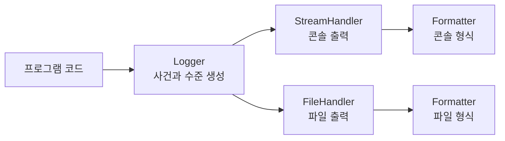

# 08-3. 실행 로그와 관찰 가능성

자동화 도구는 성공 결과만 출력해서는 실행 중 어떤 일이 있었는지 설명하기 어렵다. 이 절에서는 Python의 `logging` 모듈로 실행 사건을 일관된 형식으로 기록하고, 사람이 읽는 진단 메시지와 다른 프로그램이 소비할 결과 데이터를 분리하는 방법을 학습한다.

로그는 프로그램의 내부 상태를 바깥에서 이해하도록 돕는 **관찰 기록**이다. 그러나 로그 한 줄만으로 보안 취약점이나 장애 원인을 확정할 수는 없다. 관찰값, 판정 규칙, 결과 보고서의 책임을 구분해야 한다.


### 🧭 학습 목표

- 로그 수준과 `Logger`·`Handler`·`Formatter`의 역할을 설명한다.
- 표준 출력과 표준 오류를 목적에 맞게 구분한다.
- 애플리케이션 진입점에서 로깅을 한 번만 설정한다.
- 비밀번호·토큰·쿠키와 같은 민감정보를 로그에서 제외하거나 마스킹한다.
- 실행 로그와 점검 판정 근거를 별도의 결과로 관리한다.


## 학습 우선순위

| 구분 | 내용 |
| --- | --- |
| 필수 | 로그 수준, 모듈별 logger, 표준 출력·표준 오류 분리, 민감정보 제외 |
| 권장 | handler·formatter 설정, 중복 handler 방지, 구조화된 문맥 필드 |
| 심화 | 파일 회전, 중앙 수집, 상관관계 식별자, 메트릭·트레이스 연계 |

## 선행 지식과 학습 연결

- 예외를 처리하고 전파하는 기준은 [03-6 예외 처리](../03-python-basics/03-6-exceptions.md)에서 학습했다.
- 레코드의 형식·의미·오류를 구분하는 방법은 [05-5 데이터 검증](../05-text-processing/05-5-validation.md)에서 학습했다.
- HTTP 점검의 관찰값과 판정을 구분하는 방법은 [07-6 HTTP 보안 검증 기초](../07-http-api/07-6-http-security-validation.md)에서 학습했다.
- 이 절의 로그 설정은 [08-5 로컬 HTTP 점검기 도구화 프로젝트](08-5-toolization-project.md)에 적용한다.

## 0. 학습 전 확인

다음 질문에 먼저 답해 본다.

1. `print()`와 `logging.info()`는 어떤 상황에서 역할이 다른가?
2. `WARNING`과 `ERROR`는 각각 어떤 실행 상태를 나타내는가?
3. JSON 결과를 표준 출력으로 내보낼 때 진단 로그도 같은 출력에 섞어도 되는가?
4. HTTP 상태 코드와 응답 본문 전체를 로그에 남기면 어떤 정보가 노출될 수 있는가?
5. 로그 수준이 `ERROR`이면 보안 취약점도 높은 심각도로 확정된 것인가?

## 1. 로그가 필요한 이유

자동화 프로그램은 다음 질문에 답할 수 있어야 한다.

- 어떤 작업이 언제 시작되고 끝났는가?
- 어떤 대상과 옵션을 사용했는가?
- 어느 단계까지 성공했고 어디서 실패했는가?
- 실패가 입력 오류인지, 네트워크 오류인지, 내부 오류인지 구분할 수 있는가?
- 같은 입력으로 실패를 재현할 단서가 있는가?

`print()`는 간단한 학습 결과를 확인할 때 유용하다. 반면 `logging`은 메시지의 수준, 발생 위치, 출력 목적지와 형식을 설정할 수 있어 여러 모듈로 구성된 도구의 실행 과정을 기록하기에 적합하다.


로그는 많이 남길수록 좋은 것이 아니다. 목적 없이 원문 요청·응답, 인증값, 개인정보를 기록하면 로그 자체가 새로운 민감정보 저장소가 된다. 필요한 사건과 최소한의 문맥만 기록한다.


## 2. 로그 수준 선택

Python의 대표적인 로그 수준은 다음과 같다.

| 수준 | 의미 | 예시 |
| --- | --- | --- |
| `DEBUG` | 개발·문제 분석에 필요한 상세 상태 | 파싱한 레코드 수, 재시도 번호 |
| `INFO` | 정상적인 주요 실행 단계 | 점검 시작, 보고서 저장 완료 |
| `WARNING` | 작업은 계속되지만 확인이 필요한 상태 | 선택 설정 누락, 일부 점검 건너뜀 |
| `ERROR` | 현재 작업을 완료하지 못한 상태 | 설정 파일 해석 실패, 요청 최종 실패 |
| `CRITICAL` | 프로그램 전체를 계속하기 어려운 심각한 상태 | 필수 자원 초기화 실패 |

로그 수준은 **실행 사건의 운영상 중요도**를 나타낸다. 보안 점검 결과의 위험도나 확신 수준과 같은 개념이 아니다.

예를 들어 보안 헤더가 누락되었다는 관찰은 점검 결과에서 `warning`일 수 있다. 이때 프로그램은 정상적으로 검사를 끝냈으므로 실행 로그는 `INFO`로 남길 수 있다.

```python
logger.info(
    "점검 완료 check=%s result=%s",
    "security_headers",
    "warning",
)
```

반대로 네트워크 오류 때문에 점검 자체를 실행하지 못했다면 실행 로그에는 `ERROR`가 적절할 수 있다. 하지만 이것만으로 대상 서비스에 보안 취약점이 있다고 판정하지 않는다.

## 3. Logger·Handler·Formatter

`logging`의 핵심 구성 요소는 세 가지다.



| 구성 요소 | 책임 |
| --- | --- |
| `Logger` | 코드가 로그 사건을 생성하는 통로다. 이름과 수준을 가진다. |
| `Handler` | 로그를 콘솔·파일과 같은 목적지로 보낸다. |
| `Formatter` | 시각·수준·logger 이름·메시지의 표시 형식을 정한다. |

각 모듈에서는 모듈 이름을 logger 이름으로 사용한다.

```python
import logging


logger = logging.getLogger(__name__)


def validate_target(target):
    logger.info("target_validation_started")
    # target의 형식과 범위를 검증한다.
```

`__name__`을 사용하면 어느 모듈에서 기록했는지 추적하기 쉽다. 검증 전의 전체 URL은 사용자정보나 민감한 query를 포함할 수 있으므로 기록하지 않고 사건 이름만 남긴다. 검증 뒤에도 필요한 경우에만 허용된 scheme·loopback 여부처럼 비밀이 아닌 필드를 선택한다. 라이브러리 모듈은 handler를 직접 추가하지 않고 로그 사건만 만들며, 출력 형식과 목적지는 프로그램 진입점이 결정한다.

### 최소 설정

작은 CLI 프로그램은 진입점에서 `basicConfig()`를 한 번 호출할 수 있다.

```python
import logging


def configure_logging(verbose=False):
    level = logging.DEBUG if verbose else logging.INFO
    logging.basicConfig(
        level=level,
        format="%(asctime)s %(levelname)s %(name)s %(message)s",
    )


def main():
    configure_logging(verbose=False)
    logger = logging.getLogger(__name__)
    logger.info("프로그램 시작")


if __name__ == "__main__":
    main()
```

`logger.info(f"대상: {target}")`처럼 문자열을 먼저 만드는 대신 `logger.info("대상: %s", target)` 형식을 사용하면 해당 수준이 비활성화된 경우 불필요한 문자열 생성을 줄일 수 있다.

## 4. 표준 출력과 표준 오류

CLI 프로그램에는 서로 다른 두 출력 통로가 있다.

| 통로 | Python 객체 | 목적 |
| --- | --- | --- |
| 표준 출력 | `sys.stdout` | 최종 결과, 다른 프로그램이 읽을 데이터 |
| 표준 오류 | `sys.stderr` | 진행 상황, 경고, 오류와 같은 진단 정보 |

`logging.StreamHandler()`는 기본적으로 표준 오류를 사용한다. 따라서 최종 JSON은 표준 출력으로 보내고 로그는 표준 오류로 보내면 두 출력을 분리할 수 있다.

```python
import json
import logging
import sys


logging.basicConfig(
    level=logging.INFO,
    format="%(levelname)s %(message)s",
)
logger = logging.getLogger(__name__)

logger.info("점검 시작")

result = {
    "target": "http://127.0.0.1:8080",
    "status": "pass",
}
json.dump(result, sys.stdout, ensure_ascii=False)
sys.stdout.write("\n")
```

터미널에서는 둘 다 화면에 보이지만 리다이렉션하면 차이가 드러난다.

```bash
python checker.py > report.json
```

위 명령은 표준 출력의 JSON만 `report.json`에 저장하고 로그는 터미널에 표시한다. 로그까지 같은 표준 출력에 섞으면 JSON 문법이 깨져 다른 프로그램이 결과를 읽지 못할 수 있다.


표준 오류라는 이름이 붙어 있어도 오류만 보내는 통로는 아니다. 정상 실행의 진단 로그도 표준 오류로 보내 최종 결과 데이터와 분리할 수 있다.


## 5. handler 중복 방지

handler는 프로그램 시작 시 한 번만 설정한다. 작업 함수가 호출될 때마다 handler를 추가하면 같은 사건이 여러 번 출력된다.

### 잘못된 예

```python
import logging


logger = logging.getLogger("checker")
logger.setLevel(logging.INFO)


def run_check():
    handler = logging.StreamHandler()
    logger.addHandler(handler)
    logger.info("점검 실행")


run_check()
run_check()
```

두 번째 호출에서는 handler가 두 개가 되어 `점검 실행`이 두 번 출력된다. 반복 호출이 많아질수록 출력 횟수도 증가한다.

### 설정과 실행 분리

```python
import logging


LOGGER_NAME = "local_checker"


def configure_logging(level=logging.INFO):
    logger = logging.getLogger(LOGGER_NAME)
    logger.setLevel(level)
    logger.propagate = False

    if not logger.handlers:
        handler = logging.StreamHandler()
        handler.setFormatter(
            logging.Formatter(
                "%(asctime)s %(levelname)s %(name)s %(message)s"
            )
        )
        logger.addHandler(handler)

    return logger


logger = configure_logging()


def run_check():
    logger.info("점검 실행")


run_check()
run_check()
```

이 코드는 설정 함수를 다시 호출해도 이미 handler가 있으면 추가하지 않는다. `propagate = False`는 같은 사건이 상위 logger로 다시 전달되어 중복 출력되는 것을 막는다.

실제 애플리케이션에서는 설정 함수를 `main()`에서 한 번만 호출하는 구조가 가장 단순하다. 테스트나 프레임워크가 이미 로깅을 설정할 수 있으므로 공유 라이브러리가 루트 logger의 handler를 임의로 지우거나 교체하지 않도록 한다.

## 6. 민감정보를 로그에서 제외하기

다음 값은 기본적으로 기록하지 않는다.

- 비밀번호와 인증 코드
- API 키, 액세스 토큰, 세션 식별자
- `Authorization`·`Cookie` 헤더
- 개인정보가 포함된 요청·응답 본문
- 비밀값이 들어 있는 전체 환경 변수와 설정 객체
- URL의 사용자정보 또는 민감한 쿼리 문자열

가장 안전한 방법은 민감정보를 로그 함수에 전달하지 않는 것이다.

```python
# 잘못된 예
logger.debug("로그인 요청 username=%s password=%s", username, password)

# 개선한 예
logger.info("로그인 요청 username=%s password_supplied=%s", username, bool(password))
```

오류 분석에 설정 구조가 필요하면 **기록해도 되는 키의 허용 목록**으로 새 딕셔너리를 만든다. 비밀 키를 나열해 가리는 방식은 새 토큰 이름이 추가됐을 때 놓칠 수 있다.

```python
SAFE_LOG_FIELDS = {"timeout", "log_level", "operation"}


def select_safe_log_fields(values):
    return {
        key: values[key]
        for key in SAFE_LOG_FIELDS
        if key in values
    }
```

```python
settings = {
    "base_url": "http://127.0.0.1:8080",
    "timeout": 3,
    "log_level": "INFO",
    "api_key": "training-secret",
}

logger.debug("설정 로드 fields=%s", select_safe_log_fields(settings))
```

결과에는 `timeout`과 `log_level`만 들어가고 `base_url`과 `api_key`는 처음부터 복사되지 않는다. 허용 목록의 값도 입력 경계에서 자료형과 범위를 검증해야 한다. 중첩 객체, URL, 예외 메시지 안의 비밀값을 자동으로 정리해 주는 함수가 아니므로 원본 설정을 통째로 로그 함수에 전달하지 않는다.


실제 비밀번호·토큰·개인정보를 사용해 마스킹을 시험하지 않는다. `training-secret`처럼 명백한 가상 데이터를 사용하고, 저장된 로그 파일도 학습 작업 공간 밖으로 공유하지 않는다.


## 7. 실행 로그와 판정 근거 분리

로그는 실행 흐름을 설명하고, 결과 보고서는 관찰값과 판정 근거를 보존한다.

```python
def evaluate_status(status_code):
    observation = {
        "status_code": status_code,
    }

    if status_code == 200:
        result = "pass"
        reason = "예상한 HTTP 200 응답을 받음"
    else:
        result = "fail"
        reason = "예상한 HTTP 200 응답을 받지 못함"

    return {
        "check": "health_status",
        "result": result,
        "observation": observation,
        "reason": reason,
    }
```

```python
finding = evaluate_status(503)

logger.info(
    "점검 완료 check=%s result=%s",
    finding["check"],
    finding["result"],
)
```

`logger.info()`는 점검이 끝났다는 사건을 기록한다. `finding`은 어떤 값을 관찰했고 어떤 규칙으로 결과를 판정했는지 보존한다. 로그 수준을 바꾸거나 로그 파일을 삭제해도 결과 보고서의 판정 근거는 유지되어야 한다.

| 구분 | 실행 로그 | 결과 보고서 |
| --- | --- | --- |
| 주 목적 | 실행 진단과 운영 상태 확인 | 관찰값·판정·권고 보존 |
| 주요 독자 | 운영자·개발자 | 분석자·검토자·후속 프로그램 |
| 예 | 시작, 재시도, 저장 완료, 예외 | 대상, 검사 규칙, 관찰값, 결과, 근거 |
| 보존 정책 | 운영 필요에 따라 회전·삭제 | 과제·업무의 증적 정책에 따름 |

로그 한 줄을 근거 없이 보고서에 복사하거나 `ERROR` 로그를 취약점으로 자동 변환하지 않는다. 판정 함수는 명시적인 입력과 규칙을 사용해야 한다.

## 8. 실패를 기록하는 경계

낮은 단계의 함수가 예외를 기록하고 다시 발생시킨 뒤, 상위 함수가 같은 예외를 또 기록하면 중복 로그가 생긴다.

```python
def load_config(path):
    # 실패하면 구체적인 예외를 호출자에게 전달한다.
    return path.read_text(encoding="utf-8")


def main():
    try:
        text = load_config(config_path)
    except OSError:
        logger.exception("설정 파일을 읽지 못함 path=%s", config_path)
        return 2
```

예외를 최종적으로 사용자 메시지나 종료 코드로 바꾸는 **복구 경계**에서 한 번 기록한다. `logger.exception()`은 현재 예외의 traceback을 포함하므로 `except` 블록 안에서 사용한다.

traceback과 예외 메시지에도 경로·URL·입력값이 포함될 수 있다. 민감한 원문을 예외 메시지에 넣지 않고, 외부에 공개할 로그는 먼저 검토한다.

## 9. 흔한 실패와 점검법

| 실패 | 원인 | 점검·개선 방법 |
| --- | --- | --- |
| JSON 결과가 파싱되지 않음 | 로그와 JSON을 모두 표준 출력에 기록함 | JSON은 stdout, 로그는 stderr로 분리한다. |
| 같은 로그가 여러 번 출력됨 | 함수 호출마다 handler를 추가함 | 진입점에서 한 번 설정하고 handler 개수를 확인한다. |
| 모듈 로그가 두 번 출력됨 | 자신의 handler와 상위 logger 전파가 겹침 | handler 소유권을 정하고 필요한 경우 `propagate`를 조정한다. |
| 로그 파일에 토큰이 남음 | 설정·헤더·URL 전체를 기록함 | 필요한 필드만 선택하고 민감 필드를 전달하지 않는다. |
| 모든 사건을 `ERROR`로 기록함 | 로그 수준을 판정 위험도와 혼동함 | 작업 계속 가능 여부와 복구 여부를 기준으로 수준을 정한다. |
| 실패 원인을 찾을 수 없음 | “오류 발생”만 기록함 | 단계, 안전한 식별자, 예외 유형을 최소 문맥으로 남긴다. |
| 같은 예외가 여러 계층에서 반복됨 | 기록 후 다시 발생시키는 함수가 많음 | 복구·종료 경계에서 한 번 기록한다. |

## 10. 안전한 로그 설계 규칙

1. 로그를 남길 사건과 목적을 먼저 정한다.
2. 라이브러리 모듈은 `getLogger(__name__)`으로 사건만 만들고, 진입점이 출력을 설정한다.
3. 최종 데이터는 stdout, 진단 로그는 stderr로 분리한다.
4. 비밀번호·토큰·쿠키·개인정보는 수집하지 않는 것을 기본값으로 한다.
5. 대상 전체 URL이나 본문 대신 승인된 안전한 필드만 기록한다.
6. 로그 수준과 보안 판정의 심각도를 서로 다른 값으로 관리한다.
7. 성공 경로뿐 아니라 실패 단계와 종료 상태도 기록한다.
8. 로그 파일의 접근 권한, 보존 기간, 삭제 기준을 정한다.

## 11. 개념 이해 연습

### 연습 1. 출력 통로 선택

CLI가 다음 세 값을 출력하려고 한다. 각각 stdout과 stderr 중 어느 통로가 적절한지 선택한다.

1. 다른 프로그램이 읽을 최종 JSON 보고서
2. “설정 파일을 읽는 중”이라는 진행 로그
3. 설정 해석 실패 traceback

<details>
<summary>정답 확인</summary>

최종 JSON은 stdout으로 보낸다. 진행 로그와 traceback은 진단 정보이므로 stderr로 보낸다. 이렇게 해야 `python tool.py > report.json`으로 유효한 JSON만 저장할 수 있다.

</details>

### 연습 2. 중복 로그 원인 찾기

다음 함수를 세 번 호출하면 마지막 호출의 메시지는 몇 번 출력되는지 예상하고 코드를 수정한다.

```python
logger = logging.getLogger("exercise")
logger.setLevel(logging.INFO)


def process():
    logger.addHandler(logging.StreamHandler())
    logger.info("처리")
```

<details>
<summary>정답 확인</summary>

첫 호출은 한 번, 두 번째 호출은 두 번, 세 번째 호출은 세 번 출력된다. handler 추가를 함수 밖의 설정 단계로 옮긴다.

```python
logger = logging.getLogger("exercise")
logger.setLevel(logging.INFO)
logger.propagate = False

if not logger.handlers:
    logger.addHandler(logging.StreamHandler())


def process():
    logger.info("처리")
```

</details>

### 연습 3. 민감정보 줄이기

다음 로그에서 제거하거나 대체해야 할 값을 찾는다.

```python
logger.info(
    "request url=%s headers=%s body=%s",
    url,
    headers,
    body,
)
```

<details>
<summary>정답 확인</summary>

URL의 사용자정보·쿼리 문자열, `Authorization`·`Cookie` 헤더, 본문의 비밀번호·토큰·개인정보가 노출될 수 있다. 전체 객체를 기록하지 않고 메서드, 허용된 호스트, 상태 코드, 본문 크기처럼 목적에 필요한 안전한 필드만 선택한다.

```python
logger.info(
    "request method=%s host=%s response_status=%s response_bytes=%s",
    method,
    approved_host,
    status_code,
    response_size,
)
```

</details>

### 연습 4. 로그와 판정 구분하기

`ERROR request timeout`이라는 로그가 있으면 대상 서비스에 취약점이 있다고 판정할 수 있는가?

<details>
<summary>정답 확인</summary>

판정할 수 없다. 이 로그는 요청 작업을 완료하지 못했다는 실행 상태만 보여 준다. 대상 장애, 네트워크 문제, 잘못된 설정 등 원인이 여러 가지일 수 있다. 결과 보고서에는 “점검 미완료”와 timeout 관찰값을 기록하고, 취약점 판정은 별도의 점검 규칙과 추가 근거를 사용해야 한다.

</details>

## 12. 응용 인사이트

### 로그를 문장이 아니라 사건으로 설계한다

`"문제가 발생했습니다"` 같은 자유 문장만 남기면 검색과 집계가 어렵다. 사건 이름과 안정적인 필드를 정하면 실행 비교가 쉬워진다.

```text
event=request_finished check=health result=pass elapsed_ms=42
```

필드 이름은 실행마다 바꾸지 않고, 값에 줄바꿈이나 민감정보가 들어오지 않도록 검증한다. JSON 로그는 이후 확장할 수 있지만, 먼저 어떤 사건과 필드가 필요한지 설계해야 한다.

### 한 번의 실행을 연결하는 식별자를 둔다

동시에 여러 작업이 실행되면 로그가 섞일 수 있다. 무작위 실행 식별자를 만들어 관련 사건에 포함하면 한 실행의 흐름을 모아 볼 수 있다. 실행 식별자는 비밀번호나 사용자 개인정보를 재사용하지 않는다.

### 로그도 입력·저장·출력 계약을 가진다

로그 메시지는 부가 기능이 아니라 운영 데이터다. 어떤 값을 입력받고, 어떤 형식으로 저장하며, 누가 읽고, 언제 삭제하는지 정해야 한다. 09장의 테스트에서는 로그 수준과 핵심 사건이 의도대로 기록되는지 검증할 수 있다.

## 13. 완료 기준

- [ ] 다섯 로그 수준의 차이를 실행 상태 관점에서 설명한다.
- [ ] `Logger`·`Handler`·`Formatter`의 책임을 구분한다.
- [ ] 모듈 logger와 애플리케이션 로깅 설정을 분리한다.
- [ ] 최종 결과와 진단 로그를 stdout·stderr로 분리한다.
- [ ] handler 중복과 상위 logger 전파로 인한 중복을 설명한다.
- [ ] 검증 전 전체 URL과 민감정보를 로그 함수에 전달하지 않는 코드를 작성한다.
- [ ] 안전한 로그 필드를 거부 목록이 아니라 허용 목록으로 선택한다.
- [ ] 로그 수준과 보안 판정 결과를 서로 다른 개념으로 관리한다.
- [ ] 실패를 복구·종료 경계에서 한 번만 기록한다.

## 14. 핵심 정리

- 로그는 실행 과정을 관찰하는 기록이며 판정 결과 그 자체가 아니다.
- 모듈은 사건을 만들고 애플리케이션 진입점은 handler와 formatter를 설정한다.
- 결과 데이터는 stdout, 진단 로그는 stderr로 분리한다.
- handler를 반복해서 추가하지 않고, 민감정보는 처음부터 기록 대상에서 제외한다.
- 판정 보고서에는 관찰값과 규칙을 보존하고 로그에는 주요 실행 사건을 남긴다.

---

다음 절: [08-4. 안전한 외부 프로세스 실행](08-4-safe-subprocess.md)
