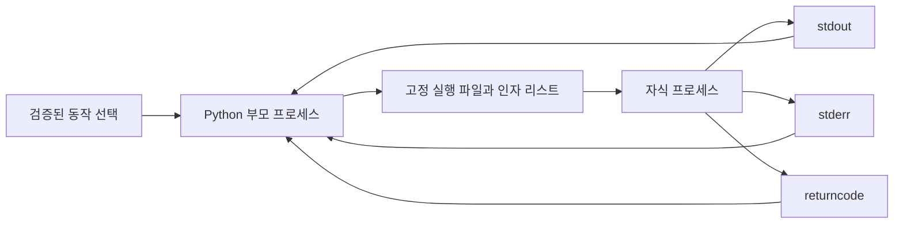

# 08-4. 안전한 외부 프로세스 실행

Python만으로 처리하기 어려운 운영체제 도구나 별도 프로그램을 호출해야 할 때 `subprocess` 모듈을 사용할 수 있다. 외부 프로세스는 현재 Python 프로그램과 다른 실행 경계를 가지므로 명령 인자, 종료 상태, 출력, 실행 시간과 허용 범위를 명시적으로 통제해야 한다.


### 📌 단원 성격: 권장·선택

이 단원은 외부 프로그램을 호출해야 할 때 적용하는 권장 학습이다. 08장의 핵심 프로젝트는 `subprocess` 없이도 완료할 수 있다. Python 표준 라이브러리로 같은 작업을 수행할 수 있다면 표준 라이브러리를 먼저 사용한다.

처음 학습하는 경우 최소 예제, 인자 리스트, `shell=False`, timeout과 종료 코드까지 학습한 뒤 08-5로 이동할 수 있다. 외부 도구 연계가 필요한 학습자는 전체 내용을 실습한다.



### 🧭 학습 목표

- Python 함수 호출과 외부 프로세스 실행의 차이를 설명한다.
- 인자 리스트와 `shell=False`를 기본값으로 사용한다.
- `timeout`, `check`, `returncode`로 실패 정책을 구현한다.
- stdout·stderr와 텍스트 인코딩을 명시적으로 처리한다.
- 사용자 입력을 고정된 동작의 허용 목록에 매핑한다.
- 임의 명령 문자열을 입력받아 실행하지 않는다.


## 학습 우선순위

| 구분 | 내용 |
| --- | --- |
| 필수 | 인자 리스트, `shell=False`, `timeout`, `returncode`, stdout·stderr 구분 |
| 권장 | `check=True`, 텍스트 인코딩, 고정 동작 허용 목록, 제어된 작업 디렉터리 |
| 심화 | 제한된 환경 변수, 출력 크기 제어, 비동기 프로세스 수명 주기 |

## 선행 지식과 학습 연결

- 리스트와 문자열의 차이는 [03-2 문자열과 자료구조](../03-python-basics/03-2-strings-collections.md)에서 학습했다.
- 예외의 복구 경계와 `raise`는 [03-6 예외 처리](../03-python-basics/03-6-exceptions.md)에서 학습했다.
- 안전한 경로 처리와 파일 검증은 [04-1 절대경로와 상대경로](../04-file-io/04-1-paths-filesystem.md)에서 학습했다.
- 실행 사건과 민감정보 제외 기준은 [08-3 실행 로그와 관찰 가능성](08-3-logging-observability.md)에서 학습했다.

## 0. 학습 전 확인

다음 질문에 먼저 답해 본다.

1. `subprocess.run("tool " + user_input, shell=True)`는 어떤 입력을 명령으로 해석할 수 있는가?
2. 외부 프로그램의 종료 코드가 0이 아니어도 Python 예외가 자동으로 발생하는가?
3. 외부 프로그램이 끝나지 않으면 현재 Python 프로그램은 언제까지 기다리는가?
4. stdout과 stderr는 어떤 종류의 출력을 전달하는가?
5. 사용자가 입력한 명령어 전체를 허용하는 것과 미리 정의한 동작 이름을 선택하게 하는 것은 어떻게 다른가?

## 1. 외부 프로세스 실행은 경계다

일반적인 Python 함수는 같은 프로세스 안에서 호출된다. `subprocess`는 별도의 프로그램을 새로운 프로세스로 실행하고, 운영체제를 통해 입력·출력·종료 상태를 주고받는다.



외부 프로세스는 다음 자원을 사용할 수 있다.

- 현재 사용자의 파일·네트워크 접근 권한
- 전달받거나 상속한 환경 변수
- 지정된 작업 디렉터리
- CPU·메모리·실행 시간
- 부모 프로세스가 전달한 입력과 파일 핸들

따라서 외부 프로그램 이름과 인자를 단순 문자열 조합으로 만들지 않는다. 어떤 실행이 허용되는지 먼저 설계한다.

### Python 기능을 먼저 확인한다

파일 해시는 `hashlib`, 파일 복사는 `shutil`, 경로 탐색은 `pathlib`, 압축은 `zipfile`처럼 표준 라이브러리로 처리할 수 있다. 같은 기능을 표준 라이브러리로 구현하면 플랫폼 차이와 외부 프로그램 의존성을 줄이고, 입력과 오류를 Python 코드에서 직접 통제할 수 있다.

`subprocess`는 반드시 별도 실행 파일이 필요한 경우에만 사용한다.

## 2. subprocess.run 최소 예제

`subprocess.run()`은 자식 프로세스가 끝날 때까지 기다린 뒤 `CompletedProcess`를 반환한다. 다음 예제는 현재 Python 인터프리터로 고정된 짧은 코드를 실행한다.

```python
import subprocess
import sys


completed = subprocess.run(
    [sys.executable, "-c", "print('child process')"],
    shell=False,
    capture_output=True,
    text=True,
    encoding="utf-8",
    timeout=3,
    check=False,
)

print(completed.returncode)  # 0
print(completed.stdout)      # child process\n
print(completed.stderr)      # 빈 문자열
```

각 인자의 의미는 다음과 같다.

| 인자 | 의미 |
| --- | --- |
| 첫 번째 리스트 | 실행 파일과 각 인자를 분리해 전달한다. |
| `shell=False` | 셸을 거치지 않고 실행한다. 기본값이지만 의도를 분명히 적었다. |
| `capture_output=True` | stdout과 stderr를 각각 수집한다. |
| `text=True` | 수집 결과를 `bytes`가 아닌 `str`로 변환한다. |
| `encoding="utf-8"` | 바이트를 문자열로 해석할 문자 인코딩을 지정한다. |
| `timeout=3` | 지정 시간 안에 끝나지 않으면 대기를 중단한다. |
| `check=False` | 0이 아닌 종료 코드를 반환값으로 직접 확인한다. |

`shell=False`는 기본값이다. 이 절에서는 안전한 실행 경계를 코드에서 쉽게 확인할 수 있도록 명시한다.

## 3. 명령 문자열 대신 인자 리스트 사용

셸은 공백뿐 아니라 파이프, 리다이렉션, 명령 연결과 같은 특수 문법을 해석한다. 사용자 입력이 포함된 문자열을 `shell=True`로 실행하면 입력이 데이터가 아니라 추가 명령으로 해석될 수 있다.

### 사용하지 말아야 할 형태

```python
# 사용자가 입력한 값을 명령 문자열에 연결하지 않는다.
command = f"some-tool --input {user_value}"
subprocess.run(command, shell=True)
```

따옴표를 추가하거나 일부 특수문자를 삭제하는 방식만으로 모든 셸 문법과 플랫폼 차이를 안전하게 처리하기 어렵다.

### 인자를 분리한 형태

```python
completed = subprocess.run(
    [trusted_executable, "--input", validated_value],
    shell=False,
    timeout=5,
    check=False,
)
```

인자 리스트를 사용하면 `validated_value`는 하나의 인자로 전달되고 셸의 파이프나 명령 연결 문법으로 해석되지 않는다. 그러나 이것만으로 모든 위험이 사라지지는 않는다.

- 실행한 프로그램 자체가 특정 문자열을 옵션으로 해석할 수 있다.
- 입력 경로가 허용 범위 밖을 가리킬 수 있다.
- 실행 파일 이름을 `PATH`에서 잘못 찾을 수 있다.
- 실행 프로그램에 자체 취약점이나 위험한 기능이 있을 수 있다.

인자 리스트는 필요한 기본 조건이며, 실행 파일·허용 동작·값의 형식·경로 범위를 함께 검증해야 한다.


CLI 인자로 `--command "..."` 같은 임의 명령 문자열을 받아 실행하는 기능을 만들지 않는다. 교육용 도구에서도 현재 사용자 권한으로 파일 삭제, 정보 노출, 외부 연결과 같은 예상하지 못한 동작을 수행할 수 있다.


## 4. 종료 코드와 실패 정책

외부 프로그램은 종료 코드로 성공 여부를 알린다. 일반적으로 0은 성공, 0이 아닌 값은 실패를 의미하지만 정확한 의미는 해당 프로그램의 문서를 확인해야 한다.

### returncode를 직접 확인하기

```python
import subprocess
import sys


completed = subprocess.run(
    [sys.executable, "-c", "raise SystemExit(7)"],
    capture_output=True,
    text=True,
    encoding="utf-8",
    timeout=3,
    check=False,
)

if completed.returncode == 0:
    print("자식 프로세스 성공")
else:
    print(f"자식 프로세스 실패: {completed.returncode}")
```

`check=False`에서는 0이 아닌 종료 코드도 정상 반환되므로 호출자가 반드시 확인해야 한다.

### check=True로 예외 발생시키기

```python
try:
    completed = subprocess.run(
        [sys.executable, "-c", "raise SystemExit(7)"],
        capture_output=True,
        text=True,
        encoding="utf-8",
        timeout=3,
        check=True,
    )
except subprocess.CalledProcessError as exc:
    print(f"종료 코드: {exc.returncode}")
    print(f"표준 오류: {exc.stderr}")
```

`check=True`는 0이 아닌 종료 코드를 `CalledProcessError`로 바꾼다. 현재 함수가 성공 결과만 반환한다는 계약을 갖는다면 유용하다. 여러 종료 코드를 서로 다른 정상 상태로 해석해야 한다면 `check=False`로 받고 명시적으로 분기한다.

## 5. timeout으로 무한 대기 막기

외부 프로그램이 입력을 기다리거나 멈추면 부모 프로그램도 계속 기다릴 수 있다. 모든 자동 실행에는 목적에 맞는 제한 시간을 둔다.

```python
import subprocess
import sys


try:
    subprocess.run(
        [sys.executable, "-c", "import time; time.sleep(10)"],
        stdin=subprocess.DEVNULL,
        capture_output=True,
        text=True,
        encoding="utf-8",
        timeout=1,
        check=True,
    )
except subprocess.TimeoutExpired:
    print("허용 시간을 초과했습니다")
```

`subprocess.run()`은 timeout이 발생하면 자식 프로세스를 종료하고 정리한 뒤 `TimeoutExpired`를 발생시킨다. `stdin=subprocess.DEVNULL`은 자식 프로세스가 터미널 입력을 기다리지 못하게 한다.

timeout 값은 무조건 짧게 정하는 것이 아니라 정상 처리 시간, 입력 크기, 시스템 부하를 고려해 정한다. 재시도한다면 전체 실행 시간과 최대 횟수도 제한한다.


장기 실행 서버를 시작하고 종료하는 기능은 `Popen`, 신호, 자식 프로세스 정리, 포트 충돌과 실패 복구까지 설계해야 한다. 이 단원은 종료 시점이 분명한 단발성 작업을 `subprocess.run()`으로 실행하는 범위까지만 다룬다.


## 6. stdout·stderr와 인코딩

자식 프로세스의 출력도 두 통로로 나뉜다.

```python
import subprocess
import sys


code = (
    "import sys; "
    "print('result'); "
    "print('diagnostic', file=sys.stderr)"
)

completed = subprocess.run(
    [sys.executable, "-c", code],
    capture_output=True,
    text=True,
    encoding="utf-8",
    errors="strict",
    timeout=3,
    check=True,
)

print(repr(completed.stdout))  # 'result\n'
print(repr(completed.stderr))  # 'diagnostic\n'
```

stdout과 stderr를 합치지 않으면 결과 데이터와 진단 메시지를 별도로 해석할 수 있다. 외부 프로그램의 문서에서 출력 형식과 인코딩을 확인하고, 알고 있는 인코딩을 명시한다.

`text=True`만 지정하면 시스템의 기본 인코딩을 사용한다. 실행 환경마다 기본값이 다를 수 있으므로 자신이 제어하는 자식 프로그램과는 UTF-8 같은 출력 계약을 정하는 편이 좋다.

디코딩할 수 없는 바이트를 발견했을 때 정책도 정한다.

| 정책 | 동작 | 적합한 경우 |
| --- | --- | --- |
| `errors="strict"` | 디코딩 실패 시 예외 발생 | 출력 손실 없이 정확성을 보장해야 함 |
| `errors="replace"` | 잘못된 바이트를 대체 문자로 표시 | 진단 텍스트 일부라도 보존해야 함 |

보안 판정 데이터는 조용히 손실되지 않도록 `strict`를 우선 검토한다. 진단 로그 수집에서는 대체 문자를 허용하되 데이터가 변경되었다는 사실을 기록할 수 있다.

### 출력 크기 주의

`capture_output=True`는 출력을 메모리에 모은다. 출력 크기를 신뢰할 수 없는 프로그램에 사용하면 메모리를 과도하게 사용할 수 있다. 이 단원에서는 출력이 작고 형식이 정해진 프로그램에만 사용한다. 큰 출력은 제한된 임시 파일이나 스트리밍 처리가 필요하며 이는 심화 범위다.

## 7. 허용 목록으로 동작 선택하기

사용자에게 실행할 명령 문자열을 입력받지 않고, 프로그램이 제공하는 **의미 있는 동작 이름** 중 하나를 선택하게 한다. 각 이름은 개발자가 미리 정의한 실행 파일과 인자에 대응한다.

```python
import subprocess
import sys


ALLOWED_ACTIONS = {
    "python-version": [sys.executable, "--version"],
    "self-check": [
        sys.executable,
        "-c",
        "print('self-check: ok')",
    ],
}


def run_allowed_action(action):
    command = ALLOWED_ACTIONS.get(action)

    if command is None:
        allowed = ", ".join(sorted(ALLOWED_ACTIONS))
        raise ValueError(f"허용되지 않은 동작입니다: {action!r}; allowed={allowed}")

    completed = subprocess.run(
        list(command),
        shell=False,
        stdin=subprocess.DEVNULL,
        capture_output=True,
        text=True,
        encoding="utf-8",
        errors="strict",
        timeout=3,
        check=False,
    )

    return {
        "action": action,
        "returncode": completed.returncode,
        "stdout": completed.stdout,
        "stderr": completed.stderr,
    }
```

```python
result = run_allowed_action("self-check")
assert result["returncode"] == 0
assert result["stdout"] == "self-check: ok\n"
```

허용 목록의 키는 사용자가 선택할 수 있지만 실제 실행 파일과 코드 문자열은 프로그램이 고정한다. `list(command)`은 전역 목록을 호출 코드가 실수로 변경하지 않도록 복사한다.

실제 도구에서는 다음 항목도 통제한다.

- 실행 파일은 승인된 절대경로나 `sys.executable`처럼 신뢰할 수 있는 값으로 정한다.
- 작업 디렉터리 `cwd`는 학습 작업 공간 안의 검증된 경로로 제한한다.
- 동적으로 추가하는 값은 자료형·길이·허용값·경로 범위를 별도로 검사한다.
- 비밀값을 명령행 인자로 전달하지 않는다. 운영체제의 프로세스 목록에 보일 수 있다.
- 자식에게 전달할 환경 변수를 검토하고 전체 설정을 로그로 출력하지 않는다.

## 8. 실행 결과와 판정 분리

외부 프로세스가 종료 코드 0을 반환했다는 사실은 해당 프로그램이 자신의 규칙에 따라 성공했다고 알린 것이다. 보안 점검 결과가 안전하다는 의미는 아니다.

```python
execution = run_allowed_action("self-check")

if execution["returncode"] != 0:
    result = {
        "status": "error",
        "reason": "외부 점검 프로그램을 완료하지 못함",
    }
else:
    result = evaluate_self_check(execution["stdout"])
```

먼저 **실행 성공 여부**를 확인하고, 성공한 출력의 형식과 의미를 별도 함수로 검증한다. stdout 문자열이 존재한다는 이유만으로 신뢰하지 않는다.

## 9. 흔한 실패와 점검법

| 실패 | 원인 | 점검·개선 방법 |
| --- | --- | --- |
| 사용자 입력이 추가 명령으로 실행됨 | 문자열 연결과 `shell=True` 사용 | 고정 실행 파일과 인자 리스트를 사용한다. |
| 예상하지 못한 옵션이 적용됨 | 입력값이 `-`로 시작해 프로그램 옵션으로 해석됨 | 허용값을 제한하고 대상 프로그램의 `--` 지원 여부를 확인한다. |
| 실패했는데 성공으로 보고됨 | `returncode`를 확인하지 않음 | `check=True` 또는 명시적인 종료 코드 분기를 사용한다. |
| 프로그램이 끝나지 않음 | timeout과 stdin 정책이 없음 | timeout을 지정하고 필요하면 `DEVNULL`로 입력을 차단한다. |
| 결과와 오류를 구분하지 못함 | stdout·stderr를 합침 | 두 통로를 각각 수집하고 용도를 문서화한다. |
| 한글 출력이 깨짐 | 실행 환경과 디코딩 인코딩이 다름 | 외부 프로그램의 출력 계약을 확인하고 인코딩을 명시한다. |
| 메모리 사용량이 증가함 | 큰 출력을 모두 `capture_output`으로 수집함 | 출력 크기를 제한하거나 심화 스트리밍 방식을 사용한다. |
| 비밀값이 노출됨 | 명령행 인자·로그에 토큰을 넣음 | 비밀값을 인자로 전달하지 않고 도구별 안전한 전달 방식을 검토한다. |
| 다른 프로그램이 실행됨 | 신뢰하지 않는 `PATH`에서 이름을 검색함 | 승인된 실행 파일의 절대경로를 사용한다. |

## 10. 안전한 외부 실행 점검표

외부 프로그램을 실행하기 전에 다음을 확인한다.

- [ ] Python 표준 라이브러리로 대체할 수 없는가?
- [ ] 실행 파일과 허용 동작이 고정되어 있는가?
- [ ] 인자를 문자열이 아니라 리스트로 전달하는가?
- [ ] `shell=False`를 사용하는가?
- [ ] 입력값의 자료형·허용값·길이·경로 범위를 검증하는가?
- [ ] timeout과 stdin 정책이 있는가?
- [ ] `returncode` 또는 `CalledProcessError`를 처리하는가?
- [ ] stdout·stderr·인코딩 계약을 알고 있는가?
- [ ] 명령행·환경 변수·로그에 비밀값이 노출되지 않는가?
- [ ] 출력 크기와 작업 디렉터리를 통제하는가?

## 11. 개념 이해 연습

### 연습 1. 위험 요소 찾기

다음 코드에서 위험 요소를 세 가지 이상 찾는다.

```python
command = input("실행할 명령: ")
result = subprocess.run(
    command,
    shell=True,
    capture_output=True,
    text=True,
)
print(result.stdout)
```

<details>
<summary>정답 확인</summary>

- 사용자가 임의 명령 전체를 입력할 수 있다.
- `shell=True`가 셸 문법을 해석한다.
- timeout이 없어 끝나지 않는 프로그램을 계속 기다릴 수 있다.
- 종료 코드를 확인하지 않는다.
- stderr를 확인하지 않는다.
- 시스템 기본 인코딩에 의존한다.
- 출력 크기에 제한이 없다.

명령 문자열 입력 기능을 제거하고, 허용된 동작 이름을 고정된 인자 리스트에 매핑해야 한다.

</details>

### 연습 2. check 동작 예측

자식 프로세스가 종료 코드 4로 끝난다. `check=False`와 `check=True`일 때 어떤 차이가 있는가?

<details>
<summary>정답 확인</summary>

`check=False`는 `CompletedProcess`를 반환하며 `returncode == 4`가 된다. 호출자가 이 값을 직접 확인해야 한다. `check=True`는 `subprocess.CalledProcessError`를 발생시키며 예외의 `returncode`, `stdout`, `stderr`를 확인할 수 있다.

</details>

### 연습 3. stdout과 stderr 해석

외부 점검 프로그램이 종료 코드 0, stdout에 JSON, stderr에 `deprecated option`을 출력했다. 무엇을 결과 데이터로 파싱하고 무엇을 진단 로그로 다뤄야 하는가?

<details>
<summary>정답 확인</summary>

stdout의 JSON을 결과 데이터로 파싱하되 JSON 문법과 필수 필드를 다시 검증한다. stderr의 메시지는 진단 경고로 기록한다. 종료 코드 0만으로 JSON의 의미나 보안 판정이 옳다고 가정하지 않는다.

</details>

### 연습 4. 허용 목록 확장

`ALLOWED_ACTIONS`에 사용자가 입력한 파일 경로를 그대로 추가하고 싶다. 어떤 검증이 필요한가?

<details>
<summary>정답 확인</summary>

파일이 교사가 제공한 학습 디렉터리 아래에 있는지, 심볼릭 링크 해석 뒤에도 범위를 벗어나지 않는지, 파일인지, 크기와 확장자가 허용되는지 확인해야 한다. 대상 프로그램이 `-`로 시작하는 값을 옵션으로 해석하는지도 확인한다. 가능하면 Python의 `pathlib`와 표준 라이브러리로 파일을 직접 처리하고 외부 프로세스 호출을 피한다.

</details>

## 12. 응용 인사이트

### 외부 프로세스를 작은 프로토콜로 본다

실행 파일과 인자만 정하면 끝나는 것이 아니다. 다음 항목을 호출 계약으로 문서화한다.

```text
입력: 허용된 동작 이름과 검증된 값
출력: stdout의 형식과 문자 인코딩
진단: stderr에 기록되는 내용
성공: 허용된 종료 코드
제한: timeout, 출력 크기, 작업 디렉터리
실패: 재시도 가능 여부와 오류 보고 방식
```

이 계약이 있어야 외부 프로그램 버전이 바뀌었을 때 무엇을 다시 검증할지 알 수 있다.

### 실행과 해석을 서로 다른 함수로 둔다

`run_allowed_action()`은 프로세스를 안전하게 실행하고 원시 결과를 반환한다. `evaluate_*()` 함수는 stdout의 형식과 의미를 검증한다. 책임을 분리하면 09장에서 외부 프로그램을 실제로 실행하지 않고 판정 함수만 테스트하기 쉽다.

### 자동화는 권한을 확장하지 않는다

`subprocess`는 현재 사용자의 권한을 이용해 작업을 더 빠르게 반복할 뿐이다. 승인되지 않은 파일·네트워크·시스템을 대상으로 실행할 권한을 새로 만들지 않는다. 외부 프로그램을 관리자 권한으로 실행하는 설계는 이 기본과정의 범위가 아니다.

## 13. 완료 기준

- [ ] Python 표준 라이브러리를 외부 프로세스보다 먼저 검토한다.
- [ ] `subprocess.run()`에 실행 파일과 인자를 리스트로 전달한다.
- [ ] `shell=False`를 기본값으로 사용하고 `shell=True`의 위험을 설명한다.
- [ ] timeout과 stdin 정책으로 대기 시간을 제한한다.
- [ ] `returncode`와 `check=True`의 차이를 설명한다.
- [ ] stdout·stderr를 분리하고 명시적인 인코딩으로 해석한다.
- [ ] 사용자 입력을 고정된 동작 허용 목록에 매핑한다.
- [ ] 임의 명령 문자열과 비밀값을 명령행 인자로 전달하지 않는다.
- [ ] 실행 성공과 출력의 의미 판정을 별도 단계로 처리한다.

## 14. 핵심 정리

- 외부 프로세스는 파일·환경·권한을 사용하는 별도의 신뢰 경계다.
- 실행 파일과 동작을 고정하고, 인자는 리스트로 전달하며, 셸은 사용하지 않는다.
- timeout, 종료 코드, stdout·stderr, 인코딩을 호출 계약에 포함한다.
- 사용자에게 임의 명령 입력을 허용하지 않고 의미 있는 동작 이름만 선택하게 한다.
- 프로세스 실행 성공과 결과의 형식·의미 검증을 분리한다.

---

다음 절: [08-5. 로컬 HTTP 점검기 도구화 프로젝트](08-5-toolization-project.md)
