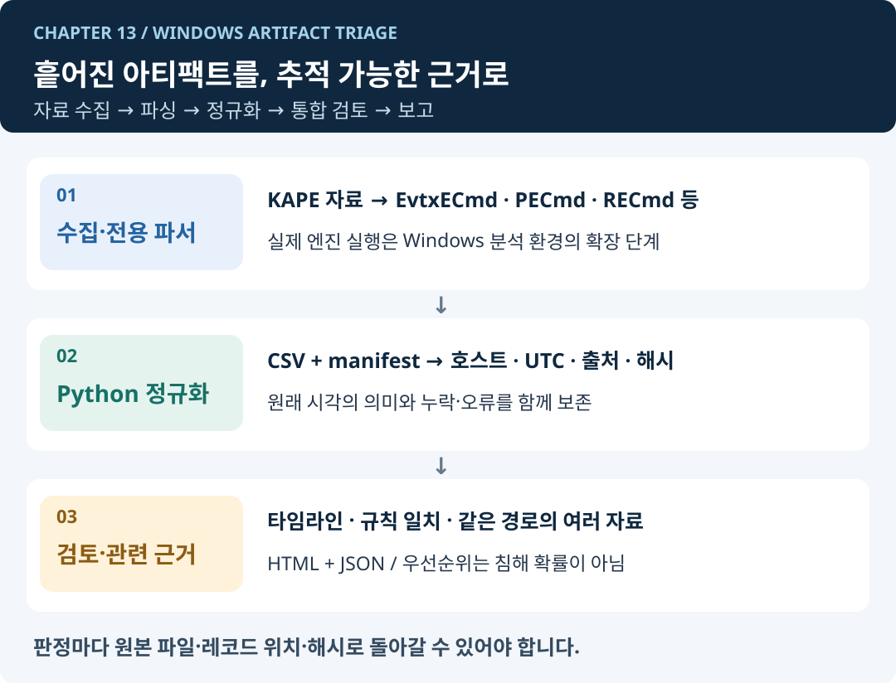

# 13. Python Automate 실무 자동화



이 장에서는 **KAPE 결과와 Windows 아티팩트를 통합하는 오프라인 분석 파이프라인**을 만듭니다. 여러 도구가 만든 결과를 같은 형식으로 정리하고, 호스트·시간·계정·파일 경로를 기준으로 함께 살펴봅니다.

## 1. 왜 KAPE 결과를 다시 Python으로 처리할까요?

KAPE로 자료를 수집하고 파서로 변환해도 결과는 여러 폴더와 표에 나뉘어 있습니다. 이벤트 로그에서 본 프로세스와 Prefetch의 실행 흔적, 레지스트리의 자동 실행 등록, MFT의 파일 시간을 함께 보려면 **열 이름·시간대·호스트·출처를 맞추는 작업**이 필요합니다.

이 실습에서는 Python으로 파일을 읽고, 날짜를 변환하고, 조건에 맞는 기록을 찾아 보고서를 만듭니다. 04·05장에서 배운 파일·데이터 처리 방법을 활용하며, 외부 도구를 실행하는 확장 실습에는 08장의 내용을 사용합니다.

DFIR은 디지털 포렌식과 사고 대응을 뜻합니다. **아티팩트**는 이벤트 로그나 실행 흔적처럼 시스템에 남은 기록입니다. 여러 아티팩트의 열 이름과 자료형을 맞추는 작업을 **정규화**, 기록을 시간순으로 모은 결과를 **타임라인**이라고 합니다. 이들을 차례로 처리하는 전체 과정을 이 장에서는 **분석 파이프라인**이라고 부릅니다.

| 단계 | 하는 일 | 함께 확인할 사항 |
| --- | --- | --- |
| 수집 | KAPE Target으로 원본 아티팩트 확보 | 수집 범위와 누락된 자료 |
| 파싱 | 전용 엔진으로 바이너리를 CSV·JSON 등으로 변환 | 파서 버전, 변환 오류, 출력 형식 |
| 정규화 | 호스트·시각·경로·필드 의미를 공통 구조로 정리 | 기록된 시각이 생성·실행·변경 중 무엇을 뜻하는지 |
| 검토 항목 추출 | 정해진 조건과 시간 범위에 맞는 기록 추출 | 정상 작업에서도 같은 조건이 나타나는지 |
| 자료 비교·보고서 작성 | 근거를 연결하고 처리 누락·한계를 표시 | 기록 사이의 관계를 뒷받침하는 추가 자료 |

## 2. 실습 범위: 실행 가능한 기본 과정과 확장 과정

**기본 과정**은 이미 파싱된 CSV를 입력으로 받습니다. 제공하는 합성 자료로 Windows·macOS·Linux에서 Python 표준 라이브러리만 사용해 실행합니다. 실제 KAPE 출력 CSV는 파서 버전·출력 옵션에 맞는 열 매핑을 먼저 작성해야 합니다.

**확장 과정**은 승인된 Windows 분석 환경에서 EvtxECmd·PECmd·RECmd·MFTECmd·Hayabusa·Chainsaw 등의 실행을 앞단에 연결하는 설계입니다. 이 저장소는 해당 실행 파일을 내려받거나 실행하지 않으며, Sigma 엔진 자체를 재구현하지 않습니다. 원본 EVTX·하이브를 읽는 단계와 CSV를 통합하는 단계를 구분합니다.


### 이 장의 최종 산출물

`manifest.json` → `normalized.jsonl` → `report.json` + `report.html` + `complete.json`

자료의 해시와 원본 레코드 위치를 보존하면서 통합 타임라인, 검토 항목, 같은 경로의 관련 아티팩트, 수집·처리 누락을 확인합니다.


## 3. 학습 순서

| 단원 | 핵심 질문 | 산출물 |
| --- | --- | --- |
| [13-1. DFIR 자동화 과제와 분석 범위](13-python-automate/13-1-automation-design.md) | 무엇을 자동화하고 무엇을 사람이 판단할까? | 분석 계획서 |
| [13-2. KAPE 결과 구조와 증거 목록](13-python-automate/13-2-file-batch.md) | 어떤 호스트의 어떤 자료를 받았나? | 입력 manifest·자료 해시 |
| [13-3. 아티팩트 파서와 분석 엔진 연계](13-python-automate/13-3-web-collection.md) | 어떤 도구가 어떤 형식을 처리하나? | 엔진 실행 설정·출력 검증 기준 |
| [13-4. 공통 스키마·시간 정규화·보고서](13-python-automate/13-4-spreadsheet-documents.md) | 다른 표를 어떻게 함께 읽을까? | 정규화 레코드와 출처 |
| [13-5. 완료 감지·워커·재실행 관리](13-python-automate/13-5-scheduling-gui.md) | 쓰는 중인 파일을 언제 처리할까? | 자동 분석 작업의 상태 관리 |
| [13-6. 프로젝트 A - KAPE 결과 정규화](13-python-automate/13-6-safe-file-organizer-project.md) | 자료를 빠뜨리지 않고 통합할 수 있나? | 공통 타임라인·입력 오류 |
| [13-7. 프로젝트 B - Windows 아티팩트 통합 분석](13-python-automate/13-7-spreadsheet-report-project.md) | 여러 근거로 검토 대상을 좁힐 수 있나? | 검토 보고서·같은 경로가 기록된 자료 목록 |

## 4. 먼저 실행해 보기

저장소 루트에서 새 폴더 이름으로 실행합니다. 첫 명령은 합성 CSV와 열 매핑 설정을 만들고, 두 번째 명령은 분석을 수행합니다.

```bash
python examples/13-kape-triage/make_sample.py outputs/kape-input
python examples/13-kape-triage/pipeline.py outputs/kape-input/manifest.json --output outputs/kape-report-01
```

```text
정규화 레코드 14건 · 검토 항목 8건 · 입력 문제 1건 · 시각 없음 1건 · 누락 자료 1개
처리 상태: partial / 종료 코드: 2
```

이 표기는 실제 JSON 요약을 읽기 쉽게 풀어 쓴 것입니다. 예제에는 시간대가 빠진 행과 누락된 Amcache 파일을 의도적으로 넣었습니다. 따라서 `partial`이 나오면 예상한 결과입니다. `report.html`은 브라우저에서 로컬 파일로 엽니다.

## 5. 학습 전제와 품질 기준

- 03장: 딕셔너리·함수·예외 처리
- 04장: 파일·CSV·JSON·원본 보존
- 05장: 날짜·자료형 검증, 필요할 때 pandas 집계
- 08·09장: 확장 실습에 필요한 CLI·외부 프로세스·테스트 개념

실제 사건 자료를 공개 저장소에 넣지 않습니다. 자료 경로·계정명·IP도 민감할 수 있으므로 실습에는 합성 데이터를 사용합니다. 분석 엔진과 규칙 버전, 수집 범위, 시간대 가정, 파싱 실패를 함께 남겨 결과를 다시 검토할 수 있게 합니다.

## 완료 기준

- [ ] KAPE 수집 결과와 파서 출력, 분석 결과를 구분합니다.
- [ ] 원본 해시·호스트·레코드 위치·시각 의미를 보존합니다.
- [ ] 누락·빈 파일·파싱 실패·행 오류·시각 없음을 구분합니다.
- [ ] 정상 관리 행위와 의심 행위를 검토할 근거를 함께 제시합니다.
- [ ] 동일 사건의 반복 분석에서 기존 결과를 덮어쓰지 않습니다.

---

시작: [13-1. DFIR 자동화 과제와 분석 범위](13-python-automate/13-1-automation-design.md)
