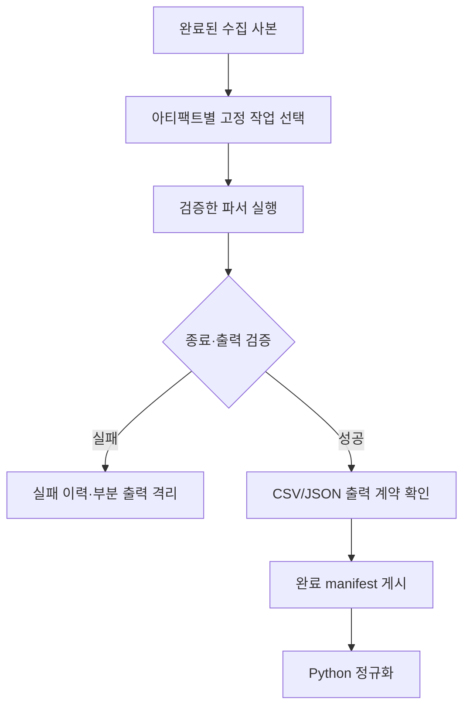

# 13-3. 아티팩트 파서와 분석 엔진 연계

> **핵심 질문** · 파일을 읽는 파서와 의심 조건을 찾는 탐지 엔진은 어떤 역할이 다를까요?

바이너리 아티팩트는 CSV처럼 직접 읽을 수 없습니다. 형식별 파서가 구조를 해석한 다음, 분석 엔진이나 Python 코드가 그 결과에 조건을 적용합니다. 하나의 도구가 두 역할을 함께 제공할 수도 있지만 결과를 기록할 때는 단계를 구분합니다.

## 1. 도구를 입력 형식과 연결합니다

| 아티팩트 | 파서·엔진 후보 | Python 통합 시 보존할 내용 |
| --- | --- | --- |
| EVTX | EvtxECmd, `python-evtx`; 탐지 결과는 Hayabusa·Chainsaw | Provider·Channel·Event ID·Record ID·시각·원본 경로 |
| Prefetch | PECmd | 마지막 실행 시각의 의미, 실행 횟수, 참조 정보 |
| Shimcache / Amcache | AppCompatCacheParser / AmcacheParser | 관찰·캐시·파일 시간의 의미, OS·파서 버전 |
| MFT / USN | MFTECmd | 엔트리·시퀀스, SI/FN 시각 구분, 변경 사유 |
| 레지스트리 | RECmd, `python-registry` | 하이브·키·값 이름·값 데이터·키 LastWrite |
| 작업·서비스 | 해당 EVTX, 작업 XML·레지스트리용 파서 | 등록·구성·실행을 구분하는 시간과 원본 위치 |
| 여러 자료 형식 | `dissect.target`의 지원 플러그인 | 플러그인별 출력 스키마와 지원 입력 확인 |

도구별 공식 링크와 해석 한계는 [13-8](13-8-artifact-reference.md)에 정리했습니다. `python-evtx`는 EVTX용이며 Prefetch·Shimcache·Amcache의 공통 파서로 사용하지 않습니다.

## 2. 실제 엔진을 실행하기 전에 고정할 것

| 계약 | 기록할 항목 |
| --- | --- |
| 실행 파일 | 검증한 경로·버전·해시, 실행 환경 |
| 입력 | 읽기 전용 작업 사본 경로·자료 해시 |
| 옵션 | 명시적 인자 배열, 출력 형식·프로필 |
| 탐지 규칙 | 규칙 집합 버전·커밋·매핑 설정 |
| 자원 제한 | 실행 기한, 워커 수, 디스크·출력 크기 |
| 성공 확인 | 종료 코드뿐 아니라 산출물 존재·헤더·행 수 검증 |

자료 안의 명령행을 실행 인자로 가져오지 않습니다. 명령행은 **분석할 텍스트**이며 실행할 작업이 아닙니다. 웹 검색으로 찾은 바이너리나 증거 폴더 안의 프로그램을 자동 실행하지 않습니다.

## 3. 실행 흐름 설계 — 확장 과정

08장의 `subprocess.run()`을 연결할 때 `shell=False`와 인자 목록, 명시적 작업 폴더, 타임아웃을 사용합니다. 도구별 옵션은 설치한 버전의 공식 도움말과 일치시킵니다. 이 교안의 기본 코드에는 외부 프로세스 실행이 없으며, 이 단계는 Windows 분석 환경에서 별도로 검증하는 확장 과제입니다.

## 4. Sigma 결과를 가져오는 것과 Sigma를 실행하는 것

Sigma는 탐지 조건을 표현하는 규칙 형식입니다. 엔진마다 필드 매핑과 지원 기능, 출력 프로필이 달라 같은 규칙 이름만으로 동일 결과를 가정할 수 없습니다.

기본 파이프라인의 `artifact="detection"`은 **이미 생성된 탐지 CSV 결과**를 가져옵니다. 매핑 가능한 필드는 `rule_id`, `rule_title`, `rule_level`, `attack_id` 등입니다. 원래 정보는 정규화 행에 남기고, 보고서에는 `IMPORTED:`로 시작하는 검토 항목을 만듭니다. 이것은 Sigma 규칙 실행이나 triager의 전체 기능 재현이 아닙니다.

두 엔진이 같은 원본 이벤트에 일치해도 독립된 침해 증거 두 개라고 점수를 합치지 않습니다. 엔진별 규칙 정보와 원본 이벤트 식별자를 연결하고 중복 여부를 따로 검토합니다.

## 실습과 완료 기준

1. 한 아티팩트를 선택해 원본 형식·파서·출력 형식·필수 열을 적습니다.
2. 출력 파일이 있어도 실행 실패로 분류해야 하는 사례를 두 개 만듭니다.
3. 빈 탐지 결과에 대해서도 실행한 규칙·입력 범위가 필요함을 설명합니다.

- [ ] 파싱과 탐지, 결과 가져오기의 차이를 설명합니다.
- [ ] 엔진 옵션·규칙 버전을 고정하는 작업 계약이 있습니다.
- [ ] 실제 사건 자료나 바이너리를 저장소에 추가하지 않습니다.

---

다음: [13-4. 공통 스키마·시간 정규화·보고서](13-4-spreadsheet-documents.md)
