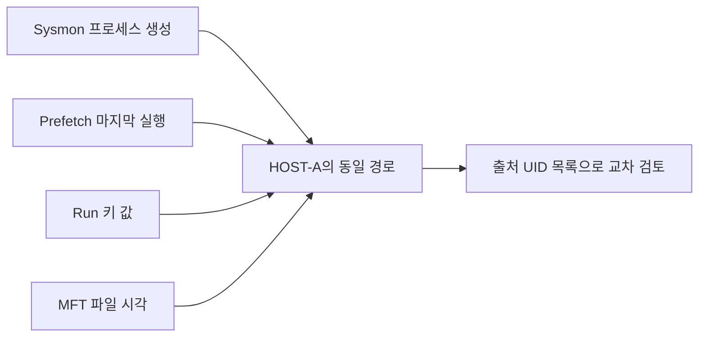

# 13-7. 프로젝트 B - Windows 아티팩트 통합 분석

> **핵심 질문** · 여러 자료에서 발견한 흔적을 어떤 조건으로 연결하고, 어떻게 검토 대상으로 제시할까요?

프로젝트 A의 공통 레코드 위에 규칙·시간 창·관련 경로 조회를 추가합니다. 프로세스 생성, 로그온, 계정·작업·서비스 등록, 파일·레지스트리 시각을 함께 읽습니다. 분석 결과는 **추가 확인이 필요한 검토 항목**으로 보고합니다.

## 1. 합성 사건의 이야기

HOST-A에서 같은 계정의 로그온 실패가 반복됩니다. 이후 사용자 폴더의 프로세스 생성, 같은 경로의 Prefetch·Run 키·MFT 자료가 나타납니다. HOST-B에는 같은 계정·출발 IP의 로그온과 계정·작업·서비스 등록 기록이 있습니다.

이 자료가 악성 행위를 재현한 것은 아닙니다. 승인된 관리 작업일 가능성과 자료 품질 문제를 함께 검토하는 **합성 기록 분석**입니다. 등록·실행 명령을 전송하거나 실제 호스트 상태를 바꾸지 않습니다.

## 2. 교육용 규칙과 한계

| 규칙 | 조건 | 우선순위 | 추가 확인 |
| --- | --- | --- | --- |
| `LAB-AUTH-01` | 동일 호스트·계정·IP의 Security 4625가 5분 안에 3건 이상 | 40 | 오입력·계정 설정·실패 사유 |
| `LAB-PROCESS-01` | Sysmon 1의 경로에 AppData 또는 C 드라이브 Windows Temp가 포함 | 30 | 부모·서명·내용 해시·정상 배포 |
| `LAB-AUTORUN-01` | 레지스트리 Run/RunOnce 값 관찰 | 40 | 승인된 시작 프로그램인지, 실제 실행 근거 |
| `LAB-TIME-01` | MFT의 비교 대상 SI/FN 시각이 다름 | 20 | 복사·이동·파일시스템 동작 |
| `LAB-HOST-01` | 같은 계정·IP의 4624, LogonType 3/10이 10분 내 2개 이상 호스트에 존재 | 20 | NAT·관리 작업·시계 오차·인증 맥락 |
| `LAB-ACCOUNT-01` | Security 4720 | 20 | 계정 생성 승인·대상 계정 |
| `LAB-TASK-01` | Security 4698 | 20 | 작업 XML·트리거·실행 대상 |
| `LAB-SERVICE-01` | System / Service Control Manager 7045 | 20 | 서비스 구성·설치 이력 |

EVTX 규칙은 Event ID만 보지 않고 `Channel`·`Provider`를 함께 확인합니다. 로그온 규칙의 `user`는 대상 계정 의미로 매핑해야 합니다. 서로 다른 이벤트의 Subject/Target 사용자를 무조건 한 열로 합치지 않습니다.

교육용 값 20·30·40은 보고서의 정렬 기준입니다. 점수를 합산해 호스트 침해 확률을 만들지 않습니다. Run 키 규칙의 ATT&CK `T1547.001`은 검토용 분류이며 자동으로 공격을 입증하지 않습니다.

## 3. 중복과 시간 창

기본 코드의 EVTX 규칙 계산은 호스트·채널·Provider·Record ID·UTC가 같은 항목을 한 이벤트로 취급합니다. 원래 레코드 자체는 모두 보존합니다. 이 식별자가 같은데 내용이 다르면 실제 자료에서는 충돌 검토가 추가로 필요합니다.

로그온 시간 창은 시간순 레코드에 적용하며 **그룹별 첫 일치 창 하나**를 보고합니다. 같은 그룹의 모든 캠페인·반복 발생 구간을 분리하는 구현은 아닙니다. 계정 이름은 선언된 문자열로 비교하므로 SID·도메인 별칭 정규화는 별도 설계합니다.

## 4. 관련 경로는 보강 자료 조회입니다

`related_paths`는 같은 호스트의 경로를 Windows 경로 규칙으로 정리한 뒤 여러 종류의 아티팩트를 연결합니다. 예제의 HOST-A 경로에는 EVTX·Prefetch·레지스트리·MFT 자료가 모입니다.



동일 경로라도 파일 내용이 바뀌었을 수 있습니다. 해시·파일 ID·원본 시각을 함께 보강해야 하며, 기본 경로 연결은 시간상 인과관계나 동일 바이너리의 증명이 아닙니다. 시각이 없는 자료도 경로별 참고 맥락으로는 연결할 수 있습니다.

## 5. 실행과 예상 결과

13-6에서 이미 실행했다면 같은 보고서를 사용합니다. 새로 실행하려면 다른 출력 폴더를 지정합니다.

```bash
python examples/13-kape-triage/pipeline.py outputs/kape-input/manifest.json --output outputs/kape-report-02
```

예상값은 정규화 14건, 검토 항목 8건, 입력 오류 1건, 시각 없음 1건, 누락 자료 1개입니다. `report.html`을 브라우저로 열어 다음 순서로 확인합니다.

1. **처리 범위:** Amcache 미수집과 HOST-B의 부분 처리를 먼저 확인합니다.
2. **검토 항목:** 규칙·우선순위·근거 UID·추가 확인 내용을 읽습니다.
3. **통합 타임라인:** MFT의 오래된 생성 시각을 프로세스 실행 시각으로 오해하지 않습니다.
4. **입력 오류:** 시간대 누락 행을 원본 레코드 번호로 찾습니다.
5. **전체 JSON:** `related_paths`로 관련 자료를 찾고 원본 CSV와 대조합니다.

HTML은 자체 포함 스타일을 사용하며 외부 CDN·스크립트·네트워크 분석을 사용하지 않습니다. 수집 문자열은 HTML로 실행되지 않도록 이스케이프합니다. 화면의 시각 표시 한도를 넘는 자료는 JSON/JSONL에서 확인합니다.

## 6. 실제 자동 분석으로 확장할 때

| 확장 | 먼저 준비할 것 | 판정의 한계 |
| --- | --- | --- |
| Hayabusa·Chainsaw 결과 | 엔진·규칙·매핑 버전, 실제 출력 스키마 | Sigma 일치만으로 침해 확정 불가 |
| LOLBAS 관련 검토 | 실행 파일·명령행·부모·사용자·서명·정상 작업 기준 | PowerShell·CMD 존재만으로 악성 판단 금지 |
| USN 대량 변경 | 변경 사유·파일 ID·시간 구간·볼륨 기준선 | 정상 배포·백업·동기화와 구분 |
| 작업 XML·서비스·Winlogon | 전용 파서의 키·값·트리거·실행 경로 | 등록 시점과 실행 시점 구분 |
| 다중 호스트 조사 | 계정 SID·주소 할당 이력·시계 오차·접속 방향 | 4624만으로 내부 이동 경로 확정 불가 |
| 기타 자료 | SRUM·Jump Lists·UserAssist·브라우저·USB 어댑터 | 활동 종류와 보존·수집 범위 확인 |

기본 프로그램은 이 확장 표 전체를 구현한 제품이 아닙니다. CSV 정규화, 표에 명시한 교육용 규칙, 경로 관련성, HTML/JSON 보고서가 실행 범위입니다.

## 7. 테스트와 제출물

```bash
python -m unittest discover -s tests -p 'test_kape_pipeline.py' -v
```

제출물은 코드와 manifest, 합성 데이터 재생성 방법, 보고서, 정상 관리 행위일 가능성을 포함한 검토 메모입니다. 실제 사건 데이터는 제출 저장소에 넣지 않습니다.

- [ ] 규칙별 조건과 근거 UID를 설명합니다.
- [ ] 같은 원본 이벤트의 복제본으로 경보 수를 부풀리지 않습니다.
- [ ] 시간 창·같은 경로·ATT&CK 분류의 한계를 설명합니다.
- [ ] 자료 누락과 검토 항목 0건을 구분합니다.
- [ ] 보고서에서 원본 CSV 레코드로 돌아갈 수 있습니다.

---

다음: [13-8. 도구 검증과 아티팩트 해석 참고](13-8-artifact-reference.md)
