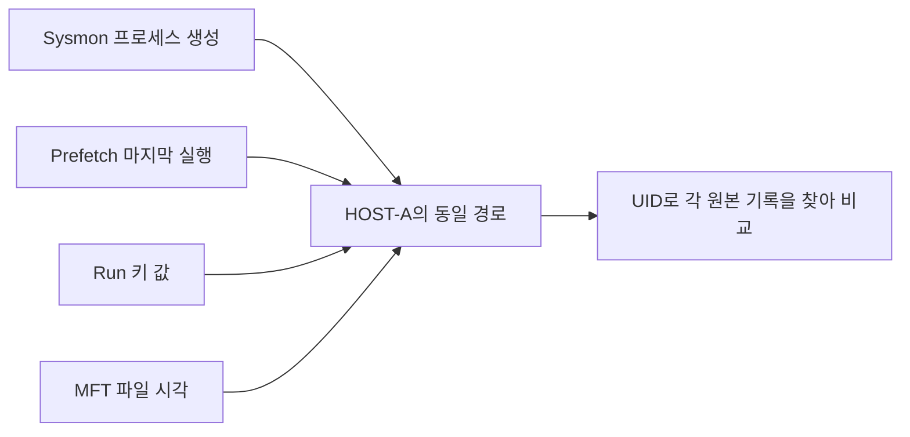

# 13-7. 프로젝트 B - Windows 아티팩트 통합 분석

> 실습 준비: [이 절의 노트북 보기](../notebooks/13-7-spreadsheet-report-project.ipynb) · [13장 교육자료 ZIP 받기](https://github.com/zxz3650/Python/raw/refs/heads/master/downloads/chapter-13.zip) · [자료 준비·실행 안내](../PRACTICE.md#download)
>
> 13장 ZIP을 새 폴더에 풀고 폴더 구조를 유지한다. 다음 갱신 때도 이 장의 자료 버전이 바뀐 경우에만 다시 받는다.

> **핵심 질문** · 여러 자료에서 발견한 흔적을 어떤 조건으로 연결하고, 어떻게 검토 대상으로 제시할까요?

프로젝트 A에서 정리한 기록에 분석 규칙을 적용합니다. 일정 시간 안에 반복된 이벤트를 찾고, 같은 파일 경로가 기록된 아티팩트를 모아 비교합니다. 프로세스 생성, 로그온, 계정·작업·서비스 등록, 파일·레지스트리 시각을 함께 읽습니다. 분석 결과는 **추가 확인이 필요한 검토 항목**으로 보고합니다.

## 1. 실습 데이터의 상황

HOST-A에서 같은 계정의 로그온 실패가 반복됩니다. 이후 사용자 폴더의 프로세스 생성, 같은 경로의 Prefetch·Run 키·MFT 자료가 나타납니다. HOST-B에는 같은 계정·출발 IP의 로그온과 계정·작업·서비스 등록 기록이 있습니다.

이 자료가 악성 행위를 재현한 것은 아닙니다. 승인된 관리 작업일 가능성과 자료 품질 문제를 함께 검토하는 **합성 기록 분석**입니다. 등록·실행 명령을 전송하거나 실제 호스트 상태를 바꾸지 않습니다.

## 2. 교육용 규칙과 한계

| 규칙 | 조건 | 우선순위 | 추가 확인 |
| --- | --- | --- | --- |
| `LAB-AUTH-01` | 동일 호스트·계정·IP의 Security 4625가 5분 안에 3건 이상 | 40 | 오입력·계정 설정·실패 사유 |
| `LAB-PROCESS-01` | Sysmon 1의 경로에 AppData 또는 C 드라이브 Windows Temp가 포함 | 30 | 부모·서명·내용 해시·정상 배포 |
| `LAB-AUTORUN-01` | 레지스트리 Run/RunOnce에 등록된 값 | 40 | 승인된 시작 프로그램인지, 실제 실행 근거 |
| `LAB-TIME-01` | MFT의 비교 대상 SI/FN 시각이 다름 | 20 | 복사·이동·파일시스템 동작 |
| `LAB-HOST-01` | 같은 계정·IP의 4624, LogonType 3/10이 10분 내 2개 이상 호스트에 존재 | 20 | NAT·관리 작업·시계 오차·인증 방식과 접속 이력 |
| `LAB-ACCOUNT-01` | Security 4720 | 20 | 계정 생성 승인·대상 계정 |
| `LAB-TASK-01` | Security 4698 | 20 | 작업 XML·트리거·실행 대상 |
| `LAB-SERVICE-01` | System / Service Control Manager 7045 | 20 | 서비스 구성·설치 이력 |

EVTX 규칙은 Event ID만 보지 않고 `Channel`·`Provider`를 함께 확인합니다. 로그온 규칙의 `user`는 로그온 대상 계정이 담긴 열에 연결해야 합니다. 서로 다른 이벤트의 Subject/Target 사용자를 무조건 한 열로 합치지 않습니다.

교육용 값 20·30·40은 보고서의 정렬 기준입니다. 점수를 합산해 호스트 침해 확률을 만들지 않습니다. Run 키 규칙의 ATT&CK `T1547.001`은 검토용 분류이며 자동으로 공격을 입증하지 않습니다.

## 3. 중복 이벤트 제거와 시간 범위 설정

기본 코드의 EVTX 규칙 계산은 호스트·채널·Provider·Record ID·UTC가 같은 항목을 한 이벤트로 취급합니다. 원래 레코드 자체는 모두 보존합니다. 이 식별자가 같은데 내용이 다르면 실제 자료에서는 충돌 검토가 추가로 필요합니다.

로그온 기록을 시간순으로 정렬한 뒤, 규칙에서 정한 시간 범위 안에 조건을 만족하는 기록이 모였는지 확인합니다. 이런 분석 범위를 **시간 창(time window)**이라고 합니다. 예제는 각 그룹에서 **조건을 처음 만족한 시간 구간 하나**만 보고합니다. 이후 같은 조건이 반복되는 구간까지 모두 찾으려면 코드를 확장해야 합니다.

계정은 CSV에 적힌 이름으로 비교합니다. 같은 계정이 다른 이름으로 기록된 경우까지 연결하려면 SID(Windows의 보안 식별자)와 도메인 정보를 추가로 확인해야 합니다.

## 4. 같은 파일 경로가 기록된 아티팩트 함께 살펴보기

보고서의 `related_paths`에는 같은 호스트에서 동일한 파일 경로를 가리키는 아티팩트가 모입니다. 경로를 비교하기 전에 Windows 경로 표기 규칙에 맞게 정리합니다. 예제의 HOST-A 경로에는 EVTX·Prefetch·레지스트리·MFT 자료가 모입니다.



예를 들어 같은 경로의 실행 파일이 업데이트되면 경로는 같아도 내용은 달라집니다. 따라서 같은 파일인지 판단하려면 해시와 파일 ID를 확인하고, 기록이 남은 시각도 비교해야 합니다. `related_paths`는 비교할 자료를 모아 주는 기능입니다. 시각이 없는 기록도 여기에 포함될 수 있으므로, 목록에 함께 있다는 이유만으로 같은 시점의 활동이라고 판단하지 않습니다.

## 5. 실행과 예상 결과

13-6에서 이미 실행했다면 같은 보고서를 사용합니다. 새로 실행하려면 다른 출력 폴더를 지정합니다.

```bash
python examples/13-kape-triage/pipeline.py outputs/kape-input/manifest.json --output outputs/kape-report-02
```

예상값은 정규화 14건, 검토 항목 8건, 입력 오류 1건, 시각 없음 1건, 누락 자료 1개입니다. `report.html`을 브라우저로 열어 다음 순서로 확인합니다.

1. **처리 범위:** Amcache 미수집과 HOST-B의 부분 처리를 먼저 확인합니다.
2. **검토 항목:** 규칙·우선순위·근거 UID·추가 확인 내용을 읽습니다.
3. **통합 타임라인:** MFT의 오래된 생성 시각을 프로세스 실행 시각으로 오해하지 않습니다.
4. **입력 오류:** 시간대 누락 행을 원본 레코드 번호로 찾습니다.
5. **전체 JSON:** `related_paths`로 관련 자료를 찾고 원본 CSV와 대조합니다.

HTML에는 화면 구성에 필요한 스타일이 들어 있어 외부 파일을 불러오지 않고 열 수 있습니다. 수집 문자열은 HTML로 실행되지 않도록 이스케이프합니다. 화면의 타임라인 표시 한도를 넘는 자료는 JSON/JSONL에서 확인합니다.

## 6. 실제 자동 분석으로 확장할 때

| 확장 | 먼저 준비할 것 | 판정의 한계 |
| --- | --- | --- |
| Hayabusa·Chainsaw 결과 | 엔진·규칙·매핑 버전, 실제 출력 스키마 | Sigma 일치만으로 침해 확정 불가 |
| LOLBAS 관련 검토 | 실행 파일·명령행·부모·사용자·서명·정상 작업 기준 | PowerShell·CMD 존재만으로 악성 판단 금지 |
| USN 대량 변경 | 변경 사유·파일 ID·시간 구간·볼륨 기준선 | 정상 배포·백업·동기화와 구분 |
| 작업 XML·서비스·Winlogon | 전용 파서의 키·값·트리거·실행 경로 | 등록 시점과 실행 시점 구분 |
| 다중 호스트 조사 | 계정 SID·주소 할당 이력·시계 오차·접속 방향 | 4624만으로 내부 이동 경로 확정 불가 |
| 기타 자료 | SRUM·Jump Lists·UserAssist·브라우저·USB 어댑터 | 활동 종류와 보존·수집 범위 확인 |

제공 프로그램으로 실행할 수 있는 기능은 CSV 정규화, 2절의 교육용 규칙 적용, 같은 경로가 기록된 자료 조회, HTML/JSON 보고서 생성입니다. 위 표의 기능은 이를 마친 뒤 추가할 과제입니다.

## 7. 테스트와 제출물

```bash
python -m unittest discover -s tests -p 'test_kape_pipeline.py' -v
```

제출물은 코드와 manifest, 합성 데이터 재생성 방법, 보고서, 정상 관리 행위일 가능성을 포함한 검토 메모입니다. 실제 사건 데이터는 제출 저장소에 넣지 않습니다.

- [ ] 규칙별 조건과 근거 UID를 설명합니다.
- [ ] 같은 원본 이벤트의 복제본으로 경보 수를 부풀리지 않습니다.
- [ ] 시간 창·같은 경로·ATT&CK 분류의 한계를 설명합니다.
- [ ] 자료 누락과 검토 항목 0건을 구분합니다.
- [ ] 보고서에서 원본 CSV 레코드로 돌아갈 수 있습니다.

---

[13장 안내로 돌아가기](../13-python-automate.md)
