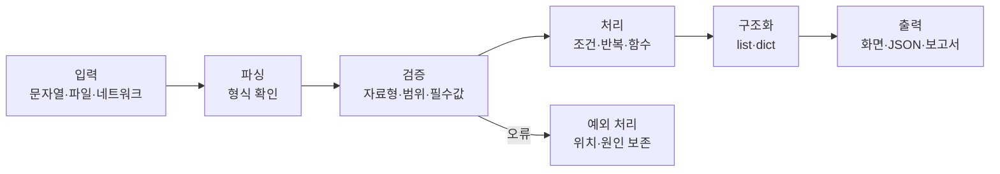

# 공식 기초교안
> 📘 이 과정의 기준 교재는 [화이트 해커를 위한 Python 기초과정](https://app.notion.com/p/3a6436c34cbd80549d0dcd801446847c)이다. 아래 실습과 개념 보강은 공식 교재를 대체하지 않고, 보안 실무에서 실행·검증·분석하는 능력을 확장한다.
# 대상과 목표
- **대상**: Python을 처음 배우거나 기초를 다시 정리하는 보안 실무자
- **Python 선수지식**: 없음
- **환경 선수 과정**: 02. 파이썬 설치 완료
- **최종 목표**: Python 코드를 읽고 수정하며, 합성 또는 허가된 로그로 재현 가능한 분석 도구를 작성한다.
- **다음 과정**: Python 문법 심화교안
# 학습 경로
1. 값과 자료형: str, int, float, bool, None, bytes
2. 제어 흐름: 조건문, 반복문, 컴프리헨션
3. 자료구조: list, tuple, set, dict
4. 함수와 모듈: 책임 분리, import, main 구조
5. 파일과 데이터: pathlib, 파일 I/O, JSON, CSV, 인코딩
6. 오류와 검증: 예외 처리, 디버깅, assert, pytest
7. 보안 데이터 실습: 로그 파싱, IP·시간·필드 검증, 집계
8. 미니 프로젝트: 오류를 보존하는 로그 분석기와 JSON 보고서
# 공식 교안 실습 연결
- 1장 input()과 형변환 → 로그 필드 자료형 검증
- 2~3장 조건·반복 → 탐지 조건과 이벤트 순회
- 4~5장 list·dict → IP 목록과 실패 횟수 집계
- 6장 문자열 → 로그 split()과 필드 추출
- 7~8장 함수·파일·예외 → 재사용 가능한 분석기
- 9장 로그 분석기 → 아래 Jupyter Book 연계 실습과 확장 프로젝트
# 수료 산출물
- 코드가 포함된 로그 분석기
- 정상·오류·경계값 입력에 대한 테스트
- 분석 결과 JSON
- 파싱 오류의 행 번호와 원인
- 실행 방법과 입력 형식을 설명하는 README
---
# Jupyter Book 연계 실습 — 로그 요약기
## 학습 목표
- list·dict·함수·예외 처리를 조합한다.
- 텍스트 로그를 구조화하고 DENY 이벤트를 집계한다.
- 오류 행을 조용히 버리지 않고 위치와 원인을 보존한다.
- assert와 pytest를 구분하여 결과를 검증한다.
## 기본 데이터와 파서
```python
from collections import Counter

sample = """2026-07-27T09:00:00Z ALLOW 10.0.0.5 /index
2026-07-27T09:00:01Z DENY 198.51.100.9 /admin
2026-07-27T09:00:02Z DENY 198.51.100.9 /login
2026-07-27T09:00:03Z ALLOW 10.0.0.8 /health"""

def parse_line(line):
    parts = line.split()
    if len(parts) != 4:
        raise ValueError(f"잘못된 로그 형식: {line!r}")
    timestamp, action, ip, path = parts
    return {"time": timestamp, "action": action, "ip": ip, "path": path}

records = [parse_line(line) for line in sample.splitlines()]
denied = Counter(r["ip"] for r in records if r["action"] == "DENY")
assert denied["198.51.100.9"] == 2
denied
```
## 직접 해보기
1. 경로별 요청 수를 집계한다.
2. 잘못된 한 줄을 추가해 오류 메시지를 확인한다.
3. DENY가 3회 이상인 IP만 출력한다.
4. 빈 줄은 건너뛰되 오류가 있는 줄의 번호는 기록한다.
## 오류를 보존하는 파서
```python
def parse_lines(text):
    records, errors = [], []
    for number, line in enumerate(text.splitlines(), start=1):
        if not line.strip():
            continue
        try:
            records.append(parse_line(line))
        except ValueError as exc:
            errors.append({"line": number, "error": str(exc)})
    return records, errors
```
정상 이벤트만 반환하면 분석 결과가 실제보다 깨끗하게 보일 수 있다. 실무 분석기는 정상 결과와 파싱 오류를 함께 반환해야 한다.
---
# 개념 보강 — 데이터가 코드 안에서 흐르는 방식

## 핵심 개념 1 — 변수와 자료형
변수는 값을 담는 상자라기보다 **값을 가리키는 이름**이다. 보안 데이터는 숫자, 문자열, 바이트, 목록, 키-값 구조가 섞이므로 자료형을 정확히 구분해야 한다.
| 자료형 | 예 | 보안 활용 |
|---|---|---|

| 자료형 
| 예 
| 보안 활용 

| str 
| "198.51.100.9" 
| 로그·URL·도메인 

| bytes 
| b"MZ" 
| 패킷·파일 헤더 

| list 
| \[80, 443\] 
| 포트·이벤트 목록 

| tuple 
| ("tcp", 443) 
| 변경하지 않을 구조화 값 

| set 
| \{"admin", "root"\} 
| 중복 제거·허용 목록 

| dict 
| \{"ip": "..."\} 
| 구조화 이벤트·보고서 

## 핵심 개념 2 — 함수와 검증
```python
from ipaddress import ip_address

def validate_ip(value):
    ip_address(value)
    return value

def is_suspicious(record):
    return record["action"] == "DENY" and record["path"] in {"/admin", "/login"}
```
정규식은 후보를 찾는 데 유용하지만, IP 주소의 의미 검증은 ipaddress 같은 표준 라이브러리로 수행한다.
## 핵심 개념 3 — 파일·JSON·CSV
```python
import json
from pathlib import Path

def load_json(path):
    path = Path(path)
    if not path.is_file():
        raise FileNotFoundError(path)
    try:
        return json.loads(path.read_text(encoding="utf-8"))
    except json.JSONDecodeError as exc:
        raise ValueError(f"JSON 형식 오류: {path}") from exc
```
pathlib로 경로를 처리하고, 파일 없음·인코딩 오류·손상된 형식을 구분한다. CSV는 쉼표가 포함된 인용 필드를 고려해 csv 모듈을 사용한다.
## 핵심 개념 4 — assert와 pytest
assert는 학습 중 불변식을 확인하는 도구다. 사용자 입력 검증이나 권한 판정의 대체 수단으로 사용하지 않는다. 실제 테스트는 pytest로 작성한다. 정상·오류·경계값을 모두 테스트한다.
---
# 예제문제
## 문제 1 — 자료형 선택
```python

```
IP별 로그인 실패 횟수를 저장하기 가장 적절한 자료형은 무엇인가?
1. str
2. dict
3. bool
4. bytes
<details>
<summary>정답과 해설</summary>
	**정답: 2번 dict**. IP를 키로, 실패 횟수를 값으로 저장한다.
</details>
## 문제 2 — 코드 수정
형식이 잘못된 줄에서 오류가 나지 않고 행 번호와 원인이 기록되도록 parse_lines를 수정한다.
## 문제 3 — 입력 검증
198.51.100.999가 포함된 로그를 정상 이벤트로 처리하지 않도록 ipaddress.ip_address()를 사용해 수정한다.
---
# 미니 프로젝트 — 로그 분석기
입력 형식은 다음과 같다.
```javascript
2026-07-27T09:00:00Z ALLOW 10.0.0.5 /index
2026-07-27T09:00:01Z DENY 198.51.100.9 /admin
```
필수 검증:
- 필드 수가 4개인지
- timestamp가 ISO 형식인지
- IP 주소가 유효한지
- action이 ALLOW 또는 DENY인지
- path가 /로 시작하는지
결과에는 전체 이벤트 수, IP별 실패 횟수, 임계치 이상 IP, 시간 범위, 파싱 오류 목록을 포함한다.
## 확장 과제
- --threshold, --input, --output 명령줄 인자를 추가한다.
- JSON과 CSV 입력을 모두 지원한다.
- UTC 기준 시간 범위를 계산한다.
- 사용자명·토큰·민감 경로를 마스킹한다.
- generator로 대용량 로그를 한 줄씩 처리한다.
- [parser.py](http://parser.py), [report.py](http://report.py), [main.py](http://main.py)로 모듈을 분리한다.
- 정상·오류·경계값 테스트를 작성한다.
## 완료 기준
- [ ] 공식 교안의 직접 해보기 문제를 실행한다.
- [ ] 정상 입력과 비정상 입력을 구분한다.
- [ ] 파싱 오류의 위치와 원인을 보존한다.
- [ ] 결과가 정해진 JSON 구조로 재현된다.
- [ ] 함수별 책임이 분리되어 있다.
- [ ] 합성 데이터 또는 명시적으로 허가된 데이터만 사용한다.
- [ ] 실행 방법과 입력 형식을 README에 기록한다.
# 보안·윤리 주의
실제 개인정보와 운영 로그를 학습 데이터로 사용하지 않는다. 합성 데이터 또는 명시적으로 허가된 데이터만 사용하며, 외부 시스템에 대한 요청·스캔·분석은 소유권 또는 명시적 허가가 있는 환경에서만 수행한다.
# 참조 주피터북 기준 학습 구성
이 과정은 [03_python_basics.ipynb](https://drive.google.com/file/d/11xD0M-CDVjIZ5Vqr8LJyIFRCJOzvjJdo/view?usp=drive_link)의 실행 순서를 기준으로 학습한다. 각 절은 설명을 읽은 뒤 코드 셀을 실행하고, 입력값을 바꿔 결과를 예측하는 방식으로 진행한다.
## 1. 자료형과 기본 표현
- 변수와 값의 관계
- `str`, `int`, `float`, `bool`, `None`
- `list`, `tuple`, `set`, `dict`
- `type()`과 자료형 확인
- 보안 데이터에서 문자열, 숫자, 부울값, 누락값의 차이
## 2. 연산자와 형변환
- 산술 연산자: `+`, `-`, `*`, `/`, `//`, `%`, `**`
- 비교 연산자와 논리 연산자
- 문자열과 숫자의 형변환
- 포트, 실패 횟수, 임계치 계산
## 3. 입력과 안전한 변환
- `input()`은 항상 문자열을 반환한다.
- 숫자 입력은 `int()` 또는 `float()`으로 변환한다.
- 변환할 수 없는 입력은 `ValueError`가 발생하므로 예외 처리가 필요하다.
- 외부 입력을 신뢰하지 않고 자료형·범위·형식을 확인한다.
## 4. 문자열 처리
- 인덱싱과 슬라이싱
- `strip()`, `lower()`, `upper()`, `replace()`
- `split()`과 `join()`
- `in`과 `not in`을 이용한 부분 문자열 검사
- f-string을 이용한 분석 결과 출력
로그에서 문자열 처리는 단순 출력이 아니라 파싱과 정규화의 첫 단계다. 원본을 보존해야 하는 경우에는 정규화한 값과 원본 값을 구분하여 저장한다.
## 5. 조건과 truthy/falsey
Python에서는 빈 문자열, 0, 빈 컬렉션, `None`이 거짓으로 평가된다. 이 특성을 이해해야 누락된 로그와 정상적인 0 값을 혼동하지 않는다.
- `if`, `elif`, `else`
- `None`과 값이 없는 상태
- `True`와 `False`
- 중첩 조건과 조기 반환
- 임계치별 NORMAL·WARNING·CRITICAL 분류
## 6. 반복과 자료구조 순회
- `for`와 `while`
- `break`와 `continue`
- `enumerate()`로 행 번호 보존
- `zip()`으로 관련 목록 결합
- list·tuple·set·dict 순회
- 언패킹과 컴프리헨션
보안 로그에서는 반복문을 이용해 이벤트를 순회하고, `enumerate()`를 이용해 오류가 발생한 원본 행을 추적한다.
## 7. 함수와 스코프
- 함수 정의와 반환값
- 인자와 기본값
- 지역 변수와 전역 변수
- 함수별 단일 책임
- `parse`, `validate`, `summarize` 분리
권장 구조:
```python
def parse_line(line):
    ...

def validate_record(record):
    ...

def summarize(records):
    ...
```
## 8. 파일 처리
with open(...)을 사용해 파일을 안전하게 열고 닫는다. 파일 경로는 가능하면 `pathlib.Path`로 다룬다.
- 텍스트 파일 읽기와 쓰기
- UTF-8 인코딩
- 파일 확장자와 경로 처리
- `read()`, `readline()`, `readlines()`
- 대용량 파일을 고려한 한 줄씩 처리
- 파일 없음과 권한 오류
## 9. 예외 처리
- `try/except`
- `else`와 `finally`
- `raise`로 의미 있는 오류 발생
- `ValueError`, `FileNotFoundError`, `JSONDecodeError`
- 오류 메시지에 행 번호·파일명·원인을 포함
- 오류 행을 버리지 않고 오류 목록에 기록
예외를 무조건 숨기거나 `except Exception`으로 모두 삼키지 않는다. 예상 가능한 오류와 프로그래밍 오류를 구분한다.
## 10. str과 bytes
- `str`은 문자 데이터, `bytes`는 0~255 범위의 바이트열
- `encode()`와 `decode()`
- bytes 인덱싱 결과가 정수라는 점
- 파일 헤더, 패킷, 해시 입력에서 bytes의 역할
- 문자열과 bytes를 암묵적으로 혼용하지 않기
이 내용은 다음 심화 과정의 바이너리 파싱·네트워크·암호 실습을 위한 선수 개념이다.
## 11. assert와 모듈
- `assert`로 학습 중 불변식 확인
- 실제 사용자 입력 검증에는 assert를 사용하지 않기
- `import`와 표준 라이브러리
- `__name__ == "__main__"` 구조
- 기능별 모듈 분리
실제 반복 테스트는 `pytest`로 작성한다. 정상 입력뿐 아니라 빈 입력, 손상된 입력, 경계값을 포함한다.
## 12. 미니 프로젝트 — 인증 로그 분석
주피터북의 미니 프로젝트는 다음 형식의 합성 인증 로그를 사용한다.
```plain text
2026-08-10T10:00:00Z ALLOW alice 10.0.0.5 /index
2026-08-10T10:00:01Z DENY bob 198.51.100.9 /admin
2026-08-10T10:00:02Z DENY bob 198.51.100.9 /login

BROKEN LINE
```
구현 단계:
1. 한 줄을 공백 기준으로 분리한다.
2. 정상 행은 timestamp, action, user, ip, path로 구조화한다.
3. 필드 수가 잘못된 행은 행 번호·원문·오류 원인을 기록한다.
4. 사용자별 DENY 횟수와 IP별 DENY 횟수를 각각 집계한다.
5. 반복 실패 사용자를 추출한다.
6. 정상 이벤트 수, 파싱 오류 수, 의심 사용자, 오류 행 목록을 JSON으로 저장한다.
결과에는 다음 항목을 포함한다.
```json
{
  "valid_events": 5,
  "parse_errors": 1,
  "deny_by_user": {
    "bob": 3
  },
  "deny_by_ip": {
    "198.51.100.9": 3
  },
  "suspicious_users": {
    "bob": 3
  },
  "error_lines": [5]
}
```
## 13. JSON 산출물 챌린지
분석 결과를 `analysis_result.json`으로 저장하고 다시 읽어 원본 결과와 같은지 확인한다.
- `json.dumps()`와 `json.loads()`
- `Path.write_text()`와 `Path.read_text()`
- UTF-8 저장
- 들여쓰기와 사람이 읽을 수 있는 출력
- 저장 후 재로드 검증
# 학습 완료 기준
- 주피터북의 각 코드 셀을 직접 실행한다.
- 코드의 입력값을 바꾸고 결과 변화를 설명한다.
- 정상·오류·경계값 입력을 구분한다.
- 인증 로그를 구조화하고 사용자·IP별로 집계한다.
- 파싱 오류의 원본 행과 행 번호를 보존한다.
- JSON 결과를 저장하고 다시 읽어 검증한다.
- 다음 심화 과정에서 사용할 str·bytes·파일·예외·모듈 개념을 설명할 수 있다.
# 참고 자료
- 원본 주피터북: [03_python_basics.ipynb](https://drive.google.com/file/d/11xD0M-CDVjIZ5Vqr8LJyIFRCJOzvjJdo/view?usp=drive_link)
- 공식 기초교안: [화이트 해커를 위한 Python 기초과정](https://app.notion.com/p/3a6436c34cbd80549d0dcd801446847c)